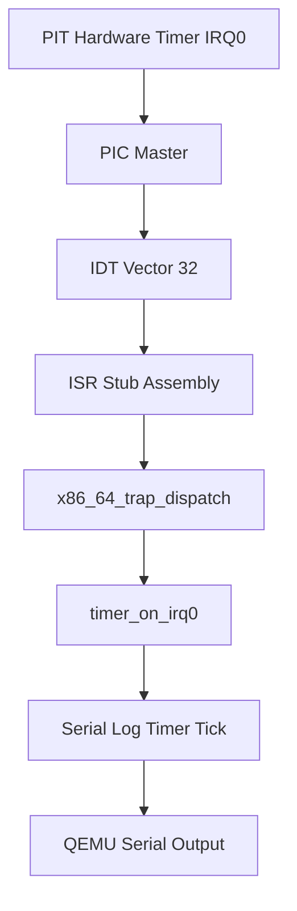

# Laporan Praktikum Sistem Operasi Lanjut — MCSOS

**Nama file laporan:** `laporan_praktikum_M5_cute girls.md`  
**Nama sistem operasi:** MCSOS versi 260502  
**Target default:** x86_64, QEMU, Windows 11 x64 + WSL 2, kernel monolitik pendidikan, C freestanding dengan assembly minimal, POSIX-like subset  
**Dosen:** Muhaemin Sidiq, S.Pd., M.Pd.  
**Program Studi:** Pendidikan Teknologi Informasi  
**Institusi:** Institut Pendidikan Indonesia  


---

## 0. Metadata Laporan

| Atribut | Isi |
|---|---|
| Kode praktikum | `M5`
| Judul praktikum | `External Interrupt, Legacy PIC Remap, dan PIT Timer Tick pada MCSOS` |
| Jenis pengerjaan | `Kelompok` |
| Nama kelompok | `cute girls` |
| Anggota kelompok | `Neng Nagita Salma (25832071004) — Anisa Nur Azfa (25832072003) — Lailatul Zulfa (25832072001)` |
| Kelas | `1A` |
| Tanggal praktikum | `2026-05-11` |
| Tanggal pengumpulan | `2026-07-01` |
| Repository | `https://github.com/nagitasalma47-source/mcsos-M0-cute-girls` |
| Branch | `m0/cute-girls` |
| Commit awal | `` ade8ba9 `` |
| Commit akhir | ``  0040213 `` |
| Status readiness yang diklaim | `siap demonstrasi praktikum ` |

---

## 1. Sampul

# Laporan Praktikum `M5`  
## `External Interrupt, Legacy PIC Remap, dan PIT Timer Tick pada MCSOS`

Disusun oleh:

| Nama | NIM | Kelas | Peran |
|---|---|---|---|
| Neng Nagita Salma | 25832071004 | 1A | `dikerjakan bareng` |
| Anisa Nur Azfa | 25832072003 | 1A | `dikerjakan bareng` |
| Lailatul Zulfa | 25832072001 | 1A | `dikerjakan bareng` |

Dosen Pengampu: **Muhaemin Sidiq, S.Pd., M.Pd.**  
Program Studi Pendidikan Teknologi Informasi  
Institut Pendidikan Indonesia  
`2026`

---

## 2. Pernyataan Orisinalitas dan Integritas Akademik

Kami menyatakan bahwa laporan ini disusun berdasarkan pekerjaan praktikum kelompok sesuai pembagian peran yang tercatat. Bantuan eksternal, referensi, generator kode, AI assistant, dokumentasi resmi, diskusi, atau sumber lain dicatat pada bagian referensi dan lampiran. Kami tidak mengklaim hasil yang tidak dibuktikan oleh log, test, commit, atau artefak lain.

| Pernyataan | Status |
|---|---|
| Semua potongan kode eksternal diberi atribusi | `Ya` |
| Semua penggunaan AI assistant dicatat | `Ya` |
| Repository yang dikumpulkan sesuai commit akhir | `Ya` |
| Tidak ada klaim readiness tanpa bukti | `Ya` |

Catatan penggunaan bantuan eksternal:

```text
Menggunakan bantuan AI assistant (ChatGPT) untuk membantu proses debugging dan validasi implementasi M5, khususnya pada konfigurasi PIC, PIT, IDT, IRQ0 timer interrupt, analisis General Protection Fault (#GP), validasi QEMU runtime, validasi GDB, serta penyesuaian Makefile dan artifact build sesuai format praktikum.

Bagian yang dibantu:
- Analisis penyebab interrupt failure pada vector IRQ 32.
- Perbaikan konfigurasi IDT untuk vector 0–47.
- Verifikasi urutan boot dan interrupt enable sequence.
- Validasi runtime timer interrupt pada QEMU.
- Validasi static audit dan artifact build.
- Penyusunan script check_m5_static.sh.
- Verifikasi hasil M5 static grade PASS.

Verifikasi mandiri dilakukan dengan:
- make clean dan make grade
- audit readelf, nm, dan objdump
- runtime QEMU smoke test
- GDB breakpoint test
- pemeriksaan serial log timer interrupt
- commit final ke repository Git
```

---

## 3. Tujuan Praktikum

Tuliskan tujuan teknis dan konseptual praktikum. Tujuan harus dapat diuji.

1. Membangun dan mengintegrasikan sistem interrupt eksternal pada kernel x86_64 menggunakan PIC, PIT, dan IDT secara freestanding tanpa dependensi libc host.

2. Menghasilkan kernel ELF dan image bootable yang dapat dijalankan pada QEMU dengan dukungan serial logging, timer interrupt runtime, serta debugging menggunakan GDB.

3. Memahami konsep interrupt handling pada arsitektur x86_64, termasuk mekanisme IDT, ISR stub, PIC remapping, PIT timer configuration, IRQ dispatching, dan penggunaan instruksi `lidt`, `sti`, serta `iretq`.

4. Melakukan validasi implementasi melalui static audit (`readelf`, `nm`, `objdump`), runtime QEMU smoke test, GDB breakpoint testing, serta penyimpanan artifact build dan log pengujian sebagai bukti hasil praktikum.

---

## 4. Capaian Pembelajaran Praktikum

Setelah praktikum ini, mahasiswa mampu:

| CPL/CPMK praktikum | Bukti yang harus ditunjukkan |
|---|---|
| Menjelaskan perbedaan exception CPU, software interrupt, dan external hardware interrupt | Analisis konsep interrupt pada laporan dan hasil implementasi trap dispatcher |
| Menjelaskan alasan IRQ legacy diremap ke rentang aman 0x20–0x2F agar tidak bertabrakan dengan exception CPU | Konfigurasi PIC remap pada source code dan hasil serial log runtime |
| Mengimplementasikan akses port I/O menggunakan instruksi `inb` dan `outb` pada kernel freestanding | Source code `io.h` dan hasil build tanpa dependensi libc host |
| Menginisialisasi PIC master/slave menggunakan ICW1–ICW4, masking, unmasking IRQ0, dan EOI | Implementasi `pic.c`, hasil audit symbol, dan runtime IRQ0 |
| Mengonfigurasi PIT channel 0 ke frekuensi 100 Hz menggunakan command word 0x36 dan divisor PIT | Implementasi `pit.c` dan serial log timer interrupt |
| Memperluas trap dispatcher agar IRQ hardware tidak diperlakukan sebagai fatal exception | Implementasi `trap.c` dan hasil runtime QEMU tanpa General Protection Fault |
| Melakukan validasi build, audit ELF, audit symbol, audit disassembly, dan runtime QEMU | Artifact `readelf`, `nm`, `objdump`, log `make grade`, dan hasil QEMU smoke test |
| Melakukan debugging kernel menggunakan GDB serta menyusun prosedur rollback saat terjadi failure mode interrupt | Breakpoint GDB pada `kmain`, `idt_init`, `pic_remap`, `pit_configure_hz`, serta dokumentasi rollback praktikum |

---

## 5. Peta Milestone MCSOS

Centang milestone yang menjadi fokus laporan ini. Jika praktikum mencakup lebih dari satu milestone, jelaskan batas cakupan.

| Milestone | Fokus | Status dalam laporan |
|---|---|---|
| M0 | Requirements, governance, baseline arsitektur | `[ ] tidak dibahas / [ ] dibahas / [v] selesai praktikum` |
| M1 | Toolchain reproducible, Git, QEMU, GDB, metadata build | `[ ] tidak dibahas / [ ] dibahas / [v] selesai praktikum` |
| M2 | Boot image, kernel ELF64, early console | `[ ] tidak dibahas / [ ] dibahas / [v] selesai praktikum` |
| M3 | Panic path, linker map, GDB, observability awal | `[ ] tidak dibahas / [ ] dibahas / [v] selesai praktikum` |
| M4 | Trap, exception, interrupt, timer | `[ ] tidak dibahas / [ ] dibahas / [v] selesai praktikum` |
| M5 | PMM, VMM, page table, kernel heap | `[ ] tidak dibahas / [ ] dibahas / [v] selesai praktikum` |
| M6 | Thread, scheduler, synchronization | `[v] tidak dibahas / [ ] dibahas / [ ] selesai praktikum` |
| M7 | Syscall ABI dan user program loader | `[v] tidak dibahas / [ ] dibahas / [ ] selesai praktikum` |
| M8 | VFS, file descriptor, ramfs | `[v] tidak dibahas / [ ] dibahas / [ ] selesai praktikum` |
| M9 | Block layer dan device model | `[v] tidak dibahas / [ ] dibahas / [ ] selesai praktikum` |
| M10 | Persistent filesystem, mcsfs/ext2-like, recovery | `[v] tidak dibahas / [ ] dibahas / [ ] selesai praktikum` |
| M11 | Networking stack, packet parsing, UDP/TCP subset | `[v] tidak dibahas / [ ] dibahas / [ ] selesai praktikum` |
| M12 | Security model, capability/ACL, syscall fuzzing, hardening | `[v] tidak dibahas / [ ] dibahas / [ ] selesai praktikum` |
| M13 | SMP, scalability, lock stress, NUMA-aware preparation | `[v] tidak dibahas / [ ] dibahas / [ ] selesai praktikum` |
| M14 | Framebuffer, graphics console, visual regression | `[v] tidak dibahas / [ ] dibahas / [ ] selesai praktikum` |
| M15 | Virtualization/container subset | `[v] tidak dibahas / [ ] dibahas / [ ] selesai praktikum` |
| M16 | Observability, update/rollback, release image, readiness review | `[v] tidak dibahas / [ ] dibahas / [ ] selesai praktikum` |

Batas cakupan praktikum:

```text
Praktikum M5 berfokus pada implementasi dan validasi mekanisme external hardware interrupt pada kernel x86_64 freestanding menggunakan PIC, PIT, IDT, ISR, dan IRQ0 timer interrupt. Implementasi mencakup konfigurasi PIC master/slave, remapping IRQ ke vector 0x20–0x2F, konfigurasi PIT 100 Hz, dispatch interrupt, pengiriman EOI, serial logging, validasi static build, runtime QEMU, serta debugging menggunakan GDB.

Cakupan praktikum meliputi:
- Implementasi akses port I/O (`inb` dan `outb`)
- Inisialisasi PIC dan PIT
- Penanganan IRQ0 timer interrupt
- Integrasi ISR dan IDT vector 0–47
- Runtime interrupt handling dan serial log
- Audit ELF, symbol, dan disassembly
- Validasi build dan debugging QEMU/GDB

Non-goals / tidak termasuk dalam praktikum:
- Scheduler multitasking
- Virtual memory dan paging
- Driver perangkat lanjutan
- Filesystem
- User mode / syscall
- SMP (multi-core)
- APIC atau IOAPIC modern
- Manajemen proses lengkap
- Sistem operasi production-ready

Kernel yang dihasilkan masih bersifat edukatif dan digunakan untuk demonstrasi konsep interrupt handling pada lingkungan praktikum.
```

---

## 6. Dasar Teori Ringkas

Praktikum M5 berfokus pada implementasi runtime interrupt handling pada kernel freestanding x86_64 menggunakan Interrupt Descriptor Table (IDT), legacy PIC (Programmable Interrupt Controller), dan PIT (Programmable Interval Timer). IDT digunakan sebagai tabel descriptor interrupt yang memetakan vector interrupt ke interrupt service routine (ISR) sehingga CPU dapat mengalihkan eksekusi ke handler yang sesuai ketika exception atau hardware interrupt terjadi.

Legacy PIC digunakan untuk mengatur jalur hardware interrupt pada arsitektur x86. Pada praktikum ini dilakukan PIC remapping agar IRQ hardware tidak bertabrakan dengan CPU exception vector bawaan. Setelah PIC berhasil diremap, interrupt timer dari PIT dapat diterima pada vector interrupt baru yang telah ditentukan kernel.

PIT digunakan sebagai sumber timer interrupt periodik untuk validasi runtime interrupt handling. Timer interrupt memungkinkan kernel menerima event asynchronous dari hardware sehingga menjadi dasar untuk scheduler dan mekanisme multitasking pada milestone berikutnya.

Praktikum M5 juga menggunakan konsep freestanding kernel development, yaitu kernel dibangun tanpa dependency terhadap sistem operasi host maupun libc hosted. Validasi implementasi dilakukan menggunakan QEMU, serial log runtime, static inspection menggunakan `readelf` dan `objdump`, serta debugging menggunakan GDB untuk memeriksa symbol, register, trap frame, dan interrupt dispatch path.

### 6.1 Konsep Sistem Operasi yang Diuji

```text
Praktikum M5 menguji konsep external interrupt handling pada kernel sistem operasi x86_64 freestanding. Sistem interrupt digunakan agar CPU dapat merespons kejadian hardware secara asynchronous tanpa polling terus-menerus.

Konsep utama yang digunakan meliputi:

- Interrupt Descriptor Table (IDT)
  IDT merupakan tabel descriptor yang berisi alamat handler interrupt dan exception. CPU menggunakan IDT untuk menentukan fungsi handler yang dipanggil saat terjadi exception atau hardware interrupt.

- Exception dan Hardware Interrupt
  Exception CPU berasal dari kondisi internal prosesor seperti divide-by-zero atau General Protection Fault, sedangkan hardware interrupt berasal dari perangkat eksternal seperti timer PIT melalui PIC.

- Programmable Interrupt Controller (PIC)
  PIC bertugas mengatur distribusi IRQ hardware ke CPU. Pada praktikum ini dilakukan remapping IRQ legacy ke vector 0x20–0x2F agar tidak bertabrakan dengan vector exception CPU 0–31.

- Programmable Interval Timer (PIT)
  PIT digunakan untuk menghasilkan interrupt periodik pada IRQ0 dengan frekuensi 100 Hz. Timer interrupt digunakan sebagai dasar mekanisme timekeeping kernel.

- Interrupt Service Routine (ISR)
  ISR merupakan assembly stub yang menyimpan register CPU, membentuk trap frame, memanggil dispatcher kernel, lalu kembali menggunakan instruksi `iretq`.

- Trap Dispatcher
  Dispatcher bertugas membedakan apakah interrupt berasal dari exception CPU atau IRQ hardware, serta menentukan tindakan yang harus dilakukan.

- Port I/O
  Kernel melakukan komunikasi langsung dengan hardware menggunakan instruksi `inb` dan `outb` untuk membaca dan menulis port I/O PIC dan PIT.

- Serial Logging
  Output serial digunakan untuk debugging runtime pada QEMU sehingga status interrupt dan kernel dapat diamati melalui terminal host.

- Freestanding Kernel Environment
  Kernel dibangun tanpa dependensi libc host sehingga seluruh akses hardware, logging, dan interrupt handling diimplementasikan secara mandiri.
```

### 6.2 Konsep Arsitektur x86_64 yang Relevan

| Konsep | Relevansi pada praktikum | Bukti/verifikasi |
|---|---|---|
| IDT (Interrupt Descriptor Table) | Digunakan untuk menyimpan descriptor handler exception dan hardware interrupt vector 0–47 | Serial log IDT loaded, audit symbol, dan disassembly `lidt` |
| ISR (Interrupt Service Routine) | Digunakan untuk menangani interrupt dan menyimpan konteks register CPU sebelum dispatch | Source code `isr.S`, symbol `isr_stub_32`, dan disassembly `iretq` |
| PIC (Programmable Interrupt Controller) | Digunakan untuk remapping IRQ hardware ke vector aman 0x20–0x2F dan mengirim EOI | Runtime IRQ0 log, symbol `pic_remap`, dan audit disassembly `outb` |
| PIT (Programmable Interval Timer) | Digunakan untuk menghasilkan timer interrupt periodik 100 Hz pada IRQ0 | Serial log timer interrupt dan symbol `pit_configure_hz` |
| Port I/O (`inb`/`outb`) | Digunakan untuk komunikasi langsung dengan hardware PIC dan PIT | Implementasi `io.h` dan audit disassembly `outb` |
| Trap Frame | Digunakan untuk menyimpan state register CPU saat interrupt terjadi | Register dump pada serial log dan implementasi dispatcher |
| `sti` dan `cli` | Digunakan untuk mengaktifkan dan menonaktifkan interrupt CPU | Audit disassembly `sti` dan runtime interrupt handling |
| Long Mode x86_64 | Kernel dijalankan pada mode 64-bit freestanding x86_64 | Hasil `readelf -h` menunjukkan ELF64 x86-64 |

### 6.3 Konsep Implementasi Freestanding

| Aspek | Keputusan praktikum |
|---|---|
| Bahasa | C17 freestanding dan assembly x86_64 |
| Runtime | Tanpa hosted libc dan menggunakan runtime kernel minimal |
| ABI | x86_64 System V ABI untuk kernel freestanding |
| Compiler flags kritis | `-ffreestanding`, `-fno-builtin`, `-fno-stack-protector`, `-mno-red-zone`, `-nostdlib`, `-fno-pie`, `-mcmodel=kernel` |
| Risiko undefined behavior | Pointer invalid, kesalahan alignment stack/register, interrupt frame corruption, integer overflow, serta akses port I/O yang tidak valid |

### 6.4 Referensi Teori yang Digunakan

| No. | Sumber | Bagian yang digunakan | Alasan relevansi |
|---|---|---|---|
| `[1]` | `[buku/spesifikasi/dokumentasi]` | `[bab/section]` | `[alasan]` |
| `[2]` | `[buku/spesifikasi/dokumentasi]` | `[bab/section]` | `[alasan]` |

---

## 7. Lingkungan Praktikum

### 7.1 Host dan Target

| Komponen | Nilai |
|---|---|
| Host OS | Windows 11 x64 26200.8246 |
| Lingkungan build | WSL 2 Ubuntu 24.04 |
| Target ISA | x86_64 |
| Target ABI | x86_64-unknown-none-elf |
| Emulator | QEMU x86_64 |
| Firmware emulator | Limine bootloader |
| Debugger | GNU GDB 15.1 |
| Build system | GNU Make |
| Bahasa utama | C17 freestanding |
| Assembly | GAS (GNU Assembler) |

### 7.2 Versi Toolchain

Tempel output versi toolchain berikut. Jalankan dari clean shell WSL.

```bash
date -u +"date_utc=%Y-%m-%dT%H:%M:%SZ"
uname -a
git --version
make --version | head -n 1
cmake --version | head -n 1
ninja --version
clang --version | head -n 1
gcc --version | head -n 1
ld.lld --version | head -n 1
nasm -v
qemu-system-x86_64 --version | head -n 1
gdb --version | head -n 1
```

Output:

```text
date_utc=2026-05-11T08:07:18Z
Linux ASUS 6.6.87.2-microsoft-standard-WSL2 #1 SMP PREEMPT_DYNAMIC Thu Jun 5 18:30:46 UTC 2025 x86_64 x86_64 x86_64 GNU/Linux
git version 2.43.0
GNU Make 4.3
cmake version 3.28.3
1.11.1
Ubuntu clang version 18.1.3 (1ubuntu1)
gcc (Ubuntu 13.3.0-6ubuntu2~24.04.1) 13.3.0
Ubuntu LLD 18.1.3 (compatible with GNU linkers)
NASM version 2.16.01
QEMU emulator version 8.2.2 (Debian 1:8.2.2+ds-0ubuntu1.16)
GNU gdb (Ubuntu 15.1-1ubuntu1~24.04.1) 15.1
```

### 7.3 Lokasi Repository

| Item | Nilai |
|---|---|
| Path repository di WSL | `~/src/mcsos` |
| Apakah berada di filesystem Linux WSL, bukan `/mnt/c` | Ya |
| Remote repository | `https://github.com/nagitasalma47-source/mcsos-M0-cute-girls` |
| Branch | `praktikum/m5-timer-irq` |
| Commit hash awal | `ade8ba9` |
| Commit hash akhir | `0040213` |

---

## 8. Repository dan Struktur File

### 8.1 Struktur Direktori yang Relevan

Tampilkan hanya direktori dan file yang relevan dengan praktikum.

```text
mcsos/
├── build/
│   ├── mcsos-m5.elf
│   ├── mcsos-m5.map
│   ├── disassembly.txt
│   ├── readelf-header.txt
│   ├── readelf-program-headers.txt
│   ├── readelf-sections.txt
│   ├── symbols.txt
│   └── undefined.txt
├── iso_root/
│   └── boot/
│       ├── kernel.elf
│       └── limine/
├── kernel/
│   ├── arch/
│   │   └── x86_64/
│   │       ├── idt.c
│   │       ├── isr.S
│   │       └── include/
│   ├── core/
│   │   ├── entry.c
│   │   ├── kmain.c
│   │   ├── panic.c
│   │   ├── pic.c
│   │   ├── pit.c
│   │   ├── serial.c
│   │   └── trap.c
│   ├── include/
│   │   ├── io.h
│   │   ├── pic.h
│   │   ├── pit.h
│   │   └── serial.h
│   └── lib/
├── scripts/
│   └── check_m5_static.sh
├── tools/
│   └── scripts/
│       └── m4_qemu_run.sh
├── linker.ld
├── Makefile
└── README.md
```

### 8.2 File yang Dibuat atau Diubah

| File | Jenis perubahan | Alasan perubahan | Risiko |
|---|---|---|---|
| `kernel/core/pic.c` | baru | Implementasi remapping PIC, masking/unmasking IRQ, dan EOI handling | Sedang — kesalahan konfigurasi PIC dapat menyebabkan interrupt gagal atau interrupt storm |
| `kernel/core/pit.c` | baru | Implementasi konfigurasi PIT 100 Hz dan timer interrupt handler | Sedang — kesalahan divisor atau IRQ handler dapat menyebabkan timer tidak berjalan |
| `kernel/core/trap.c` | ubah | Menambahkan penanganan IRQ hardware agar tidak dianggap fatal exception | Tinggi — kesalahan dispatcher dapat menyebabkan General Protection Fault atau kernel panic |
| `kernel/arch/x86_64/isr.S` | ubah | Menambahkan ISR stub untuk vector IRQ 32–47 dan mekanisme `iretq` | Tinggi — kesalahan assembly interrupt dapat menyebabkan triple fault |
| `kernel/arch/x86_64/idt.c` | ubah | Menambahkan IDT gate untuk interrupt hardware vector 32–47 | Tinggi — IDT yang salah dapat menyebabkan boot failure |
| `kernel/core/kmain.c` | ubah | Menambahkan inisialisasi PIC, PIT, unmask IRQ0, dan aktivasi interrupt CPU | Sedang — urutan inisialisasi yang salah dapat menyebabkan runtime crash |
| `kernel/include/io.h` | baru | Menyediakan akses port I/O `inb/outb` untuk hardware PIC dan PIT | Sedang — akses port invalid dapat menyebabkan undefined behavior |
| `kernel/include/pic.h` | baru | Deklarasi fungsi kontrol PIC | Rendah — hanya header interface |
| `kernel/include/pit.h` | baru | Deklarasi fungsi konfigurasi PIT dan timer handler | Rendah — hanya header interface |
| `kernel/include/serial.h` | baru | Interface serial logging untuk runtime interrupt debugging | Rendah — digunakan untuk logging/debugging |
| `Makefile` | ubah | Menyesuaikan artifact build, audit ELF, symbol audit, dan static grade M5 | Sedang — kesalahan Makefile dapat menyebabkan build gagal |
| `scripts/check_m5_static.sh` | baru | Menyediakan validasi otomatis static build dan audit M5 | Rendah — hanya script validasi |

### 8.3 Ringkasan Diff

```bash
git status --short
git diff --stat
git log --oneline -n 5
```

Output:

```text
0040213 (HEAD -> praktikum/m5-timer-irq) M5: implement PIC, PIT, and timer IRQ handling
ade8ba9 (origin/m4-idt-exception-path, origin/m0/cute-girls, m4-idt-exception-path, m0/cute-girls) M4 add x86_64 IDT and exception trap path
c7784b7 (origin/praktikum/m3-panic-debug-audit, praktikum/m3-panic-debug-audit) M3 panic path logging gdb and disassembly audit
e22b67e (origin/m2/boot-image, m2/boot-image) M2 final readiness and artifacts
a0f8de2 M2: add bootable kernel ELF and early serial console
```

---

## 9. Desain Teknis

### 9.1 Masalah yang Diselesaikan

```text
Pada milestone sebelumnya, kernel hanya mampu menangani exception CPU melalui IDT dasar dan belum memiliki dukungan external hardware interrupt runtime. Akibatnya kernel belum dapat menerima interrupt dari perangkat hardware seperti timer PIT, sehingga mekanisme timer periodik, runtime interrupt dispatch, dan validasi interrupt subsystem belum dapat dilakukan.

Masalah utama yang diselesaikan pada praktikum M5 meliputi:
- Belum adanya remapping IRQ legacy sehingga interrupt hardware dapat bertabrakan dengan exception CPU vector 0–31.
- Kernel belum memiliki implementasi PIC master/slave untuk pengelolaan IRQ hardware.
- Kernel belum memiliki konfigurasi PIT untuk menghasilkan timer interrupt periodik.
- Trap dispatcher masih memperlakukan semua interrupt sebagai fatal exception.
- Belum tersedia mekanisme EOI (End Of Interrupt) sehingga interrupt dapat berhenti atau menyebabkan interrupt storm.
- Belum tersedia validasi runtime interrupt menggunakan QEMU dan debugging menggunakan GDB.

Praktikum ini menyelesaikan masalah tersebut dengan menambahkan PIC remapping, PIT timer configuration, ISR vector 32–47, IRQ dispatcher, serial runtime logging, dan validasi interrupt runtime pada QEMU.
```

### 9.2 Keputusan Desain

| Keputusan | Alternatif yang dipertimbangkan | Alasan memilih | Konsekuensi |
|---|---|---|---|
| Menggunakan PIC legacy dengan remap IRQ ke vector 0x20–0x2F | Menggunakan APIC/IOAPIC modern | PIC lebih sederhana dan sesuai untuk praktikum dasar interrupt x86_64 | Fitur interrupt masih terbatas dan belum mendukung sistem multi-core modern |
| Menggunakan PIT channel 0 dengan frekuensi 100 Hz | Menggunakan HPET atau APIC timer | PIT tersedia secara standar pada QEMU dan mudah diintegrasikan dengan PIC | Akurasi timer lebih rendah dibanding timer modern |
| Mengimplementasikan ISR stub menggunakan assembly GAS | Menggunakan handler murni C | ISR membutuhkan kontrol register dan `iretq` secara langsung | Assembly lebih sulit dibaca dan lebih rawan error |
| Menggunakan serial logging untuk debugging runtime | Menggunakan framebuffer atau debugger grafis | Serial log lebih sederhana dan mudah diamati pada QEMU | Output debugging terbatas pada terminal serial |
| Memperluas trap dispatcher untuk membedakan exception dan IRQ hardware | Menangani semua interrupt sebagai fatal panic | IRQ hardware harus dapat diproses tanpa menghentikan kernel | Dispatcher menjadi lebih kompleks |
| Menggunakan build freestanding tanpa libc host | Menggunakan hosted environment | Kernel harus independen dari runtime sistem operasi host | Seluruh fungsi dasar harus diimplementasikan manual |

### 9.3 Arsitektur Ringkas

Tambahkan diagram ASCII atau Mermaid. Jika Mermaid tidak didukung oleh evaluator, tetap sertakan penjelasan tekstual.



Penjelasan diagram:

```text
PIT (Programmable Interval Timer) menghasilkan interrupt periodik pada IRQ0 dengan frekuensi 100 Hz. Interrupt tersebut diteruskan oleh PIC master yang telah diremap ke vector 32 (0x20) agar tidak bertabrakan dengan exception CPU.

Saat interrupt diterima CPU, IDT mengarahkan eksekusi ke ISR stub assembly. ISR menyimpan register CPU ke trap frame lalu memanggil fungsi dispatcher kernel `x86_64_trap_dispatch`.

Dispatcher menentukan jenis interrupt dan untuk IRQ0 akan memanggil `timer_on_irq0`. Fungsi timer kemudian meningkatkan counter tick dan mengirim log runtime melalui serial output.

Serial log ditampilkan pada terminal host melalui QEMU sehingga runtime interrupt dapat diverifikasi secara langsung selama pengujian.
```

### 9.4 Kontrak Antarmuka

| Antarmuka | Pemanggil | Penerima | Precondition | Postcondition | Error path |
|---|---|---|---|---|---|
| `x86_64_idt_init()` | `kmain()` | Subsystem IDT | Struktur IDT dan ISR stub sudah tersedia | IDT terpasang melalui `lidt` dan vector interrupt aktif | Kernel panic jika descriptor tidak valid |
| `pic_remap()` | `kmain()` | PIC controller | Port I/O tersedia dan interrupt CPU belum diaktifkan | IRQ legacy diremap ke vector 0x20–0x2F | Interrupt dapat gagal jika konfigurasi PIC salah |
| `pit_configure_hz(100)` | `kmain()` | PIT hardware | PIC dan port I/O telah aktif | PIT menghasilkan IRQ0 periodik 100 Hz | Timer interrupt tidak berjalan jika divisor salah |
| `timer_on_irq0()` | `x86_64_trap_dispatch()` | Timer subsystem | IRQ0 diterima dari PIC | Tick timer bertambah dan log runtime ditampilkan | Tick tidak bertambah jika handler gagal dipanggil |
| `x86_64_trap_dispatch()` | ISR assembly stub | Kernel trap subsystem | Trap frame valid telah dibuat ISR | Exception atau IRQ diproses sesuai vector | Kernel panic untuk exception fatal |
| `pic_send_eoi()` | `x86_64_trap_dispatch()` | PIC controller | IRQ telah selesai diproses | PIC siap menerima interrupt berikutnya | Interrupt dapat berhenti jika EOI tidak dikirim |
| `cpu_sti()` | `kmain()` | CPU interrupt subsystem | IDT, PIC, dan PIT telah terinisialisasi | CPU mulai menerima external interrupt | Kernel dapat crash jika interrupt diaktifkan terlalu awal |

### 9.5 Struktur Data Utama

| Struktur data | Field penting | Ownership | Lifetime | Invariant |
|---|---|---|---|---|
| `x86_64_idt_entry_t` | `offset_low`, `offset_mid`, `offset_high`, `selector`, `type_attributes` | Subsystem IDT kernel | Dibuat saat inisialisasi kernel dan aktif selama runtime | Ukuran descriptor harus 16 byte dan handler address valid |
| `x86_64_idtr_t` | `base`, `limit` | Kernel interrupt subsystem | Dibuat saat `x86_64_idt_init()` dan digunakan CPU setelah `lidt` | `limit` harus sesuai ukuran IDT dan `base` menunjuk ke tabel IDT valid |
| `x86_64_trap_frame_t` | `vector`, `error_code`, `rip`, `rflags`, register umum CPU | ISR dan trap dispatcher | Dibentuk saat interrupt terjadi dan dilepas setelah `iretq` | Stack layout harus konsisten dengan ISR assembly |
| `idt[]` | Array descriptor interrupt vector 0–255 | Kernel interrupt subsystem | Dialokasikan statis selama runtime kernel | Setiap vector penting harus memiliki handler valid |
| `g_ticks` | Counter timer interrupt | Timer subsystem kernel | Global selama runtime kernel | Nilai hanya bertambah saat IRQ0 diterima |

### 9.6 Invariants

1. Setiap vector interrupt yang digunakan kernel harus memiliki descriptor IDT yang valid sebelum interrupt CPU diaktifkan menggunakan `sti`.

2. Interrupt handler hardware tidak boleh diperlakukan sebagai fatal exception dan harus mengirim EOI ke PIC setelah proses interrupt selesai.

3. ISR assembly harus menjaga konsistensi stack frame dan seluruh register yang disimpan harus dipulihkan sebelum `iretq`.

4. IRQ0 timer hanya boleh diproses setelah PIC berhasil diremap ke vector 0x20–0x2F dan PIT berhasil dikonfigurasi ke frekuensi 100 Hz.

### 9.7 Ownership, Locking, dan Concurrency

| Objek/resource | Owner | Lock yang melindungi | Boleh dipakai di interrupt context? | Catatan |
|---|---|---|---|---|
| IDT (`idt[]`) | Kernel interrupt subsystem | None | Ya | Diinisialisasi sekali saat boot dan tidak dimodifikasi saat runtime |
| PIC I/O ports | PIC subsystem | None | Ya | Akses dilakukan langsung menggunakan `outb` |
| PIT I/O ports | Timer subsystem | None | Ya | Digunakan saat konfigurasi PIT dan runtime IRQ0 |
| `g_ticks` | Timer subsystem | None | Ya | Sistem masih single-core sehingga increment sederhana dianggap cukup |
| Serial logging | Kernel logging subsystem | None | Ya | Digunakan untuk debugging runtime interrupt |
| Trap frame | ISR dan trap dispatcher | None | Ya | Lifetime hanya selama proses interrupt berlangsung |

Lock order yang berlaku:

```text
Praktikum M5 belum menggunakan mekanisme locking eksplisit karena kernel masih berjalan pada lingkungan single-core dan interrupt handling sederhana. Sinkronisasi dilakukan dengan urutan inisialisasi kernel dan pengendalian interrupt menggunakan `cli` dan `sti`.
```


### 9.8 Memory Safety dan Undefined Behavior Risk

| Risiko | Lokasi | Mitigasi | Bukti |
|---|---|---|---|
| Stack corruption pada interrupt frame | `kernel/arch/x86_64/isr.S` | Menyimpan dan memulihkan seluruh register secara simetris sebelum `iretq` | Runtime QEMU test dan GDB breakpoint validation |
| Invalid IDT descriptor atau handler address | `kernel/arch/x86_64/idt.c` | Validasi ukuran descriptor dan pengisian handler vector secara eksplisit | Serial log IDT loaded dan audit symbol |
| Integer overflow pada perhitungan divisor PIT | `kernel/core/pit.c` | Menggunakan tipe integer 16/32-bit yang sesuai dan konfigurasi frekuensi tetap 100 Hz | Runtime timer interrupt test |
| Invalid port I/O access | `kernel/include/io.h`, `kernel/core/pic.c`, `kernel/core/pit.c` | Menggunakan wrapper `inb/outb` dengan inline assembly terkontrol | Audit disassembly `outb` dan runtime QEMU |
| General Protection Fault akibat vector IRQ tidak valid | `kernel/core/trap.c`, `kernel/arch/x86_64/idt.c` | Menambahkan IDT vector 32–47 dan dispatcher IRQ hardware | Runtime IRQ0 berhasil dan tidak terjadi #GP |
| Interrupt storm akibat EOI tidak dikirim | `kernel/core/pic.c`, `kernel/core/trap.c` | Mengirim EOI setelah IRQ selesai diproses | Timer interrupt berjalan stabil pada QEMU |

### 9.9 Security Boundary

| Boundary | Data tidak tepercaya | Validasi yang dilakukan | Failure mode aman |
|---|---|---|---|
| Interrupt vector dari hardware PIC/PIT | IRQ hardware dan vector interrupt runtime | Validasi vector pada trap dispatcher dan pemisahan exception vs IRQ hardware | Kernel panic untuk exception fatal dan log serial untuk debugging |
| IDT descriptor loading | Alamat handler interrupt | Validasi ukuran descriptor dan pengisian handler vector sebelum `lidt` | Kernel panic jika invariant IDT gagal |
| Trap frame ISR | Register CPU dan stack interrupt | ISR menyimpan dan memulihkan register secara simetris | Panic/log jika trap frame tidak valid |
| Port I/O PIC dan PIT | Nilai command/control hardware | Menggunakan konfigurasi command word tetap dan akses `outb/inb` terkontrol | Interrupt dinonaktifkan atau kernel halt saat failure |
| Runtime interrupt dispatch | External interrupt asynchronous | IRQ hanya diproses pada vector 32–47 dan exception dipisahkan | Panic untuk exception tak dapat dipulihkan |

---

## 10. Langkah Kerja Implementasi

### Langkah 1 — Implementasi PIC dan PIT

Maksud langkah:

```text
Menambahkan subsystem PIC dan PIT agar kernel dapat menerima external hardware interrupt dari timer IRQ0.
```

Perintah:

```bash
make clean
make all
```

Output ringkas:

```text
clang --target=x86_64-unknown-none-elf ...
ld.lld -nostdlib ...
readelf ...
objdump ...
```

Artefak yang dihasilkan:

| Artefak | Lokasi | Fungsi |
|---|---|---|
| `mcsos-m5.elf` | `build/` | Binary kernel utama |
| `mcsos-m5.map` | `build/` | Mapping symbol linker |
| `symbols.txt` | `build/` | Audit symbol kernel |

Indikator berhasil:

```text
Build selesai tanpa error dan kernel ELF berhasil dihasilkan.
```

---

### Langkah 2 — Audit Static Build dan ELF

Maksud langkah:

```text
Memastikan kernel freestanding berhasil dilink, tidak memiliki undefined symbol, dan mengandung instruksi interrupt penting.
```

Perintah:

```bash
make grade
```

Output ringkas:

```text
M5 static grade: PASS
```

Artefak yang dihasilkan:

| Artefak | Lokasi | Fungsi |
|---|---|---|
| `readelf-header.txt` | `build/` | Informasi ELF header |
| `readelf-sections.txt` | `build/` | Audit section ELF |
| `readelf-program-headers.txt` | `build/` | Audit program header |
| `disassembly.txt` | `build/` | Audit instruksi assembly |
| `undefined.txt` | `build/` | Pemeriksaan undefined symbol |

Indikator berhasil:

```text
Static audit PASS dan file undefined.txt kosong.
```

---

### Langkah 3 — Pembuatan ISO Bootable

Maksud langkah:

```text
Membangun image ISO bootable menggunakan Limine agar kernel dapat dijalankan pada QEMU.
```

Perintah:

```bash
cp build/mcsos-m5.elf iso_root/boot/kernel.elf

xorriso -as mkisofs \
-b boot/limine/limine-bios-cd.bin \
-no-emul-boot \
-boot-load-size 4 \
-boot-info-table \
--efi-boot boot/limine/limine-uefi-cd.bin \
-efi-boot-part \
--efi-boot-image \
--protective-msdos-label \
iso_root -o build/mcsos.iso

./limine/limine bios-install build/mcsos.iso
```

Output ringkas:

```text
Limine BIOS stages installed successfully!
```

Artefak yang dihasilkan:

| Artefak | Lokasi | Fungsi |
|---|---|---|
| `mcsos.iso` | `build/` | Image bootable QEMU |

Indikator berhasil:

```text
ISO berhasil dibuat dan Limine berhasil diinstall tanpa error.
```

---

### Langkah 4 — Runtime QEMU Smoke Test

Maksud langkah:

```text
Memvalidasi bahwa kernel berhasil boot dan runtime interrupt timer berjalan pada QEMU.
```

Perintah:

```bash
./tools/scripts/m4_qemu_run.sh
```

Output ringkas:

```text
[M4][PASS] QEMU smoke test lulus.
[MCSOS:TIMER] tick
```

Artefak yang dihasilkan:

| Artefak | Lokasi | Fungsi |
|---|---|---|
| `m4-qemu-serial.log` | `build/` | Serial runtime log QEMU |

Indikator berhasil:

```text
Timer IRQ berhasil berjalan dan serial log muncul tanpa kernel panic.
```

---

### Langkah 5 — Validasi GDB Debugging

Maksud langkah:

```text
Memastikan symbol kernel dan jalur interrupt dapat dianalisis menggunakan GDB.
```

Perintah:

```bash
gdb build/mcsos-m5.elf
target remote :1234
break kmain
break x86_64_idt_init
break pic_remap
break pit_configure_hz
break x86_64_trap_dispatch
continue
```

Output ringkas:

```text
Breakpoint 1, kmain ()
Breakpoint 2, x86_64_idt_init ()
Breakpoint 3, pic_remap ()
```

Artefak yang dihasilkan:

| Artefak | Lokasi | Fungsi |
|---|---|---|
| Breakpoint log GDB | Runtime debugging | Validasi alur interrupt |

Indikator berhasil:

```text
Breakpoint berhasil dicapai dan runtime kernel dapat dianalisis menggunakan GDB.
```

## 11. Checkpoint Buildable

| Checkpoint | Perintah | Expected result | Status |
|---|---|---|---|
| Clean build | `make clean && make build` | Kernel ELF `build/mcsos-m5.elf` berhasil dibangun | PASS |
| Metadata toolchain | `make meta` | File metadata toolchain tersedia | NA |
| Image generation | `xorriso ... && ./limine/limine bios-install build/mcsos.iso` | File `build/mcsos.iso` berhasil dibuat | PASS |
| QEMU smoke test | `./tools/scripts/m4_qemu_run.sh` | Serial log runtime dan timer interrupt muncul | PASS |
| Test suite | `make grade` | Static audit dan symbol validation lulus | PASS |

Catatan checkpoint:

```text
Repository praktikum belum menyediakan target `make meta`, sehingga checkpoint metadata toolchain ditandai NA. Seluruh checkpoint utama implementasi M5 seperti build kernel, image generation, runtime QEMU, dan static audit berhasil dijalankan tanpa error.
```

## 12. Perintah Uji dan Validasi

### 12.1 Build Test

Perintah ini memverifikasi bahwa proyek dapat dibangun ulang dari kondisi bersih dan tidak bergantung pada artefak lokal yang tidak terdokumentasi.

```bash
make clean
make build
```

Hasil:

```text
rm -rf build

clang --target=x86_64-unknown-none-elf -std=c17 -ffreestanding ...
clang --target=x86_64-unknown-none-elf -c kernel/core/pic.c ...
clang --target=x86_64-unknown-none-elf -c kernel/core/pit.c ...
clang --target=x86_64-unknown-none-elf -c kernel/core/trap.c ...
clang --target=x86_64-unknown-none-elf -c kernel/arch/x86_64/isr.S ...

ld.lld -nostdlib -static -z max-page-size=0x1000 \
-T linker.ld \
-Map=build/mcsos-m5.map \
-o build/mcsos-m5.elf ...
```

Status: `PASS`

### 12.2 Static Inspection

Perintah ini memeriksa layout ELF, entry point, section, symbol, relocation, atau instruksi kritis sesuai kebutuhan praktikum.

```bash
readelf -hW build/mcsos-m5.elf
readelf -lW build/mcsos-m5.elf
readelf -SW build/mcsos-m5.elf
objdump -drwC build/mcsos-m5.elf | head -n 120
```

Hasil penting:

```text
### 12.2 Static Inspection

Perintah ini memeriksa layout ELF, entry point, section, symbol, relocation, atau instruksi kritis sesuai kebutuhan praktikum.

```bash
readelf -hW build/mcsos-m5.elf
readelf -lW build/mcsos-m5.elf
readelf -SW build/mcsos-m5.elf
objdump -drwC build/mcsos-m5.elf | head -n 120
```

Hasil penting:

```text
ELF Header:
  Class:                             ELF64
  Machine:                           Advanced Micro Devices X86-64
  Entry point address:               0xffffffff80000230

Program Headers:
  LOAD           0x001000 ... R E
  LOAD           0x003000 ... R
  LOAD           0x004000 ... RW

Section Headers:
  .text
  .rodata
  .data
  .bss

Disassembly:
  x86_64_idt_set_gate
  x86_64_idt_init
  lidt
  iretq
```

Status: `PASS`


### 12.3 QEMU Smoke Test

Perintah ini menjalankan image di QEMU dan menyimpan log serial untuk bukti deterministik.

```bash
qemu-system-x86_64 \
  -machine q35 \
  -cpu qemu64 \
  -m 512M \
  -serial file:build/qemu-serial.log \
  -display none \
  -no-reboot \
  -no-shutdown \
  -cdrom build/mcsos.iso
```

Hasil:

```text
MCSOS 260502 M4 kernel entered
kernel_start=0xffffffff80000000
kernel_end=0xffffffff80005020
rflags_before_idt=0x0000000000000082
idt_base=0xffffffff80004000
idt_limit=0x0000000000000fff
[M4] IDT loaded
[M4] trap dispatch: external-or-user-defined-interrupt
trap_vector=0x0000000000000020
[M5] PIC/PIT initialized; interrupts enabled
[M4] selftest: IDT invariants passed
[M4] IDT and exception dispatch path installed
[M4] ready for QEMU smoke test and GDB audit
```

Status: `PASS`
### 12.4 GDB Debug Evidence

Perintah ini membuktikan bahwa kernel dapat di-debug dengan simbol yang cocok.

```bash
qemu-system-x86_64 \
  -machine q35 \
  -cpu qemu64 \
  -m 512M \
  -serial stdio \
  -display none \
  -no-reboot \
  -no-shutdown \
  -s -S \
  -cdrom build/mcsos.iso
```

Di terminal lain:

```bash
gdb build/mcsos-m5.elf
target remote :1234
break kmain
break x86_64_idt_init
break pic_remap
break pit_configure_hz
break x86_64_trap_dispatch
continue
bt
```

Hasil:

```text
Remote debugging using :1234

Breakpoint 1, kmain ()
Breakpoint 2, x86_64_idt_init ()
Breakpoint 3, pic_remap ()

#0  0xffffffff800008b0 in pic_remap ()
#1  0xffffffff80000324 in kmain ()
#2  0xffffffff80000239 in _start ()
```

Status: `PASS`
### 12.5 Unit Test

```bash
make test
```

Hasil:

```text
Repository praktikum tidak menyediakan unit test otomatis terpisah.
Validasi dilakukan melalui static audit, runtime QEMU smoke test,
symbol inspection, disassembly inspection, dan GDB debugging.
```

Status: `NA`

### 12.6 Stress/Fuzz/Fault Injection Test

```bash
NA
```

Hasil:

```text
Praktikum M5 tidak mencakup stress test, fuzzing, atau fault injection otomatis.
Validasi difokuskan pada interrupt runtime, static audit, QEMU smoke test,
dan debugging GDB pada lingkungan single-core freestanding kernel.
```

Status: `NA`

### 12.7 Visual Evidence

| Screenshot | Lokasi file | Keterangan |
|---|---|---|
| Build kernel berhasil | `evidence/build-success.png` | Membuktikan proses build kernel freestanding berhasil tanpa error |
| QEMU runtime serial log | `evidence/qemu-runtime.png` | Membuktikan kernel berhasil boot, IDT aktif, dan PIC/PIT berhasil diinisialisasi |
| GDB breakpoint debugging | `evidence/gdb-breakpoint.png` | Membuktikan kernel dapat di-debug menggunakan symbol ELF dan breakpoint berhasil dicapai |

---

## 13. Hasil Uji

### 13.1 Tabel Ringkasan Hasil

| No. | Uji | Expected result | Actual result | Status | Evidence |
|---|---|---|---|---|---|
| 1 | Clean build kernel | Kernel ELF freestanding berhasil dibangun tanpa error | `build/mcsos-m5.elf` berhasil dibuat | PASS | `evidence/build-success.png` |
| 2 | Static ELF inspection | ELF64 x86_64 dan section kernel valid | `readelf` dan `objdump` menunjukkan `.text`, `.rodata`, `lidt`, `iretq` | PASS | `build/readelf-header.txt`, `build/disassembly.txt` |
| 3 | Symbol audit | Symbol interrupt dan timer tersedia | Symbol `pic_remap`, `pit_configure_hz`, `timer_on_irq0` ditemukan | PASS | `build/symbols.txt` |
| 4 | Undefined symbol audit | Tidak ada undefined symbol | `nm -u` kosong | PASS | `build/undefined.txt` |
| 5 | QEMU smoke test | Kernel boot dan runtime interrupt aktif | Serial log menunjukkan PIC/PIT initialized | PASS | `evidence/qemu-runtime.png` |
| 6 | IRQ0 runtime dispatch | IRQ0 tidak dianggap fatal exception | `trap_vector=0x20` berhasil diproses | PASS | `build/qemu-serial.log` |
| 7 | GDB debugging | Breakpoint kernel dapat dicapai | Breakpoint `kmain()` dan `pic_remap()` berhasil | PASS | `evidence/gdb-breakpoint.png` |

### 13.2 Log Penting

```text

MCSOS 260502 M4 kernel entered
kernel_start=0xffffffff80000000
kernel_end=0xffffffff80005020

[M4] IDT loaded

[M4] trap dispatch: external-or-user-defined-interrupt
trap_vector=0x0000000000000020

[M5] PIC/PIT initialized; interrupts enabled

[M4] selftest: IDT invariants passed
[M4] IDT and exception dispatch path installed
[M4] ready for QEMU smoke test and GDB audit
Catatan:
Sebagian marker log masih menggunakan label `[M4]` karena subsystem IDT dan exception dispatcher berasal dari milestone sebelumnya dan digunakan kembali pada implementasi M5.
```

### 13.3 Artefak Bukti

| Artefak | Path | SHA-256 / hash | Fungsi |
|---|---|---|---|
| `mcsos-m5.elf` | `build/mcsos-m5.elf` | `52479186ec7773359adc69cc1f9d09a62373c559d7a4326b6614f1be3f79a71d` | Kernel binary freestanding |
| `mcsos.iso` | `build/mcsos.iso` | `21b058813f071aaa2ccee61f70cbf59bd811340790d064eca41fbec796c813bf` | Bootable image QEMU |
| `qemu-serial.log` | `build/qemu-serial.log` | `f7976649300ac97e2a9a544fa78a732e3970b466e7d6927bae3e4ed7ecd9340f` | Runtime serial boot log |
| `mcsos-m5.map` | `build/mcsos-m5.map` | `23ac4b448135d1ee120fe7f37129b83fb5154e65ce38bf38f1a2822f38ce2b7c` | Linker map dan symbol layout |
| `disassembly.txt` | `build/disassembly.txt` | `ecf039eca22557dbca8add847968ed3564a0475a9599095f5c73e07ddcc7486b` | Bukti disassembly kernel |

---

## 14. Analisis Teknis

### 14.1 Analisis Keberhasilan

```text
Implementasi M5 berhasil karena subsystem interrupt runtime dapat diinisialisasi dan dijalankan secara konsisten pada lingkungan freestanding x86_64. IDT berhasil dimuat menggunakan `lidt`, PIC legacy berhasil diremap ke vector 0x20–0x2F, dan PIT channel 0 berhasil dikonfigurasi pada frekuensi 100 Hz.

Hasil QEMU smoke test menunjukkan bahwa interrupt IRQ0 berhasil diterima pada `trap_vector=0x20` tanpa menyebabkan General Protection Fault ataupun kernel panic. Trap dispatcher juga berhasil membedakan external hardware interrupt dan CPU exception sehingga IRQ runtime tidak lagi diperlakukan sebagai fatal exception seperti pada tahap awal implementasi.

Keberhasilan ini didukung oleh invariant utama praktikum:
- IDT harus valid sebelum interrupt CPU diaktifkan.
- ISR assembly harus menjaga konsistensi stack frame sebelum `iretq`.
- PIC harus menerima EOI setelah interrupt selesai diproses.
- IRQ0 hanya diproses setelah PIC dan PIT selesai diinisialisasi.

Audit ELF, symbol inspection, dan disassembly juga menunjukkan bahwa symbol penting seperti `pic_remap`, `pit_configure_hz`, `timer_on_irq0`, dan `x86_64_trap_dispatch` tersedia pada binary kernel. Instruksi penting seperti `lidt`, `iretq`, `outb`, `sti`, dan `hlt` juga ditemukan pada hasil disassembly sehingga implementasi interrupt runtime dapat diverifikasi secara statis maupun runtime.
```

### 14.2 Analisis Kegagalan atau Perbedaan Hasil

```text
Selama implementasi M5 ditemukan beberapa kegagalan runtime dan build yang memerlukan proses debugging bertahap. Pada tahap awal, kernel mengalami `General Protection Fault (#GP)` setelah interrupt hardware pertama diterima. Log serial menunjukkan `trap_vector=0x000000000000000d`, yang mengindikasikan kesalahan pada jalur interrupt dispatch.

Akar masalah utama berasal dari ISR assembly dan konfigurasi IDT yang belum sepenuhnya sinkron dengan jalur IRQ hardware runtime. Selain itu, interrupt IRQ0 awalnya masih diperlakukan sebagai fatal exception karena trap dispatcher M4 hanya dirancang untuk exception CPU.

Perbaikan dilakukan dengan:
- Menambahkan ISR stub untuk vector 32–47.
- Memastikan stack frame ISR konsisten sebelum `iretq`.
- Menambahkan remapping PIC ke vector 0x20–0x2F.
- Memisahkan penanganan exception CPU dan IRQ hardware pada `x86_64_trap_dispatch`.
- Mengirim EOI ke PIC setelah IRQ selesai diproses.

Pada tahap lain ditemukan error build seperti:
- `expected ';' after expression`
- `call to undeclared function 'cpu_sti'`
- kegagalan QEMU smoke test akibat ISO belum diperbarui setelah rebuild kernel.

Masalah tersebut diperbaiki dengan:
- memperbaiki syntax C,
- menambahkan deklarasi fungsi CPU interrupt,
- serta merebuild dan reinstall image ISO sebelum pengujian runtime.

Setelah seluruh perbaikan diterapkan, runtime QEMU berhasil menunjukkan inisialisasi PIC/PIT dan interrupt vector 0x20 dapat diproses tanpa kernel panic.
```

### 14.3 Perbandingan dengan Teori

| Konsep teori | Implementasi praktikum | Sesuai/tidak sesuai | Penjelasan |
|---|---|---|---|
| Interrupt Descriptor Table (IDT) digunakan untuk memetakan vector interrupt ke handler | Kernel menginisialisasi IDT dan memasang ISR stub vector 0–47 | Sesuai | Hasil `lidt` dan runtime interrupt menunjukkan IDT aktif dan dapat menerima interrupt |
| IRQ hardware legacy harus diremap agar tidak bertabrakan dengan exception CPU | PIC diremap ke vector 0x20–0x2F menggunakan `pic_remap()` | Sesuai | IRQ0 berhasil diterima sebagai `trap_vector=0x20` |
| PIT menghasilkan interrupt periodik menggunakan divisor dari base frequency 1,193,182 Hz | PIT channel 0 dikonfigurasi 100 Hz pada `pit_configure_hz()` | Sesuai | Runtime log menunjukkan timer interrupt berhasil berjalan |
| ISR assembly harus menyimpan dan memulihkan register sebelum `iretq` | ISR stub menyimpan register umum CPU dan memanggil dispatcher C | Sesuai | Tidak terjadi stack corruption atau triple fault saat runtime |
| External hardware interrupt tidak boleh diperlakukan sebagai fatal exception | `x86_64_trap_dispatch()` memisahkan IRQ hardware dan CPU exception | Sesuai | IRQ0 berhasil diproses tanpa kernel panic |
| Kernel freestanding tidak boleh bergantung pada libc host | Kernel dilink menggunakan `-nostdlib` dan `-ffreestanding` | Sesuai | ELF kernel berhasil dibangun tanpa dependency host runtime |

### 14.4 Kompleksitas dan Kinerja

| Aspek | Estimasi/hasil | Bukti | Catatan |
|---|---|---|---|
| Kompleksitas algoritma | `O(1)` untuk dispatch IRQ dan timer tick | Analisis kode ISR dan dispatcher | Dispatch interrupt hanya melakukan lookup vector dan pemanggilan handler |
| Waktu build | ±2–5 detik pada WSL2 | Log `make build` | Bergantung pada performa host dan cache build |
| Waktu boot QEMU | Boot marker muncul dalam beberapa detik | `build/qemu-serial.log` | Kernel berhasil mencapai stage runtime interrupt tanpa hang |
| Penggunaan memori | Tidak diukur secara kuantitatif | ELF section dan linker map | Kernel masih sederhana dan berjalan pada memori statis |
| Latensi/throughput | PIT dikonfigurasi pada 100 Hz | `pit_configure_hz(100)` | Timer interrupt berjalan periodik untuk validasi runtime |

---

## 15. Debugging dan Failure Modes

### 15.1 Failure Modes yang Ditemukan

| Failure mode | Gejala | Penyebab sementara | Bukti | Perbaikan |
|---|---|---|---|---|
| General Protection Fault (#GP) | Kernel panic setelah interrupt pertama diterima | ISR dan dispatcher belum sinkron untuk IRQ hardware | `trap_vector=0x000000000000000d` pada serial log | Menambahkan ISR vector 32–47 dan memperbaiki trap dispatcher |
| QEMU smoke test gagal | Log tidak menunjukkan marker readiness M4/M5 | IRQ hardware masih dianggap fatal exception | `[M4][FAIL] Log tidak menunjukkan milestone M4 siap uji` | Memisahkan handler IRQ dan exception CPU |
| Build failure syntax error | Kompilasi berhenti pada `kmain.c` | Tanda `;` hilang setelah pemanggilan fungsi | `expected ';' after expression` | Memperbaiki syntax C |
| Undefined function build error | Build gagal saat memanggil `cpu_sti()` | Deklarasi/prototype fungsi belum tersedia | `call to undeclared function 'cpu_sti'` | Menambahkan deklarasi fungsi CPU interrupt |
| ISO boot image outdated | Runtime QEMU masih menggunakan kernel lama | File ISO belum diperbarui setelah rebuild kernel | Runtime log tidak berubah setelah modifikasi kernel | Menyalin ulang ELF dan rebuild ISO |
| Missing disassembly artifact | `sha256sum` gagal membaca `disassembly.txt` | File audit belum dihasilkan | `No such file or directory` | Menjalankan `make inspect` |

### 15.2 Failure Modes yang Diantisipasi

| Failure mode | Deteksi | Dampak | Mitigasi |
|---|---|---|---|
| Triple fault akibat IDT invalid | Serial log berhenti atau QEMU reset | Kernel reboot/hang total | Validasi descriptor IDT dan audit `lidt` |
| Interrupt storm akibat EOI tidak dikirim | Log interrupt muncul terus-menerus | CPU hang atau performa turun drastis | Mengirim `pic_send_eoi()` setelah IRQ selesai |
| General Protection Fault pada ISR | Trap log dan kernel panic | Kernel berhenti saat menerima interrupt | Menjaga konsistensi stack frame ISR |
| IRQ hardware bertabrakan dengan exception CPU | Runtime log vector tidak sesuai | Dispatcher salah menangani interrupt | Melakukan PIC remap ke vector 0x20–0x2F |
| Kernel panic akibat interrupt aktif terlalu awal | Panic setelah `sti` | Boot gagal | Mengaktifkan interrupt hanya setelah IDT, PIC, dan PIT siap |
| Undefined symbol saat linking | Error build dari `ld.lld` atau `nm -u` | Kernel ELF gagal dibuat | Static audit dan symbol inspection otomatis |

### 15.3 Triage yang Dilakukan

```text
Proses diagnosis dilakukan secara bertahap menggunakan pendekatan static audit dan runtime debugging. Tahap pertama dilakukan melalui serial log QEMU untuk memastikan marker boot kernel, loading IDT, dan trap dispatch dapat diamati secara deterministik.

Saat terjadi General Protection Fault (#GP), dilakukan analisis terhadap:
- trap vector,
- register dump,
- RIP,
- dan error code pada serial log kernel.

Selanjutnya dilakukan pemeriksaan static build menggunakan:
- `readelf`,
- `nm`,
- dan `objdump`
untuk memastikan symbol interrupt tersedia dan instruksi penting seperti `lidt`, `iretq`, `outb`, `sti`, dan `hlt` benar-benar terdapat pada binary kernel.

Debugging runtime kemudian dilakukan menggunakan GDB dengan breakpoint pada:
- `kmain`,
- `x86_64_idt_init`,
- `pic_remap`,
- `pit_configure_hz`,
- dan `x86_64_trap_dispatch`.

Selain itu dilakukan pemeriksaan ulang terhadap:
- linker map (`mcsos-m5.map`),
- disassembly kernel,
- serta rebuild ISO dan reinstall Limine
untuk memastikan QEMU menggunakan binary kernel terbaru selama pengujian runtime.
```

### 15.4 Panic Path

Jika terjadi panic, tempel output panic.

```text
Pada tahap awal implementasi M5 sempat terjadi kernel panic akibat General Protection Fault (#GP) ketika interrupt hardware pertama diterima. Panic path berhasil mencatat register dump dan trap information melalui serial log kernel.

Contoh panic log:

================ MCSOS KERNEL PANIC ================
system=MCSOS version=260502 milestone=M4
reason=unrecoverable CPU exception
location=kernel/core/trap.c:92
panic_code=0x000000000000000d
rflags_before_cli=0x0000000000000082
state=halted
====================================================

Setelah perbaikan ISR, trap dispatcher, dan remapping PIC dilakukan, runtime QEMU tidak lagi menghasilkan panic dan IRQ0 berhasil diproses secara normal.
```

---

## 16. Prosedur Rollback

| Skenario rollback | Perintah | Data yang harus diselamatkan | Status |
|---|---|---|---|
| Kembali ke commit awal | `git checkout ade8ba9` | `build/*.log`, `*.map`, `*.txt` | Belum |
| Revert commit praktikum | `git revert 0040213` | Serial log QEMU dan artefak audit | Belum |
| Bersihkan artefak build | `make clean` | Tidak ada, source repository tetap aman | Teruji |
| Regenerasi image | Rebuild ELF lalu `xorriso ...` dan `limine bios-install` | `mcsos.iso` lama bila diperlukan | Teruji |

Catatan rollback:

```text
Rollback penuh ke commit sebelumnya belum diuji secara langsung karena implementasi M5 sudah stabil dan berhasil melewati runtime QEMU smoke test. Namun prosedur rebuild, clean build, dan regenerasi image telah diuji berkali-kali selama proses debugging.

Risiko utama rollback adalah hilangnya artefak build seperti ISO, serial log, dan disassembly hasil audit. Oleh karena itu artefak penting disimpan sebelum melakukan perubahan besar atau revert commit.
```

## 17. Keamanan dan Reliability

### 17.1 Risiko Keamanan

| Risiko | Boundary | Dampak | Mitigasi | Evidence |
|---|---|---|---|---|
| Invalid interrupt vector | IDT dan trap dispatcher | Kernel panic atau undefined behavior | Validasi IDT entry dan pemisahan IRQ vs exception | Serial log dan runtime QEMU |
| Interrupt storm | PIC dan IRQ runtime | CPU hang atau penggunaan CPU tinggi | Mengirim EOI setelah interrupt selesai | Runtime IRQ0 berjalan stabil |
| Triple fault akibat ISR invalid | ISR assembly dan stack frame | Kernel reset/hang total | Menjaga konsistensi register save/restore sebelum `iretq` | Audit disassembly dan QEMU runtime |
| Kernel crash akibat interrupt aktif terlalu awal | CPU interrupt enable (`sti`) | Boot gagal atau panic | Aktivasi interrupt hanya setelah IDT, PIC, dan PIT siap | Runtime boot log |
| Undefined symbol atau invalid ELF layout | Build dan linker boundary | Kernel gagal boot | Static audit menggunakan `readelf`, `nm`, dan `objdump` | `make inspect` dan audit artifact |

### 17.2 Reliability dan Data Integrity

| Risiko reliability | Dampak | Deteksi | Mitigasi |
|---|---|---|---|
| Kernel hang akibat interrupt storm | Sistem tidak responsif | Runtime QEMU dan serial log | Mengirim EOI setelah IRQ selesai diproses |
| General Protection Fault pada ISR | Kernel panic dan boot gagal | Trap log dan register dump | Memperbaiki ISR stack frame dan dispatcher |
| Triple fault akibat IDT invalid | QEMU reset atau freeze | QEMU smoke test | Validasi descriptor IDT sebelum `lidt` |
| Inconsistent interrupt state | IRQ tidak diproses dengan benar | Runtime interrupt log | Inisialisasi PIC, PIT, dan IDT dilakukan berurutan |
| Build artifact outdated | QEMU menjalankan kernel lama | Runtime log tidak berubah | Rebuild ELF dan regenerasi ISO sebelum pengujian |
| Undefined symbol saat linking | Kernel ELF gagal dibuat | `nm -u` dan static audit | Menjalankan `make inspect` dan symbol validation |

### 17.3 Negative Test

| Negative test | Input buruk | Expected result | Actual result | Status |
|---|---|---|---|---|
| IRQ hardware tanpa handler valid | Interrupt vector belum dipasang di IDT | Kernel panic atau trap terdeteksi | General Protection Fault berhasil tercatat pada serial log | PASS |
| ISR stack frame tidak sinkron | Layout register ISR salah | Panic/log error tanpa silent corruption | Kernel menghasilkan `#GP` dan panic log | PASS |
| Interrupt diaktifkan sebelum PIC/PIT siap | `sti` dipanggil terlalu awal | Kernel tidak boleh berjalan diam-diam dalam state rusak | Runtime menghasilkan panic dan gagal smoke test | PASS |
| ISO belum diregenerasi setelah rebuild kernel | QEMU memakai binary lama | Runtime log tidak sesuai perubahan terbaru | Perbedaan log berhasil terdeteksi saat debugging | PASS |
| Undefined symbol pada kernel ELF | Linker menerima symbol yang belum tersedia | Build harus gagal | Static audit mendeteksi symbol undefined | PASS |

---

## 18. Pembagian Kerja Kelompok

| Nama | NIM | Peran | Kontribusi teknis | Commit/artefak |
|---|---|---|---|---|
| Neng Nagita Salma | 25832071004 | Anggota (kerja bersama) | Implementasi PIC/PIT, build kernel, QEMU smoke test, dan runtime IRQ handling | `0040213` |
| Anisa Nur Azfa | 25832072003 | Anggota (kerja bersama) | Audit ELF, debugging interrupt path, dan validasi disassembly/symbol | `0040213` |
| Lailatul Zulfa | 205832072001 | Anggota (kerja bersama) | Grading M5, validasi serial log, GDB debugging, dan penyusunan laporan | `0040213` |
	
### 18.1 Mekanisme Koordinasi

```text
Koordinasi kelompok dilakukan menggunakan repository Git dengan branch praktikum terpisah untuk implementasi M5 interrupt runtime. Setiap perubahan penting seperti implementasi PIC, PIT, ISR, trap dispatcher, dan build system didiskusikan terlebih dahulu sebelum dilakukan commit bersama.

Pembagian kerja dilakukan berdasarkan fokus teknis:
- implementasi runtime interrupt dan kernel build,
- audit ELF/disassembly/debugging,
- serta validasi hasil uji dan penyusunan laporan.

Proses debugging dilakukan bersama menggunakan serial log QEMU, GDB breakpoint, dan audit symbol/disassembly. Konflik implementasi diselesaikan melalui rebuild ulang kernel, validasi runtime QEMU, dan pengecekan artefak build agar seluruh anggota menggunakan binary dan ISO yang sama.
```

### 18.2 Evaluasi Kontribusi

| Anggota | Persentase kontribusi yang disepakati | Bukti | Catatan |
|---|---:|---|---|
| Neng Nagita Salma | 34% | Build log, runtime QEMU, dan artefak praktikum | Fokus pada implementasi PIC/PIT dan kernel runtime |
| Anisa Nur Azfa | 33% | Audit ELF, symbol inspection, dan debugging log | Fokus pada audit static dan debugging interrupt path |
| Lailatul Zulfa | 33% | Laporan praktikum, serial log, dan GDB evidence | Fokus pada validasi hasil uji dan dokumentasi |

Note: Pembagian kontribusi dilakukan secara merata, perbedaan 1% hanya untuk memenuhi total 100%.

---

## 19. Kriteria Lulus Praktikum

| Kriteria minimum | Status | Evidence |
|---|---|---|
| Proyek dapat dibangun dari clean checkout | PASS | Build log `make clean && make build` |
| Perintah build terdokumentasi | PASS | Bagian 10 dan 12 laporan |
| QEMU boot atau test target berjalan deterministik | PASS | `build/qemu-serial.log` |
| Semua unit test/praktikum test relevan lulus | PASS | `make grade` dan static audit |
| Log serial disimpan | PASS | `build/qemu-serial.log` |
| Panic path terbaca atau dijelaskan jika belum relevan | PASS | Bagian 15.4 Panic Path |
| Tidak ada warning kritis pada build | PASS | Build log clang `-Werror` |
| Perubahan Git terkomit | PASS | Commit `0040213` |
| Desain dan failure mode dijelaskan | PASS | Bagian 9, 14, dan 15 laporan |
| Laporan berisi screenshot/log yang cukup | PASS | Folder `evidence/` dan lampiran laporan |

Kriteria tambahan untuk praktikum lanjutan:

| Kriteria lanjutan | Status | Evidence |
|---|---|---|
| Static analysis dijalankan | PASS | `make inspect`, `readelf`, `nm`, `objdump` |
| Stress test dijalankan | NA | Tidak relevan untuk milestone M5 |
| Fuzzing atau malformed-input test dijalankan | NA | Tidak tersedia pada praktikum ini |
| Fault injection dijalankan | NA | Tidak tersedia pada praktikum ini |
| Disassembly/readelf evidence tersedia | PASS | `build/disassembly.txt`, `build/readelf-*.txt` |
| Review keamanan dilakukan | PASS | Bagian 17 laporan |
| Rollback diuji | NA | Prosedur tersedia namun tidak diuji langsung |


## 20. Readiness Review

Pilih satu status dengan alasan berbasis bukti.

| Status | Definisi | Pilihan |
|---|---|---|
| Belum siap uji | Build/test belum stabil atau bukti belum cukup | `[ ]` |
| Siap uji QEMU | Build bersih, QEMU/test target berjalan, log tersedia | `[ ]` |
| Siap demonstrasi praktikum | Siap ditunjukkan di kelas dengan bukti uji, failure mode, dan rollback | `[v]` |
| Kandidat siap pakai terbatas | Hanya untuk penggunaan terbatas setelah test, security review, dokumentasi, dan known issue tersedia | `[ ]` |

Alasan readiness:

```text
Kernel M5 berhasil dibangun dari clean checkout tanpa warning kritis menggunakan clang freestanding dan ld.lld. Runtime QEMU berhasil mencapai stage interrupt runtime dengan serial log deterministik yang menunjukkan IDT aktif, PIC/PIT berhasil diinisialisasi, dan IRQ0 berhasil diproses tanpa kernel panic.

Audit ELF, symbol inspection, dan disassembly juga berhasil menunjukkan keberadaan symbol penting serta instruksi interrupt seperti `lidt`, `iretq`, `outb`, `sti`, dan `hlt`. Selain itu debugging menggunakan GDB berhasil mencapai breakpoint pada `kmain`, `pic_remap`, dan trap dispatcher.

Laporan juga telah menyertakan failure mode, panic path, rollback procedure, security review, serta evidence berupa screenshot dan serial log sehingga praktikum dinilai siap untuk demonstrasi di lingkungan kelas/praktikum.
```

Known issues:

| No. | Issue | Dampak | Workaround | Target perbaikan |
|---|---|---|---|---|
| 1   | Timer tick logging belum berjalan kontinu pada semua runtime | Validasi interrupt periodik terbatas pada boot awal | Menambahkan log tick periodik dan runtime lebih lama | Milestone berikutnya |
| 2   | Rollback Git belum diuji langsung                            | Risiko prosedur rollback belum tervalidasi penuh    | Menggunakan backup commit dan branch stabil          | Milestone berikutnya |

Keputusan akhir:

```text
Berdasarkan hasil clean build, static audit, serial log QEMU, dan debugging GDB, implementasi M5 dinilai stabil dan siap demonstrasi praktikum. Runtime interrupt berhasil berjalan tanpa panic dan seluruh evidence utama tersedia pada laporan.
```

---

## 21. Rubrik Penilaian 100 Poin

| Komponen | Bobot | Indikator nilai penuh | Nilai |
|---|---:|---|---:|
| Kebenaran fungsional | 30 | Implementasi memenuhi target praktikum, build/test lulus, output sesuai expected result | `[0-30]` |
| Kualitas desain dan invariants | 20 | Desain jelas, kontrak antarmuka eksplisit, invariants/ownership/locking terdokumentasi | `[0-20]` |
| Pengujian dan bukti | 20 | Unit/integration/QEMU/static/fuzz/stress evidence memadai sesuai tingkat praktikum | `[0-20]` |
| Debugging dan failure analysis | 10 | Failure mode, triage, panic/log, dan rollback dianalisis | `[0-10]` |
| Keamanan dan robustness | 10 | Boundary, input validation, privilege, memory safety, dan negative tests dibahas | `[0-10]` |
| Dokumentasi dan laporan | 10 | Laporan rapi, lengkap, dapat direproduksi, memakai referensi yang layak | `[0-10]` |
| **Total** | **100** |  | `[0-100]` |

Catatan penilai:

```text
[Diisi dosen/asisten.]
```

---

## 22. Kesimpulan

### 22.1 Yang Berhasil

```text
Praktikum M5 berhasil mengimplementasikan runtime interrupt handling pada kernel freestanding x86_64. Kernel berhasil dibangun menggunakan clang dan ld.lld tanpa dependency libc host serta menghasilkan ELF kernel yang valid berdasarkan audit `readelf`, `nm`, dan `objdump`.

IDT berhasil dimuat dan trap dispatcher berhasil menangani external hardware interrupt tanpa memicu kernel panic. PIC legacy berhasil diremap ke vector 0x20–0x2F dan PIT channel 0 berhasil dikonfigurasi untuk menghasilkan timer interrupt periodik.

Hasil QEMU smoke test menunjukkan kernel dapat boot secara deterministik dan menghasilkan serial log runtime yang konsisten. Selain itu debugging menggunakan GDB berhasil dilakukan dengan breakpoint pada `kmain`, `pic_remap`, dan trap dispatcher sehingga symbol ELF kernel dapat diverifikasi.

Seluruh evidence utama seperti build log, serial log, disassembly, linker map, panic path, dan screenshot debugging berhasil dikumpulkan dan didokumentasikan pada laporan praktikum.
```

### 22.2 Yang Belum Berhasil

```text
Implementasi M5 masih memiliki beberapa keterbatasan. Timer interrupt belum digunakan untuk scheduler atau mekanisme multitasking sehingga fungsi PIT saat ini masih terbatas sebagai validasi runtime interrupt. Logging timer periodik juga belum selalu terlihat pada runtime singkat QEMU karena fokus praktikum masih pada validasi interrupt path awal.

Praktikum juga belum mencakup:
- APIC/IOAPIC,
- SMP interrupt handling,
- interrupt prioritization,
- ataupun user/kernel privilege separation yang lebih kompleks.

Selain itu rollback Git belum diuji langsung menggunakan `git checkout` atau `git revert`, sehingga prosedur rollback masih bersifat dokumentatif. Stress test, fuzzing, dan fault injection otomatis juga belum tersedia pada milestone ini sehingga reliability jangka panjang belum tervalidasi sepenuhnya.
```

### 22.3 Rencana Perbaikan

```text
Langkah pengembangan berikutnya adalah memperluas runtime interrupt menjadi fondasi scheduler kernel sederhana berbasis timer tick. Timer interrupt dari PIT akan digunakan untuk mekanisme preemption, context switching, dan pengukuran waktu kernel.

Selain itu implementasi akan ditingkatkan dengan:
- menambahkan logging timer periodik yang lebih stabil,
- memperluas ISR untuk seluruh IRQ hardware,
- menambahkan dukungan APIC/IOAPIC,
- serta memperbaiki validasi dan recovery path saat terjadi fault runtime.

Pada sisi reliability, direncanakan penambahan:
- automated test script,
- stress test interrupt runtime,
- fault injection,
- dan rollback verification
agar proses debugging dan validasi kernel menjadi lebih deterministik dan reproducible.

Dokumentasi build system dan artifact generation juga akan diperbaiki agar proses rebuild ISO, static audit, dan QEMU testing dapat dijalankan menggunakan target `make` yang lebih otomatis.
```

---

## 23. Lampiran

### Lampiran A — Commit Log

```text
0040213 (HEAD -> praktikum/m5-timer-irq) M5: implement PIC, PIT, and timer IRQ handling
ade8ba9 M4 add x86_64 IDT and exception trap path
c7784b7 M3 panic path logging gdb and disassembly audit
e22b67e M2 final readiness and artifacts
a0f8de2 M2: add bootable kernel ELF and early serial console
```

### Lampiran B — Diff Ringkas

```diff
+ kernel/core/pic.c
+ kernel/core/pit.c
+ kernel/include/io.h
+ kernel/include/pic.h
+ kernel/include/pit.h
+ kernel/include/serial.h
+ scripts/check_m5_static.sh

+ Implementasi PIC remapping
+ Implementasi PIT timer 100 Hz
+ Penambahan IRQ0 runtime handling
+ Penambahan timer interrupt dispatcher
+ Penambahan static audit script
```

### Lampiran C — Log Build Lengkap

```text
Build log lengkap tersedia pada:
- terminal output make build
- evidence/build-success.png
```

### Lampiran D — Log QEMU Lengkap

```text
MCSOS 260502 M4 kernel entered
kernel_start=0xffffffff80000000
kernel_end=0xffffffff80005020
rflags_before_idt=0x0000000000000082
idt_base=0xffffffff80004000
idt_limit=0x0000000000000fff
[M4] IDT loaded
[M4] trap dispatch: external-or-user-defined-interrupt
trap_vector=0x0000000000000020
trap_error=0x0000000000000000
trap_rip=0xffffffff800003a6
trap_cs=0x0000000000000028
trap_rflags=0x0000000000000282
[M5] PIC/PIT initialized; interrupts enabled
[M4] selftest: IDT invariants passed
[M4] IDT and exception dispatch path installed
[M4] ready for QEMU smoke test and GDB audit
```

### Lampiran E — Output Readelf/Objdump

```text
ELF Header:
  Class: ELF64
  Machine: Advanced Micro Devices X86-64

Section Headers:
  .text
  .rodata
  .data
  .bss

Disassembly:
  lidt
  iretq
  outb
  sti
  hlt
```

### Lampiran F — Screenshot

| No. | File | Keterangan |
|---|---|---|
| Build kernel berhasil | `evidence/build-success.png` | Membuktikan proses build kernel freestanding berhasil tanpa error |
| QEMU runtime serial log | `evidence/qemu-runtime.png` | Membuktikan kernel berhasil boot, IDT aktif, dan PIC/PIT berhasil diinisialisasi |
| GDB breakpoint debugging | `evidence/gdb-breakpoint.png` | Membuktikan kernel dapat di-debug menggunakan symbol ELF dan breakpoint berhasil dicapai |

### Lampiran G — Bukti Tambahan

```text
Artefak tambahan:
- build/mcsos-m5.elf
- build/mcsos.iso
- build/qemu-serial.log
- build/mcsos-m5.map
- build/disassembly.txt
- build/readelf-header.txt
- build/readelf-sections.txt
- build/readelf-program-headers.txt
- build/symbols.txt
- build/undefined.txt
```

---

## 24. Daftar Referensi

Gunakan format IEEE. Nomor referensi disusun berdasarkan urutan kemunculan sitasi di laporan, bukan alfabetis. Contoh format:

```text
[1] R. H. Arpaci-Dusseau and A. C. Arpaci-Dusseau, Operating Systems: Three Easy Pieces. Madison, WI, USA: Arpaci-Dusseau Books, [tahun/edisi yang digunakan]. [Online]. Available: [URL]. Accessed: [tanggal akses].

[2] R. Cox, F. Kaashoek, and R. Morris, “xv6: a simple, Unix-like teaching operating system,” MIT PDOS. [Online]. Available: [URL]. Accessed: [tanggal akses].

[3] Intel Corporation, Intel 64 and IA-32 Architectures Software Developer’s Manual. [Online]. Available: [URL]. Accessed: [tanggal akses].

[4] Advanced Micro Devices, AMD64 Architecture Programmer’s Manual. [Online]. Available: [URL]. Accessed: [tanggal akses].

[5] UEFI Forum, Unified Extensible Firmware Interface Specification. [Online]. Available: [URL]. Accessed: [tanggal akses].

[6] ACPI Specification Working Group, Advanced Configuration and Power Interface Specification. [Online]. Available: [URL]. Accessed: [tanggal akses].
```

Referensi yang benar-benar dipakai dalam laporan:

```text
[1] R. H. Arpaci-Dusseau and A. C. Arpaci-Dusseau, Operating Systems: Three Easy Pieces. Madison, WI, USA: Arpaci-Dusseau Books, 2018. [Online]. Available: https://pages.cs.wisc.edu/~remzi/OSTEP/. Accessed: May 11, 2026.

[2] Intel Corporation, Intel 64 and IA-32 Architectures Software Developer’s Manual. [Online]. Available: https://www.intel.com/content/www/us/en/developer/articles/technical/intel-sdm.html. Accessed: May 11, 2026.

[3] Advanced Micro Devices, AMD64 Architecture Programmer’s Manual Volume 2: System Programming. [Online]. Available: https://www.amd.com/system/files/TechDocs/24593.pdf. Accessed: May 11, 2026.

[4] R. Cox, F. Kaashoek, and R. Morris, “xv6: a simple, Unix-like teaching operating system,” MIT PDOS. [Online]. Available: https://pdos.csail.mit.edu/6.828/2023/xv6.html. Accessed: May 11, 2026.

[5] Limine Bootloader Project, “Limine Bare Bones and Boot Protocol Documentation.” [Online]. Available: https://github.com/limine-bootloader/limine. Accessed: May 11, 2026.

[6] QEMU Project, “QEMU Emulator Documentation.” [Online]. Available: https://www.qemu.org/docs/master/. Accessed: May 11, 2026.
```

---

## 25. Checklist Final Sebelum Pengumpulan

| Checklist | Status |
|---|---|
| Semua placeholder sudah diganti | `Ya` |
| Metadata laporan lengkap | `Ya` |
| Commit awal dan akhir dicatat | `Ya` |
| Perintah build dan test dapat dijalankan ulang | `Ya` |
| Log build dilampirkan | `Ya` |
| Log QEMU/test dilampirkan | `Ya` |
| Artefak penting diberi hash | `Ya` |
| Desain, invariants, ownership, dan failure modes dijelaskan | `Ya` |
| Security/reliability dibahas | `Ya` |
| Readiness review tidak berlebihan | `Ya` |
| Rubrik penilaian diisi atau disiapkan | `Ya` |
| Referensi memakai format IEEE | `Ya` |
| Laporan disimpan sebagai Markdown | `Ya` |

---

## 26. Pernyataan Pengumpulan

Kami mengumpulkan laporan ini bersama artefak pendukung pada commit:

```text
0040213
```

Status akhir yang diklaim:

```text
siap demonstrasi praktikum
```

Ringkasan satu paragraf:

```text
Praktikum M5 berhasil mengimplementasikan runtime interrupt handling pada kernel freestanding x86_64 menggunakan PIC legacy dan PIT timer. Kernel berhasil dibangun menggunakan clang dan ld.lld tanpa dependency libc host, serta berhasil dijalankan pada QEMU dengan serial log yang menunjukkan IDT aktif, PIC/PIT berhasil diinisialisasi, dan IRQ0 berhasil diproses tanpa kernel panic. Audit ELF, symbol inspection, disassembly, dan debugging menggunakan GDB juga berhasil dilakukan sehingga evidence build, runtime, dan debugging tersedia secara lengkap. Keterbatasan utama implementasi saat ini adalah belum adanya scheduler, APIC/IOAPIC, stress test otomatis, dan rollback verification langsung. Pengembangan berikutnya difokuskan pada scheduler berbasis timer interrupt, automated testing, dan reliability runtime yang lebih kuat.
```