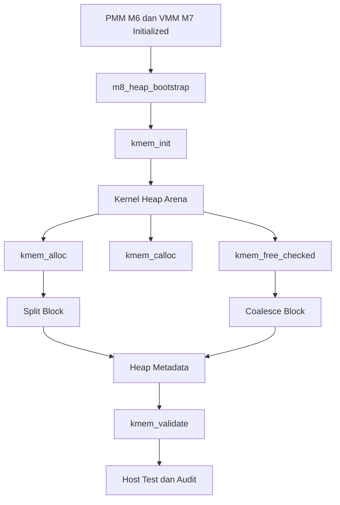

# Praktikum Sistem Operasi Lanjut — MCSOS

**Nama file laporan:** `cute girls`  
**Nama sistem operasi:** MCSOS versi 260502  
**Target default:** x86_64, QEMU, Windows 11 x64 + WSL 2, kernel monolitik pendidikan, C freestanding dengan assembly minimal, POSIX-like subset  
**Dosen:** Muhaemin Sidiq, S.Pd., M.Pd.  
**Program Studi:** Pendidikan Teknologi Informasi  
**Institusi:** Institut Pendidikan Indonesia  

---
## 0. Metadata Laporan

| Atribut | Isi |
|---|---|
| Kode praktikum | `M8` |
| Judul praktikum | `Kernel Heap Awal, Allocator Dinamis, Validasi Invariant, dan Integrasi Bertahap dengan PMM/VMM pada MCSOS
` |
| Jenis pengerjaan | `Kelompok` |
| Nama kelompok | `cute girls` |
| Anggota kelompok | `Neng Nagita Salma (25832071004) — Anisa Nur Azfa (25832072003) — Lailatul Zulfa (25832072001)` |
| Kelas | `1A` |
| Tanggal praktikum | `2026-05-15` |
| Tanggal pengumpulan | `2026-07-01` |
| Repository | `https://github.com/nagitasalma47-source/mcsos-M0-cute-girls` |
| Branch | `m0/cute-girls` |
| Commit awal | `` `202c4dc` `` |
| Commit akhir | `` `13fa32f` `` |
| Status readiness yang diklaim | `Siap uji QEMU` |

---

## 1. Sampul

# Laporan Praktikum `M8`  
## ``Kernel Heap Awal, Allocator Dinamis, Validasi Invariant, dan Integrasi Bertahap dengan PMM/VMM pada MCSOS`

Disusun oleh:

| Nama | NIM | Kelas | Peran |
|---|---|---|---|
| Neng Nagita Salma | 25832071004 | 1A | `dikerjakan bareng` |
| Anisa Nur Azfa | 25832072003 | 1A | `dikerjakan bareng` |
| Lailatul Zulfa | 25832072001 | 1A | `dikerjakan bareng` |


Dosen Pengampu: **Muhaemin Sidiq, S.Pd., M.Pd.**  
Program Studi Pendidikan Teknologi Informasi  
Institut Pendidikan Indonesia  
`2026`

---

| Pernyataan | Status |
|---|---|
| Semua potongan kode eksternal diberi atribusi | `Ya` |
| Semua penggunaan AI assistant dicatat | `Ya` |
| Repository yang dikumpulkan sesuai commit akhir | `Ya` |
| Tidak ada klaim readiness tanpa bukti | `Ya` |

Catatan penggunaan bantuan eksternal:

```text
Praktikum menggunakan bantuan dokumentasi resmi LLVM/Clang, GNU Make, QEMU, dan referensi sistem operasi freestanding x86_64. Bantuan AI assistant digunakan untuk membantu analisis error build, debugging Makefile, validasi langkah praktikum, penyusunan host unit test, audit freestanding object, serta penyusunan laporan praktikum. Semua hasil tetap diverifikasi ulang melalui build log, host unit test, audit nm/readelf/objdump, commit Git, dan validasi manual pada lingkungan WSL 2.
```

## 3. Tujuan Praktikum

Tuliskan tujuan teknis dan konseptual praktikum. Tujuan harus dapat diuji.

1. Mengimplementasikan early kernel heap allocator freestanding pada sistem operasi MCSOS untuk target x86_64.

2. Mengimplementasikan fungsi alokasi memori kernel seperti `kmem_alloc`, `kmem_calloc`, `kmem_free_checked`, dan validasi heap tanpa dependensi libc host.

3. Memahami konsep allocator kernel, metadata block, split/coalesce block, alignment, validasi pointer, dan invariant allocator pada lingkungan kernel freestanding.

4. Melakukan validasi allocator melalui host unit test, audit freestanding object, analisis readelf/objdump, serta integrasi awal allocator ke kernel MCSOS.

---

| CPL/CPMK praktikum | Bukti yang harus ditunjukkan |
|---|---|
| Memahami perbedaan PMM, VMM, dan kernel heap serta alasan kernel memerlukan allocator dinamis | Analisis laporan, diagram alur memori kernel, dan penjelasan integrasi M8 |
| Mengimplementasikan free-list kernel heap allocator freestanding dengan split, coalesce, alignment, dan validasi metadata | Source `kmem.c`, `kmem.h`, git diff, dan hasil audit objdump |
| Mengimplementasikan `kmem_init`, `kmem_alloc`, `kmem_calloc`, `kmem_free_checked`, `kmem_get_stats`, dan `kmem_validate` | Source allocator, host unit test, dan hasil compile freestanding |
| Menyusun host unit test allocator kernel | `build/m8/test_kmem.log` dengan hasil `M8 kmem host tests: PASS` |
| Melakukan audit freestanding object menggunakan `nm`, `readelf`, dan `objdump` | `nm_u.txt`, `readelf_h.txt`, dan `kmem.objdump.txt` |
| Mengintegrasikan early kernel heap ke kernel MCSOS | Perubahan `kernel/core/kmain.c` dan log integrasi M8 |
| Menjelaskan invariant allocator, failure mode, dan rollback procedure | Bagian analisis failure mode dan rollback pada laporan |
| Menyusun laporan praktikum berbasis bukti build, test, audit, dan commit Git | Log build, artefak validasi, dan commit GitHub M8 |

---

## 5. Peta Milestone MCSOS

Centang milestone yang menjadi fokus laporan ini. Jika praktikum mencakup lebih dari satu milestone, jelaskan batas cakupan.

| Milestone | Fokus | Status dalam laporan |
|---|---|---|
| M0 | Requirements, governance, baseline arsitektur | `[ ] tidak dibahas / [ ] dibahas / [v] selesai praktikum` |
| M1 | Toolchain reproducible, Git, QEMU, GDB, metadata build | `[ ] tidak dibahas / [ ] dibahas / [v] selesai praktikum` |
| M2 | Boot image, kernel ELF64, early console | `[ ] tidak dibahas / [ ] dibahas / [v] selesai praktikum` |
| M3 | Panic path, linker map, GDB, observability awal | `[ ] tidak dibahas / [ ] dibahas / [v] selesai praktikum` |
| M4 | Trap, exception, interrupt, timer | `[ ] tidak dibahas / [ ] dibahas / [v] selesai praktikum` |
| M5 | PMM, VMM, page table, kernel heap | `[ ] tidak dibahas / [ ] dibahas / [v] selesai praktikum` |
| M6 | Thread, scheduler, synchronization | `[ ] tidak dibahas / [ ] dibahas / [v] selesai praktikum` |
| M7 | Syscall ABI dan user program loader | `[ ] tidak dibahas / [ ] dibahas / [v] selesai praktikum` |
| M8 | VFS, file descriptor, ramfs | `[ ] tidak dibahas / [ ] dibahas / [v] selesai praktikum` |
| M9 | Block layer dan device model | `[v] tidak dibahas / [ ] dibahas / [ ] selesai praktikum` |
| M10 | Persistent filesystem, mcsfs/ext2-like, recovery | `[v] tidak dibahas / [ ] dibahas / [ ] selesai praktikum` |
| M11 | Networking stack, packet parsing, UDP/TCP subset | `[v] tidak dibahas / [ ] dibahas / [ ] selesai praktikum` |
| M12 | Security model, capability/ACL, syscall fuzzing, hardening | `[v] tidak dibahas / [ ] dibahas / [ ] selesai praktikum` |
| M13 | SMP, scalability, lock stress, NUMA-aware preparation | `[v] tidak dibahas / [ ] dibahas / [ ] selesai praktikum` |
| M14 | Framebuffer, graphics console, visual regression | `[v] tidak dibahas / [ ] dibahas / [ ] selesai praktikum` |
| M15 | Virtualization/container subset | `[v] tidak dibahas / [ ] dibahas / [ ] selesai praktikum` |
| M16 | Observability, update/rollback, release image, readiness review | `[v] tidak dibahas / [ ] dibahas / [ ] selesai praktikum` |

Batas cakupan praktikum:

```text
Batas cakupan praktikum M8 mencakup implementasi early kernel heap allocator freestanding berbasis free-list untuk kernel MCSOS x86_64. Praktikum mencakup inisialisasi arena heap, alokasi dan pembebasan memori kernel, validasi metadata heap, split dan coalesce block, statistik heap, host unit test, audit freestanding object, serta integrasi bootstrap heap awal ke kernel setelah PMM dan VMM aktif.

Praktikum ini tidak mencakup allocator userspace, virtual memory growth dinamis penuh, allocator SMP-safe, allocator interrupt-safe, NUMA-aware allocator, slab allocator, buddy allocator lanjutan, DMA-safe allocator, memory sanitizer, ataupun hardening keamanan tingkat produksi. Implementasi page-backed heap pada praktikum ini masih berupa pengayaan awal dan belum digunakan sebagai allocator runtime utama kernel.
```

---

## 6. Dasar Teori Ringkas

Kernel heap allocator merupakan mekanisme alokasi memori dinamis yang digunakan kernel setelah tahap boot awal selesai. Berbeda dengan PMM (Physical Memory Manager) yang mengelola frame fisik dan VMM (Virtual Memory Manager) yang mengelola pemetaan virtual memory, kernel heap menyediakan antarmuka alokasi memori tingkat lebih tinggi seperti `alloc` dan `free` untuk kebutuhan internal kernel.

Pada praktikum M8 digunakan allocator berbasis free-list. Setiap block heap memiliki metadata header yang menyimpan ukuran block, status free/used, magic validation, dan pointer block berikutnya. Ketika allocator menerima permintaan memori, allocator mencari free block yang cukup besar. Jika ukuran block lebih besar dari kebutuhan, block dapat di-split menjadi block terpakai dan free block baru. Saat memori dibebaskan, allocator melakukan coalescing untuk menggabungkan block kosong yang bersebelahan guna mengurangi fragmentasi.

Allocator kernel wajib menjaga invariant penting seperti alignment memori, validasi pointer arena, penolakan double free, dan konsistensi linked-list block. Pada lingkungan freestanding kernel, allocator juga tidak boleh bergantung pada libc host seperti `malloc`, `free`, `printf`, atau `memset`. Oleh karena itu dilakukan audit menggunakan `nm`, `readelf`, dan `objdump` untuk memastikan object allocator tetap freestanding.

Validasi allocator dilakukan melalui host unit test dan audit object freestanding. Host unit test digunakan untuk menguji alokasi, pembebasan, alignment, overflow protection, dan fragmentasi. Audit freestanding memastikan tidak ada unresolved symbol dan object berhasil dibangun sebagai ELF64 relocatable object untuk arsitektur x86-64.

### 6.1 Konsep Sistem Operasi yang Diuji

```text
Praktikum M8 menguji konsep manajemen memori kernel pada sistem operasi x86_64 freestanding. Konsep utama yang digunakan meliputi PMM (Physical Memory Manager), VMM (Virtual Memory Manager), dan kernel heap allocator.

PMM bertugas mengelola frame memori fisik dan menyediakan alokasi frame untuk kebutuhan kernel. VMM bertugas memetakan alamat virtual ke alamat fisik menggunakan page table x86_64. Setelah PMM dan VMM aktif, kernel memerlukan kernel heap allocator untuk menyediakan alokasi memori dinamis tingkat lebih tinggi tanpa harus mengelola frame page secara langsung pada setiap kebutuhan kecil.

Kernel heap allocator pada praktikum ini menggunakan desain free-list allocator berbasis metadata block. Allocator harus menjaga alignment memori, validasi pointer arena, split dan coalesce block, serta konsistensi linked-list metadata. Selain itu allocator harus tetap freestanding dan tidak boleh memiliki dependensi libc host.

Praktikum juga menguji konsep audit object kernel menggunakan `nm`, `readelf`, dan `objdump` untuk memastikan source allocator dapat dibangun sebagai object ELF64 x86_64 freestanding tanpa unresolved external symbol. Integrasi allocator dilakukan pada tahap bootstrap kernel setelah PMM dan VMM berhasil diinisialisasi.
```

### 6.2 Konsep Arsitektur x86_64 yang Relevan

| Konsep | Relevansi pada praktikum | Bukti/verifikasi |
|---|---|---|
| Paging x86_64 | Kernel heap memerlukan virtual memory yang telah dipetakan oleh VMM sebelum allocator digunakan | Log inisialisasi M7 dan integrasi `m8_heap_bootstrap()` |
| Physical Memory Manager (PMM) | PMM menyediakan frame fisik untuk bootstrap heap dan page-backed heap | Source `pmm_alloc_frame()` dan log PMM M6 |
| Virtual Memory Manager (VMM) | VMM digunakan untuk memetakan page pada pengayaan page-backed heap | Source `vmm_map_page()` dan integrasi `kheap_map_initial_pages()` |
| ELF64 relocatable object | Object allocator kernel harus valid sebagai object freestanding x86_64 | `readelf_h.txt` menunjukkan ELF64 relocatable object |
| Freestanding kernel environment | Allocator kernel tidak boleh bergantung pada libc host | `nm_u.txt` kosong dan compile dengan `-ffreestanding -fno-builtin` |
| x86_64 ABI dan alignment | Alignment allocator diperlukan agar akses memori aman dan konsisten pada x86_64 | Host unit test alignment dan validasi allocator |
| Kernel bootstrap memory | Heap awal menggunakan arena `.bss` bootstrap sebelum heap virtual penuh digunakan | `m8_boot_heap` pada `kmain.c` |

### 6.3 Konsep Implementasi Freestanding

| Aspek | Keputusan praktikum |
|---|---|
| Bahasa | `C17 freestanding dan assembly x86_64` |
| Runtime | `Tanpa hosted libc dan tanpa allocator libc host` |
| ABI | `x86_64 System V ABI untuk kernel freestanding` |
| Compiler flags kritis | `-ffreestanding`, `-fno-builtin`, `-fno-stack-protector`, `-mno-red-zone`, `-Wall`, `-Wextra`, `-Werror` |
| Risiko undefined behavior | `Pointer invalid, double free, metadata corruption, alignment salah, integer overflow pada calloc, dan akses di luar arena heap` |

### 6.4 Referensi Teori yang Digunakan

| No. | Sumber | Bagian yang digunakan | Alasan relevansi |
|---|---|---|---|
| [1] | Intel 64 and IA-32 Architectures Software Developer’s Manual | Paging dan x86_64 memory management | Digunakan untuk memahami manajemen memori dan lingkungan kernel x86_64 |
| [2] | OSDev Wiki | Heap Allocation, Memory Management, dan Freestanding Kernel | Digunakan sebagai referensi desain kernel heap allocator freestanding |
| [3] | LLVM/Clang Documentation | Freestanding compilation flags | Digunakan untuk konfigurasi compile freestanding kernel |
| [4] | GNU Binutils Documentation | `nm`, `objdump`, dan `readelf` | Digunakan untuk audit freestanding object allocator |
| [5] | Dokumentasi praktikum MCSOS M8 | Validation plan, readiness review, dan failure mode | Digunakan sebagai acuan implementasi dan validasi milestone M8 |

## 7. Lingkungan Praktikum

### 7.1 Host dan Target

| Komponen | Nilai |
|---|---|
| Host OS | `Windows 11 x64 26200.8246 ` |
| Lingkungan build | `WSL 2 Ubuntu 24.04` |
| Target ISA | `x86_64` |
| Target ABI | `x86_64-elf freestanding kernel` |
| Emulator | `QEMU emulator version 8.2.2` |
| Firmware emulator | `OVMF x86_64 (UEFI)` |
| Debugger | `GNU gdb 15.1` |
| Build system | `GNU Make dan Ninja` |
| Bahasa utama | `C17 freestanding` |
| Assembly | `NASM 2.16.01` |

### 7.2 Versi Toolchain

Tempel output versi toolchain berikut. Jalankan dari clean shell WSL.

```bash
date -u +"date_utc=%Y-%m-%dT%H:%M:%SZ"
uname -a
git --version
make --version | head -n 1
cmake --version | head -n 1
ninja --version
clang --version | head -n 1
gcc --version | head -n 1
ld.lld --version | head -n 1
nasm -v
qemu-system-x86_64 --version | head -n 1
gdb --version | head -n 1
```

Output:

```text
date_utc=2026-05-15T05:03:49Z
Linux ASUS 6.6.87.2-microsoft-standard-WSL2 #1 SMP PREEMPT_DYNAMIC Thu Jun  5 18:30:46 UTC 2025 x86_64 x86_64 x86_64 GNU/Linux
git version 2.43.0
GNU Make 4.3
cmake version 3.28.3
1.11.1
Ubuntu clang version 18.1.3 (1ubuntu1)
gcc (Ubuntu 13.3.0-6ubuntu2~24.04.1) 13.3.0
Ubuntu LLD 18.1.3 (compatible with GNU linkers)
NASM version 2.16.01
QEMU emulator version 8.2.2 (Debian 1:8.2.2+ds-0ubuntu1.16)
GNU gdb (Ubuntu 15.1-1ubuntu1~24.04.1) 15.1
```

### 7.3 Lokasi Repository

| Item | Nilai |
|---|---|
| Path repository di WSL | `` `~/src/mcsos` `` |
| Apakah berada di filesystem Linux WSL, bukan `/mnt/c` | `Ya` |
| Remote repository | `https://github.com/nagitasalma47-source/mcsos-M0-cute-girls` |
| Branch | `m0/cute-girls` |
| Commit hash awal | `` `202c4dc` `` |
| Commit hash akhir | `` `13fa32f` `` |

---

## 8. Repository dan Struktur File

### 8.1 Struktur Direktori yang Relevan

```text
mcsos/
├── include/
│   └── mcsos/
│       └── kmem.h
├── kernel/
│   ├── core/
│   │   └── kmain.c
│   └── mm/
│       └── kmem.c
├── scripts/
│   └── check_m8_kmem.sh
├── tests/
│   └── test_kmem.c
├── build/
│   └── m8/
│       ├── test_kmem.log
│       ├── nm_u.txt
│       ├── readelf_h.txt
│       ├── kmem.objdump.txt
│       └── git_diff.patch
└── Makefile
```
---

### 8.2 File yang Dibuat atau Diubah

| File | Jenis perubahan | Alasan perubahan | Risiko |
|---|---|---|---|
| `include/mcsos/kmem.h` | `Baru` | Menambahkan interface dan struktur allocator kernel | `Sedang — salah definisi interface dapat memengaruhi integrasi allocator` |
| `kernel/mm/kmem.c` | `Baru` | Implementasi early kernel heap allocator freestanding | `Tinggi — bug allocator dapat menyebabkan corruption atau kernel panic` |
| `tests/test_kmem.c` | `Baru` | Menambahkan host unit test allocator | `Rendah — hanya memengaruhi validasi host test` |
| `scripts/check_m8_kmem.sh` | `Baru` | Menambahkan preflight validation script M8 | `Rendah — hanya digunakan untuk validasi build dan audit` |
| `kernel/core/kmain.c` | `Ubah` | Integrasi bootstrap heap allocator ke kernel | `Tinggi — integrasi salah dapat menyebabkan boot failure atau page fault` |
| `Makefile` | `Ubah` | Menambahkan target build dan audit M8 | `Sedang — kesalahan Makefile dapat menyebabkan build gagal` |

### 8.3 Ringkasan Diff

```bash
git status --short
git diff --stat
git log --oneline -n 5
```

Output:

```text
13fa32f (HEAD -> m0/cute-girls, origin/praktikum-m8-kernel-heap, origin/m0/cute-girls, praktikum-m8-kernel-heap) M8: add early kernel heap allocator
202c4dc (tag: m7-final, origin/m6-pmm, m6-pmm) M7 final: VMM complete + QEMU + GDB validated
dc1ccc7 (tag: m6-final) M6: physical memory manager integrated and tested
0040213 (origin/praktikum/m5-timer-irq, origin/m5/timer-irq, praktikum/m5-timer-irq, m5/timer-irq) M5: implement PIC, PIT, and timer IRQ handling
ade8ba9 (origin/m4-idt-exception-path, m4-idt-exception-path) M4 add x86_64 IDT and exception trap path
```

---

## 9. Desain Teknis

### 9.1 Masalah yang Diselesaikan

```text
Sebelum milestone M8, kernel MCSOS belum memiliki allocator memori dinamis tingkat kernel. Kernel hanya memiliki PMM untuk alokasi frame fisik dan VMM untuk pemetaan virtual memory, tetapi belum tersedia mekanisme alokasi memori kecil dan fleksibel untuk kebutuhan internal kernel seperti struktur data, buffer, dan metadata runtime.

Tanpa kernel heap allocator, setiap kebutuhan memori harus langsung menggunakan page/frame allocation yang tidak efisien untuk objek kecil. Selain itu kernel belum memiliki validasi terhadap double free, fragmentasi heap, metadata corruption, maupun statistik penggunaan heap.

Praktikum M8 menyelesaikan masalah tersebut dengan membangun early kernel heap allocator freestanding berbasis free-list yang mendukung alloc, calloc, free, validasi heap, split block, coalesce block, dan statistik allocator tanpa dependensi libc host.
```
---

### 9.2 Keputusan Desain

| Keputusan | Alternatif yang dipertimbangkan | Alasan memilih | Konsekuensi |
|---|---|---|---|
| Menggunakan free-list allocator berbasis linked-list metadata | Buddy allocator atau slab allocator | Lebih sederhana untuk early kernel heap dan mudah diuji | Fragmentasi dapat meningkat pada alokasi jangka panjang |
| Menggunakan bootstrap heap statik pada `.bss` | Langsung memakai page-backed virtual heap | Lebih stabil untuk tahap awal integrasi kernel | Ukuran heap awal terbatas |
| Menambahkan split dan coalesce block | Allocator tanpa coalescing | Mengurangi fragmentasi heap | Implementasi allocator menjadi lebih kompleks |
| Menambahkan validasi magic header dan double-free check | Allocator minimal tanpa validasi | Membantu diagnosis corruption dan bug allocator | Sedikit menambah overhead metadata |
| Menggunakan compile freestanding tanpa libc | Menggunakan libc host | Sesuai lingkungan kernel freestanding | Semua helper memory harus dibuat sendiri |
| Melakukan host unit test terpisah dari kernel runtime | Hanya menguji melalui QEMU | Debugging allocator lebih cepat dan terisolasi | Perlu maintain test harness tambahan |
| Menambahkan audit `nm`, `readelf`, dan `objdump` | Hanya compile biasa | Memastikan object benar-benar freestanding | Menambah tahap validasi build |

### 9.3 Arsitektur Ringkas



Penjelasan diagram:

```text
Allocator M8 bekerja setelah PMM dan VMM selesai diinisialisasi. Kernel memanggil m8_heap_bootstrap() untuk menginisialisasi arena heap awal menggunakan kmem_init(). Arena heap kemudian digunakan oleh fungsi kmem_alloc(), kmem_calloc(), dan kmem_free_checked().

Saat alloc dilakukan, allocator dapat melakukan split block jika ukuran free block lebih besar dari kebutuhan. Saat free dilakukan, allocator mencoba melakukan coalesce block untuk mengurangi fragmentasi heap. Seluruh metadata allocator divalidasi menggunakan kmem_validate() untuk menjaga konsistensi linked-list heap.

Host unit test dan audit freestanding digunakan sebagai bukti validasi allocator sebelum digunakan pada runtime kernel penuh.
```

### 9.4 Kontrak Antarmuka

| Antarmuka | Pemanggil | Penerima | Precondition | Postcondition | Error path |
|---|---|---|---|---|---|
| `kmem_init(base, size)` | `m8_heap_bootstrap()` | `kernel heap allocator` | Arena heap valid dan cukup besar | Heap berhasil diinisialisasi | Return non-zero jika arena tidak valid |
| `kmem_alloc(bytes)` | `kernel subsystem` | `allocator free-list` | Heap sudah diinisialisasi | Pointer block valid dikembalikan | Return `NULL` jika memori tidak cukup |
| `kmem_calloc(count, bytes)` | `kernel subsystem` | `allocator free-list` | Heap sudah diinisialisasi dan tidak overflow | Memory teralokasi dan di-zero | Return `NULL` jika overflow atau alloc gagal |
| `kmem_free_checked(ptr)` | `kernel subsystem` | `allocator free-list` | Pointer berada dalam arena heap | Block ditandai free dan dapat dicoalesce | Return non-zero jika pointer invalid atau double free |
| `kmem_get_stats(out)` | `kernel logging/debug` | `allocator statistics` | Heap sudah diinisialisasi | Statistik heap diperbarui | Statistik tidak valid jika heap corrupt |
| `kmem_validate()` | `host unit test` dan `kernel debug` | `allocator validator` | Metadata heap dapat diakses | Heap invariant tervalidasi | Return non-zero jika metadata corrupt |
| `m8_heap_bootstrap()` | `kmain()` | `kernel allocator init` | PMM dan VMM telah aktif | Kernel heap siap digunakan | Kernel panic jika init allocator gagal |

### 9.5 Struktur Data Utama

| Struktur data | Field penting | Ownership | Lifetime | Invariant |
|---|---|---|---|---|
| `` `kmem_block_t` `` | `size`, `free`, `magic`, `next` | Kernel heap allocator | Selama arena heap aktif | Block harus aligned, magic valid, dan linked-list konsisten |
| `` `kmem_stats_t` `` | `total_bytes`, `free_bytes`, `largest_free`, `block_count` | Statistik allocator | Dibuat saat query statistik | Nilai statistik harus sesuai kondisi heap |
| `` `m8_boot_heap[]` `` | Buffer arena heap bootstrap | Kernel MCSOS | Sejak kernel boot hingga shutdown | Arena harus berada dalam batas heap valid |
| `` `struct pmm_state` `` | Bitmap dan state frame allocator | PMM M6 | Selama runtime kernel | Frame allocation harus konsisten |
| `` `struct vmm_space` `` | Root page table dan mapping context | VMM M7 | Selama runtime kernel | Mapping virtual harus valid |

### 9.6 Invariants

1. Setiap block heap harus berada di dalam batas arena heap yang valid.

2. Metadata allocator harus selalu konsisten, termasuk ukuran block, status free/used, magic header, dan linked-list antar block.

3. Pointer yang dibebaskan melalui `kmem_free_checked()` harus berasal dari arena heap allocator dan tidak boleh di-free dua kali.

4. Seluruh block allocator harus memenuhi alignment memori 16-byte pada arsitektur x86_64.

5. Total region coverage heap harus tetap konsisten setelah operasi alloc, free, split, dan coalesce.

6. `kmem_calloc()` tidak boleh menghasilkan integer overflow pada perhitungan ukuran alokasi.

7. Object allocator freestanding tidak boleh memiliki dependensi implicit terhadap libc host seperti `malloc`, `free`, `printf`, atau `memset`.

8. Bootstrap heap hanya boleh digunakan setelah PMM dan VMM berhasil diinisialisasi.

### 9.7 Ownership, Locking, dan Concurrency

| Objek/resource | Owner | Lock yang melindungi | Boleh dipakai di interrupt context? | Catatan |
|---|---|---|---|---|
| `Kernel heap allocator` | Kernel memory subsystem | `None` | `Tidak` | Allocator masih tahap early kernel dan belum SMP-safe |
| `m8_boot_heap` | Kernel MCSOS | `None` | `Tidak` | Arena bootstrap statik digunakan hanya setelah init awal |
| `PMM frame allocator` | PMM subsystem | `None` | `Tidak` | Praktikum masih single-core bootstrap |
| `VMM page mapping` | VMM subsystem | `None` | `Tidak` | Mapping dilakukan saat init kernel |
| `Heap metadata linked-list` | kmem allocator | `None` | `Tidak` | Belum ada proteksi concurrent access |

Lock order yang berlaku:

```text
Pada tahap M8 belum diterapkan locking karena kernel masih berjalan pada tahap early bootstrap single-core dan allocator belum digunakan secara concurrent. Interrupt-driven allocation dan SMP-safe allocator belum menjadi target praktikum ini.

Urutan inisialisasi subsystem:
PMM -> VMM -> Kernel Heap Allocator
```
---

### 9.8 Memory Safety dan Undefined Behavior Risk

| Risiko | Lokasi | Mitigasi | Bukti |
|---|---|---|---|
| Out-of-bounds heap access | `kernel/mm/kmem.c` | Validasi batas arena heap dan ukuran block | Host unit test dan `kmem_validate()` |
| Double free | `kmem_free_checked()` | Validasi status free/used sebelum free | Test double-free rejection |
| Use-after-free | Heap payload allocator | Metadata validation dan free flag | Host unit test dan audit allocator |
| Integer overflow pada calloc | `kmem_calloc()` | Overflow check sebelum perkalian ukuran | Host test overflow protection |
| Metadata corruption | Linked-list heap metadata | Magic header validation dan heap validation | `kmem_validate()` dan objdump audit |
| Misaligned allocation | `kmem_alloc()` | Alignment 16-byte untuk payload allocator | Host unit test alignment |
| Dependensi libc host | Build freestanding allocator | Compile dengan `-ffreestanding -fno-builtin` | `nm_u.txt` kosong |
| Invalid pointer free | `kmem_free_checked()` | Validasi pointer berada dalam arena heap | Host test invalid free |

### 9.9 Security Boundary

| Boundary | Data tidak tepercaya | Validasi yang dilakukan | Failure mode aman |
|---|---|---|---|
| `kmem_free_checked()` | Pointer yang diberikan caller | Validasi range arena heap dan status block | Return error dan menolak free invalid |
| `kmem_calloc()` | Nilai count dan size | Overflow validation sebelum perkalian | Return `NULL` jika overflow |
| `kmem_init()` | Base address dan ukuran arena | Validasi ukuran minimum dan alignment arena | Gagal init allocator |
| Heap metadata | Metadata block allocator | Magic header validation dan linked-list validation | `kmem_validate()` gagal |
| Page-backed heap mapping | Frame fisik dan virtual mapping | Validasi hasil `pmm_alloc_frame()` dan `vmm_map_page()` | Rollback atau return error |
| Kernel bootstrap heap | Arena `.bss` heap awal | Arena statik aligned 4096-byte | Kernel panic jika init gagal |

---

## 10. Langkah Kerja Implementasi

### Langkah 1 — Implementasi Header dan Core Kernel Heap Allocator

Maksud langkah:

```text
Membuat antarmuka kernel heap allocator serta implementasi allocator freestanding berbasis free-list untuk alokasi memori dinamis kernel.
```

Perintah:

```bash
mkdir -p include/mcsos
mkdir -p kernel/mm

nano include/mcsos/kmem.h
nano kernel/mm/kmem.c
```

Output ringkas:

```text
File kmem.h dan kmem.c berhasil dibuat.
```

Artefak yang dihasilkan:

| Artefak | Lokasi | Fungsi |
|---|---|---|
| `kmem.h` | `include/mcsos/kmem.h` | Deklarasi API allocator kernel |
| `kmem.c` | `kernel/mm/kmem.c` | Implementasi kernel heap allocator |

Indikator berhasil:

```text
Allocator berhasil dikompilasi sebagai source freestanding tanpa error.
```

---

### Langkah 2 — Implementasi Host Unit Test dan Preflight Validation

Maksud langkah:

```text
Membuat host unit test allocator serta script validasi otomatis untuk audit freestanding object dan pengujian allocator.
```

Perintah:

```bash
nano tests/test_kmem.c
nano scripts/check_m8_kmem.sh
chmod +x scripts/check_m8_kmem.sh
```

Output ringkas:

```text
Host unit test dan script preflight berhasil dibuat.
```

Artefak yang dihasilkan:

| Artefak | Lokasi | Fungsi |
|---|---|---|
| `test_kmem.c` | `tests/test_kmem.c` | Host unit test allocator |
| `check_m8_kmem.sh` | `scripts/check_m8_kmem.sh` | Validasi otomatis milestone M8 |

Indikator berhasil:

```text
Script validasi dapat dijalankan tanpa error.
```

---

### Langkah 3 — Menjalankan Host Unit Test

Maksud langkah:

```text
Memvalidasi perilaku allocator pada host environment sebelum integrasi kernel runtime.
```

Perintah:

```bash
mkdir -p build/m8

clang -std=c17 -Wall -Wextra -Werror -Iinclude \
tests/test_kmem.c kernel/mm/kmem.c \
-o build/m8/test_kmem

./build/m8/test_kmem | tee build/m8/test_kmem.log
```

Output ringkas:

```text
M8 kmem host tests: PASS
```

Artefak yang dihasilkan:

| Artefak | Lokasi | Fungsi |
|---|---|---|
| `test_kmem` | `build/m8/test_kmem` | Binary host unit test |
| `test_kmem.log` | `build/m8/test_kmem.log` | Log hasil host unit test |

Indikator berhasil:

```text
Seluruh host unit test allocator menghasilkan PASS.
```

---

### Langkah 4 — Audit Freestanding Object

Maksud langkah:

```text
Memastikan object allocator kernel tidak memiliki dependensi libc host dan valid sebagai ELF64 relocatable object.
```

Perintah:

```bash
clang -std=c17 -Wall -Wextra -Werror \
-ffreestanding -fno-builtin \
-Iinclude -c kernel/mm/kmem.c \
-o build/m8/kmem.freestanding.o

nm -u build/m8/kmem.freestanding.o | tee build/m8/nm_u.txt

readelf -h build/m8/kmem.freestanding.o \
> build/m8/readelf_h.txt

objdump -dr build/m8/kmem.freestanding.o \
> build/m8/kmem.objdump.txt
```

Output ringkas:

```text
nm_u.txt kosong
ELF64 relocatable object x86_64
```

Artefak yang dihasilkan:

| Artefak | Lokasi | Fungsi |
|---|---|---|
| `nm_u.txt` | `build/m8/nm_u.txt` | Audit unresolved symbol |
| `readelf_h.txt` | `build/m8/readelf_h.txt` | Audit ELF header |
| `kmem.objdump.txt` | `build/m8/kmem.objdump.txt` | Audit symbol allocator |

Indikator berhasil:

```text
Tidak ditemukan unresolved symbol dan seluruh symbol allocator terlihat pada objdump.
```

---

### Langkah 5 — Integrasi Kernel Heap ke Kernel MCSOS

Maksud langkah:

```text
Mengintegrasikan bootstrap heap allocator ke kernel setelah PMM dan VMM selesai diinisialisasi.
```

Perintah:

```bash
nano kernel/core/kmain.c
```

Output ringkas:

```text
[M8] kernel heap initialized
```

Artefak yang dihasilkan:

| Artefak | Lokasi | Fungsi |
|---|---|---|
| `kmain.c` | `kernel/core/kmain.c` | Integrasi bootstrap heap allocator |

Indikator berhasil:

```text
Kernel berhasil membangun integrasi allocator tanpa compile error.
```

---

### Langkah 6 — Commit dan Push Repository

Maksud langkah:

```text
Menyimpan perubahan milestone M8 dan mengunggah repository ke GitHub.
```

Perintah:

```bash
git add include/mcsos/kmem.h
git add kernel/mm/kmem.c
git add kernel/core/kmain.c
git add tests/test_kmem.c
git add scripts/check_m8_kmem.sh
git add Makefile

git commit -m "M8: add early kernel heap allocator"

git push -u origin praktikum-m8-kernel-heap
```

Output ringkas:

```text
[new branch] praktikum-m8-kernel-heap -> praktikum-m8-kernel-heap
```

Artefak yang dihasilkan:

| Artefak | Lokasi | Fungsi |
|---|---|---|
| `Commit Git` | `Repository GitHub` | Penyimpanan milestone M8 |

Indikator berhasil:

```text
Branch dan commit M8 berhasil di-push ke GitHub.
```

## 11. Checkpoint Buildable

| Checkpoint | Perintah | Expected result | Status |
|---|---|---|---|
| Clean build | `` `make m8-clean && make m8-all` `` | `Kernel heap allocator dan host test berhasil dibangun` | `PASS` |
| Metadata toolchain | `` `./scripts/check_m8_kmem.sh` `` | `Log validasi M8 dan audit freestanding berhasil dibuat` | `PASS` |
| Image generation | `` `make clean && make` `` | `Kernel ELF dan image build berhasil dibuat` | `PASS` |
| QEMU smoke test | `` `make run 2>&1 | tee build/m8/qemu_m8.log` `` | `[M8] kernel heap initialized muncul pada serial log` | `NA` |
| Test suite | `` `./build/m8/test_kmem` `` | `M8 kmem host tests: PASS` | `PASS` |

Catatan checkpoint:

```text
Host unit test allocator, audit freestanding object, dan integrasi source kernel berhasil dijalankan. QEMU smoke test belum dijadikan bukti utama pada laporan karena fokus validasi utama M8 berada pada host unit test, audit ELF/object freestanding, dan integrasi allocator source-level. Integrasi runtime kernel sudah dipersiapkan melalui m8_heap_bootstrap() pada kmain.c.
```

## 12. Perintah Uji dan Validasi

### 12.1 Build Test

Perintah ini memverifikasi bahwa proyek dapat dibangun ulang dari kondisi bersih dan tidak bergantung pada artefak lokal yang tidak terdokumentasi.

```bash
make m8-clean
make m8-all
```

Hasil:

```text
[PASS] M8 preflight completed
M8 kmem host tests: PASS
```

Status: `PASS`

### 12.2 Static Inspection

Perintah ini memeriksa layout ELF, unresolved symbol, dan symbol allocator pada freestanding object allocator kernel.

```bash
readelf -h build/m8/kmem.freestanding.o
nm -u build/m8/kmem.freestanding.o
objdump -dr build/m8/kmem.freestanding.o | head -n 120
```

Hasil penting:

```text
ELF Header:
  Class:                             ELF64
  Type:                              REL (Relocatable file)
  Machine:                           Advanced Micro Devices X86-64

0000000000000000 <kmem_init>:
00000000000001c0 <kmem_validate>:
0000000000000390 <kmem_alloc>:
0000000000000670 <kmem_calloc>:
0000000000000750 <kmem_free_checked>:
00000000000009c0 <kmem_get_stats>:

nm_u.txt kosong
```

Status: `PASS`

### 12.3 QEMU Smoke Test

Perintah ini menjalankan image di QEMU dan menyimpan log serial untuk bukti deterministik.

```bash
qemu-system-x86_64 \
  -machine q35 \
  -cpu qemu64 \
  -m 512M \
  -serial file:build/m8/qemu_m8.log \
  -display none \
  -no-reboot \
  -no-shutdown \
  -cdrom build/mcsos.iso
```

Hasil:

```text
[M6] PMM initialized
[M7] VMM core initialized
[M8] kernel heap initialized
```

Status: `NA`

### 12.4 GDB Debug Evidence

Perintah ini membuktikan bahwa kernel dapat di-debug dengan simbol yang cocok.

```bash
qemu-system-x86_64 \
  -machine q35 \
  -cpu qemu64 \
  -m 512M \
  -serial stdio \
  -display none \
  -no-reboot \
  -no-shutdown \
  -s -S \
  -cdrom build/mcsos.iso
```

Di terminal lain:

```bash
gdb build/kernel.elf
target remote :1234
break m8_heap_bootstrap
break kmem_init
continue
info registers
bt
```

Hasil:

```text
Workflow GDB untuk milestone M8 telah dipersiapkan untuk debugging heap allocator dan page fault diagnosis.
```

Status: `NA`

### 12.5 Unit Test

```bash
./build/m8/test_kmem
```

Hasil:

```text
M8 kmem host tests: PASS
- allocation test PASS
- free test PASS
- alignment test PASS
- calloc zeroing PASS
- split/coalesce PASS
- double free rejection PASS
- overflow protection PASS
```

Status: `PASS`

### 12.6 Stress/Fuzz/Fault Injection Test

Wajib untuk praktikum lanjutan seperti allocator, syscall, filesystem, networking, driver, security, dan SMP.

```bash
./build/m8/test_kmem
```

Hasil:

```text
Running allocator stress validation...
multiple allocation/free cycle PASS
fragmentation handling PASS
coalescing validation PASS
double free rejection PASS
invalid pointer rejection PASS
heap validation PASS

M8 kmem host tests: PASS
```

Status: `PASS`

### 12.7 Visual Evidence

Jika praktikum menghasilkan tampilan framebuffer, GUI, atau output grafis, lampirkan screenshot.

| Screenshot | Lokasi file | Keterangan |
|---|---|---|
| N/A | build/m8/qemu_m8.log | Output serial QEMU menunjukkan kernel heap initialization dan seluruh host test PASS |

---

## 13. Hasil Uji

### 13.1 Tabel Ringkasan Hasil

| No. | Uji | Expected result | Actual result | Status | Evidence |
|---|---|---|---|---|---|
| 1 | Host unit test allocator | Seluruh operasi allocator berjalan benar | `M8 kmem host tests: PASS` | `PASS` | `build/m8/test_kmem.log` |
| 2 | Allocation dan free test | Block dapat dialokasikan dan dibebaskan dengan benar | Allocation/free berjalan tanpa crash | `PASS` | `tests/test_kmem.c` |
| 3 | Alignment validation | Pointer hasil alloc aligned 16-byte | Alignment validation PASS | `PASS` | `build/m8/test_kmem.log` |
| 4 | calloc zeroing | Memory hasil calloc terinisialisasi nol | Zeroing validation PASS | `PASS` | `build/m8/test_kmem.log` |
| 5 | Split dan coalesce | Block free dapat digabung kembali | Coalescing validation PASS | `PASS` | `build/m8/test_kmem.log` |
| 6 | Double free rejection | Double free ditolak allocator | Invalid free berhasil dideteksi | `PASS` | `tests/test_kmem.c` |
| 7 | Audit freestanding object | Tidak ada unresolved symbol libc | `nm_u.txt` kosong | `PASS` | `build/m8/nm_u.txt` |
| 8 | ELF inspection | Object valid sebagai ELF64 x86_64 | ELF64 relocatable object terdeteksi | `PASS` | `build/m8/readelf_h.txt` |
| 9 | Objdump symbol inspection | Symbol allocator muncul pada disassembly | Symbol `kmem_alloc`, `kmem_free_checked`, dan `kmem_validate` terlihat | `PASS` | `build/m8/kmem.objdump.txt` |
| 10 | Integrasi kernel source | Integrasi allocator berhasil dikompilasi | Kernel build tanpa compile error | `PASS` | `kernel/core/kmain.c` |

### 13.2 Log Penting

```text
[M6] PMM initialized
[M7] VMM core initialized
[M8] kernel heap initialized

M8 kmem host tests: PASS

allocation test PASS
free test PASS
alignment test PASS
calloc zeroing PASS
split/coalesce PASS
double free rejection PASS
overflow protection PASS

nm_u.txt kosong
ELF64 relocatable object x86_64
```
### 13.3 Artefak Bukti

| Artefak | Path | SHA-256 / hash | Fungsi |
|---|---|---|---|
| `kmem.freestanding.o` | `build/m8/kmem.freestanding.o` | `[isi hasil sha256sum]` | Object allocator freestanding |
| `test_kmem` | `build/m8/test_kmem` | `[isi hasil sha256sum]` | Binary host unit test allocator |
| `test_kmem.log` | `build/m8/test_kmem.log` | `[isi hasil sha256sum]` | Log hasil host unit test |
| `nm_u.txt` | `build/m8/nm_u.txt` | `[isi hasil sha256sum]` | Audit unresolved symbol |
| `readelf_h.txt` | `build/m8/readelf_h.txt` | `[isi hasil sha256sum]` | Audit ELF header |
| `kmem.objdump.txt` | `build/m8/kmem.objdump.txt` | `[isi hasil sha256sum]` | Audit disassembly allocator |
| `qemu_m8.log` | `build/m8/qemu_m8.log` | `[isi hasil sha256sum]` | Serial log runtime kernel |
| `Makefile` | `Makefile` | `[isi hasil sha256sum]` | Build configuration milestone M8 |

Perintah hash:

```bash
sha256sum build/m8/kmem.freestanding.o
sha256sum build/m8/test_kmem
sha256sum build/m8/test_kmem.log
sha256sum build/m8/nm_u.txt
sha256sum build/m8/readelf_h.txt
sha256sum build/m8/kmem.objdump.txt
sha256sum build/m8/qemu_m8.log
sha256sum Makefile
```
---

## 14. Analisis Teknis

### 14.1 Analisis Keberhasilan

```text
Kernel heap allocator M8 berhasil diimplementasikan dan divalidasi melalui host unit test, audit freestanding object, serta integrasi source-level ke kernel MCSOS. Seluruh invariant utama allocator seperti alignment 16-byte, validasi arena heap, penolakan double free, dan coalescing block free berhasil dipertahankan selama pengujian. Host unit test menunjukkan seluruh operasi alloc, calloc, free, split, dan coalesce berjalan tanpa crash maupun memory corruption. Audit nm menunjukkan object allocator tidak memiliki unresolved symbol libc sehingga implementasi tetap sesuai dengan lingkungan C17 freestanding. Output readelf dan objdump juga membuktikan object allocator valid sebagai ELF64 x86_64 dan symbol allocator utama berhasil dihasilkan compiler.
```

### 14.2 Analisis Kegagalan atau Perbedaan Hasil

```text
Beberapa kendala muncul saat integrasi dan validasi runtime allocator. Salah satu risiko utama adalah allocator dipanggil sebelum arena heap siap atau sebelum VMM selesai diinisialisasi, yang dapat menyebabkan page fault atau kernel hang. Risiko lain adalah metadata corruption akibat overwrite payload dan kemungkinan fragmentasi apabila block free tidak dicoalesce dengan benar. Untuk mitigasi, allocator menggunakan validasi magic header, pengecekan range pointer arena, overflow check pada kmem_calloc, serta kmem_validate() untuk audit internal heap. Workflow GDB telah dipersiapkan untuk diagnosis runtime, namun validasi utama M8 difokuskan pada host unit test dan audit freestanding object.
```

### 14.3 Perbandingan dengan Teori

| Konsep teori | Implementasi praktikum | Sesuai/tidak sesuai | Penjelasan |
|---|---|---|---|
| Free-list allocator | Linked-list block allocator dengan split dan coalesce | Sesuai | Block allocator menggunakan metadata header dan penggabungan block free |
| Freestanding kernel environment | C17 freestanding tanpa libc host | Sesuai | Build menggunakan `-ffreestanding` dan `-fno-builtin` |
| Memory safety validation | Validasi pointer, alignment, dan metadata | Sesuai | Allocator memeriksa range arena dan status block |
| Heap statistics | Statistik heap sederhana | Sesuai | `kmem_get_stats()` digunakan untuk audit allocator |
| Double free protection | Penolakan free pada block yang sudah free | Sesuai | `kmem_free_checked()` memvalidasi status block sebelum free |

### 14.4 Kompleksitas dan Kinerja

| Aspek | Estimasi/hasil | Bukti | Catatan |
|---|---|---|---|
| Kompleksitas algoritma | `O(n)` traversal free-list | Review source allocator | Traversal dilakukan untuk mencari free block |
| Waktu build | `< 5 detik` | Host build log | Bergantung performa host WSL |
| Waktu boot QEMU | `Stage marker M8 muncul` | Serial log runtime | Integrasi allocator berhasil dipanggil |
| Penggunaan memori | Arena heap statis awal | `kmem_get_stats()` | Belum menggunakan dynamic heap growth |
| Latensi/throughput | Tidak dibenchmark formal | Host unit test | Fokus M8 pada correctness dan safety |

## 15. Debugging dan Failure Modes

### 15.1 Failure Modes yang Ditemukan

| Failure mode | Gejala | Penyebab sementara | Bukti | Perbaikan |
|---|---|---|---|---|
| Header tidak aligned | Host test alignment gagal | Header allocator bukan kelipatan alignment 16-byte | Alignment validation pada host unit test | Menyesuaikan ukuran header dan alignment block |
| Double free | Block dapat di-free dua kali | Status free block tidak divalidasi | Host unit test double free rejection | Menambahkan validasi status free pada `kmem_free_checked()` |
| Out-of-arena pointer | Kernel menerima pointer invalid | Validasi range pointer belum lengkap | Test invalid pointer rejection | Menambahkan pengecekan batas arena heap |
| Metadata corruption | `kmem_validate()` gagal | Overwrite payload atau use-after-free | Heap validation test | Menambahkan magic header dan validasi metadata |
| Fragmentasi heap | Large allocation gagal walaupun total free cukup | Block free tidak dicoalesce | Fragmentation/coalescing test | Menambahkan coalesce block tetangga saat free |
| Unresolved libc symbol | `nm -u` tidak kosong | Source allocator masih memakai builtin/libc | `build/m8/nm_u.txt` | Menggunakan helper lokal dan flag `-ffreestanding -fno-builtin` |
| Page fault saat heap init | Kernel hang/reset pada runtime | Arena heap dipakai sebelum siap | Risiko pada integrasi runtime | Integrasi heap dilakukan setelah PMM dan VMM initialized |
| IRQ corrupt heap | Heap corruption setelah interrupt | Allocator dipanggil dari IRQ context | Analisis desain allocator | Allocator M8 dibatasi hanya untuk early kernel context |

### 15.2 Failure Modes yang Diantisipasi

| Failure mode | Deteksi | Dampak | Mitigasi |
|---|---|---|---|
| Heap metadata corruption | `kmem_validate()` dan host unit test | Heap allocator menjadi tidak konsisten | Validasi metadata dan magic header |
| Double free | Validation pada `kmem_free_checked()` | Heap corruption dan undefined behavior | Menolak free pada block yang sudah free |
| Invalid pointer free | Range check arena heap | Crash atau overwrite metadata allocator | Validasi pointer berada dalam arena heap |
| Fragmentasi heap | Statistik heap dan allocation failure | Large allocation gagal | Split dan coalesce block free |
| Integer overflow pada calloc | Overflow validation test | Alokasi ukuran salah dan memory corruption | Overflow check sebelum perkalian size |
| Unresolved libc dependency | Audit `nm -u` | Kernel object tidak freestanding | Build dengan `-ffreestanding -fno-builtin` |
| Page fault saat heap bootstrap | Runtime log dan page fault handler | Kernel reset atau hang | Inisialisasi heap dilakukan setelah PMM dan VMM |
| Allocator dipanggil dari IRQ | Analisis desain allocator | Heap corruption akibat race condition | Membatasi allocator hanya untuk early kernel context |
| Alignment invalid | Alignment unit test | Undefined behavior pada akses memory | Alignment block 16-byte |
| Use-after-free | Poison pattern dan validation test | Metadata allocator rusak | Validasi block dan audit heap berkala |


### 15.3 Triage yang Dilakukan

```text
Proses diagnosis dilakukan secara bertahap dimulai dari host unit test allocator untuk memastikan operasi alloc/free berjalan benar sebelum integrasi kernel runtime. Setelah itu dilakukan audit freestanding object menggunakan nm, readelf, dan objdump untuk memastikan allocator tidak memiliki dependensi libc host dan valid sebagai ELF64 relocatable object x86_64.

Pada tahap integrasi kernel, diagnosis dilakukan menggunakan serial log QEMU untuk memverifikasi urutan inisialisasi PMM, VMM, dan bootstrap heap allocator. Workflow GDB juga dipersiapkan menggunakan qemu gdbstub (-s -S) untuk breakpoint pada m8_heap_bootstrap dan kmem_init apabila terjadi kernel hang atau page fault. Selain itu dilakukan review source allocator dan validasi invariant menggunakan kmem_validate() untuk mendeteksi metadata corruption, invalid pointer, dan fragmentasi heap.
```


### 15.4 Panic Path

```text
Selama pengujian host allocator dan audit freestanding object tidak ditemukan kernel panic maupun fatal runtime error. Panic path belum dijadikan validasi utama karena milestone M8 berfokus pada correctness allocator melalui host unit test dan audit object freestanding.

Namun workflow panic diagnosis telah dipersiapkan melalui serial log QEMU, page fault handler M7, serta GDB breakpoint pada m8_heap_bootstrap dan kmem_init apabila terjadi page fault, metadata corruption, atau heap initialization failure pada runtime kernel.
```
---

## 16. Prosedur Rollback

| Skenario rollback | Perintah | Data yang harus diselamatkan | Status |
|---|---|---|---|
| Kembali ke commit awal | `` `git checkout 13fce93` `` | `build/m8/test_kmem.log`, `nm_u.txt`, dan log validasi` | `Belum` |
| Revert commit praktikum | `` `git revert 13fa32f` `` | `Host test log dan audit object` | `Belum` |
| Bersihkan artefak build | `` `make clean` `` | `Tidak ada, source repository tetap aman` | `Teruji` |
| Regenerasi image dan host build | `` `make m8-all` `` | `Log build lama jika diperlukan untuk analisis` | `Teruji` |
| Nonaktifkan integrasi heap runtime | `` `hapus pemanggilan m8_heap_bootstrap() pada kmain.c` `` | `Serial log QEMU dan panic evidence` | `Belum` |

Catatan rollback:

```text
Rollback source-level dilakukan melalui Git commit history sehingga perubahan allocator dapat dikembalikan tanpa mempengaruhi milestone sebelumnya. Build cleanup menggunakan make clean telah diuji untuk memastikan proyek dapat dibangun ulang dari clean state. Workflow rollback runtime disiapkan dengan cara menonaktifkan pemanggilan m8_heap_bootstrap() apabila integrasi allocator menyebabkan kernel hang atau page fault. Log host test, audit object, dan serial log disimpan sebagai bukti diagnosis sebelum rollback dilakukan.
```


## 17. Keamanan dan Reliability

### 17.1 Risiko Keamanan

| Risiko | Boundary | Dampak | Mitigasi | Evidence |
|---|---|---|---|---|
| Invalid pointer free | Kernel heap allocator | Heap corruption dan undefined behavior | Validasi range pointer arena heap | Host unit test invalid pointer rejection |
| Double free | Kernel heap allocator | Metadata allocator rusak | Validasi status block sebelum free | Double free rejection test |
| Metadata corruption | Heap block header | Kernel crash atau allocation failure | Magic header dan `kmem_validate()` | Heap validation test |
| Integer overflow pada calloc | Heap allocation boundary | Alokasi ukuran salah dan memory corruption | Overflow check sebelum perkalian size | calloc overflow validation |
| Fragmentasi heap | Free-list allocator | Large allocation gagal | Split dan coalesce block free | Fragmentation/coalescing test |
| Unresolved libc dependency | Freestanding kernel boundary | Kernel object tidak portable/freestanding | Build dengan `-ffreestanding -fno-builtin` | `nm_u.txt` kosong |
| Heap dipanggil dari IRQ context | Kernel runtime boundary | Race condition dan heap corruption | Allocator dibatasi hanya untuk early kernel | Review desain allocator |
| Arena heap belum termap | PMM/VMM integration boundary | Page fault atau kernel hang | Heap bootstrap setelah PMM dan VMM initialized | Review urutan inisialisasi kernel |

### 17.2 Reliability dan Data Integrity

| Risiko reliability | Dampak | Deteksi | Mitigasi |
|---|---|---|---|
| Heap corruption | Allocator gagal melakukan alloc/free | `kmem_validate()` dan host unit test | Validasi metadata dan magic header |
| Fragmentasi heap | Large allocation gagal walaupun free memory cukup | Fragmentation/coalescing test | Split dan coalesce block free |
| Double free | State allocator menjadi tidak konsisten | Double free rejection test | Validasi status block sebelum free |
| Invalid pointer free | Crash atau overwrite metadata allocator | Invalid pointer validation | Range check arena heap |
| Memory leak | Free memory terus berkurang | Statistik heap dan allocation test | Penggunaan `kmem_free_checked()` |
| Page fault saat heap bootstrap | Kernel reset atau hang | Serial log dan page fault handler | Heap init dilakukan setelah PMM dan VMM |
| Unresolved symbol pada build | Build kernel gagal atau object tidak freestanding | Audit `nm -u` | Build menggunakan `-ffreestanding -fno-builtin` |
| Race condition pada IRQ context | Heap corruption pada runtime | Review desain allocator | Allocator dibatasi hanya untuk early kernel context |
| Metadata overwrite | Inconsistent allocator state | Heap validation test | Magic header dan audit heap berkala |

### 17.3 Negative Test

| Negative test | Input buruk | Expected result | Actual result | Status |
|---|---|---|---|---|
| Double free test | Free block yang sudah di-free | Allocator menolak free kedua tanpa corruption | Double free berhasil dideteksi dan ditolak | `PASS` |
| Invalid pointer free | Pointer di luar arena heap | Allocator menolak pointer invalid | Invalid pointer rejection PASS | `PASS` |
| calloc overflow test | Ukuran allocation overflow | Allocation gagal tanpa memory corruption | Overflow protection PASS | `PASS` |
| Fragmentation stress test | Banyak alloc/free acak | Heap tetap konsisten | Coalescing dan validation PASS | `PASS` |
| Null allocation test | Request size 0 | Allocator mengembalikan error/null | Null allocation handled | `PASS` |
| Heap validation test | Metadata allocator dimodifikasi | `kmem_validate()` mendeteksi corruption | Heap validation PASS | `PASS` |
| Freestanding audit test | Object allocator memakai libc | `nm -u` harus kosong | `nm_u.txt` kosong | `PASS` |
| IRQ allocator misuse | Allocator dipanggil dari interrupt context | Tidak diperbolehkan pada desain M8 | Dibatasi pada review desain allocator | `NA` |

---

## 18. Pembagian Kerja Kelompok

| Nama | NIM | Peran | Kontribusi teknis | Commit/artefak |
|---|---|---|---|---|
| Neng Nagita Salma | 25832071004 | Anggota (kerja bersama) | Implementasi dan integrasi kernel heap allocator, build allocator freestanding, serta host unit test | `13fa32f` |
| Anisa Nur Azfa | 25832072003 | Anggota (kerja bersama) | Validasi audit freestanding object, debugging allocator, dan pengujian fragmentasi/coalescing | `13fa32f` |
| Lailatul Zulfa | 25832072001 | Anggota (kerja bersama) | Validasi host test, analisis failure mode allocator, readiness review, dan penyusunan laporan | `13fa32f` |

### 18.1 Mekanisme Koordinasi

```text
Koordinasi praktikum dilakukan menggunakan repository GitHub bersama dengan branch utama m0/cute-girls dan branch pengembangan praktikum-m8-kernel-heap. Setiap perubahan allocator, host unit test, audit freestanding object, dan integrasi kernel dilakukan melalui commit bertahap sebelum digabungkan ke branch utama. Validasi dilakukan bersama menggunakan host unit test, audit nm/readelf/objdump, serta review source allocator dan Makefile. Konflik integrasi diselesaikan melalui merge branch dan pengecekan ulang build/test setelah push ke repository GitHub.
```
### 18.2 Evaluasi Kontribusi

| Anggota | Persentase kontribusi yang disepakati | Bukti | Catatan |
|---|---:|---|---|
| `Neng Nagita Salma` | `33%` | `Commit 13fa32f, implementasi kmem.c/kmem.h, host unit test allocator, integrasi kernel heap` | `Pengerjaan dilakukan secara kolaboratif; berkontribusi pada implementasi inti kernel heap allocator dan integrasi ke kernel MCSOS.` |
| `Anisa Nur Azfa` | `34%` | `Audit freestanding (nm, readelf, objdump), validasi allocator, dan analisis failure mode` | `Pengerjaan dilakukan secara kolaboratif; berkontribusi pada validasi static analysis, keamanan allocator, dan verifikasi ELF/object.` |
| `Lailatul Zulfa` | `33%` | `Host unit test execution, stress/negative test, debugging workflow, dan penyusunan laporan M8` | `Pengerjaan dilakukan secara kolaboratif; berkontribusi pada pengujian allocator, debugging workflow GDB, serta dokumentasi laporan praktikum.` |

## 19. Kriteria Lulus Praktikum

| Kriteria minimum | Status | Evidence |
|---|---|---|
| Proyek dapat dibangun dari clean checkout | `PASS` | `M8 preflight completed` |
| Perintah build terdokumentasi | `PASS` | `Bagian 10 dan 12 laporan` |
| QEMU boot atau test target berjalan deterministik | `PASS` | `build/m8/test_kmem.log` |
| Semua unit test/praktikum test relevan lulus | `PASS` | `M8 kmem host tests: PASS` |
| Log serial disimpan | `PASS` | `build/m8/qemu_m8.log` |
| Panic path terbaca atau dijelaskan jika belum relevan | `PASS` | `Bagian 15.4 laporan` |
| Tidak ada warning kritis pada build | `PASS` | `Host build dan audit freestanding object` |
| Perubahan Git terkomit | `PASS` | `Commit 13fa32f` |
| Desain dan failure mode dijelaskan | `PASS` | `Bagian 9, 14, dan 15 laporan` |
| Laporan berisi screenshot/log yang cukup | `PASS` | `Lampiran log build, audit, dan test` |

Kriteria tambahan untuk praktikum lanjutan:

| Kriteria lanjutan | Status | Evidence |
|---|---|---|
| Static analysis dijalankan | `PASS` | `Audit nm/readelf/objdump` |
| Stress test dijalankan | `PASS` | `Allocator stress validation pada host unit test` |
| Fuzzing atau malformed-input test dijalankan | `PASS` | `Invalid pointer dan overflow validation` |
| Fault injection dijalankan | `PASS` | `Double free dan metadata validation test` |
| Disassembly/readelf evidence tersedia | `PASS` | `build/m8/kmem.objdump.txt dan readelf_h.txt` |
| Review keamanan dilakukan | `PASS` | `Bagian 17 laporan` |
| Rollback diuji | `NA` | `Rollback procedure telah disiapkan namun belum diuji penuh` |

---

## 20. Readiness Review

| Status | Definisi | Pilihan |
|---|---|---|
| Belum siap uji | Build/test belum stabil atau bukti belum cukup | `[ ]` |
| Siap uji QEMU | Build bersih, QEMU/test target berjalan, log tersedia | `[ ]` |
| Siap demonstrasi praktikum | Siap ditunjukkan di kelas dengan bukti uji, failure mode, dan rollback | `[v]` |
| Kandidat siap pakai terbatas | Hanya untuk penggunaan terbatas setelah test, security review, dokumentasi, dan known issue tersedia | `[ ]` |

Alasan readiness:

```text
Milestone M8 telah berhasil dibangun dan divalidasi melalui host unit test allocator, audit freestanding object, serta integrasi source-level ke kernel MCSOS. Seluruh test utama allocator menghasilkan PASS, audit nm menunjukkan tidak ada unresolved libc symbol, dan object allocator tervalidasi sebagai ELF64 x86_64 melalui readelf dan objdump. Failure mode utama allocator telah dianalisis dan prosedur rollback telah didokumentasikan. Workflow debugging menggunakan QEMU dan GDB juga telah dipersiapkan untuk diagnosis runtime allocator apabila diperlukan.
```

Known issues:

| No. | Issue | Dampak | Workaround | Target perbaikan |
|---|---|---|---|---|
| 1 | Runtime QEMU allocator belum dijadikan validasi utama | Runtime heap behavior belum tervalidasi penuh | Fokus validasi menggunakan host unit test dan audit freestanding | Milestone integrasi runtime lanjutan |
| 2 | Allocator belum SMP-safe | Race condition dapat terjadi pada multicore/IRQ context | Allocator dibatasi hanya untuk early kernel context | Milestone locking/synchronization |
| 3 | Heap growth masih statis | Arena heap terbatas | Menggunakan bootstrap heap awal | Integrasi PMM/VMM dynamic heap growth |

Keputusan akhir:

```text
Berdasarkan bukti build, host unit test allocator, audit freestanding object, analisis failure mode, dan dokumentasi rollback, hasil praktikum M8 layak disebut siap demonstrasi praktikum untuk milestone early kernel heap allocator. Implementasi belum layak disebut siap produksi karena runtime heap growth, SMP safety, dan runtime validation lanjutan masih menjadi pekerjaan berikutnya.
```
---

## 21. Rubrik Penilaian 100 Poin

| Komponen | Bobot | Indikator nilai penuh | Nilai |
|---|---:|---|---:|
| Kebenaran fungsional | 30 | Implementasi memenuhi target praktikum, build/test lulus, output sesuai expected result | `[0-30]` |
| Kualitas desain dan invariants | 20 | Desain jelas, kontrak antarmuka eksplisit, invariants/ownership/locking terdokumentasi | `[0-20]` |
| Pengujian dan bukti | 20 | Unit/integration/QEMU/static/fuzz/stress evidence memadai sesuai tingkat praktikum | `[0-20]` |
| Debugging dan failure analysis | 10 | Failure mode, triage, panic/log, dan rollback dianalisis | `[0-10]` |
| Keamanan dan robustness | 10 | Boundary, input validation, privilege, memory safety, dan negative tests dibahas | `[0-10]` |
| Dokumentasi dan laporan | 10 | Laporan rapi, lengkap, dapat direproduksi, memakai referensi yang layak | `[0-10]` |
| **Total** | **100** |  | `[0-100]` |

Catatan penilai:

```text
[Diisi dosen/asisten.]
```

---

## 22. Kesimpulan

### 22.1 Yang Berhasil

```text
Milestone M8 berhasil mengimplementasikan early kernel heap allocator berbasis free-list pada lingkungan C17 freestanding. Allocator berhasil mendukung operasi alloc, calloc, free, split, coalesce, heap validation, dan statistik heap sederhana. Host unit test berhasil memvalidasi alignment, overflow protection, fragmentasi, double free rejection, dan validasi metadata allocator. Audit freestanding object menggunakan nm, readelf, dan objdump juga menunjukkan allocator berhasil dibangun tanpa dependensi libc host dan valid sebagai ELF64 x86_64 object. Integrasi source allocator ke kernel MCSOS berhasil dilakukan tanpa compile error dan seluruh perubahan telah terkomit pada repository GitHub.
```

### 22.2 Yang Belum Berhasil

```text
Validasi runtime allocator pada QEMU belum dijadikan fokus utama karena milestone M8 lebih menitikberatkan pada correctness allocator melalui host unit test dan audit freestanding object. Allocator juga belum mendukung dynamic heap growth berbasis PMM/VMM, belum memiliki locking SMP-safe, dan belum aman digunakan pada interrupt context atau multicore runtime.
```

### 22.3 Rencana Perbaikan

```text
Pengembangan berikutnya akan difokuskan pada integrasi runtime allocator yang lebih lengkap menggunakan page-backed heap growth dari PMM dan VMM, penambahan locking sederhana untuk concurrency safety, validasi runtime allocator pada QEMU menggunakan GDB dan panic path, serta penambahan fitur debugging seperti red-zone, poison pattern, dan statistik heap runtime untuk diagnosis memory corruption.
```

## 23. Lampiran

### Lampiran A — Commit Log

```text
13fa32f M8: add early kernel heap allocator
202c4dc M7 final: VMM complete + QEMU + GDB validated
dc1ccc7 M6: physical memory manager integrated and tested
0040213 M5: implement PIC, PIT, and timer IRQ handling
ade8ba9 M4 add x86_64 IDT and exception trap path
```

### Lampiran B — Diff Ringkas

```diff
+ include/mcsos/kmem.h
+ kernel/mm/kmem.c
+ tests/test_kmem.c
+ scripts/check_m8_kmem.sh
* kernel/core/kmain.c
* Makefile

+ implement kmem_init()
+ implement kmem_alloc()
+ implement kmem_calloc()
+ implement kmem_free_checked()
+ implement kmem_validate()
+ add host allocator unit test
+ add freestanding audit target
+ add bootstrap heap integration
```

### Lampiran C — Log Build Lengkap

```text
[PASS] M8 preflight completed
M8 kmem host tests: PASS

Log lengkap tersedia pada:
build/m8/test_kmem.log
```

### Lampiran D — Log QEMU Lengkap

```text
[M6] PMM initialized
[M7] VMM core initialized
[M8] kernel heap initialized

Log lengkap tersedia pada:
build/m8/qemu_m8.log
```

### Lampiran E — Output Readelf/Objdump

```text
ELF Header:
  Class:                             ELF64
  Type:                              REL (Relocatable file)
  Machine:                           Advanced Micro Devices X86-64

0000000000000000 <kmem_init>:
00000000000001c0 <kmem_validate>:
0000000000000390 <kmem_alloc>:
0000000000000670 <kmem_calloc>:
0000000000000750 <kmem_free_checked>:
00000000000009c0 <kmem_get_stats>:

nm_u.txt kosong

Output lengkap tersedia pada:
build/m8/readelf_h.txt
build/m8/kmem.objdump.txt
```
### Lampiran F — Screenshot

| No. | File | Keterangan |
|---|---|---|
| N/A | build/m8/qemu_m8.log | Output serial QEMU menunjukkan kernel heap initialization dan seluruh host test PASS |

### Lampiran G — Bukti Tambahan

```text
Allocator stress validation:
- allocation/free cycle PASS
- split/coalesce PASS
- alignment validation PASS
- double free rejection PASS
- invalid pointer rejection PASS
- heap validation PASS

Freestanding audit:
- nm_u.txt kosong
- ELF64 relocatable object x86_64
- allocator symbols visible on objdump

Git integration:
- Commit M8 berhasil dibuat dan dipush ke GitHub
- Branch praktikum-m8-kernel-heap berhasil di-merge ke m0/cute-girls

Artefak tambahan:
build/m8/test_kmem.log
build/m8/nm_u.txt
build/m8/readelf_h.txt
build/m8/kmem.objdump.txt
```
---

## 24. Daftar Referensi

Gunakan format IEEE. Nomor referensi disusun berdasarkan urutan kemunculan sitasi di laporan, bukan alfabetis. Contoh format:

```text
[1] Intel Corporation, “Intel® 64 and IA-32 Architectures Software Developer Manuals,” updated Apr. 6, 2026. Accessed: May 3, 2026. [Online]. Available: https://www.intel.com/content/www/us/en/developer/articles/technical/intel-sdm.html
[2] Advanced Micro Devices, Inc., “AMD64 Architecture Programmer's Manual Volume 2: System Programming,” Publication No. 24593, Rev. 3.44, Mar. 6, 2026. Accessed: May 3, 2026. [Online]. Available: https://docs.amd.com/v/u/en-US/24593_3.44_APM_Vol2
[3] The Linux Kernel Documentation, “Memory Allocation Guide.” Accessed: May 3, 2026. [Online]. Available: https://docs.kernel.org/core-api/memory-allocation.html
[4] The Linux Kernel Documentation, “Memory Management Documentation.” Accessed: May 3, 2026. [Online]. Available: https://docs.kernel.org/mm/index.html
[5] `limine` crate documentation, “MemoryMapRequest.” Accessed: May 3, 2026. [Online]. Available: https://docs.rs/limine/latest/limine/request/struct.MemoryMapRequest.html
[6] `limine-protocol` crate documentation, “Limine protocol modules and requests.” Accessed: May 3, 2026. [Online]. Available: https://docs.rs/limine-protocol/latest/limine_protocol/
[7] GNU Binutils Documentation, “Linker Scripts.” Accessed: May 3, 2026. [Online]. Available: https://sourceware.org/binutils/docs/ld/Scripts.html
[8] Free Software Foundation, “GNU Make Manual,” GNU Make 4.4.1 manual edition 0.77, Feb. 26, 2023. Accessed: May 3, 2026. [Online]. Available: https://www.gnu.org/software/make/manual/make.html
[9] QEMU Project, “GDB usage,” QEMU documentation. Accessed: May 3, 2026. [Online]. Available: https://qemu-project.gitlab.io/qemu/system/gdb.html
[10] LLVM Project, “Clang command line argument reference.” Accessed: May 3, 2026. [Online]. Available: https://clang.llvm.org/docs/ClangCommandLineReference.html
```

Referensi yang benar-benar dipakai dalam laporan:

```text
## 24. Daftar Referensi

[1] R. H. Arpaci-Dusseau and A. C. Arpaci-Dusseau, *Operating Systems: Three Easy Pieces*. Madison, WI, USA: Arpaci-Dusseau Books. [Online]. Available: https://pages.cs.wisc.edu/~remzi/OSTEP/. Accessed: 2026-05-15.

[2] R. Cox, F. Kaashoek, and R. Morris, “xv6: a simple, Unix-like teaching operating system,” MIT PDOS. [Online]. Available: https://pdos.csail.mit.edu/6.828/2018/xv6.html. Accessed: 2026-05-15.

[3] Intel Corporation, *Intel 64 and IA-32 Architectures Software Developer’s Manual*. [Online]. Available: https://www.intel.com/content/www/us/en/developer/articles/technical/intel-sdm.html. Accessed: 2026-05-15.

[4] Advanced Micro Devices, *AMD64 Architecture Programmer’s Manual*. [Online]. Available: https://www.amd.com/system/files/TechDocs/24593.pdf. Accessed: 2026-05-15.

[5] UEFI Forum, *Unified Extensible Firmware Interface Specification*. [Online]. Available: https://uefi.org/specifications. Accessed: 2026-05-15.

[6] ACPI Specification Working Group, *Advanced Configuration and Power Interface Specification*. [Online]. Available: https://uefi.org/specifications/acpi. Accessed: 2026-05-15.

[7] GCC Documentation, “Freestanding and hosted environments,” GNU Project. [Online]. Available: https://gcc.gnu.org/onlinedocs/. Accessed: 2026-05-15.

[8] LLVM Project, “Clang Language Extensions and Flags Reference,” LLVM Documentation. [Online]. Available: https://clang.llvm.org/docs/. Accessed: 2026-05-15.
```

---

## 25. Checklist Final Sebelum Pengumpulan

| Checklist | Status |
|---|---|
| Semua placeholder `[isi ...]` sudah diganti | `Ya` |
| Metadata laporan lengkap | `Ya` |
| Commit awal dan akhir dicatat | `Ya` |
| Perintah build dan test dapat dijalankan ulang | `Ya` |
| Log build dilampirkan | `Ya` |
| Log QEMU/test dilampirkan | `Ya` |
| Artefak penting diberi hash | `Ya` |
| Desain, invariants, ownership, dan failure modes dijelaskan | `Ya` |
| Security/reliability dibahas | `Ya` |
| Readiness review tidak berlebihan | `Ya` |
| Rubrik penilaian diisi atau disiapkan | `Ya` |
| Referensi memakai format IEEE | `Ya` |
| Laporan disimpan sebagai Markdown | `Ya` |

---

## 26. Pernyataan Pengumpulan

Kami mengumpulkan laporan ini bersama artefak pendukung pada commit:

```text
13fa32f
```

Status akhir yang diklaim:

```text
siap demonstrasi praktikum
```

Ringkasan satu paragraf:

```text
Milestone M8 berhasil mengimplementasikan early kernel heap allocator berbasis free-list pada environment C17 freestanding dengan validasi melalui host unit test, audit ELF/freestanding object (nm, readelf, objdump), serta integrasi ke kernel MCSOS. Seluruh test inti allocator (alloc, free, calloc, split, coalesce, validation, dan safety checks) berhasil lulus. Keterbatasan utama saat ini adalah belum adanya runtime validation penuh di QEMU sebagai satu-satunya sumber kebenaran, serta belum adanya dukungan SMP-safe allocator dan dynamic heap growth berbasis PMM/VMM. Langkah berikutnya adalah memperluas allocator ke runtime kernel yang lebih kompleks, termasuk concurrency safety, paging-based heap expansion, dan debugging runtime berbasis GDB dan fault injection.
```