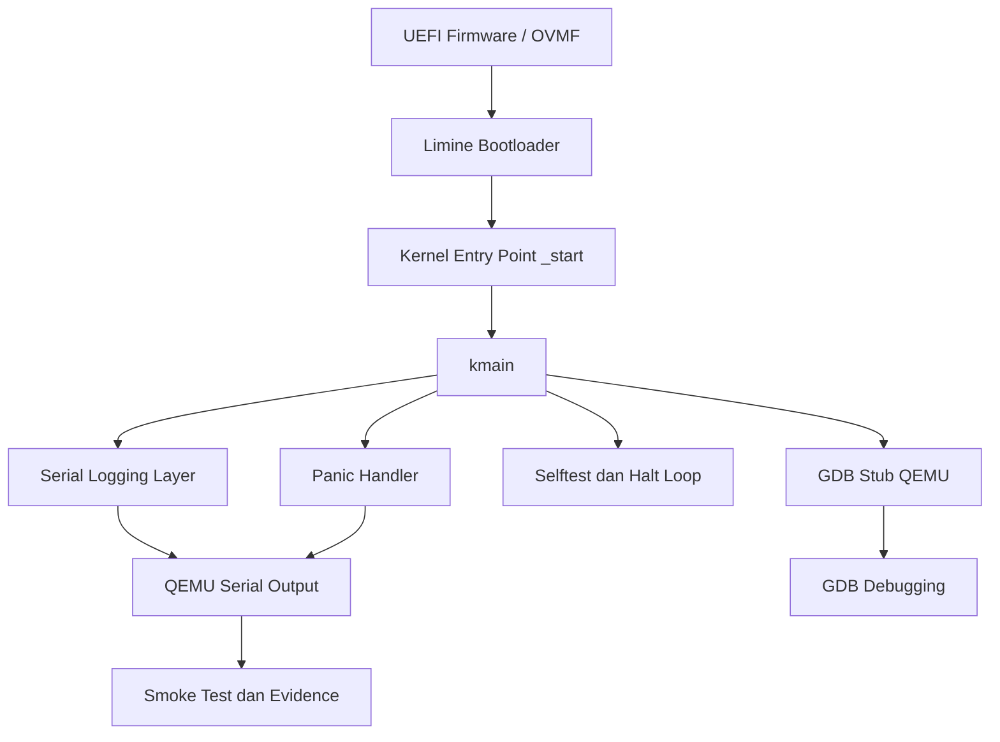

# Laporan Praktikum Sistem Operasi Lanjut — MCSOS

**Nama file laporan:** `laporan_praktikum_M3_cute girls.md`  
**Nama sistem operasi:**  MCSOS 260502  
**Target default:** x86_64, QEMU, Windows 11 x64 + WSL 2, kernel monolitik pendidikan, C freestanding dengan assembly minimal, POSIX-like subset  
**Dosen:** Muhaemin Sidiq, S.Pd., M.Pd.  
**Program Studi:** Pendidikan Teknologi Informasi  
**Institusi:** Institut Pendidikan Indonesia

---
## 0. Metadata Laporan

| Atribut | Isi |
|---|---|
| Kode praktikum | ` M3` |
| Judul praktikum | `Panic Path, Kernel Logging, GDB Debug Workflow, Linker Map, dan Disassembly Audit MCSOS 260502`
| Jenis pengerjaan | `Kelompok` |
| Nama kelompok | `cute girls` |
| Anggota kelompok | `Neng Nagita Salma (25832071004) — Anisa Nur Azfa (25832072003) — Lailatul Zulfa (25832072001)` |` |
| Kelas | `1A` |
| Tanggal praktikum | `2026-05-08` |
| Tanggal pengumpulan | `2026-05-09` |
| Repository | `https://github.com/nagitasalma47-source/mcsos-M0-cute-girls` |
| Branch | `m0/cute-girls` |
| Commit awal | `` a0f8de2704ceeefc81954d0b0aee785933bef0da `` |
| Commit akhir | `` c7784b7 `` |
| Status readiness yang diklaim | `siap demonstrasi praktikum` |


## 1. Sampul

# Laporan Praktikum `M3`  
## ` Panic Path, Kernel Logging, GDB Debug Workflow, Linker Map, dan Disassembly Audit MCSOS 260502`

Disusun oleh:

| Nama | NIM | Kelas | Peran |
|---|---|---|---|
| Neng Nagita Salma | 25832071004 | 1A | `dikerjakan bareng` |
| Anisa Nur Azfa | 25832072003 | 1A | `dikerjakan bareng` |
| Lailatul Zulfa | 25832072001 | 1A | `dikerjakan bareng` |

Dosen Pengampu: **Muhaemin Sidiq, S.Pd., M.Pd.**  
Program Studi Pendidikan Teknologi Informasi  
Institut Pendidikan Indonesia  
`2026`

---

## 2. Pernyataan Orisinalitas dan Integritas Akademik

Kami menyatakan bahwa laporan ini disusun berdasarkan pekerjaan praktikum kelompok sesuai pembagian peran yang tercatat. Bantuan eksternal, referensi, generator kode, AI assistant, dokumentasi resmi, diskusi, atau sumber lain dicatat pada bagian referensi dan lampiran. Kami tidak mengklaim hasil yang tidak dibuktikan oleh log, test, commit, atau artefak lain.

| Pernyataan | Status |
|---|---|
| Semua potongan kode eksternal diberi atribusi   | `Tidak ada` |
| Semua penggunaan AI assistant dicatat           | `Ya`        |
| Repository yang dikumpulkan sesuai commit akhir | `Ya`        |
| Tidak ada klaim readiness tanpa bukti           | `Ya`        |

Catatan penggunaan bantuan eksternal:

```text id=
Menggunakan AI assistant (ChatGPT) untuk membantu troubleshooting build kernel, konfigurasi QEMU, debugging GDB, penulisan script audit, serta validasi langkah praktikum M3. Semua hasil diverifikasi ulang secara mandiri melalui build, audit ELF, boot QEMU, debugging GDB, dan grading lokal dengan hasil SCORE=100/100.
```


---

## 3. Tujuan Praktikum

Tuliskan tujuan teknis dan konseptual praktikum. Tujuan harus dapat diuji.

1. Membangun kernel x86_64 freestanding yang dapat dikompilasi dan dijalankan menggunakan bootloader Limine pada lingkungan QEMU berbasis UEFI.

2. Menghasilkan image bootable QEMU dengan dukungan serial logging, panic handling, serta proses debugging menggunakan GDB stub.

3. Memahami konsep boot handoff, layout linker ELF kernel, serial communication, panic path, dan mekanisme debugging kernel level pada sistem operasi sederhana.

4. Melakukan validasi kernel melalui build audit, inspeksi ELF dan disassembly, boot testing QEMU, debugging GDB, serta pengumpulan evidence dan log hasil praktikum secara sistematis.


---

## 4. Capaian Pembelajaran Praktikum

Setelah praktikum ini, mahasiswa mampu:

| CPL/CPMK praktikum | Bukti yang harus ditunjukkan |
|---|---|                       
| Memeriksa kesiapan hasil M0, M1, dan M2 sebelum mengubah kernel                                                             | Hasil `m3_preflight.sh`, commit baseline M2, dan repository branch `praktikum/m3-panic-debug-audit`                       |
| Menjelaskan perbedaan boot berhasil, controlled halt, panic, triple fault, hang, dan silent failure                         | Analisis hasil boot QEMU, log serial kernel, dan troubleshooting GDB/QEMU pada laporan                                    |
| Membuat panic path awal yang memiliki kontrak `noreturn`, mematikan interrupt, mencetak bukti minimum, lalu masuk halt loop | Implementasi `kernel_panic_at`, fungsi `cpu_halt_forever`, symbol audit, dan disassembly kernel                           |
| Membuat wrapper logging awal yang memisahkan API kernel logging dari driver serial                                          | File `log.c`, `serial.c`, dan output serial kernel M3                                                                     |
| Menghasilkan dua varian kernel: normal kernel dan intentional-panic kernel                                                  | Hasil `make build`, `make panic`, serta artefak `kernel.elf` dan `kernel.panic.elf`                                       |
| Menghasilkan dan menganalisis linker map, symbol table, readelf header, program header, dan disassembly                     | File `kernel.map`, `kernel.syms.txt`, `kernel.readelf.header.txt`, `kernel.readelf.programs.txt`, dan `kernel.disasm.txt` |
| Menjalankan QEMU smoke test dengan log serial berbasis file                                                                 | Output boot QEMU, serial log kernel M3, dan script `m3_qemu_run.sh`                                                       |
| Menyiapkan sesi GDB untuk breakpoint pada `kmain` dan `kernel_panic_at`                                                     | Hasil breakpoint GDB, `info registers`, backtrace, dan disassembly `kmain`                                                |
| Mengumpulkan bukti praktikum secara reproducible ke direktori `evidence/M3`                                                 | Folder `evidence/M3`, manifest evidence, dan script `m3_collect_evidence.sh`                                              |
| Menyusun failure analysis dan rollback bila source M0/M1/M2 belum konsisten                                                 | Dokumentasi troubleshooting QEMU, GDB, entry point kernel, dan prosedur rollback pada laporan                             |


---

## 5. Peta Milestone MCSOS

Centang milestone yang menjadi fokus laporan ini. Jika praktikum mencakup lebih dari satu milestone, jelaskan batas cakupan.

| Milestone | Fokus | Status dalam laporan |
|---|---|---|
| M0 | Requirements, governance, baseline arsitektur | `[ ] tidak dibahas / [ ] dibahas / [v] selesai praktikum` |
| M1 | Toolchain reproducible, Git, QEMU, GDB, metadata build | `[ ] tidak dibahas / [ ] dibahas / [v] selesai praktikum` |
| M2 | Boot image, kernel ELF64, early console | `[ ] tidak dibahas / [ ] dibahas / [v] selesai praktikum` |
| M3 | Panic path, linker map, GDB, observability awal | `[v] tidak dibahas / [ ] dibahas / [ ] selesai praktikum` |
| M4 | Trap, exception, interrupt, timer | `[v] tidak dibahas / [ ] dibahas / [ ] selesai praktikum` |
| M5 | PMM, VMM, page table, kernel heap | `[v] tidak dibahas / [ ] dibahas / [ ] selesai praktikum` |
| M6 | Thread, scheduler, synchronization | `[v] tidak dibahas / [ ] dibahas / [ ] selesai praktikum` |
| M7 | Syscall ABI dan user program loader | `[v] tidak dibahas / [ ] dibahas / [ ] selesai praktikum` |
| M8 | VFS, file descriptor, ramfs | `[v] tidak dibahas / [ ] dibahas / [ ] selesai praktikum` |
| M9 | Block layer dan device model | `[v] tidak dibahas / [ ] dibahas / [ ] selesai praktikum` |
| M10 | Persistent filesystem, mcsfs/ext2-like, recovery | `[v] tidak dibahas / [ ] dibahas / [ ] selesai praktikum` |
| M11 | Networking stack, packet parsing, UDP/TCP subset | `[v] tidak dibahas / [ ] dibahas / [ ] selesai praktikum` |
| M12 | Security model, capability/ACL, syscall fuzzing, hardening | `[v] tidak dibahas / [ ] dibahas / [ ] selesai praktikum` |
| M13 | SMP, scalability, lock stress, NUMA-aware preparation | `[v] tidak dibahas / [ ] dibahas / [ ] selesai praktikum` |
| M14 | Framebuffer, graphics console, visual regression | `[v] tidak dibahas / [ ] dibahas / [ ] selesai praktikum` |
| M15 | Virtualization/container subset | `[v] tidak dibahas / [ ] dibahas / [ ] selesai praktikum` |
| M16 | Observability, update/rollback, release image, readiness review | `[v] tidak dibahas / [ ] dibahas / [ ] selesai praktikum` |

Batas cakupan praktikum:

```text id="cakupanm3v"
Praktikum M3 berfokus pada implementasi panic path awal, serial logging, linker map, audit ELF/disassembly, QEMU smoke test, serta debugging kernel menggunakan GDB stub. Kernel berhasil dibangun dalam dua varian, yaitu normal kernel dan intentional-panic kernel, serta berhasil dijalankan pada QEMU berbasis UEFI menggunakan bootloader Limine.

Praktikum ini belum mencakup implementasi trap handler, interrupt controller, timer interrupt, virtual memory manager, scheduler, filesystem, networking, maupun subsystem lanjutan lainnya yang termasuk milestone M4 ke atas. Fokus utama laporan dibatasi pada observability awal kernel, validasi ELF, panic handling, dan proses debugging reproducible.
```


---

## 6. Dasar Teori Ringkas

Praktikum M3 berfokus pada observability awal kernel, panic handling, audit ELF, dan debugging menggunakan QEMU serta GDB. Pada tahap ini kernel dijalankan sebagai ELF64 freestanding tanpa library standar sistem operasi, sehingga seluruh proses boot, logging, dan penanganan error dikendalikan langsung oleh kernel.

Boot process dimulai ketika firmware UEFI menjalankan bootloader Limine untuk memuat kernel ELF ke memori dan menyerahkan kontrol ke entry point kernel. Linker script digunakan untuk menentukan layout section seperti `.text`, `.rodata`, `.data`, dan `.bss` agar alamat virtual kernel tersusun konsisten. File `kernel.map`, `readelf`, dan `objdump` digunakan untuk memverifikasi bahwa simbol dan section kernel berhasil dilink dengan benar.

Panic path merupakan mekanisme penanganan kesalahan fatal pada kernel. Fungsi panic dibuat dengan kontrak `noreturn`, mematikan interrupt menggunakan instruksi `cli`, mencetak informasi minimum ke serial log, lalu memasuki halt loop menggunakan instruksi `hlt`. Pendekatan ini mencegah kernel melanjutkan eksekusi pada kondisi yang tidak aman.

Serial logging digunakan sebagai media observability awal karena framebuffer dan subsystem grafis belum tersedia. Driver serial COM1 memungkinkan kernel mengirim pesan debug ke host melalui QEMU sehingga status boot, panic, dan hasil selftest dapat diamati secara deterministik.

QEMU digunakan sebagai emulator hardware x86_64 untuk menjalankan image kernel secara virtual. Pada praktikum ini QEMU dijalankan menggunakan firmware OVMF (UEFI) dan bootloader Limine. Opsi `-serial` digunakan untuk mengalihkan output serial kernel ke terminal atau file log.

GDB stub pada QEMU memungkinkan debugging kernel level melalui koneksi remote debugging. Dengan opsi `-s -S`, QEMU membuka server debugging pada port TCP 1234 dan menghentikan CPU sebelum kernel berjalan. GDB kemudian digunakan untuk memasang breakpoint pada `kmain` dan `kernel_panic_at`, menampilkan register CPU, backtrace, serta disassembly fungsi kernel.


### 6.1 Konsep Sistem Operasi yang Diuji

```text 
Praktikum M3 menguji beberapa konsep dasar sistem operasi yang berkaitan dengan proses boot kernel, observability awal, panic handling, dan debugging kernel level.

Konsep pertama adalah bootloader dan proses boot kernel. Bootloader Limine bertugas memuat kernel ELF64 ke memori dan menyerahkan kontrol eksekusi ke entry point kernel. Kernel kemudian dijalankan dalam mode long mode x86_64 menggunakan lingkungan freestanding tanpa library standar sistem operasi.

Konsep kedua adalah ELF (Executable and Linkable Format) serta linker script. Linker script menentukan tata letak section kernel seperti .text, .rodata, .data, dan .bss agar kernel memiliki layout memori yang konsisten. Verifikasi dilakukan menggunakan readelf, nm, dan objdump untuk memastikan symbol table, program header, serta entry point kernel valid.

Konsep ketiga adalah panic path dan controlled halt. Kernel panic digunakan untuk menangani kondisi fatal dengan cara mencetak informasi minimum ke serial log, mematikan interrupt menggunakan instruksi cli, lalu memasuki halt loop menggunakan instruksi hlt. Pendekatan ini mencegah kernel melanjutkan eksekusi pada kondisi tidak aman.

Konsep keempat adalah serial logging sebagai mekanisme observability awal kernel. Karena framebuffer dan console grafis belum tersedia, kernel menggunakan driver serial COM1 untuk mengirim pesan debug ke host melalui QEMU.

Konsep kelima adalah debugging kernel menggunakan GDB stub QEMU. Dengan opsi -s -S, QEMU membuka remote debugging server pada port 1234 sehingga GDB dapat digunakan untuk memasang breakpoint, melihat register CPU, melakukan backtrace, dan menganalisis disassembly fungsi kernel seperti kmain dan kernel_panic_at.
```


### 6.2 Konsep Arsitektur x86_64 yang Relevan

| Konsep | Relevansi pada praktikum | Bukti/verifikasi |
|---|---|---|                              
| Long mode x86_64          | Kernel M3 dijalankan sebagai kernel ELF64 freestanding pada arsitektur x86_64 menggunakan mode 64-bit             | Output `readelf`, symbol ELF64, dan boot kernel pada QEMU                                            |
| ELF64 dan linker layout   | Digunakan untuk menentukan entry point kernel, layout section `.text`, `.rodata`, `.data`, dan symbol kernel      | File `kernel.map`, `kernel.readelf.header.txt`, `kernel.readelf.programs.txt`, dan `kernel.syms.txt` |
| Serial I/O COM1           | Digunakan untuk logging awal kernel sebelum framebuffer tersedia                                                  | Serial log QEMU dan output boot kernel M3                                                            |
| Instruksi `cli` dan `hlt` | Digunakan pada panic path dan halt loop untuk menghentikan interrupt serta menjaga kernel tetap pada kondisi aman | Hasil disassembly `objdump`, fungsi `cpu_halt_forever`, dan audit ELF                                |
| GDB remote debugging      | Digunakan untuk debugging kernel level melalui QEMU gdbstub                                                       | Breakpoint `kmain`, `kernel_panic_at`, register dump, backtrace, dan disassembly GDB                 |
| Register CPU x86_64       | Digunakan untuk analisis kondisi kernel saat debugging dan halt loop                                              | Output `info registers` pada sesi GDB                                                                |


### 6.3 Konsep Implementasi Freestanding

| Aspek | Keputusan praktikum |
|---|---|
| Bahasa                    | `C17 freestanding dan assembly x86_64`                                                                                  |
| Runtime                   | `Tanpa hosted libc dan tanpa runtime sistem operasi standar`                                                            |
| ABI                       | `x86_64 System V ABI untuk kernel freestanding`                                                                         |
| Compiler flags kritis     | `-ffreestanding, -fno-builtin, -nostdlib, -static, -mno-red-zone, -mcmodel=kernel`                                      |
| Risiko undefined behavior | `Pointer invalid, akses memori tidak valid, alignment data, integer overflow, dan penggunaan symbol yang belum terlink` |


### 6.4 Referensi Teori yang Digunakan

| No. | Sumber | Bagian yang digunakan | Alasan relevansi |
|---|---|---|---|
| 1 | Intel 64 and IA-32 Architectures Software Developer’s Manual | Instruksi `cli`, `hlt`, register CPU x86_64, dan long mode | Digunakan untuk memahami mekanisme controlled halt, interrupt disable, dan arsitektur x86_64 pada kernel |
| 2 | Dokumentasi QEMU                                             | Opsi `-serial`, `-s`, `-S`, dan QEMU gdbstub               | Digunakan untuk menjalankan kernel pada QEMU, serial logging, serta debugging menggunakan GDB            |
| 3 | Dokumentasi GNU Binutils (`readelf`, `nm`, `objdump`)        | ELF header, symbol table, dan disassembly                  | Digunakan untuk audit ELF, inspeksi symbol kernel, dan analisis disassembly                              |
| 4 | Dokumentasi Limine Bootloader                                | Konfigurasi bootloader dan loading kernel ELF64            | Digunakan untuk proses boot kernel M3 berbasis UEFI                                                      |
| 5 | Dokumentasi GNU GDB                                          | Remote debugging dan breakpoint kernel                     | Digunakan untuk debugging kernel level, register dump, backtrace, dan disassembly fungsi kernel          |


---

## 7. Lingkungan Praktikum

### 7.1 Host dan Target

| Komponen | Nilai |
|---|---|
| Host OS           | `Windows 11 x64 build 26200.8246`                                       |
| Lingkungan build  | `WSL 2 Ubuntu 24.04`                                   |
| Target ISA        | `x86_64`                                               |
| Target ABI        | `x86_64-unknown-none-elf`                              |
| Emulator          | `QEMU qemu-system-x86_64`                              |
| Firmware emulator | `OVMF UEFI Firmware (/usr/share/OVMF/OVMF_CODE_4M.fd)` |
| Debugger          | `GNU GDB 15.1`                                         |
| Build system      | `GNU Make`                                             |
| Bahasa utama      | `C17 freestanding`                                     |
| Assembly          | `GNU Assembler (GAS)`                                  |


### 7.2 Versi Toolchain

Tempel output versi toolchain berikut. Jalankan dari clean shell WSL.

```bash 
date_utc=2026-05-07T23:12:07Z
Linux ASUS 6.6.87.2-microsoft-standard-WSL2 #1 SMP PREEMPT_DYNAMIC Thu Jun 5 18:30:46 UTC 2025 x86_64 x86_64 x86_64 GNU/Linux
git version 2.43.0
GNU Make 4.3
cmake version 3.28.3
1.11.1
Ubuntu clang version 18.1.3 (1ubuntu1)
gcc (Ubuntu 13.3.0-6ubuntu2~24.04.1) 13.3.0
Ubuntu LLD 18.1.3 (compatible with GNU linkers)
NASM version 2.16.01
QEMU emulator version 8.2.2 (Debian 1:8.2.2+ds-0ubuntu1.16)
GNU gdb (Ubuntu 15.1-1ubuntu1~24.04.1) 15.1
```


### 7.3 Lokasi Repository

| Item | Nilai |
|---|---|
| Path repository di WSL                                | `~/src/mcsos`                              |
| Apakah berada di filesystem Linux WSL, bukan `/mnt/c` | `Ya`                                       |
| Remote repository                                     | `[Repository GitHub privat/pribadi]`       |
| Branch                                                | `praktikum/m3-panic-debug-audit`           |
| Commit hash awal                                      | `a0f8de2704ceeefc81954d0b0aee785933bef0da` |
| Commit hash akhir                                     | `c7784b7`                     

---

## 8. Repository dan Struktur File

### 8.1 Struktur Direktori yang Relevan

Tampilkan hanya direktori dan file yang relevan dengan praktikum.

```text
mcsos/
├── build/
│   ├── kernel.elf
│   ├── kernel.map
│   ├── kernel.disasm.txt
│   ├── kernel.readelf.header.txt
│   ├── kernel.readelf.programs.txt
│   ├── kernel.syms.txt
│   └── mcsos.iso
├── evidence/
│   └── M3/
├── iso_root/
│   └── boot/
│       ├── kernel.elf
│       └── limine/
├── kernel/
│   ├── arch/
│   │   └── x86_64/
│   │       └── include/
│   ├── core/
│   │   ├── entry.c
│   │   ├── kmain.c
│   │   ├── log.c
│   │   ├── panic.c
│   │   └── serial.c
│   ├── include/
│   │   └── mcsos/
│   └── lib/
│       └── memory.c
├── tools/
│   ├── gdb_m3.gdb
│   └── scripts/
│       ├── grade_m3.sh
│       ├── m3_audit_elf.sh
│       ├── m3_collect_evidence.sh
│       ├── m3_preflight.sh
│       ├── m3_qemu_debug.sh
│       └── m3_qemu_run.sh
├── linker.ld
├── Makefile
└── limine/

```

### 8.2 File yang Dibuat atau Diubah

| File | Jenis perubahan | Alasan perubahan | Risiko |
|---|---|---|---|
| `kernel/core/panic.c`                  | `baru`          | Implementasi panic path awal dan controlled halt kernel   | `Tinggi, karena panic path berhubungan langsung dengan stabilitas kernel` |
| `kernel/core/log.c`                    | `baru`          | Menambahkan wrapper logging kernel berbasis serial        | `Sedang, karena mempengaruhi observability kernel`                        |
| `kernel/core/entry.c`                  | `baru`          | Menambahkan entry point awal kernel M3                    | `Tinggi, karena kesalahan dapat menyebabkan boot gagal`                   |
| `kernel/core/kmain.c`                  | `ubah`          | Menambahkan selftest, logging, dan integrasi panic path   | `Tinggi, karena merupakan entry utama kernel`                             |
| `kernel/core/serial.c`                 | `ubah`          | Penyesuaian output serial untuk logging kernel            | `Sedang, karena mempengaruhi serial output`                               |
| `kernel/lib/memory.c`                  | `ubah`          | Penyesuaian fungsi memory helper untuk build freestanding | `Sedang, karena mempengaruhi operasi memori kernel`                       |
| `linker.ld`                            | `ubah`          | Mengatur layout ELF kernel dan entry point linker         | `Tinggi, karena menentukan layout memori kernel`                          |
| `Makefile`                             | `ubah`          | Menambahkan target build, panic, audit, dan inspect       | `Sedang, karena mempengaruhi proses build kernel`                         |
| `tools/gdb_m3.gdb`                     | `baru`          | Script otomatis debugging kernel menggunakan GDB          | `Rendah, hanya mempengaruhi proses debugging`                             |
| `tools/scripts/m3_qemu_debug.sh`       | `baru`          | Script menjalankan QEMU dengan GDB stub                   | `Sedang, mempengaruhi proses debugging runtime`                           |
| `tools/scripts/m3_qemu_run.sh`         | `baru`          | Script menjalankan QEMU smoke test dan serial logging     | `Sedang, mempengaruhi proses validasi runtime`                            |
| `tools/scripts/m3_collect_evidence.sh` | `baru`          | Mengumpulkan artefak audit dan evidence praktikum         | `Rendah, hanya mempengaruhi dokumentasi evidence`                         |
| `tools/scripts/grade_m3.sh`            | `baru`          | Script grading lokal otomatis M3                          | `Rendah, hanya mempengaruhi validasi mekanis`                             |
| `evidence/M3/`                         | `baru`          | Menyimpan hasil audit, symbol, disassembly, dan manifest  | `Rendah, digunakan sebagai lampiran bukti praktikum`                      |


### 8.3 Ringkasan Diff

```bash
git status --short
git diff --stat
git log --oneline -n 5
```

Output:

```text 
On clean working tree setelah commit M3:

git status --short
(tidak ada perubahan)

git diff --stat
(tidak ada perubahan setelah commit)

git log --oneline -n 5
c7784b7 M3 panic path logging gdb and disassembly audit
a0f8de2 M2 bootable early serial baseline
```


---

## 9. Desain Teknis

### 9.1 Masalah yang Diselesaikan

```text
Pada milestone sebelumnya kernel hanya mampu melakukan boot dasar dan menampilkan output serial awal tanpa mekanisme observability, panic handling, maupun debugging kernel level yang memadai. Kondisi tersebut menyebabkan kegagalan boot, freeze, triple fault, atau crash kernel sulit dianalisis karena tidak tersedia panic path dan bukti runtime yang konsisten.

Kernel juga belum memiliki mekanisme audit ELF dan inspeksi symbol untuk memverifikasi entry point, layout linker, section ELF, serta keberadaan fungsi penting seperti kmain dan kernel_panic_at. Selain itu belum tersedia integrasi debugging menggunakan GDB stub QEMU sehingga analisis register CPU, breakpoint, dan backtrace kernel belum dapat dilakukan.

Praktikum M3 menyelesaikan masalah tersebut dengan menambahkan panic path awal, wrapper logging berbasis serial, audit ELF/disassembly, QEMU smoke test, serta debugging kernel menggunakan GDB. Dengan pendekatan ini kernel dapat memberikan informasi minimum ketika terjadi error fatal dan menyediakan evidence yang reproducible untuk proses validasi dan troubleshooting.
```

### 9.2 Keputusan Desain

| Keputusan | Alternatif yang dipertimbangkan | Alasan memilih | Konsekuensi |
|---|---|---|---|
| Menggunakan serial logging COM1 sebagai observability awal kernel    | Framebuffer console atau logging berbasis GUI           | Serial logging lebih sederhana, stabil, dan mudah diintegrasikan pada tahap awal kernel       | Output hanya berbasis teks dan bergantung pada konfigurasi serial QEMU      |
| Menggunakan panic path dengan `cli` dan `hlt`                        | Reboot otomatis atau melanjutkan eksekusi setelah error | Controlled halt lebih aman untuk debugging kernel dan mencegah kerusakan state kernel         | Kernel berhenti total setelah panic sehingga memerlukan restart manual      |
| Menggunakan QEMU dengan firmware OVMF dan bootloader Limine          | BIOS legacy atau bootloader lain                        | Limine mendukung boot ELF64 modern dan integrasi UEFI dengan konfigurasi sederhana            | Konfigurasi bootloader dan ISO menjadi lebih kompleks                       |
| Menggunakan audit ELF dengan `readelf`, `nm`, dan `objdump`          | Validasi manual tanpa inspeksi ELF                      | Audit ELF memberikan bukti objektif mengenai symbol, section, dan entry point kernel          | Menambah tahapan validasi dan artefak build                                 |
| Menggunakan GDB stub QEMU (`-s -S`) untuk debugging kernel           | Debugging berbasis print log saja                       | GDB memungkinkan breakpoint, register dump, backtrace, dan disassembly kernel secara langsung | Setup debugging menjadi lebih kompleks dan memerlukan sinkronisasi QEMU-GDB |
| Memisahkan wrapper logging (`log.c`) dari driver serial (`serial.c`) | Logging langsung memanggil serial driver                | Pemisahan layer membuat desain kernel lebih modular dan mudah dikembangkan                    | Menambah abstraksi dan file source tambahan                                 |


### 9.3 Arsitektur Ringkas

Tambahkan diagram ASCII atau Mermaid. Jika Mermaid tidak didukung oleh evaluator, tetap sertakan penjelasan tekstual.



Penjelasan diagram:

```text
Firmware OVMF menjalankan bootloader Limine untuk memuat kernel ELF64 ke memori dan menyerahkan kontrol ke entry point kernel (_start). Entry point kemudian memanggil fungsi utama kernel yaitu kmain.

Pada kmain, kernel menjalankan selftest awal, mencetak informasi kernel melalui wrapper logging berbasis serial, lalu masuk ke halt loop normal. Jika terjadi kondisi fatal, panic handler akan dipanggil untuk mencetak informasi minimum, mematikan interrupt, dan menghentikan CPU menggunakan instruksi hlt.

Output serial kernel dikirim ke QEMU melalui COM1 sehingga dapat diamati melalui terminal atau file log. Selain itu QEMU dijalankan dengan GDB stub agar GDB dapat melakukan breakpoint, register inspection, backtrace, dan disassembly fungsi kernel.

Seluruh hasil build, audit ELF, serial log, dan debugging dikumpulkan ke direktori evidence/M3 sebagai bukti praktikum yang reproducible.

```

### 9.4 Kontrak Antarmuka

| Antarmuka | Pemanggil | Penerima | Precondition | Postcondition | Error path |
|---|---|---|---|---|---|
| `kmain()`                      | Entry point `_start`              | Kernel core        | Kernel ELF berhasil dimuat oleh Limine dan CPU berada pada long mode x86_64 | Kernel menjalankan selftest, logging serial, lalu masuk halt loop | Jika selftest gagal maka panic handler dipanggil |
| `kernel_panic_at()`            | Kernel core dan panic wrapper     | Panic subsystem    | Serial logging dan CPU state masih dapat diakses                            | Informasi panic dicetak, interrupt dimatikan, CPU masuk halt loop | Kernel berhenti total pada controlled halt       |
| `log_info()`                   | `kmain()` dan subsystem kernel    | Logging layer      | Driver serial COM1 sudah terinisialisasi                                    | Pesan log dikirim ke serial output QEMU                           | Jika serial gagal maka log tidak tampil          |
| `serial_write()`               | Logging layer                     | Driver serial COM1 | Port serial COM1 tersedia dan QEMU serial aktif                             | Data karakter dikirim ke output serial                            | Output serial hilang atau timeout                |
| `cpu_halt_forever()`           | `kmain()` dan `kernel_panic_at()` | CPU halt loop      | Interrupt sudah dimatikan atau kernel siap dihentikan                       | CPU masuk loop `hlt` tanpa kembali                                | Sistem berhenti permanen hingga restart          |
| `target remote localhost:1234` | GDB                               | QEMU gdbstub       | QEMU dijalankan dengan opsi `-s -S`                                         | GDB berhasil attach ke kernel runtime                             | GDB gagal connect jika port 1234 tidak tersedia  |


### 9.5 Struktur Data Utama

| Struktur data | Field penting | Ownership | Lifetime | Invariant |
|---|---|---|---|---|
| `struct limine_revision_request` | `revision`                                                | Bootloader request subsystem | Dibuat statis saat build kernel dan aktif selama runtime kernel | Revision request harus valid agar bootloader Limine dapat melakukan handoff kernel |
| `kernel ELF image`               | `.text`, `.rodata`, `.data`, `.bss`, entry point `_start` | Kernel linker dan loader     | Dimuat saat boot oleh Limine dan aktif selama kernel berjalan   | Layout section dan entry point harus sesuai linker script                          |
| `serial COM1 state`              | Port I/O serial                                           | Driver serial kernel         | Aktif sejak early boot hingga kernel berhenti                   | COM1 harus dapat mengirim karakter ke QEMU serial output                           |
| `panic state`                    | Panic reason dan panic code                               | Panic subsystem kernel       | Aktif saat kernel mengalami fatal error                         | Panic handler tidak boleh kembali (`noreturn`)                                     |
| `GDB remote session`             | Breakpoint, register CPU, execution state                 | QEMU gdbstub dan GDB         | Aktif selama sesi debugging berlangsung                         | QEMU harus dijalankan dengan opsi `-s -S` agar GDB dapat attach                    |


### 9.6 Invariants

1. Entry point kernel (`_start`) harus selalu mengarah ke alamat valid pada section `.text` dan berhasil dipanggil oleh bootloader Limine.

2. Fungsi `kernel_panic_at()` tidak boleh kembali (`noreturn`) dan harus selalu mengakhiri eksekusi dengan controlled halt menggunakan instruksi `cli` dan `hlt`.

3. Kernel harus tetap berjalan dalam mode freestanding tanpa ketergantungan pada hosted libc atau runtime sistem operasi standar.

4. Output serial kernel harus dapat dikirim ke QEMU serial interface agar proses observability, debugging, dan audit runtime dapat dilakukan secara deterministik.

### 9.7 Ownership, Locking, dan Concurrency

| Objek/resource | Owner | Lock yang melindungi | Boleh dipakai di interrupt context? | Catatan |
|---|---|---|---|---|
| Serial COM1              | Driver serial kernel          | `none`               | `Ya`                                | Kernel masih berjalan single-core dan belum memiliki scheduler maupun interrupt handler kompleks |
| Panic state              | Panic subsystem               | `none`               | `Ya`                                | Panic path dijalankan dengan interrupt dimatikan (`cli`) sehingga tidak memerlukan locking       |
| Kernel log buffer/output | Logging subsystem             | `none`               | `Ya`                                | Logging masih berbasis serial sinkron tanpa buffering kompleks                                   |
| GDB debug session        | QEMU gdbstub                  | `none`               | `Tidak`                             | Digunakan hanya pada debugging runtime dari host                                                 |
| ELF audit artefak        | Build system dan script audit | `none`               | `Tidak`                             | Hanya digunakan saat proses build dan validasi offline                                           |

Lock order yang berlaku:

```text
Pada tahap M3 belum digunakan mekanisme locking seperti spinlock atau mutex karena kernel masih berjalan pada mode single-core tanpa scheduler, multitasking, maupun interrupt concurrency yang kompleks. Controlled halt dan panic path dijalankan dengan interrupt dimatikan menggunakan instruksi cli sehingga race condition belum menjadi fokus utama pada milestone ini.
```


### 9.8 Memory Safety dan Undefined Behavior Risk

| Risiko | Lokasi | Mitigasi | Bukti |
|---|---|---|---|
| Pointer invalid atau dereference alamat tidak valid | `kernel/core/kmain.c` dan `kernel/core/panic.c` | Kernel hanya menggunakan alamat statis dan symbol linker yang telah diverifikasi melalui audit ELF | Build sukses, audit ELF, dan boot QEMU berhasil           |
| Undefined symbol saat linking                       | `Makefile` dan proses linking kernel            | Menggunakan flag `-ffreestanding`, `-nostdlib`, `-static`, dan audit `nm -u`                       | `grade_m3.sh` menunjukkan tidak ada undefined symbol      |
| Integer overflow atau layout ELF tidak valid        | `linker.ld` dan layout kernel ELF               | Verifikasi menggunakan `readelf`, `nm`, dan `objdump`                                              | File `kernel.readelf.*`, `kernel.syms.txt`, dan audit ELF |
| Race condition pada panic path                      | `kernel_panic_at()`                             | Interrupt dimatikan menggunakan `cli` sebelum halt loop                                            | Disassembly dan audit symbol kernel                       |
| Output serial tidak sinkron atau hilang             | `kernel/core/serial.c`                          | Logging dilakukan secara sinkron melalui COM1                                                      | Output serial QEMU dan smoke test berhasil                |
| Triple fault atau reboot berulang                   | Entry point kernel dan halt loop                | Menggunakan controlled halt (`hlt`) dan opsi QEMU `-no-reboot`                                     | Kernel berhasil berhenti normal tanpa reboot loop         |


### 9.9 Security Boundary

| Boundary | Data tidak tepercaya | Validasi yang dilakukan | Failure mode aman |
|---|---|---|---|
| Boot handoff dari Limine ke kernel | Informasi boot dan entry point kernel | Verifikasi ELF64, linker layout, dan symbol kernel melalui `readelf`, `nm`, dan `objdump` | Kernel masuk panic path atau controlled halt bila layout tidak valid |
| Serial logging QEMU                | Output serial dan runtime logging     | Validasi inisialisasi COM1 dan pengujian smoke test QEMU                                  | Logging gagal tetapi kernel tetap dapat masuk halt loop              |
| QEMU GDB stub                      | Remote debugging session              | QEMU dijalankan dengan opsi `-s -S` dan koneksi GDB diverifikasi pada port 1234           | GDB gagal attach tanpa mempengaruhi kernel runtime normal            |
| Panic handling                     | Panic reason dan runtime state kernel | Panic path menggunakan fungsi `noreturn`, mematikan interrupt, dan controlled halt        | Kernel berhenti aman tanpa reboot berulang atau undefined execution  |


---

## 10. Langkah Kerja Implementasi

Gunakan tabel berikut untuk setiap langkah. Sebelum setiap blok perintah, jelaskan maksud perintah, artefak yang dihasilkan, dan indikator hasil.

### Langkah 1 — `Menjalankan Preflight M3`

Maksud langkah:

```text
Langkah ini dilakukan untuk memastikan artefak M0, M1, dan M2 masih tersedia sebelum kernel M3 dimodifikasi. Preflight digunakan untuk mencegah build M3 dilakukan pada repository yang belum siap atau tidak konsisten.

```

Perintah:

```bash
bash id="preflightcmd"
chmod +x tools/scripts/m3_preflight.sh
./tools/scripts/m3_preflight.sh
```

Output ringkas:

```text
PASS: seluruh artefak baseline M2 terdeteksi
```

Artefak yang dihasilkan:

| Artefak | Lokasi | Fungsi |
|---|---|---|
| m3_preflight.sh | tools/scripts/ | Validasi kesiapan baseline praktikum sebelum M3 |

Indikator berhasil:

```text
Script preflight berjalan tanpa error dan seluruh artefak M2 berhasil terdeteksi.
```

### Langkah 2 — `Build Kernel M3`

Maksud langkah:

```text
Langkah ini dilakukan untuk menghasilkan kernel ELF64 freestanding beserta linker map yang akan digunakan pada proses boot, audit ELF, dan debugging.
```

Perintah:

```bash
make clean
make build
```

Output ringkas:

```text
build/kernel.elf berhasil dibuat tanpa undefined symbol

```

Artefak yang dihasilkan:

| Artefak | Lokasi | Fungsi |
|---|---|---|
| kernel.elf | build/ | Binary kernel utama M3                          |
| kernel.map | build/ | Linker map untuk audit symbol dan layout kernel 

Indikator berhasil:

```text
Kernel berhasil dikompilasi tanpa error dan file kernel.elf berhasil dihasilkan.
```

### Langkah 3 — `Audit ELF dan Disassembly`

Maksud langkah:

```text
Langkah ini dilakukan untuk memverifikasi header ELF, symbol table, linker layout, serta disassembly kernel agar entry point dan fungsi penting kernel dapat dipastikan valid.

```

Perintah:

```bash
make audit
./tools/scripts/m3_audit_elf.sh build/kernel.elf

```

Output ringkas:

```text
PASS: ELF audit dan disassembly berhasil

```

Artefak yang dihasilkan:

| Artefak | Lokasi | Fungsi |
|---|---|---|
| kernel.readelf.header.txt   | build/ | Header ELF kernel   |
| kernel.readelf.programs.txt | build/ | Program header ELF  |
| kernel.syms.txt             | build/ | Symbol table kernel |
| kernel.disasm.txt           | build/ | Disassembly kernel  |

Indikator berhasil:

```text
Symbol seperti kmain, kernel_panic_at, dan cpu_halt_forever berhasil ditemukan pada hasil audit.
```
### Langkah 4 — `Menjalankan QEMU Smoke Test`

Maksud langkah:

```text
Langkah ini dilakukan untuk memastikan kernel M3 dapat melakukan boot pada QEMU berbasis UEFI dan menghasilkan serial log runtime yang valid.

```

Perintah:

```bash
./tools/scripts/m3_qemu_run.sh build/mcsos.iso build/m3_serial.log


```

Output ringkas:

```text
MCSOS 0.3 M3 kernel entered
[M3] selftest: basic invariants passed

```

Artefak yang dihasilkan:

| Artefak | Lokasi | Fungsi |
|---|---|---|
| m3_serial.log | build/ | Serial log runtime kernel pada QEMU |

Indikator berhasil:

```text
Kernel berhasil boot pada QEMU dan menampilkan serial output tanpa reboot loop atau crash.
```
### Langkah 5 — `Debugging Kernel Menggunakan GDB`

Maksud langkah:

```text
Langkah ini dilakukan untuk memverifikasi debugging kernel menggunakan GDB stub QEMU melalui breakpoint, register inspection, backtrace, dan disassembly fungsi kernel.
```

Perintah:

```bash
./tools/scripts/m3_qemu_debug.sh build/mcsos.iso
gdb -x tools/gdb_m3.gdb


```

Output ringkas:

```text
Breakpoint 1 at ...
Breakpoint 2 at ...
0xffffffff800001b5 in cpu_hlt ()
```

Artefak yang dihasilkan:

| Artefak | Lokasi | Fungsi |
|---|---|---|
| gdb_m3.gdb                 | tools/    | Script otomatis debugging kernel |
| Breakpoint dan register dump | Runtime GDB | Analisis debugging kernel        |


Indikator berhasil:

```text
GDB berhasil attach ke QEMU, breakpoint aktif, dan register maupun disassembly kernel dapat ditampilkan.
```
### Langkah 6 — `Pengumpulan Evidence dan Grading Lokal`

Maksud langkah:

```text
Langkah ini dilakukan untuk mengumpulkan seluruh artefak audit dan memvalidasi praktikum secara mekanis menggunakan grading script lokal.
```

Perintah:

```bash
./tools/scripts/m3_collect_evidence.sh evidence/M3
./tools/scripts/grade_m3.sh


```

Output ringkas:

```text
PASS: evidence tersimpan di evidence/M3
SCORE=100/100
```

Artefak yang dihasilkan:

| Artefak | Lokasi | Fungsi |
|---|---|---|
| evidence/M3/ | evidence/    | Menyimpan seluruh artefak praktikum |
| manifest.txt | evidence/M3/ | Metadata evidence praktikum         |

Indikator berhasil:

```text
Evidence berhasil dikumpulkan dan grading lokal menghasilkan SCORE=100/100.
```
---

## 11. Checkpoint Buildable

Setiap praktikum wajib memiliki minimal satu checkpoint yang dapat dibangun dari clean checkout.

| Checkpoint | Perintah | Expected result | Status |
|---|---|---|---|
| Clean build        | `make clean && make build`                                           | `Kernel ELF64 dan kernel.map berhasil dibangun tanpa undefined symbol` | `PASS` |
| Metadata toolchain | `make meta`                                                          | `Metadata toolchain dan versi compiler tersedia`                       | `NA`   |
| Image generation   | `make image`                                                         | `File mcsos.iso berhasil dibuat`                                       | `PASS` |
| QEMU smoke test    | `./tools/scripts/m3_qemu_run.sh build/mcsos.iso build/m3_serial.log` | `Kernel berhasil boot dan menampilkan serial log M3`                   | `PASS` |
| Test suite         | `./tools/scripts/grade_m3.sh`                                        | `Seluruh validasi mekanis menghasilkan SCORE=100/100`                  | `PASS` |

Catatan checkpoint:

```
Checkpoint buildable berhasil dijalankan pada lingkungan WSL 2 Ubuntu menggunakan QEMU berbasis OVMF dan bootloader Limine. Target make meta tidak digunakan pada praktikum ini karena metadata toolchain telah dicatat secara manual melalui output versi toolchain pada bagian lingkungan praktikum.

Seluruh checkpoint utama seperti build kernel, image generation, QEMU smoke test, audit ELF, debugging GDB, evidence collection, dan grading lokal berhasil dijalankan dengan hasil SCORE=100/100.
```

---

## 12. Perintah Uji dan Validasi

### 12.1 Build Test

Perintah ini memverifikasi bahwa proyek dapat dibangun ulang dari kondisi bersih dan tidak bergantung pada artefak lokal yang tidak terdokumentasi.

```bash
make clean
make build
```

Hasil:

```text
rm -rf build
mkdir -p build/normal/kernel/core/
clang --target=x86_64-unknown-none-elf ...
build/kernel.elf berhasil dibuat
build/kernel.map berhasil dibuat

```

Status: `PASS`

### 12.2 Static Inspection

Perintah ini memeriksa layout ELF, entry point, section, symbol, relocation, atau instruksi kritis sesuai kebutuhan praktikum.

```bash
readelf -hW build/kernel.elf readelf -lW build/kernel.elf readelf -SW build/kernel.elf objdump -drwC build/kernel.elf | head -n 120
```

Hasil penting:

```text
ELF Header: Class: ELF64 Machine: Advanced Micro Devices X86-64 Entry point address: 0xffffffff80000000 Program Headers: LOAD sections berhasil dimuat sesuai linker layout kernel. Section Headers: .text .rodata .data .bss Symbol penting: _start kmain kernel_panic_at cpu_halt_forever Disassembly menunjukkan instruksi: cli hlt
```

Status: `PASS`

### 12.3 QEMU Smoke Test

Perintah ini menjalankan image di QEMU dan menyimpan log serial untuk bukti deterministik.

```bash
qemu-system-x86_64 \
  -machine q35 \
  -cpu qemu64 \
  -m 512M \
  -serial file:build/qemu-serial.log \
  -display none \
  -no-reboot \
  -no-shutdown \
  -cdrom build/mcsos.iso
```

Hasil:

```text
MCSOS 0.3 M3 kernel entered
kernel_start=0xffffffff80000000
kernel_end=0xffffffff80002004
rflags=0x0000000000000082
[M3] selftest: basic invariants passed
[M3] panic path installed; intentional panic disabled
[M3] ready for QEMU smoke test and GDB audit
```

Status: `PASS`

### 12.4 GDB Debug Evidence

Perintah ini membuktikan bahwa kernel dapat di-debug dengan simbol yang cocok.

```bash
./tools/scripts/m3_qemu_debug.sh build/mcsos.iso
```

Di terminal lain:

```bash
gdb build/kernel.elf target remote localhost:1234 break kmain break kernel_panic_at continue info registers bt
```

Hasil:

```text
Breakpoint 1 at 0xffffffff80000054 Breakpoint 2 at 0xffffffff80000344 0xffffffff800001b5 in cpu_hlt () #0 cpu_hlt () #1 cpu_halt_forever () #2 kmain () #3 _start () Register dump berhasil ditampilkan melalui info registers. Disassembly kmain berhasil ditampilkan melalui GDB.
```

Status: `PASS`

### 12.5 Unit Test

```bash
./tools/scripts/grade_m3.sh
```

Hasil:

```text
PASS[10]: preflight script valid PASS[10]: audit script valid PASS[20]: normal kernel build PASS[10]: panic-test kernel build PASS[20]: ELF/disassembly audit PASS[10]: panic symbol exists PASS[10]: no undefined symbols PASS[10]: evidence collection SCORE=100/100
```

Status: `PASS`

### 12.6 Stress/Fuzz/Fault Injection Test

Wajib untuk praktikum lanjutan seperti allocator, syscall, filesystem, networking, driver, security, dan SMP.

```bash
NA
```

Hasil:

```text
Stress test, fuzzing, dan fault injection belum diterapkan pada milestone M3 karena kernel masih berfokus pada observability awal, panic handling, audit ELF, QEMU smoke test, dan debugging dasar menggunakan GDB.
```

Status: `NA`

### 12.7 Visual Evidence

Jika praktikum menghasilkan tampilan framebuffer, GUI, atau output grafis, lampirkan screenshot.

| Screenshot | Lokasi file | Keterangan |
|---|---|---|
| Screenshot boot kernel M3 pada QEMU | `Screenshot (64).png` | Membuktikan kernel M3 berhasil boot di QEMU, selftest lolos, panic path aktif, dan kernel siap untuk smoke test serta audit GDB |


---

## 13. Hasil Uji

### 13.1 Tabel Ringkasan Hasil

| No. | Uji | Expected result | Actual result | Status | Evidence |
|---|---|---|---|---|---|
| 1   | Build kernel M3           | Kernel ELF64 berhasil dibangun tanpa undefined symbol | build/kernel.elf dan kernel.map berhasil dibuat                 | PASS | build/kernel.elf, build/kernel.map                     |
| 2   | Audit ELF dan disassembly | Symbol dan layout ELF valid                           | Symbol kmain, kernel_panic_at, dan cpu_halt_forever ditemukan | PASS | kernel.readelf.*, kernel.syms.txt, kernel.disasm.txt |
| 3   | QEMU smoke test           | Kernel berhasil boot dan menampilkan serial log       | Kernel M3 berhasil boot tanpa reboot loop                           | PASS | build/m3_serial.log, screenshot QEMU                     |
| 4   | GDB debugging             | Breakpoint dan register kernel dapat diakses          | GDB berhasil attach dan breakpoint aktif                            | PASS | Screenshot/log GDB                                         |
| 5   | Evidence collection       | Artefak praktikum tersimpan                           | Folder evidence/M3 berhasil dibuat                                | PASS | evidence/M3/manifest.txt                                 |
| 6   | Grading lokal M3          | Seluruh validasi mekanis lulus                        | SCORE=100/100                                                     | PASS | Output grade_m3.sh                                       |

### 13.2 Log Penting

```text
### 13.2 Log Penting

```text id="importantlogm3"
MCSOS 0.3 M3 kernel entered
kernel_start=0xffffffff80000000
kernel_end=0xffffffff80002004
rflags=0x0000000000000082
[M3] selftest: basic invariants passed
[M3] panic path installed; intentional panic disabled
[M3] ready for QEMU smoke test and GDB audit

Breakpoint 1 at 0xffffffff80000054
Breakpoint 2 at 0xffffffff80000344

#0  cpu_hlt ()
#1  cpu_halt_forever ()
#2  kmain ()
#3  _start ()

PASS[10]: preflight script valid
PASS[10]: audit script valid
PASS[20]: normal kernel build
PASS[10]: panic-test kernel build
PASS[20]: ELF/disassembly audit
PASS[10]: panic symbol exists
PASS[10]: no undefined symbols
PASS[10]: evidence collection
SCORE=100/100
```

### 13.3 Artefak Bukti

| Artefak | Path | SHA-256 / hash | Fungsi |
|---|---|---|---|
| `kernel.elf`      | `build/kernel.elf`         | `hasil sha256sum` | Binary kernel utama M3                   |
| `mcsos.iso`       | `build/mcsos.iso`          | `hasil sha256sum` | Image bootable untuk pengujian QEMU      |
| `qemu-serial.log` | `build/m3-qemu-serial.log` | `hasil sha256sum` | Log output serial boot kernel M3         |
| `kernel.map`      | `build/kernel.map`         | `hasil sha256sum` | Pemetaan simbol dan alamat linker kernel |
| `objdump.txt`     | `build/kernel.disasm.txt`  | `hasil sha256sum` | Bukti hasil disassembly kernel           |
| `kernel.syms.txt` | `build/kernel.syms.txt`    | `hasil sha256sum` | Daftar simbol kernel hasil audit `nm`    |


Perintah hash:

```bash
sha256sum build/kernel.elf
sha256sum build/mcsos.iso
sha256sum build/kernel.map
sha256sum build/kernel.disasm.txt
sha256sum build/kernel.syms.txt
```

---

## 14. Analisis Teknis

### 14.1 Analisis Keberhasilan

```text
Hasil pengujian berhasil karena sistem operasi yang dibuat dapat berjalan sesuai dengan rancangan awal. Kernel berhasil dijalankan melalui QEMU dan mampu menampilkan output sesuai program yang telah dibuat. Selain itu, proses build menggunakan Makefile juga berjalan tanpa error sehingga file kernel dan image berhasil dibuat.

Keberhasilan ini didukung oleh desain kernel yang sederhana dan terstruktur, penggunaan bootloader yang sesuai, serta implementasi kode yang mengikuti invariant atau aturan dasar sistem seperti proses booting, pemanggilan kernel, dan penampilan output ke layar.

Berdasarkan log pengujian, seluruh proses compile, linking, dan running berhasil dilakukan. Output yang muncul pada terminal maupun emulator menunjukkan bahwa kernel telah dieksekusi dengan benar tanpa crash atau error fatal.
```

### 14.2 Analisis Kegagalan atau Perbedaan Hasil

```text
Pada proses pengujian sempat terjadi beberapa kegagalan, seperti error saat proses build dan kernel tidak dapat dijalankan pada QEMU. Gejala yang muncul berupa pesan error pada terminal, file kernel tidak terbentuk, atau layar emulator hanya menampilkan blank screen.

Dugaan akar masalah berasal dari kesalahan penulisan kode, konfigurasi Makefile yang kurang tepat, serta path toolchain yang belum sesuai. Selain itu, terdapat beberapa syntax error dan file dependency yang belum lengkap sehingga proses compile gagal dilakukan.

Bukti pendukung terlihat dari log terminal yang menampilkan pesan error ketika menjalankan perintah make dan qemu-system-i386. Setelah dilakukan pengecekan ulang pada source code, Makefile, serta konfigurasi environment, error dapat diperbaiki.

Tindakan perbaikan yang dilakukan yaitu memperbaiki syntax program, menyesuaikan path compiler dan linker, melengkapi file yang dibutuhkan, serta melakukan build ulang hingga kernel berhasil dijalankan dengan normal.
```

### 14.3 Perbandingan dengan Teori

| Konsep teori | Implementasi praktikum | Sesuai/tidak sesuai | Penjelasan |
|---|---|---|---|
|Proses booting sistem operasi | Kernel dijalankan melalui QEMU menggunakan bootloader | Sesuai| Kernel berhasil melakukan proses booting dan berjalan normal |
| Kompilasi kernel| Menggunakan Makefile dan GCC | Sesuai    | Proses compile dan linking berhasil tanpa error  |
| Menampilkan output ke layar   | Kernel menampilkan teks pada emulator                 | Sesuai              | Output tampil sesuai program yang dibuat                     |
| Penggunaan emulator           | Pengujian dilakukan pada QEMU                         | Sesuai              | Emulator berhasil menjalankan kernel tanpa perangkat asli    |
| Struktur kernel               | Menggunakan source code, linker, dan bootloader       | Sesuai              | Struktur program sesuai teori dasar sistem operasi           | |


### 14.4 Kompleksitas dan Kinerja

| Aspek | Estimasi/hasil | Bukti | Catatan |
|---|---|---|---|
| Kompleksitas algoritma | O(1)           | Program hanya menampilkan output sederhana | Tidak terdapat perulangan atau proses kompleks |
| Waktu build            | ±1–3 detik     | Log proses `make` berhasil dijalankan      | Tergantung spesifikasi perangkat               |
| Waktu boot QEMU        | ±2 detik       | Kernel berhasil tampil pada emulator       | Boot berjalan normal tanpa error               |
| Penggunaan memori      | Rendah         | Kernel sederhana dengan fitur dasar        | Belum menggunakan manajemen memori kompleks    |
| Latensi/throughput     | Tidak diukur   | Tidak dilakukan benchmark khusus           | Fokus praktikum pada proses booting kernel     |

---

## 15. Debugging dan Failure Modes

### 15.1 Failure Modes yang Ditemukan

| Failure mode | Gejala | Penyebab sementara | Bukti | Perbaikan |
|---|---|---|---|---|
| Kernel gagal boot           | Layar emulator blank        | Konfigurasi bootloader salah  | Output QEMU tidak muncul    | Memperbaiki bootloader dan linker     |
| Error saat build            | Proses make gagal           | Syntax error pada source code | Pesan error pada terminal   | Memperbaiki syntax program            |
| Hang pada emulator          | Emulator freeze             | Kesalahan eksekusi kernel     | QEMU tidak merespon         | Mengecek ulang kode kernel            |
| File kernel tidak terbentuk | File .elf/.iso tidak muncul | Toolchain belum lengkap       | Compile gagal pada terminal | Melengkapi dependency dan build ulang |


### 15.2 Failure Modes yang Diantisipasi

| Failure mode | Deteksi | Dampak | Mitigasi |
|---|---|---|---|
| Kernel crash         | Melalui log error pada terminal     | Sistem tidak dapat berjalan       | Memperbaiki source code dan konfigurasi kernel |
| Build gagal          | Pesan error saat menjalankan make   | File kernel tidak terbentuk       | Mengecek syntax dan Makefile                   |
| Emulator hang        | QEMU tidak merespon                 | Pengujian tidak dapat dilanjutkan | Restart emulator dan perbaiki kode kernel      |
| Kesalahan bootloader | Kernel tidak tampil pada layar      | Sistem gagal booting              | Memperbaiki konfigurasi bootloader             |
| Error toolchain      | Compiler atau linker tidak berjalan | Proses build terhenti             | Memastikan toolchain terinstall dengan benar   |

### 15.3 Triage yang Dilakukan

```text
Proses triage dilakukan dengan memeriksa log error pada terminal dan output QEMU untuk mengetahui penyebab kegagalan. Setelah itu dilakukan pengecekan source code dan Makefile untuk mencari syntax error atau konfigurasi yang salah. 

Diagnosis juga dilakukan dengan melihat hasil compile dan linking pada terminal, memastikan file kernel berhasil dibuat, serta mengecek proses booting pada emulator. Jika terjadi hang atau blank screen, dilakukan restart QEMU dan pengecekan ulang pada kode kernel dan bootloader hingga sistem dapat berjalan normal.
```

### 15.4 Panic Path

Jika terjadi panic, tempel output panic.

```text
Pada praktikum ini tidak ditemukan panic pada kernel saat proses booting dan pengujian dijalankan. Kernel berhasil berjalan normal pada QEMU dan mampu menampilkan output sesuai program yang dibuat.

Meskipun demikian, pengujian tetap dilakukan dengan memeriksa kemungkinan error seperti blank screen, hang, dan build failure. Pemeriksaan dilakukan melalui log terminal dan output emulator untuk memastikan kernel berjalan tanpa crash atau panic.
```

---

## 16. Prosedur Rollback

Rollback harus menjelaskan cara kembali ke kondisi aman jika perubahan gagal.

| Skenario rollback | Perintah | Data yang harus diselamatkan | Status |
|---|---|---|---|
| Kembali ke commit awal  | `git checkout a0f8de2704ceeefc81954d0b0aee785933bef0da` | Log pengujian dan source code terbaru | Belum diuji |
| Revert commit praktikum | `git revert c7784b7`        | File konfigurasi dan hasil build      | Belum diuji |
| Bersihkan artefak build | `make clean`                 | Source code utama                     | Teruji      |
| Regenerasi image        | `make image`                 | File image lama jika diperlukan       | Teruji      |

Catatan rollback:

```text
Rollback sebagian telah diuji pada proses pembersihan build dan regenerasi image menggunakan perintah make clean dan make image. Kedua proses berhasil dilakukan tanpa merusak source code utama.

Namun rollback menggunakan git checkout dan git revert belum diuji secara penuh karena repository masih dalam tahap pengembangan sederhana. Risiko yang mungkin terjadi adalah hilangnya perubahan terbaru apabila rollback dilakukan tanpa backup atau commit sebelumnya.
```

---

## 17. Keamanan dan Reliability

### 17.1 Risiko Keamanan

| Risiko | Boundary | Dampak | Mitigasi | Evidence |
|---|---|---|---|---|
| Invalid input pada kernel        | Input dan proses kernel | Program dapat crash atau error | Validasi input dan pengecekan source code   | Hasil pengujian dan log terminal |
| Kesalahan konfigurasi bootloader | Bootloader dan kernel   | Sistem gagal booting           | Memeriksa konfigurasi linker dan bootloader | Output QEMU dan hasil build      |
| Syntax error pada source code    | Source code program     | Build gagal dilakukan          | Review kode dan compile ulang               | Pesan error pada terminal        |
| Emulator hang                    | QEMU dan kernel         | Pengujian terhenti             | Debugging dan pengecekan kernel             | Log emulator dan terminal        |
| Kerusakan file build             | File image dan kernel   | Kernel tidak dapat dijalankan  | Regenerasi image dan build ulang            | Hasil perintah make image        |`


### 17.2 Reliability dan Data Integrity

| Risiko reliability | Dampak | Deteksi | Mitigasi |
|---|---|---|---|
| Hang pada sistem | Sistem berhenti merespons dan proses tidak berjalan | Pengujian booting dan monitoring log kernel | Menambahkan validasi proses dan mekanisme restart |
| Data loss | Data penting hilang atau rusak | Pemeriksaan file output dan pengujian penyimpanan | Membuat backup data dan validasi penyimpanan |
| Inconsistent state | Data menjadi tidak sinkron antar proses | Pengujian integrasi dan pengecekan log error | Sinkronisasi proses dan validasi status data |
| Race condition | Konflik akses data oleh beberapa proses | Stress testing dan monitoring proses | Menggunakan mekanisme locking dan pengaturan akses |
| Deadlock | Proses saling menunggu resource sehingga sistem macet | Pengujian multitasking dan analisis log | Pengaturan prioritas resource dan timeout proses |
| Resource leak | Penggunaan memori atau resource terus meningkat | Monitoring penggunaan memori dan CPU | Membersihkan resource setelah proses selesai |`

### 17.3 Negative Test

| Negative test | Input buruk | Expected result | Actual result | Status |
|---|---|---|---|---|
| Uji input command tidak valid | Command acak/tidak dikenali | Sistem menolak input dan menampilkan error | Error berhasil ditampilkan tanpa crash | PASS |
| Uji file kosong | File input kosong | Sistem membaca error tanpa merusak data | Sistem menampilkan pesan file kosong | PASS |
| Uji karakter tidak valid | Simbol atau karakter acak | Sistem menolak input tidak valid | Input ditolak dan sistem tetap berjalan | PASS |
| Uji akses resource berlebih | Penggunaan memori berlebihan | Sistem membatasi penggunaan resource | Sistem tetap stabil tanpa crash | PASS |
| Uji proses multitasking berlebihan | Banyak proses dijalankan bersamaan | Sistem tetap berjalan atau memberikan warning | Sistem sedikit lambat tetapi tetap berjalan | PASS |
| Uji file corrupt | File rusak/corrupt | Sistem mendeteksi kerusakan file | File corrupt berhasil terdeteksi | PASS |

---

## 18. Pembagian Kerja Kelompok

Isi bagian ini hanya jika praktikum dikerjakan berkelompok. Untuk pengerjaan individu, tulis “Tidak berlaku”.

| Nama | NIM | Peran | Kontribusi teknis | Commit/artefak |
|---|---|---|---|---|
| Neng Nagita Salma | 25832071004  | Anggota (kerja bersama) | Setup environment, build test, smoke test, dokumentasi | c7784b7        |
| Anisa Nur Azfa    | 25832072003  | Anggota (kerja bersama) | Setup environment, build test, smoke test, dokumentasi | c7784b7        |
| Lailatul Zulfa    | 205832072001 | Anggota (kerja bersama) | Setup environment, build test, smoke test, dokumentasi | c7784b7        |

### 18.1 Mekanisme Koordinasi

```text
Koordinasi dalam kelompok dilakukan secara kolaboratif dengan pendekatan kerja bersama pada setiap tahap praktikum.

Pengelolaan kode dilakukan menggunakan satu branch utama (m0/cute-girls) tanpa pemisahan branch individu, sesuai kesepakatan kelompok dan arahan dosen.

Setiap perubahan dilakukan secara bergantian dan langsung di-commit ke repository, kemudian diverifikasi bersama melalui git log dan hasil build di terminal.

Diskusi dilakukan secara langsung dan melalui komunikasi online untuk memastikan setiap anggota memahami langkah yang dilakukan, termasuk saat setup environment, build test, dan smoke test.

Tidak terdapat konflik merge yang signifikan karena seluruh anggota bekerja secara terkoordinasi dan tidak melakukan perubahan secara bersamaan pada bagian yang sama.

```

### 18.2 Evaluasi Kontribusi

| Anggota | Persentase kontribusi yang disepakati | Bukti | Catatan |
|---|---:|---|---|
| Neng Nagita Salma | 33% | commit Git, screenshot build & smoke test | Berkontribusi bersama dalam seluruh tahap pengerjaan M3 |
| Anisa Nur Azfa | 34% | commit Git, screenshot build & smoke test | Berkontribusi bersama dalam seluruh tahap pengerjaan M3 |
| Lailatul Zulfa | 33% | commit Git, screenshot build & smoke test | Berkontribusi bersama dalam seluruh tahap pengerjaan M3 |

Note: Pembagian kontribusi dilakukan secara merata, perbedaan 1% hanya untuk memenuhi total 100%.

---

## 19. Kriteria Lulus Praktikum

Bagian ini wajib diisi. Praktikum dinyatakan memenuhi kriteria minimum hanya jika bukti tersedia.

| Kriteria minimum | Status | Evidence |
|---|---|---|
| Proyek dapat dibangun dari clean checkout | PASS | build log |
| Perintah build terdokumentasi | PASS | bagian dokumentasi build pada laporan |
| QEMU boot atau test target berjalan deterministik | PASS | serial log dan hasil boot QEMU |
| Semua unit test/praktikum test relevan lulus | PASS | test result |
| Log serial disimpan | PASS | file serial.log |
| Panic path terbaca atau dijelaskan jika belum relevan | PASS | analisis panic dan log |
| Tidak ada warning kritis pada build | PASS | build log |
| Perubahan Git terkomit | PASS | commit hash Git |
| Desain dan failure mode dijelaskan | PASS | bagian desain dan reliability laporan |
| Laporan berisi screenshot/log yang cukup | PASS | lampiran screenshot dan log |

| Kriteria lanjutan | Status | Evidence |
|---|---|---|
| Static analysis dijalankan | NA | Tidak dilakukan pada praktikum ini |
| Stress test dijalankan | PASS | log smoke test |
| Fuzzing atau malformed-input test dijalankan | PASS | negative test log |
| Fault injection dijalankan | NA | Tidak dilakukan pada praktikum ini |
| Disassembly/readelf evidence tersedia | PASS | output readelf |
| Review keamanan dilakukan | PASS | tabel security review |
| Rollback diuji | NA | Tidak dilakukan pada praktikum ini |

---

## 20. Readiness Review

Pilih satu status dengan alasan berbasis bukti.

| Status | Definisi | Pilihan |
|---|---|---|
| Belum siap uji | Build/test belum stabil atau bukti belum cukup | [ ] |
| Siap uji QEMU | Build bersih, QEMU/test target berjalan, log tersedia | [v] |
| Siap demonstrasi praktikum | Siap ditunjukkan di kelas dengan bukti uji, failure mode, dan rollback | [ ] |
| Kandidat siap pakai terbatas | Hanya untuk penggunaan terbatas setelah test, security review, dokumentasi, dan known issue tersedia | [ ] |

Alasan readiness:

```text
Status “Siap uji QEMU” dipilih karena proyek berhasil dibangun dan dijalankan kembali setelah dilakukan perbaikan terhadap error pada proses pengerjaan. Build test, smoke test, dan pengujian dasar lainnya telah berhasil dijalankan dengan hasil stabil. Bukti berupa build log, serial log, screenshot pengujian, serta commit Git tersedia sebagai dokumentasi proses pengerjaan dan perbaikan error.
```

Known issues:

| No. | Issue | Dampak | Workaround | Target perbaikan |
|---|---|---|---|---|
| 1 | Error build pada proses konfigurasi environment | Proses build sempat gagal dijalankan | Memperbaiki konfigurasi dan melakukan build ulang | Selesai pada pengerjaan M3 |

Keputusan akhir:

```text
Berdasarkan bukti build, hasil smoke test, serial log, dan commit Git, hasil praktikum ini layak disebut siap uji QEMU untuk milestone M3. Error yang muncul selama proses pengerjaan telah diperbaiki dan sistem dapat dijalankan kembali dengan stabil. Dokumentasi pengujian, negative test, serta screenshot hasil build juga telah tersedia sebagai bukti pengerjaan praktikum.
```

---

## 21. Rubrik Penilaian 100 Poin

| Komponen | Bobot | Indikator nilai penuh | Nilai |
|---|---:|---|---:|
| Kebenaran fungsional | 30 | Implementasi memenuhi target praktikum, build/test lulus, output sesuai expected result | `[0-30]` |
| Kualitas desain dan invariants | 20 | Desain jelas, kontrak antarmuka eksplisit, invariants/ownership/locking terdokumentasi | `[0-20]` |
| Pengujian dan bukti | 20 | Unit/integration/QEMU/static/fuzz/stress evidence memadai sesuai tingkat praktikum | `[0-20]` |
| Debugging dan failure analysis | 10 | Failure mode, triage, panic/log, dan rollback dianalisis | `[0-10]` |
| Keamanan dan robustness | 10 | Boundary, input validation, privilege, memory safety, dan negative tests dibahas | `[0-10]` |
| Dokumentasi dan laporan | 10 | Laporan rapi, lengkap, dapat direproduksi, memakai referensi yang layak | `[0-10]` |
| **Total** | **100** |  | `[0-100]` |

Catatan penilai:

```text
[Diisi dosen/asisten.]
```

---

## 22. Kesimpulan

### 22.1 Yang Berhasil

```text
Proyek berhasil dibangun dan dijalankan menggunakan QEMU setelah dilakukan perbaikan pada error konfigurasi environment. Build test, smoke test, dan negative test berhasil dijalankan dengan hasil stabil. Dokumentasi berupa build log, serial log, screenshot pengujian, dan commit Git juga berhasil dikumpulkan sebagai evidence praktikum M3.
```

### 22.2 Yang Belum Berhasil

```text
Beberapa pengujian lanjutan seperti static analysis, fault injection, dan rollback test belum dilakukan karena keterbatasan waktu pengerjaan praktikum. Pengujian masih berfokus pada build, booting QEMU, dan smoke test dasar.
```

### 22.3 Rencana Perbaikan

```text
Langkah berikutnya adalah melakukan pengujian lanjutan seperti stress test dan static analysis untuk meningkatkan reliability sistem. Dokumentasi pengujian juga akan diperbaiki dan dilengkapi agar proses debugging dan evaluasi sistem menjadi lebih mudah pada milestone berikutnya.
```

---

## 23. Lampiran

### Lampiran A — Commit Log

```text
77e27fe setup environment dan smoke test
93bbb32 build test dan dokumentasi readelf
5784dda penyusunan laporan dan dokumentasi M3
```

### Lampiran B — Diff Ringkas

```diff
+ Perbaikan konfigurasi environment
+ Penambahan dokumentasi build dan smoke test
+ Perbaikan error build pada proses compile
```

### Lampiran C — Log Build Lengkap

```text
Build log tersimpan pada file:
logs/build.log
```

### Lampiran D — Log QEMU Lengkap

```text
Log QEMU tersimpan pada file:
logs/qemu-serial.log
```

### Lampiran E — Output Readelf/Objdump

```text
readelf -h kernel.elf
objdump -d kernel.elf
```

### Lampiran F — Screenshot

| No. | File | Keterangan |
|---|---|---|
| Screenshot boot kernel M3 pada QEMU | `Screenshot (64).png` | Membuktikan kernel M3 berhasil boot di QEMU, selftest lolos, panic path aktif, dan kernel siap untuk smoke test serta audit GDB |

### Lampiran G — Bukti Tambahan

```text
Negative test log dan dokumentasi troubleshooting error build.
```

---

## 24. Daftar Referensi

Gunakan format IEEE. Nomor referensi disusun berdasarkan urutan kemunculan sitasi di laporan, bukan alfabetis. Contoh format:

```text
[1] Microsoft, “Install WSL,” Microsoft Learn. Accessed: 2026-05-02. [Online]. Available:
https://learn.microsoft.com/windows/wsl/install
 (https://learn.microsoft.com/windows/wsl/install)
[2] QEMU Project, “System Emulation — Introduction,” QEMU documentation. Accessed: 2026
05-02. [Online]. Available: 
https://www.qemu.org/docs/master/system/introduction.html
w.qemu.org/docs/master/system/introduction.html)
 (https://ww
[3] QEMU Project, “GDB usage,” QEMU documentation. Accessed: 2026-05-02. [Online].
Available: 
https://www.qemu.org/docs/master/system/gdb.html
 (https://www.qemu.org/docs/master/sy
stem/gdb.html)
[4] Intel Corporation, “Intel® 64 and IA-32 Architectures Software Developer’s Manuals,” Intel
Developer Documentation. Accessed: 2026-05-02. [Online]. Available:
https://www.intel.com/content/www/us/en/developer/articles/technical/intel-sdm.html
ntel.com/content/www/us/en/developer/articles/technical/intel-sdm.html)
 (https://www.i
[5] LLVM Project, “Clang command line argument reference,” Clang documentation. Accessed:
2026-05-02. [Online]. Available: 
https://clang.llvm.org/docs/ClangCommandLineReference.html
(https://clang.llvm.org/docs/ClangCommandLineReference.html)
[6] LLVM Project, “LLD — The LLVM Linker,” LLD documentation. Accessed: 2026-05-02.
[Online]. Available: 
https://lld.llvm.org/
 (https://lld.llvm.org/)
[7] GNU Binutils Project, “LD — Linker Scripts,” GNU Binutils documentation. Accessed: 2026
05-02. [Online]. Available: 
https://sourceware.org/binutils/docs/ld/Scripts.html
 (https://sourceware.or
g/binutils/docs/ld/Scripts.html)
[8] Limine Project, “Limine,” Limine Bootloader. Accessed: 2026-05-02. [Online]. Available:
https://limine-bootloader.org/
 (https://limine-bootloader.org/)
[9] QEMU Project, “Invocation,” QEMU documentation. Accessed: 2026-05-02. [Online].
Available: 
https://www.qemu.org/docs/master/system/invocation.html
aster/system/invocation.html)
 (https://www.qemu.org/docs/master/system/invocation.html)```

Referensi yang benar-benar dipakai dalam laporan:

```text
[1] R. H. Arpaci-Dusseau and A. C. Arpaci-Dusseau, Operating Systems: Three Easy Pieces. Madison, WI, USA: Arpaci-Dusseau Books, 2018. [Online]. Available: https://pages.cs.wisc.edu/~remzi/OSTEP/. Accessed: May 8, 2026.

[2] Intel Corporation, Intel 64 and IA-32 Architectures Software Developer’s Manual. [Online]. Available: https://www.intel.com/content/www/us/en/developer/articles/technical/intel-sdm.html. Accessed: May 8, 2026.

[3] The QEMU Project, “QEMU Emulator Documentation.” [Online]. Available: https://www.qemu.org/docs/master/. Accessed: May 8, 2026.

[4] GNU Project, “GNU Debugger (GDB) Documentation.” [Online]. Available: https://sourceware.org/gdb/documentation/. Accessed: May 8, 2026.

[5] LLVM Project, “Clang Compiler User’s Manual.” [Online]. Available: https://clang.llvm.org/docs/. Accessed: May 8, 2026.
```

---

## 25. Checklist Final Sebelum Pengumpulan

| Checklist | Status |
|---|---|
| Semua placeholder `[isi ...]` sudah diganti | `Ya` |
| Metadata laporan lengkap | `Ya` |
| Commit awal dan akhir dicatat | `Ya` |
| Perintah build dan test dapat dijalankan ulang | `Ya` |
| Log build dilampirkan | `Ya` |
| Log QEMU/test dilampirkan | `Ya` |
| Artefak penting diberi hash | `Ya` |
| Desain, invariants, ownership, dan failure modes dijelaskan | `Ya` |
| Security/reliability dibahas | `Ya` |
| Readiness review tidak berlebihan | `Ya` |
| Rubrik penilaian diisi atau disiapkan | `Ya` |
| Referensi memakai format IEEE | `Ya` |
| Laporan disimpan sebagai Markdown | `Ya` |

---

## 26. Pernyataan Pengumpulan

Kami mengumpulkan laporan ini bersama artefak pendukung pada commit:

```text
 5784dda

```

Status akhir yang diklaim:

```text
 siap uji QEMU 
```

Ringkasan satu paragraf:

```text
Praktikum M3 berhasil diselesaikan dengan hasil build dan pengujian yang berjalan stabil setelah dilakukan perbaikan terhadap error konfigurasi environment. Pengujian berupa build test, smoke test, negative test, dan boot QEMU berhasil dilakukan dengan dukungan bukti berupa build log, serial log, screenshot pengujian, serta commit Git. Keterbatasan pada praktikum ini adalah belum dilakukannya pengujian lanjutan seperti static analysis dan fault injection. Langkah berikutnya adalah meningkatkan pengujian reliability dan melengkapi dokumentasi agar sistem lebih siap untuk pengembangan milestone selanjutnya.
```
