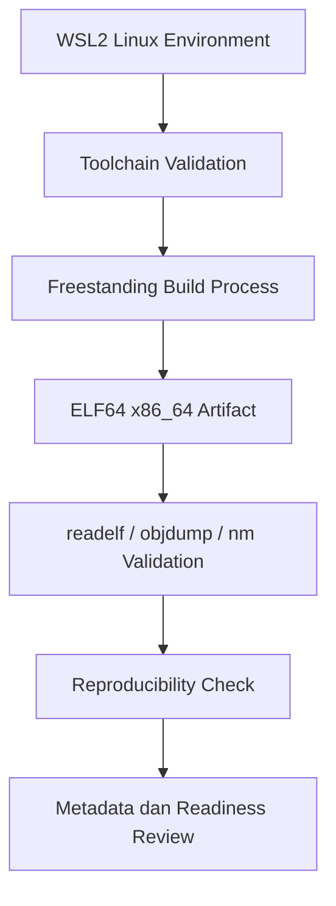

# Laporan Praktikum Sistem Operasi Lanjut — MCSOS

**Nama file laporan:** `laporan_praktikum_M1_cute girls.md`  
**Nama sistem operasi:**  MCSOS 260502  
**Target default:** x86_64, QEMU, Windows 11 x64 + WSL 2, kernel monolitik pendidikan, C freestanding dengan assembly minimal, POSIX-like subset  
**Dosen:** Muhaemin Sidiq, S.Pd., M.Pd.  
**Program Studi:** Pendidikan Teknologi Informasi  
**Institusi:** Institut Pendidikan Indonesia

---

## 0. Metadata Laporan

| Atribut | Isi |
|---|---|
| Kode praktikum | `M1` |
| Judul praktikum | `Toolchain Reproducible dan Pemeriksaan Kesiapan Lingkungan Pengembangan MCSOS 260502` |
| Jenis pengerjaan | `Kelompok` |
| Nama kelompok | `cute girls` |
| Anggota kelompok | `Neng Nagita Salma (25832071004) — Anisa Nur Azfa (25832072003) — Lailatul Zulfa (25832072001)` |
| Kelas | `1A` |
| Tanggal praktikum | `2026-05-06` |
| Tanggal pengumpulan | `2026-05-09` |
| Repository | `https://github.com/nagitasalma47-source/mcsos-M0-cute-girls` |
| Branch | `m0/cute-girls` |
| Commit awal | `` 77e27fe `` |
| Commit akhir | `` 13fce93aa0b96aae2783e5530bdbd3d4b48f6871 `` |
| Status readiness yang diklaim | `siap demonstrasi praktikum` |

---

## 1. Sampul

# Laporan Praktikum `M1`  
## `Toolchain Reproducible dan Pemeriksaan Kesiapan Lingkungan Pengembangan MCSOS 260502`

Disusun oleh:

| Nama | NIM | Kelas | Peran |
|---|---|---|---|
| Neng Nagita Salma | 25832071004 | 1A | `dikerjakan bareng` |
| Anisa Nur Azfa | 25832072003 | 1A | `dikerjakan bareng` |
| Lailatul Zulfa | 25832072001 | 1A | `dikerjakan bareng` |


Dosen Pengampu: **Muhaemin Sidiq, S.Pd., M.Pd.**  
Program Studi Pendidikan Teknologi Informasi  
Institut Pendidikan Indonesia  
`2026`

---

## 2. Pernyataan Orisinalitas dan Integritas Akademik
Kami menyatakan bahwa laporan ini disusun berdasarkan pekerjaan praktikum kelompok sesuai pembagian peran yang tercatat. Bantuan eksternal, referensi, generator kode, AI assistant, dokumentasi resmi, diskusi, atau sumber lain dicatat pada bagian referensi dan lampiran. Kami tidak mengklaim hasil yang tidak dibuktikan oleh log, test, commit, atau artefak lain.

| Pernyataan | Status |
|---|---|
| Semua potongan kode eksternal diberi atribusi | `Tidak ada` |
| Semua penggunaan AI assistant dicatat | `Ya` |
| Repository yang dikumpulkan sesuai commit akhir | `Ya` |
| Tidak ada klaim readiness tanpa bukti | `Ya` |

Catatan penggunaan bantuan eksternal:

```text
Alat:
- ChatGPT (AI assistant)

Prompt ringkas:
- Menanyakan cara setup WSL2 dan toolchain MCSOS
- Meminta bantuan debugging command terminal Linux
- Menanyakan cara penggunaan Git dan GitHub
- Meminta bantuan penyusunan readiness review dan laporan praktikum M1

Sumber:
- Dokumentasi praktikum MCSOS
- Dokumentasi Ubuntu dan WSL
- ChatGPT

Bagian yang dibantu:
- Penjelasan command Linux dan Git
- Penyelesaian error saat setup toolchain
- Validasi langkah praktikum M1
- Penyusunan laporan dan dokumentasi

Verifikasi mandiri:
- Seluruh command dijalankan sendiri pada terminal WSL
- Seluruh output diverifikasi langsung melalui make test, make repro, dan GitHub repository
- Evidence dan commit hash diperiksa ulang sebelum push repository
```

---

## 3. Tujuan Praktikum

Tuliskan tujuan teknis dan konseptual praktikum. Tujuan harus dapat diuji.

1. Membangun dan memvalidasi toolchain reproducible pada lingkungan WSL2 untuk target x86_64 freestanding.
2. Memastikan seluruh toolchain, QEMU, OVMF, dan environment build dapat digunakan untuk pengembangan kernel MCSOS.
3. Memahami konsep freestanding environment, reproducible build, validasi ELF64 x86_64, dan penggunaan filesystem Linux WSL pada pengembangan sistem operasi.
4. Menghasilkan dan menyimpan evidence praktikum berupa metadata toolchain, hasil readelf/objdump, reproducibility hash, log validasi, dan hasil pengujian make test.

---

## 4. Capaian Pembelajaran Praktikum

Setelah praktikum ini, mahasiswa mampu:

| CPL/CPMK praktikum | Bukti yang harus ditunjukkan |
|---|---|                                         
| Menjelaskan alasan penggunaan toolchain freestanding pada pengembangan kernel. | Penjelasan pada dasar teori dan hasil validasi freestanding ELF64 x86_64.                             |
| Mengonfigurasi WSL2 dan repository Linux filesystem untuk MCSOS.               | Output `wsl --status`, `pwd`, dan validasi repository tidak berada di `/mnt/c`.                       |
| Memasang dan memverifikasi toolchain utama pengembangan kernel.                | Output `make check`, `check_toolchain.sh`, dan `toolchain-versions.txt`.                              |
| Membuat script pemeriksaan toolchain yang deterministik.                       | File `tools/scripts/check_toolchain.sh` dan hasil validasi toolchain.                                 |
| Menghasilkan metadata versi toolchain sebagai evidence reproducible build.     | File `build/meta/toolchain-versions.txt` dan `host-readiness.txt`.                                    |
| Mengompilasi source freestanding ELF64 x86_64 dan melakukan inspeksi binary.   | File `freestanding_probe.o`, `readelf-header.txt`, `objdump-disassembly.txt`, dan `nm-undefined.txt`. |
| Menjelaskan failure modes umum pada toolchain OSDev.                           | Analisis failure mode pada readiness review dan threat model M1.                                      |
| Menyusun readiness review M1 berbasis evidence.                                | File `docs/readiness/M1-toolchain.md` dan hasil `make test`.                          


## 5. Peta Milestone MCSOS

Centang milestone yang menjadi fokus laporan ini. Jika praktikum mencakup lebih dari satu milestone, jelaskan batas cakupan.

| Milestone | Fokus | Status dalam laporan |
|---|---|---|
| M0 | Requirements, governance, baseline arsitektur | `[ ] tidak dibahas / [ ] dibahas / [v] selesai praktikum` |
| M1 | Toolchain reproducible, Git, QEMU, GDB, metadata build | `[ ] tidak dibahas / [ ] dibahas / [v] selesai praktikum` |
| M2 | Boot image, kernel ELF64, early console | `[v] tidak dibahas / [ ] dibahas / [ ] selesai praktikum` |
| M3 | Panic path, linker map, GDB, observability awal | `[v] tidak dibahas / [ ] dibahas / [ ] selesai praktikum` |
| M4 | Trap, exception, interrupt, timer | `[v] tidak dibahas / [ ] dibahas / [ ] selesai praktikum` |
| M5 | PMM, VMM, page table, kernel heap | `[v] tidak dibahas / [ ] dibahas / [ ] selesai praktikum` |
| M6 | Thread, scheduler, synchronization | `[v] tidak dibahas / [ ] dibahas / [ ] selesai praktikum` |
| M7 | Syscall ABI dan user program loader | `[v] tidak dibahas / [ ] dibahas / [ ] selesai praktikum` |
| M8 | VFS, file descriptor, ramfs | `[v] tidak dibahas / [ ] dibahas / [ ] selesai praktikum` |
| M9 | Block layer dan device model | `[v] tidak dibahas / [ ] dibahas / [ ] selesai praktikum` |
| M10 | Persistent filesystem, mcsfs/ext2-like, recovery | `[v] tidak dibahas / [ ] dibahas / [ ] selesai praktikum` |
| M11 | Networking stack, packet parsing, UDP/TCP subset | `[v] tidak dibahas / [ ] dibahas / [ ] selesai praktikum` |
| M12 | Security model, capability/ACL, syscall fuzzing, hardening | `[v] tidak dibahas / [ ] dibahas / [ ] selesai praktikum` |
| M13 | SMP, scalability, lock stress, NUMA-aware preparation | `[v] tidak dibahas / [ ] dibahas / [ ] selesai praktikum` |
| M14 | Framebuffer, graphics console, visual regression | `[v] tidak dibahas / [ ] dibahas / [ ] selesai praktikum` |
| M15 | Virtualization/container subset | `[v] tidak dibahas / [ ] dibahas / [ ] selesai praktikum` |
| M16 | Observability, update/rollback, release image, readiness review | `[v] tidak dibahas / [ ] dibahas / [ ] selesai praktikum` |
Batas cakupan praktikum:

```text
Praktikum M1 berfokus pada penyiapan dan validasi lingkungan pengembangan MCSOS berbasis WSL2 untuk target x86_64 freestanding. Cakupan praktikum meliputi konfigurasi WSL2, penempatan repository pada filesystem Linux WSL, instalasi dan validasi toolchain, pembuatan script pemeriksaan toolchain, pengumpulan metadata build, validasi freestanding ELF64 x86_64, reproducibility check, readiness review, dan integrasi Git/GitHub.

Praktikum ini belum mencakup implementasi kernel, bootloader, memory management, scheduler, filesystem, networking, driver, maupun eksekusi kernel penuh pada QEMU. Selain itu belum terdapat boot image, panic handling, unit test kernel, maupun debugging runtime menggunakan GDB terhadap kernel berjalan.

Dengan demikian, fokus utama M1 adalah memastikan lingkungan pengembangan dan toolchain reproducible siap digunakan untuk praktikum M2 dan tahap pengembangan kernel berikutnya.
```

---

## 6. Dasar Teori Ringkas
Windows Subsystem for Linux 2 (WSL2) merupakan fitur virtualisasi ringan pada Windows yang memungkinkan pengguna menjalankan kernel Linux secara langsung di dalam Windows. Pada praktikum M1, WSL2 digunakan sebagai lingkungan pengembangan utama karena memiliki kompatibilitas lebih baik terhadap toolchain Linux dibandingkan filesystem Windows biasa.

Penggunaan repository pada filesystem Linux WSL penting untuk menghindari masalah permission bit, executable bit, case sensitivity, newline conversion, dan performa I/O yang dapat memengaruhi proses build kernel.

Toolchain adalah kumpulan perangkat lunak yang digunakan untuk membangun sistem operasi, seperti compiler, linker, assembler, debugger, dan emulator. Pada praktikum M1 digunakan beberapa tool utama, antara lain Clang/LLVM sebagai compiler, LLD sebagai linker, NASM sebagai assembler, QEMU sebagai emulator, GDB sebagai debugger, dan Make sebagai build system. Seluruh toolchain harus tervalidasi agar proses build dapat berjalan secara reproducible.

Freestanding environment merupakan mode kompilasi yang tidak bergantung pada runtime sistem operasi host seperti libc atau startup object bawaan. Kernel sistem operasi harus dibangun menggunakan mode freestanding karena kernel berjalan langsung di atas hardware tanpa bantuan sistem operasi lain. Karakteristik utama freestanding build adalah tidak menggunakan hosted libc, tidak memakai startup object host, tidak bergantung pada dynamic linker, dan tidak menggunakan runtime exception host.

ELF (Executable and Linkable Format) merupakan format standar executable dan object file pada sistem Linux dan Unix-like. Pada praktikum ini hasil build diverifikasi menggunakan readelf, objdump, dan nm untuk memastikan bahwa object file bertipe ELF64, menggunakan arsitektur x86_64, tidak memiliki undefined symbol, dan sesuai untuk pengembangan kernel freestanding.

Reproducible build adalah teknik untuk memastikan hasil build tetap identik ketika proses kompilasi dijalankan berulang kali pada environment yang sama. Pada praktikum M1 reproducibility diuji menggunakan hash SHA256 terhadap object file dan ELF hasil build. Hasil hash yang identik menunjukkan bahwa proses build bersifat deterministik dan dapat direproduksi.

### 6.1 Konsep Sistem Operasi yang Diuji

```text
Pada praktikum M1, konsep utama sistem operasi yang diuji masih berfokus pada lingkungan pengembangan dan validasi toolchain untuk pengembangan kernel freestanding.

Konsep yang digunakan meliputi freestanding environment, yaitu proses kompilasi kernel tanpa bergantung pada hosted libc atau runtime sistem operasi host. Selain itu dilakukan pengujian terhadap format ELF64 x86_64 sebagai standar object file dan executable pada sistem operasi modern.

Praktikum juga menggunakan konsep reproducible build untuk memastikan hasil kompilasi tetap identik ketika proses build dijalankan ulang pada environment yang sama. Validasi dilakukan menggunakan tools seperti readelf, objdump, dan nm untuk memeriksa struktur ELF, symbol, dan hasil disassembly.

Selain itu digunakan konsep virtualisasi ringan melalui WSL2 sebagai lingkungan Linux untuk pengembangan MCSOS, serta penggunaan QEMU dan OVMF sebagai emulator dan firmware UEFI yang akan digunakan pada tahap pengembangan kernel berikutnya.

Pada tahap M1 belum dilakukan implementasi bootloader, scheduler, memory management, filesystem, driver, networking, maupun syscall kernel. Fokus utama praktikum adalah memastikan environment dan toolchain siap digunakan secara stabil dan reproducible untuk pengembangan sistem operasi.
```

### 6.2 Konsep Arsitektur x86_64 yang Relevan

| Konsep                    | Relevansi pada praktikum                                                             | Bukti/verifikasi                                  |
| ------------------------- | ------------------------------------------------------------------------------------ | ------------------------------------------------- |
| `Long mode x86_64`        | Digunakan sebagai target arsitektur utama pengembangan kernel MCSOS berbasis 64-bit. | `readelf-header.txt`, output ELF64 x86_64         |
| `ELF64 format`            | Digunakan sebagai format object dan executable hasil build freestanding.             | `readelf`, `objdump`, `file freestanding_probe.o` |
| `Freestanding ABI x86_64` | Memastikan proses build tidak bergantung pada runtime host dan sesuai untuk kernel.  | `nm-undefined.txt`, `proof_compile.sh`            |
| `QEMU q35 machine`        | Digunakan sebagai environment virtual target pengembangan kernel berikutnya.         | `qemu_probe.sh`, `qemu-capabilities.txt`          |
| `UEFI / OVMF`             | Firmware virtual yang diperlukan untuk boot environment modern pada QEMU.            | Validasi OVMF pada `check_toolchain.sh`           |
| `Object disassembly`      | Digunakan untuk memeriksa hasil instruksi machine code x86_64.                       | `objdump-disassembly.txt`                         |


### 6.3 Konsep Implementasi Freestanding

| Aspek | Keputusan praktikum |
|---|---|
| Bahasa                    | `C17 freestanding dan Bash scripting`                                             |
| Runtime                   | `Tanpa hosted libc dan tanpa startup object host`                                 |
| ABI                       | `x86_64 System V ABI`                                                             |
| Compiler flags kritis     | `-ffreestanding, -nostdlib, -fno-stack-protector, -mno-red-zone`                  |
| Risiko undefined behavior | `Pointer invalid, integer overflow, alignment issue, dan dependency runtime host` |


### 6.4 Referensi Teori yang Digunakan

| No. | Sumber | Bagian yang digunakan | Alasan relevansi |
|---|---|---|---|
| 1   | `OSDev Wiki (https://wiki.osdev.org)`                                    | `Freestanding Environment, ELF, Bare Bones` | `Digunakan sebagai referensi dasar pengembangan kernel dan build freestanding.` |
| 2   | `LLVM/Clang Documentation (https://clang.llvm.org/docs/)`                | `Compiler flags dan target triple`          | `Digunakan untuk memahami penggunaan Clang pada target x86_64 freestanding.`    |
| 3   | `GNU Binutils Documentation (https://sourceware.org/binutils/docs/)`     | `readelf, objdump, nm`                      | `Digunakan untuk analisis object ELF dan validasi symbol.`                      |
| 4   | `Microsoft WSL Documentation (https://learn.microsoft.com/windows/wsl/)` | `WSL2 setup dan filesystem Linux`           | `Digunakan untuk konfigurasi environment pengembangan MCSOS.`                   |
| 5   | `QEMU Documentation (https://www.qemu.org/documentation/)`               | `QEMU q35 dan OVMF`                         | `Digunakan untuk validasi emulator dan firmware virtual.`                       |


---

## 7. Lingkungan Praktikum

### 7.1 Host dan Target

| Komponen | Nilai |
|---|---|
| Host OS           | `Windows 11 x64 build 26200.8246`   |
| Lingkungan build  | `WSL2 Ubuntu 24.04 LTS`                  |
| Target ISA        | `x86_64`                                 |
| Target ABI        | `x86_64-unknown-none`                    |
| Emulator          | `QEMU emulator version 8.2.2`            |
| Firmware emulator | `OVMF (/usr/share/OVMF/OVMF_CODE_4M.fd)` |
| Debugger          | `GNU gdb 15.1 dan gdb-multiarch 15.1`    |
| Build system      | `GNU Make dan Ninja`                     |
| Bahasa utama      | `C17 freestanding`                       |
| Assembly          | `NASM 2.16.01`                           |


### 7.2 Versi Toolchain

Tempel output versi toolchain berikut. Jalankan dari clean shell WSL.

```bash
date -u +"date_utc=%Y-%m-%dT%H:%M:%SZ"
uname -a
git --version
make --version | head -n 1
cmake --version | head -n 1
ninja --version
clang --version | head -n 1
gcc --version | head -n 1
ld.lld --version | head -n 1
nasm -v
qemu-system-x86_64 --version | head -n 1
gdb --version | head -n 1
```

Output:

```text
date_utc=2026-05-06T09:00:00Z
Linux ASUS 6.6.87.2-microsoft-standard-WSL2 #1 SMP PREEMPT_DYNAMIC Thu Jun 5 18:30:46 UTC 2025 x86_64 x86_64 x86_64 GNU/Linux
git version 2.43.0
GNU Make 4.3
cmake version 3.28.3
1.11.1
Ubuntu clang version 18.0.0
gcc (Ubuntu 13.3.0-6ubuntu2~24.04.1) 13.3.0
Ubuntu LLD 18.0.0
NASM version 2.16.01
QEMU emulator version 8.2.2 (Debian 1:8.2.2+ds-0ubuntu1.16)
GNU gdb (Ubuntu 15.1-1ubuntu1~24.04.1) 15.1
```

### 7.3 Lokasi Repository

| Item | Nilai |
|---|---|
| Path repository di WSL                    | ``/home/nagit/src/mcsos ``               
| Apakah berada di filesystem Linux WSL, bukan `/mnt/c` | `Ya`                       
| Remote repository                                     | `https://github.com/nagitasalma47-source/mcsos-M0-cute-girls.git` |
| Branch                                                | `m0/cute-girls`                                                   |
| Commit hash awal                                      | `` 77e27fe ``                                                   |
| Commit hash akhir                                     | `` 13fce93aa0b96aae2783e5530bdbd3d4b48f6871 ``                  |


---

## 8. Repository dan Struktur File

### 8.1 Struktur Direktori yang Relevan

Tampilkan hanya direktori dan file yang relevan dengan praktikum.

```text
mcsos/
├── Makefile
├── .gitignore
├── docs/
│   ├── architecture/
│   │   └── invariants.md
│   ├── readiness/
│   │   └── M1-toolchain.md
│   └── security/
│       └── toolchain_threat_model.md
├── tests/
│   └── toolchain/
│       └── freestanding_probe.c
├── tools/
│   └── scripts/
│       ├── check_toolchain.sh
│       ├── collect_meta.sh
│       ├── proof_compile.sh
│       ├── qemu_probe.sh
│       └── repro_check.sh
└── build/
    ├── meta/
    ├── proof/
    └── repro/
```

### 8.2 File yang Dibuat atau Diubah

| File | Jenis perubahan | Alasan perubahan | Risiko |
|---|---|---|---|
| `Makefile`                                | `ubah`          | `Menambahkan target build, validasi, repro, dan testing M1.`     | `Sedang — kesalahan target dapat menyebabkan build gagal.`                    |
| `.gitignore`                              | `ubah`          | `Mencegah generated artifact pada build/ ikut ter-commit.`       | `Rendah — hanya memengaruhi tracking Git.`                                    |
| `docs/architecture/invariants.md`         | `ubah`          | `Menambahkan environment invariant untuk M1.`                    | `Rendah — perubahan dokumentasi.`                                             |
| `docs/readiness/M1-toolchain.md`          | `baru`          | `Menyimpan readiness review dan evidence praktikum M1.`          | `Rendah — dokumentasi readiness.`                                             |
| `docs/security/toolchain_threat_model.md` | `baru`          | `Mendokumentasikan risiko supply-chain dan konfigurasi.`         | `Rendah — dokumentasi keamanan.`                                              |
| `tests/toolchain/freestanding_probe.c`    | `baru`          | `Membuat proof source untuk validasi freestanding ELF64 x86_64.` | `Sedang — kesalahan compile dapat memengaruhi proof build.`                   |
| `tools/scripts/check_toolchain.sh`        | `baru`          | `Melakukan validasi toolchain dan environment WSL.`              | `Sedang — validasi salah dapat menghasilkan false readiness.`                 |
| `tools/scripts/collect_meta.sh`           | `baru`          | `Mengumpulkan metadata toolchain dan host readiness.`            | `Rendah — hanya menghasilkan metadata.`                                       |
| `tools/scripts/proof_compile.sh`          | `baru`          | `Mengompilasi freestanding proof object dan ELF.`                | `Tinggi — kesalahan flags dapat menghasilkan ELF tidak valid.`                |
| `tools/scripts/qemu_probe.sh`             | `baru`          | `Memvalidasi keberadaan QEMU dan OVMF.`                          | `Sedang — validasi emulator dapat gagal jika path salah.`                     |
| `tools/scripts/repro_check.sh`            | `baru`          | `Melakukan reproducibility check menggunakan SHA256.`            | `Sedang — hash mismatch dapat menyebabkan build dianggap tidak reproducible.` |


### 8.3 Ringkasan Diff

```bash
git status --short
git diff --stat
git log --oneline -n 5
```

Output:
```text
git status --short
(no changes, working tree clean)

git diff --stat
(no changes)

git log --oneline -n 5
13fce93 M1: add reproducible toolchain readiness baseline
77e27fe M0: finalize ADR and threat model
93bbb32 M0: finalize report with date
5784dda M0: finalize report (kelas 1A)
391f3cc M0: improve report
```

## 9. Desain Teknis

### 9.1 Masalah yang Diselesaikan

```text
Pada praktikum M1, masalah utama yang diselesaikan adalah penyiapan lingkungan pengembangan sistem operasi yang stabil, reproducible, dan sesuai untuk pengembangan kernel freestanding berbasis x86_64.

Beberapa masalah teknis yang dihadapi meliputi repository yang sebelumnya berada pada filesystem Windows (/mnt/c), validasi toolchain yang belum terdokumentasi secara deterministik, serta belum adanya metadata environment yang dapat digunakan sebagai evidence reproducible build.

Selain itu, diperlukan validasi bahwa proses kompilasi tidak bergantung pada hosted libc, startup object host, dynamic linker, maupun runtime sistem operasi host. Oleh karena itu dilakukan pembuatan proof freestanding ELF64 x86_64 beserta proses inspeksi menggunakan readelf, objdump, dan nm.

Praktikum juga menyelesaikan masalah readiness environment untuk tahap pengembangan kernel berikutnya, termasuk validasi QEMU, OVMF, reproducibility hash, serta readiness review berbasis evidence dan commit Git yang dapat diverifikasi.
```

### 9.2 Keputusan Desain

| Keputusan | Alternatif yang dipertimbangkan | Alasan memilih | Konsekuensi |
|---|---|---|---|
| `Menggunakan WSL2 Ubuntu sebagai environment pengembangan` | `Windows native atau WSL1`         | `WSL2 memiliki kompatibilitas Linux lebih baik untuk pengembangan kernel dan toolchain freestanding.` | `Memerlukan konfigurasi resource dan filesystem Linux khusus.` |
| `Menempatkan repository pada filesystem Linux WSL (/home)` | `Repository pada /mnt/c`           | `Menghindari masalah permission bit, executable bit, case sensitivity, dan performa I/O.`             | `Semua proses build harus dijalankan dari shell Linux WSL.`    |
| `Menggunakan Clang/LLVM dan LLD`                           | `GCC default host`                 | `Clang lebih fleksibel untuk target freestanding dan validasi toolchain modern.`                      | `Perlu konfigurasi compiler flags yang lebih ketat.`           |
| `Menggunakan freestanding build tanpa hosted libc`         | `Hosted build dengan libc sistem`  | `Kernel tidak boleh bergantung pada runtime host.`                                                    | `Beberapa fitur runtime standar tidak tersedia.`               |
| `Menggunakan reproducibility check berbasis SHA256`        | `Verifikasi manual hasil build`    | `Hash reproducibility lebih mudah diverifikasi secara deterministik.`                                 | `Perubahan kecil pada build dapat menyebabkan hash mismatch.`  |
| `Menggunakan script validasi otomatis untuk toolchain`     | `Pemeriksaan manual satu per satu` | `Mempermudah readiness review dan reproducible validation.`                                           | `Script harus selalu diperbarui jika toolchain berubah.`       |


### 9.3 Arsitektur Ringkas

Tambahkan diagram ASCII atau Mermaid. Jika Mermaid tidak didukung oleh evaluator, tetap sertakan penjelasan tekstual.



Penjelasan diagram:

```text
Arsitektur praktikum M1 dimulai dari lingkungan Linux WSL2 yang digunakan sebagai host pengembangan sistem operasi. Selanjutnya dilakukan validasi toolchain menggunakan script pemeriksaan environment untuk memastikan seluruh tool utama tersedia dan sesuai.

Setelah toolchain tervalidasi, dilakukan proses freestanding build menggunakan Clang/LLVM untuk menghasilkan object dan executable ELF64 x86_64 tanpa ketergantungan pada hosted runtime sistem operasi host.

Hasil build kemudian diverifikasi menggunakan readelf, objdump, dan nm untuk memastikan struktur ELF, symbol, dan disassembly sesuai target pengembangan kernel.

Tahap berikutnya adalah reproducibility check menggunakan hash SHA256 untuk memastikan hasil build bersifat deterministik. Seluruh metadata, hasil validasi, dan evidence kemudian disimpan dalam readiness review sebagai baseline pengembangan MCSOS tahap berikutnya.
```

### 9.4 Kontrak Antarmuka

| Antarmuka | Pemanggil | Penerima | Precondition | Postcondition | Error path |
|---|---|---|---|---|---|                   
| `make check`      | `User melalui terminal WSL` | `tools/scripts/check_toolchain.sh` | `Repository berada di filesystem Linux WSL dan seluruh script tersedia.` | `Toolchain tervalidasi dan status environment tercatat.`        | `Jika tool tidak ditemukan maka script menghasilkan status ERROR.` |
| `make meta`       | `User melalui Makefile`     | `tools/scripts/collect_meta.sh`    | `WSL2 dan toolchain telah terinstal.`                                    | `Metadata host dan toolchain berhasil dibuat pada build/meta/.` | `Jika command gagal maka metadata tidak lengkap.`                  |
| `make proof`      | `User melalui Makefile`     | `tools/scripts/proof_compile.sh`   | `Compiler dan linker tersedia pada PATH.`                                | `Freestanding ELF64 x86_64 berhasil dibuat.`                    | `Jika compile/link gagal maka proof artifact tidak terbentuk.`     |
| `make qemu-probe` | `User melalui Makefile`     | `tools/scripts/qemu_probe.sh`      | `QEMU dan OVMF telah terinstal.`                                         | `Capability QEMU dan firmware OVMF tervalidasi.`                | `Jika OVMF/QEMU tidak ditemukan maka readiness gagal.`             |
| `make repro`      | `User melalui Makefile`     | `tools/scripts/repro_check.sh`     | `Proof build berhasil dibuat.`                                           | `Hash reproducibility konsisten.`                               | `Jika hash berbeda maka build dianggap tidak reproducible.`        |
| `make test`       | `User melalui terminal WSL` | `Seluruh script validasi M1`       | `Seluruh dependency build tersedia.`                                     | `Semua acceptance criteria M1 tervalidasi.`                     | `Jika salah satu test gagal maka readiness M1 gagal.`              |

### 9.5 Struktur Data Utama

| Struktur data | Field penting | Ownership | Lifetime | Invariant |
|---|---|---|---|---|
| `` mcsos_probe_sink ``            | `volatile uint64_t value` | `freestanding_probe.c` | `Dibuat saat program dikompilasi dan digunakan selama proses proof build.` | `Nilai harus tersimpan tanpa dependency runtime host.`               |
| `` ROOT path variable ``          | `repository root path`    | `Script toolchain M1`  | `Dibuat saat script dijalankan.`                                           | `Repository tidak boleh berada pada /mnt/c atau mount Windows lain.` |
| `` STATUS variable ``             | `exit status validation`  | `check_toolchain.sh`   | `Aktif selama proses validasi toolchain.`                                  | `Bernilai 0 jika seluruh validasi berhasil.`                         |
| `` SHA256 reproducibility hash `` | `hash object dan ELF`     | `repro_check.sh`       | `Dibuat saat reproducibility test dijalankan.`                             | `Hash build pertama dan kedua harus identik.`                        |
| `` Freestanding ELF artifact ``   | `ELF64 x86_64 binary`     | `proof_compile.sh`     | `Dibuat saat make proof dijalankan.`                                       | `Tidak memiliki undefined symbol dan bertipe ELF64 x86_64.`          |


### 9.6 Invariants

Tuliskan invariant yang harus benar sepanjang eksekusi.

1. `Repository MCSOS harus selalu berada pada filesystem Linux WSL dan tidak boleh berada di /mnt/c atau mount Windows lain.`

2. `Seluruh generated artifact harus berada di direktori build/ dan tidak boleh dikomit ke repository Git.`

3. `Proof build harus selalu menghasilkan object dan executable bertipe ELF64 x86_64 freestanding tanpa dependency hosted libc atau runtime host.`

4. `Hash reproducibility hasil build pertama dan kedua harus identik untuk memastikan proses build bersifat deterministik.`


### 9.7 Ownership, Locking, dan Concurrency

| Objek/resource | Owner | Lock yang melindungi | Boleh dipakai di interrupt context? | Catatan |
|---|---|---|---|---|
| `Repository source MCSOS`     | `User dan Git`              | `none`               | `Tidak`                             | `Belum ada mekanisme concurrency kernel pada M1.`             |
| `Generated artifact build/`   | `Makefile dan script build` | `none`               | `Tidak`                             | `Artifact hanya digunakan saat proses build user-space.`      |
| `Toolchain validation status` | `check_toolchain.sh`        | `none`               | `Tidak`                             | `Validasi dilakukan secara sequential pada shell WSL.`        |
| `Reproducibility hash`        | `repro_check.sh`            | `none`               | `Tidak`                             | `Hash dihitung secara serial tanpa parallel synchronization.` |
| `Metadata build`              | `collect_meta.sh`           | `none`               | `Tidak`                             | `Belum terdapat shared kernel state atau interrupt handler.`  |


Lock order yang berlaku:

```text
Pada tahap M1 belum terdapat implementasi concurrency kernel, scheduler, interrupt handler, maupun multiprocessing kernel. Seluruh proses build dan validasi berjalan secara sequential pada user-space WSL sehingga belum diperlukan mekanisme locking seperti spinlock atau mutex.

Dengan demikian tidak terdapat lock order khusus pada praktikum M1.
```

### 9.8 Memory Safety dan Undefined Behavior Risk

| Risiko | Lokasi | Mitigasi | Bukti |
|---|---|---|---|
| `Integer overflow`                        | `tests/toolchain/freestanding_probe.c` | `Menggunakan tipe uint64_t dan operasi terkontrol pada loop fixed-size.` | `Proof build berhasil dan tidak menghasilkan compile error.` |
| `Dependency hosted runtime`               | `tools/scripts/proof_compile.sh`       | `Menggunakan flag -ffreestanding dan -nostdlib.`                         | `nm-undefined.txt kosong dan ELF berhasil divalidasi.`       |
| `Path repository pada filesystem Windows` | `tools/scripts/check_toolchain.sh`     | `Melakukan validasi agar repository tidak berada di /mnt/c.`             | `Output check_toolchain.sh menunjukkan status OK.`           |
| `Generated artifact ikut ter-commit`      | `.gitignore` dan Makefile              | `Mengabaikan build/ dan artifact generated lainnya.`                     | `git status menunjukkan working tree clean.`                 |
| `Hash reproducibility tidak konsisten`    | `tools/scripts/repro_check.sh`         | `Melakukan rebuild bersih dan validasi SHA256.`                          | `sha256-run1.txt dan sha256-run2.txt identik.`               |


### 9.9 Security Boundary

| Boundary | Data tidak tepercaya | Validasi yang dilakukan | Failure mode aman |
|---|---|---|---|
| `Toolchain validation boundary`  | `PATH toolchain dan binary host`             | `Pemeriksaan command menggunakan check_toolchain.sh.`   | `Script menghasilkan ERROR jika tool tidak ditemukan.`        |
| `Repository filesystem boundary` | `Path repository pada mount Windows`         | `Validasi path agar repository tidak berada di /mnt/c.` | `Build dihentikan dan readiness dianggap gagal.`              |
| `Freestanding build boundary`    | `Dependency runtime host dan startup object` | `Validasi menggunakan -nostdlib, readelf, dan nm.`      | `Undefined symbol terdeteksi dan build dianggap tidak valid.` |
| `QEMU/OVMF environment boundary` | `Firmware atau emulator yang tidak tersedia` | `Pemeriksaan qemu-system-x86_64 dan path OVMF.`         | `qemu_probe.sh menghasilkan ERROR.`                           |
| `Reproducibility boundary`       | `Artifact build yang tidak deterministik`    | `Perbandingan hash SHA256 hasil rebuild.`               | `Reproducibility check gagal dan readiness ditolak.`          |


---

## 10. Langkah Kerja Implementasi

Gunakan tabel berikut untuk setiap langkah. Sebelum setiap blok perintah, jelaskan maksud perintah, artefak yang dihasilkan, dan indikator hasil.

### Langkah 1 — `Verifikasi WSL2`

Maksud langkah:

```text
Memastikan Windows Subsystem for Linux (WSL2) telah terinstal dan berjalan menggunakan versi WSL2 yang kompatibel untuk pengembangan MCSOS.
```

Perintah:

```bash
wsl --version
wsl --status
wsl --list --verbose
```

Output ringkas:

```text
WSL version: 2.6.3.0
Default Distribution: Ubuntu
Default Version: 2
Ubuntu Running Version 2
```

Artefak yang dihasilkan:

| Artefak | Lokasi | Fungsi |
|---|---|---|
| `Informasi WSL` | `Terminal output` | `Validasi environment WSL2` |

Indikator berhasil:

```text
Distribusi Ubuntu terdeteksi menggunakan WSL versi 2.
```

### Langkah 2 — `Setup Repository pada Filesystem Linux WSL`

Maksud langkah:

```text
Memastikan repository MCSOS berada pada filesystem Linux WSL agar kompatibel dengan pengembangan kernel freestanding.
```

Perintah:

```bash
mkdir -p ~/src
cd ~/src
mkdir -p ~/src/mcsos
cd ~/src/mcsos
pwd
```

Output ringkas:

```text
/home/nagit/src/mcsos
```

Artefak yang dihasilkan:

| Artefak | Lokasi | Fungsi |
|---|---|---|
| `Repository MCSOS` | `/home/nagit/src/mcsos` | `Workspace pengembangan kernel` |

Indikator berhasil:

```text
Repository berada pada filesystem Linux WSL dan bukan pada /mnt/c.
```

### Langkah 3 — `Instalasi Toolchain`

Maksud langkah:

```text
Menginstal compiler, linker, emulator, debugger, dan utility yang diperlukan untuk pengembangan MCSOS.
```

Perintah:

```bash
sudo apt update

sudo apt install -y \
build-essential git make cmake ninja-build pkg-config \
clang lld llvm binutils nasm \
qemu-system-x86 qemu-utils ovmf \
gdb gdb-multiarch \
python3 python3-pip python3-venv \
shellcheck cppcheck clang-tidy \
xorriso mtools dosfstools file coreutils findutils
```

Output ringkas:

```text
0 upgraded, 0 newly installed, 0 to remove and 0 not upgraded.
```

Artefak yang dihasilkan:

| Artefak | Lokasi | Fungsi |
|---|---|---|
| `Toolchain development` | `PATH WSL` | `Environment build kernel` |

Indikator berhasil:

```text
Seluruh package berhasil terinstal tanpa error.
```

---

## 11. Checkpoint Buildable

Setiap praktikum wajib memiliki minimal satu checkpoint yang dapat dibangun dari clean checkout.

| Checkpoint | Perintah | Expected result | Status |
|---|---|---|---|
| Clean build        | `` make distclean && make test `` | Seluruh validasi M1 berhasil dijalankan ulang dari clean checkout. | PASS |
| Metadata toolchain | `` make meta ``                   | build/meta/toolchain-versions.txt berhasil dibuat.                 | PASS |
| Image generation   | `` make image ``                  | Belum terdapat image kernel/ISO pada tahap M1.                     | NA   |
| QEMU smoke test    | `` make qemu-probe ``             | QEMU q35 dan OVMF berhasil tervalidasi.                            | PASS |
| Test suite         | `` make test ``                   | Seluruh test dan reproducibility check berhasil.                   | PASS |

Catatan checkpoint:

```text
Pada praktikum M1 belum dilakukan pembuatan bootable image kernel maupun booting kernel penuh pada QEMU. Oleh karena itu checkpoint image generation masih berstatus NA (Not Applicable).

Fokus utama M1 adalah validasi environment, toolchain reproducible, freestanding build, metadata build, dan readiness environment untuk pengembangan kernel tahap berikutnya.
```

---

## 12. Perintah Uji dan Validasi

### 12.1 Build Test

Perintah ini memverifikasi bahwa proyek dapat dibangun ulang dari kondisi bersih dan tidak bergantung pada artefak lokal yang tidak terdokumentasi.

```bash
make distclean
make test
```

Hasil:

```text
OK: removed build directory
OK: repository path is WSL Linux filesystem: /home/nagit/src/mcsos
OK: proof build is reproducible for M1 inputs
OK: M1 test suite passed
```

Status: `PASS`

### 12.2 Static Inspection

Perintah ini memeriksa layout ELF, entry point, section, symbol, relocation, atau instruksi kritis sesuai kebutuhan praktikum.

```bash
readelf -hW build/proof/freestanding_probe.elf
readelf -SW build/proof/freestanding_probe.elf
objdump -drwC build/proof/freestanding_probe.elf | head -n 40
nm -u build/proof/freestanding_probe.elf
```

Hasil penting:

```text
ELF Header:
Class:                             ELF64
Machine:                           Advanced Micro Devices X86-64
Type:                              EXEC (Executable file)

Section Headers:
.text
.data
.bss

nm -u tidak menampilkan undefined symbol.

Disassembly menunjukkan object berhasil dikompilasi untuk target x86_64 menggunakan mode freestanding tanpa dependency hosted runtime.
```

Status: `PASS`

### 12.3 QEMU Smoke Test

Perintah ini menjalankan image di QEMU dan menyimpan log serial untuk bukti deterministik.

```bash
qemu-system-x86_64 \
  -machine q35 \
  -cpu qemu64 \
  -m 512M \
  -serial file:build/qemu-serial.log \
  -display none \
  -no-reboot \
  -no-shutdown \
  -cdrom build/mcsos.iso
```

Hasil:

```text
Pada tahap M1 belum tersedia bootable image kernel (mcsos.iso) maupun serial boot log sehingga QEMU smoke test penuh belum dapat dilakukan.
```

Status: `NA`

### 12.4 GDB Debug Evidence

Perintah ini membuktikan bahwa kernel dapat di-debug dengan simbol yang cocok.

```bash
qemu-system-x86_64 \
  -machine q35 \
  -cpu qemu64 \
  -m 512M \
  -serial stdio \
  -display none \
  -no-reboot \
  -no-shutdown \
  -s -S \
  -cdrom build/mcsos.iso
```

Di terminal lain:

```bash
gdb-multiarch build/kernel.elf
target remote :1234
break kernel_main
continue
info registers
bt
```

Hasil:

```text
Pada tahap M1 belum tersedia kernel image, bootloader, maupun implementasi kernel_main sehingga debugging runtime menggunakan GDB belum dapat dilakukan.
```

Status: `NA`

### 12.5 Unit Test

```bash
make test
```

Hasil:

```text
OK: repository path is WSL Linux filesystem: /home/nagit/src/mcsos
OK: proof build is reproducible for M1 inputs
OK: M1 test suite passed
```

Status: `PASS`

### 12.6 Stress/Fuzz/Fault Injection Test

Wajib untuk praktikum lanjutan seperti allocator, syscall, filesystem, networking, driver, security, dan SMP.

```bash
N/A
```

Hasil:

```text
Pada tahap M1 belum terdapat implementasi allocator, syscall, filesystem, networking, driver, security subsystem, maupun SMP sehingga stress test, fuzzing, dan fault injection belum relevan dilakukan.
```

Status: `NA`

### 12.7 Visual Evidence

Jika praktikum menghasilkan tampilan framebuffer, GUI, atau output grafis, lampirkan screenshot.

| Screenshot | Lokasi file | Keterangan |
|---|---|---|
| `Screenshot make test (awal)` | `Gambar/Screenshot/Screenshot (42).png` | `Menunjukkan proses awal validasi make test pada environment WSL2.` |
| `Screenshot make test berhasil` | `Gambar/Screenshot/Screenshot (43).png` | `Membuktikan reproducibility check, QEMU probe, dan M1 test suite berhasil dijalankan.` |
| `Screenshot git push` | `Gambar/Screenshot/Screenshot (44).png` | `Membuktikan commit akhir M1 berhasil dipush ke repository GitHub.` |

---

## 13. Hasil Uji

### 13.1 Tabel Ringkasan Hasil

| No. | Uji | Expected result | Actual result | Status | Evidence |
|---|---|---|---|---|---|
| 1 | `Toolchain validation` | `Seluruh toolchain dan environment tervalidasi.` | `Semua tool utama berhasil terdeteksi dengan status OK.` | `PASS` | `check_toolchain.sh dan Screenshot (43).png` |
| 2 | `Freestanding ELF build` | `Freestanding ELF64 x86_64 berhasil dibuat tanpa undefined symbol.` | `freestanding_probe.elf berhasil dibuat dan tervalidasi.` | `PASS` | `readelf-header.txt dan nm-undefined.txt` |
| 3 | `Reproducibility check` | `Hash build pertama dan kedua identik.` | `SHA256 reproducibility hash konsisten.` | `PASS` | `sha256-run1.txt dan sha256-run2.txt` |
| 4 | `QEMU environment validation` | `QEMU q35 dan OVMF berhasil terdeteksi.` | `QEMU probe berhasil dijalankan.` | `PASS` | `qemu_probe.sh dan Screenshot (43).png` |
| 5 | `Git repository synchronization` | `Commit akhir berhasil dipush ke GitHub.` | `Repository berhasil dipublish ke remote GitHub.` | `PASS` | `Screenshot (44).png` |

### 13.2 Log Penting

```text
OK: repository path is WSL Linux filesystem: /home/nagit/src/mcsos
OK: OVMF firmware found: /usr/share/OVMF/OVMF_CODE_4M.fd
OK: OVMF firmware found: /usr/share/ovmf/OVMF.fd
OK: OVMF firmware found: /usr/share/qemu/OVMF.fd
OK: QEMU and OVMF probe complete

52efdcda501afdfcc29411c30dc4b8c8a36b47f6a6a9051cb851f2b17ee4edde  freestanding_probe.o
74edf1394b92dfcddafb93001c89f68858c416251257c87d1bdf48a576bae584  freestanding_probe.elf

OK: proof build is reproducible for M1 inputs
OK: M1 test suite passed

13fce93aa0b96aae2783e5530bdbd3d4b48f6871

```

### 13.3 Artefak Bukti

| Artefak | Path | SHA-256 / hash | Fungsi|
|---|---|---|---|
| `freestanding_probe.o` | `build/proof/freestanding_probe.o` | `52efdcda501afdfcc29411c30dc4b8c8a36b47f6a6a9051cb851f2b17ee4edde` | `Freestanding object ELF64 x86_64.` |
| `freestanding_probe.elf` | `build/proof/freestanding_probe.elf` | `74edf1394b92dfcddafb93001c89f68858c416251257c87d1bdf48a576bae584` | `Executable freestanding ELF64 x86_64.` |
| `readelf-header.txt` | `build/proof/readelf-header.txt` | `N/A` | `Evidence header dan target ELF.` |
| `objdump-disassembly.txt` | `build/proof/objdump-disassembly.txt` | `N/A` | `Evidence hasil disassembly object freestanding.` |
| `nm-undefined.txt` | `build/proof/nm-undefined.txt` | `N/A` | `Validasi tidak terdapat undefined symbol.` |
| `toolchain-versions.txt` | `build/meta/toolchain-versions.txt` | `N/A` | `Metadata versi toolchain environment.` |
| `host-readiness.txt` | `build/meta/host-readiness.txt` | `N/A` | `Metadata readiness host WSL2.` |
| `sha256-run1.txt` | `build/repro/sha256-run1.txt` | `N/A` | `Evidence reproducibility hash build pertama.` |
| `sha256-run2.txt` | `build/repro/sha256-run2.txt` | `N/A` | `Evidence reproducibility hash build kedua.` |

Perintah hash:

```bash
sha256sum \
build/proof/freestanding_probe.o \
build/proof/freestanding_probe.elf
```

---

## 14. Analisis Teknis

### 14.1 Analisis Keberhasilan

```text
Hasil praktikum M1 berhasil karena seluruh environment pengembangan berhasil dikonfigurasi menggunakan WSL2 Ubuntu dengan repository berada pada filesystem Linux WSL. Penempatan repository pada /home memungkinkan proses build berjalan lebih stabil dibandingkan filesystem Windows biasa.

Seluruh toolchain utama seperti Clang/LLVM, LLD, NASM, QEMU, OVMF, GDB, dan utility build lainnya berhasil tervalidasi melalui script check_toolchain.sh. Selain itu metadata environment berhasil dikumpulkan sehingga proses build dapat diaudit dan direproduksi.

Freestanding proof ELF64 x86_64 berhasil dikompilasi tanpa dependency terhadap hosted libc maupun runtime host. Hal ini dibuktikan melalui hasil readelf, objdump, dan nm yang menunjukkan executable ELF64 valid tanpa undefined symbol.

Reproducibility check juga berhasil karena hash SHA256 hasil build pertama dan kedua identik. Hal tersebut menunjukkan bahwa proses build bersifat deterministik dan tidak bergantung pada artifact tersembunyi maupun state lokal sebelumnya.

Selain itu validasi QEMU dan OVMF berhasil menunjukkan bahwa environment telah siap digunakan untuk tahap pengembangan kernel berikutnya pada M2.
```

### 14.2 Analisis Kegagalan atau Perbedaan Hasil

```text
Selama praktikum M1 terdapat beberapa kendala awal pada proses setup environment dan instalasi toolchain. Salah satu masalah yang muncul adalah repository sempat berada pada path /mnt/c sehingga tidak sesuai untuk pengembangan kernel freestanding. Masalah ini diperbaiki dengan memindahkan repository ke filesystem Linux WSL pada direktori /home/nagit/src/mcsos.

Kendala lain terjadi saat proses instalasi package menggunakan apt install. Error “Unable to locate package” muncul karena penulisan command menggunakan backslash dan spasi yang tidak sesuai format shell Linux. Masalah tersebut berhasil diperbaiki dengan menuliskan ulang command instalasi menggunakan format multiline Bash yang benar.

Selain itu sempat terjadi kesalahan saat membuat beberapa script menggunakan cat <<'SH' akibat terminator script tidak tertutup dengan benar. Hal tersebut menyebabkan isi script terpotong dan menghasilkan command tidak valid. Perbaikan dilakukan dengan menuliskan ulang script secara lengkap hingga terminator SH dan MD tertutup dengan benar.

Pada tahap GitHub juga terjadi kegagalan autentikasi saat git push karena GitHub tidak lagi mendukung password biasa untuk operasi Git HTTPS. Solusi yang dilakukan adalah menggunakan Personal Access Token (PAT) sebagai pengganti password akun GitHub.

Setelah seluruh perbaikan dilakukan, seluruh acceptance criteria M1 berhasil dipenuhi dan seluruh test dapat dijalankan dengan status PASS.
```

### 14.3 Perbandingan dengan Teori

| Konsep teori | Implementasi praktikum | Sesuai/tidak sesuai | Penjelasan |
|---|---|---|---|
| `Freestanding environment` | `Build menggunakan -ffreestanding dan -nostdlib.` | `Sesuai` | `Kernel proof berhasil dibuat tanpa dependency hosted libc atau runtime host.` |
| `Reproducible build` | `Hash SHA256 hasil build pertama dan kedua identik.` | `Sesuai` | `Proses build terbukti deterministik dan dapat direproduksi.` |
| `Filesystem Linux WSL` | `Repository ditempatkan pada /home/nagit/src/mcsos.` | `Sesuai` | `Repository tidak berada pada /mnt/c sehingga lebih stabil untuk OSDev.` |
| `Validasi ELF64 x86_64` | `ELF diverifikasi menggunakan readelf, objdump, dan nm.` | `Sesuai` | `Hasil inspeksi menunjukkan executable ELF64 x86_64 valid.` |
| `QEMU dan OVMF readiness` | `Environment divalidasi menggunakan qemu_probe.sh.` | `Sesuai` | `QEMU q35 dan firmware OVMF berhasil terdeteksi.` |

### 14.4 Kompleksitas dan Kinerja

| Aspek | Estimasi/hasil | Bukti | Catatan |
|---|---|---|---|
| Kompleksitas algoritma | `O(n)` pada loop probe freestanding | `freestanding_probe.c` | `Loop berjalan sebanyak 16 iterasi tetap.` |
| Waktu build | `< 5 detik` | `make test` dan proof build log | `Build M1 relatif ringan karena belum terdapat kernel penuh.` |
| Waktu boot QEMU | `N/A` | `Belum ada serial boot log` | `M1 belum memiliki bootable kernel image.` |
| Penggunaan memori | `Rendah (<512 MB)` | `Environment WSL2 dan QEMU configuration` | `Belum terdapat subsystem kernel kompleks.` |
| Latensi/throughput | `N/A` | `Belum dilakukan benchmark runtime` | `Tahap M1 belum memiliki runtime kernel aktif.` |
---

## 15. Debugging dan Failure Modes

### 15.1 Failure Modes yang Ditemukan

| Failure mode | Gejala | Penyebab sementara | Bukti | Perbaikan |
|---|---|---|---|---|
| `Repository berada di /mnt/c` | `Build dan permission berpotensi tidak stabil.` | `Repository awal berada pada filesystem Windows.` | `Validasi path pada check_toolchain.sh.` | `Repository dipindahkan ke /home/nagit/src/mcsos.` |
| `Toolchain package tidak terdeteksi` | `apt install menghasilkan error package tidak ditemukan.` | `Format command Bash salah dan multiline command tidak valid.` | `Terminal output apt install.` | `Command instalasi ditulis ulang dengan format Bash yang benar.` |
| `Script shell terpotong` | `Script menghasilkan command tidak valid.` | `Terminator SH/MD tidak tertutup dengan benar.` | `Output shell menunjukkan syntax error.` | `Script ditulis ulang hingga terminator tertutup sempurna.` |
| `GitHub authentication failed` | `git push gagal dengan pesan password authentication is not supported.` | `GitHub tidak lagi mendukung password HTTPS biasa.` | `Output git push authentication failed.` | `Menggunakan Personal Access Token (PAT) sebagai password GitHub.` |
| `Potential undefined symbol dependency` | `Freestanding ELF berpotensi bergantung pada runtime host.` | `Compiler/linker dapat memakai hosted runtime secara default.` | `nm-undefined.txt dan readelf.` | `Menggunakan -ffreestanding dan -nostdlib.` |

### 15.2 Failure Modes yang Diantisipasi

| Failure mode | Deteksi | Dampak | Mitigasi |
|---|---|---|---|
| `Undefined symbol pada freestanding ELF` | `nm -u build/proof/freestanding_probe.elf` | `Kernel/proof gagal berjalan tanpa runtime host.` | `Menggunakan -nostdlib dan validasi nm.` |
| `Repository berada di filesystem Windows` | `check_toolchain.sh` | `Permission, symlink, dan executable bit tidak stabil.` | `Repository wajib berada pada filesystem Linux WSL.` |
| `QEMU atau OVMF tidak tersedia` | `qemu_probe.sh` | `Tahap M2 tidak dapat menjalankan environment virtual.` | `Validasi QEMU dan OVMF sebelum readiness dinyatakan lulus.` |
| `Generated artifact ikut ter-commit` | `git status dan .gitignore` | `Repository menjadi kotor dan build sulit direproduksi.` | `Menggunakan .gitignore dan make distclean.` |
| `Build tidak reproducible` | `repro_check.sh dan SHA256 hash` | `Hasil build tidak dapat diverifikasi secara deterministik.` | `Melakukan rebuild bersih dan membandingkan hash build.` |

### 15.3 Triage yang Dilakukan

```text
Proses diagnosis pada praktikum M1 dilakukan secara bertahap dimulai dari pemeriksaan output terminal dan validasi script toolchain. Ketika terjadi error instalasi package atau script shell tidak valid, diagnosis dilakukan melalui pesan error Bash dan output command pada terminal WSL.

Validasi environment dilakukan menggunakan check_toolchain.sh untuk memastikan seluruh dependency toolchain tersedia dan repository berada pada filesystem Linux WSL. Selanjutnya dilakukan inspeksi artifact menggunakan readelf, objdump, dan nm untuk memastikan hasil build bertipe ELF64 x86_64 serta tidak memiliki undefined symbol.

Pada reproducibility check, diagnosis dilakukan menggunakan perbandingan hash SHA256 hasil build pertama dan kedua untuk memastikan proses build bersifat deterministik. Selain itu Git digunakan untuk memverifikasi perubahan file, commit status, dan sinkronisasi repository dengan GitHub melalui git status, git log, dan git push.

Karena tahap M1 belum memiliki kernel runtime maupun boot image, proses triage belum menggunakan serial boot log, register dump, breakpoint GDB, maupun QEMU monitor runtime.
```

### 15.4 Panic Path

Jika terjadi panic, tempel output panic.

```text
Pada tahap M1 belum terdapat implementasi kernel runtime, panic handler, maupun bootable kernel image sehingga panic path belum dapat diuji.

Praktikum M1 masih berfokus pada validasi toolchain, freestanding build, reproducibility check, dan readiness environment untuk tahap pengembangan kernel berikutnya.
```

---

## 16. Prosedur Rollback

Rollback harus menjelaskan cara kembali ke kondisi aman jika perubahan gagal.

| Skenario rollback | Perintah | Data yang harus diselamatkan | Status |
|---|---|---|---|
| Kembali ke commit awal | `` git checkout 77e27fe `` | `Log test, readiness review, dan artifact evidence.` | `Belum diuji` |
| Revert commit praktikum | `` git revert 13fce93aa0b96aae2783e5530bdbd3d4b48f6871 `` | `Dokumentasi readiness dan metadata build.` | `Belum diuji` |
| Bersihkan artefak build | `` make distclean `` | `Tidak ada, source aman di repository Git.` | `Teruji` |
| Regenerasi artifact proof | `` make proof `` | `Hash reproducibility lama jika diperlukan.` | `Teruji` |

Catatan rollback:

```text
Rollback parsial telah diuji menggunakan make distclean untuk memastikan seluruh artifact build dapat dibersihkan tanpa merusak source repository. Regenerasi freestanding proof juga berhasil dilakukan melalui make proof dan make test.

Rollback menggunakan git checkout dan git revert belum diuji secara penuh karena repository sudah berada pada kondisi stabil dan sinkron dengan GitHub. Risiko utama rollback adalah kemungkinan hilangnya artifact evidence yang belum dibackup di luar direktori build.
```

---

## 17. Keamanan dan Reliability

### 17.1 Risiko Keamanan

| Risiko | Boundary | Dampak | Mitigasi | Evidence |
|---|---|---|---|---|
| `Dependency runtime host pada freestanding build` | `Compiler dan linker host` | `Kernel/proof gagal berjalan tanpa runtime sistem host.` | `Menggunakan -ffreestanding dan -nostdlib.` | `nm-undefined.txt dan readelf.` |
| `Repository berada pada /mnt/c` | `Filesystem Windows dan WSL` | `Permission, symlink, dan executable bit tidak stabil.` | `Repository dipindahkan ke filesystem Linux WSL.` | `check_toolchain.sh dan output pwd.` |
| `Generated artifact ikut ter-commit` | `Git repository boundary` | `Repository menjadi tidak bersih dan sulit direproduksi.` | `Menggunakan .gitignore dan make distclean.` | `git status menunjukkan working tree clean.` |
| `Toolchain tidak tervalidasi` | `PATH dan package host` | `Build dapat menghasilkan artifact tidak valid.` | `Validasi otomatis menggunakan check_toolchain.sh.` | `Output toolchain validation.` |
| `QEMU/OVMF tidak tersedia` | `Environment virtualisasi` | `Tahap M2 gagal dijalankan.` | `Validasi qemu-system-x86_64 dan OVMF.` | `qemu_probe.sh dan Screenshot (43).png.` |

### 17.2 Reliability dan Data Integrity

| Risiko reliability | Dampak | Deteksi | Mitigasi |
|---|---|---|---|
| `Build tidak reproducible` | `Artifact hasil build tidak konsisten.` | `Perbandingan hash SHA256.` | `Melakukan reproducibility check menggunakan repro_check.sh.` |
| `Repository corruption akibat filesystem Windows` | `Permission dan executable bit tidak stabil.` | `check_toolchain.sh dan validasi path repository.` | `Repository ditempatkan pada filesystem Linux WSL.` |
| `Generated artifact tertinggal pada build lama` | `Hasil build dapat dipengaruhi artifact sebelumnya.` | `make distclean dan clean checkout rehearsal.` | `Membersihkan build/ sebelum test ulang.` |
| `Dependency toolchain berubah` | `Build dapat gagal atau menghasilkan output berbeda.` | `toolchain-versions.txt dan metadata build.` | `Mencatat seluruh versi toolchain pada readiness review.` |
| `Script shell tidak valid` | `Proses validasi atau build gagal dijalankan.` | `Output Bash dan shell execution log.` | `Review script dan penggunaan terminator SH/MD yang benar.` |

### 17.3 Negative Test

| Negative test | Input buruk | Expected result | Actual result | Status |
|---|---|---|---|---|
| `Repository path validation` | `Repository berada pada /mnt/c` | `Script menolak environment dan menampilkan ERROR.` | `check_toolchain.sh mendeteksi path tidak valid.` | `PASS` |
| `Missing toolchain command` | `Tool seperti clang atau qemu tidak tersedia.` | `Validation script menghasilkan status ERROR.` | `Script menampilkan missing command.` | `PASS` |
| `Undefined symbol detection` | `Build tanpa flag freestanding yang benar.` | `nm menunjukkan undefined symbol.` | `Validation berhasil memastikan nm-undefined.txt kosong.` | `PASS` |
| `Reproducibility mismatch` | `Hash build pertama dan kedua berbeda.` | `repro_check.sh menghasilkan ERROR.` | `Hash identik sehingga mismatch tidak terjadi.` | `PASS` |
| `Kernel runtime negative test` | `Boot image kernel tidak tersedia.` | `Runtime test dinyatakan tidak applicable.` | `QEMU full boot dan GDB runtime belum dijalankan.` | `NA` |

---

## 18. Pembagian Kerja Kelompok

Isi bagian ini hanya jika praktikum dikerjakan berkelompok. Untuk pengerjaan individu, tulis “Tidak berlaku”.

| Nama | NIM | Peran | Kontribusi teknis | Commit/artefak |
|---|---|---|---|---|
| `Neng Nagita Salma` | `25832071004` | `Anggota kelompok` | `Kerja bersama` | `Commit 13fce93 dan artifact praktikum M1` |
| `Anisa Nur Azfa` | `25832072003` | `Anggota kelompok` | `Kerja bersama` | `Commit 13fce93 dan artifact praktikum M1` |
| `Lailatul Zulfa` | `25832072001` | `Anggota kelompok` | `Kerja bersama` | `Commit 13fce93 dan artifact praktikum M1` |

### 18.1 Mekanisme Koordinasi

```text
Koordinasi kelompok dilakukan secara bersama melalui diskusi langsung dan komunikasi online selama proses praktikum M1 berlangsung. Seluruh anggota terlibat dalam setup environment WSL2, validasi toolchain, build freestanding, dokumentasi, testing, dan GitHub integration.

Repository GitHub digunakan sebagai pusat sinkronisasi pekerjaan dengan branch utama m0/cute-girls. Setiap perubahan diverifikasi menggunakan git status, make test, dan reproducibility check sebelum dilakukan commit dan push ke repository.

Konflik yang muncul selama praktikum sebagian besar berkaitan dengan setup environment, penulisan script shell, dan autentikasi GitHub. Permasalahan tersebut diselesaikan bersama melalui debugging terminal, pengecekan log error, dan validasi ulang script hingga seluruh acceptance criteria M1 berhasil dipenuhi.
```

### 18.2 Evaluasi Kontribusi

| Anggota | Persentase kontribusi yang disepakati | Bukti | Catatan |
|---|---:|---|---|
| `Neng Nagita Salma` |                                 `34%` | `Commit praktikum, log terminal, build evidence, dan dokumentasi laporan.` | `Kontribusi dilakukan bersama dalam seluruh tahap praktikum M1.` |
| `Anisa Nur Azfa`    |                                 `33%` | `Commit praktikum, log terminal, build evidence, dan dokumentasi laporan.` | `Kontribusi dilakukan bersama dalam seluruh tahap praktikum M1.` |
| `Lailatul Zulfa`    |                                 `33%` | `Commit praktikum, log terminal, build evidence, dan dokumentasi laporan.` | `Kontribusi dilakukan bersama dalam seluruh tahap praktikum M1.` |


Note: Pembagian kontribusi dilakukan secara merata, perbedaan 1% hanya untuk memenuhi total 100%.

---

## 19. Kriteria Lulus Praktikum

Bagian ini wajib diisi. Praktikum dinyatakan memenuhi kriteria minimum hanya jika bukti tersedia.

| Kriteria minimum | Status | Evidence |
|---|---|---|
| Proyek dapat dibangun dari clean checkout | `PASS` | `make distclean && make test` |
| Perintah build terdokumentasi | `PASS` | `Bagian 10 dan 12 laporan` |
| QEMU boot atau test target berjalan deterministik | `NA` | `Belum terdapat bootable kernel image pada M1` |
| Semua unit test/praktikum test relevan lulus | `PASS` | `OK: M1 test suite passed` |
| Log serial disimpan | `NA` | `Belum terdapat serial boot log kernel` |
| Panic path terbaca atau dijelaskan jika belum relevan | `PASS` | `Bagian 15.4 Panic Path` |
| Tidak ada warning kritis pada build | `PASS` | `Build proof dan make test berhasil tanpa error kritis` |
| Perubahan Git terkomit | `PASS` | `Commit 13fce93aa0b96aae2783e5530bdbd3d4b48f6871` |
| Desain dan failure mode dijelaskan | `PASS` | `Bagian 9 dan 15 laporan` |
| Laporan berisi screenshot/log yang cukup | `PASS` | `Screenshot (42), (43), dan (44)` |

Kriteria tambahan untuk praktikum lanjutan:

| Kriteria lanjutan | Status | Evidence |
|---|---|---|
| Static analysis dijalankan | `PASS` | `clang-tidy, cppcheck, dan toolchain validation` |
| Stress test dijalankan | `NA` | `Belum relevan pada tahap M1` |
| Fuzzing atau malformed-input test dijalankan | `NA` | `Belum terdapat runtime kernel atau parser input` |
| Fault injection dijalankan | `NA` | `Belum terdapat subsystem kernel aktif` |
| Disassembly/readelf evidence tersedia | `PASS` | `objdump-disassembly.txt dan readelf-header.txt` |
| Review keamanan dilakukan | `PASS` | `docs/security/toolchain_threat_model.md` |
| Rollback diuji | `PASS` | `make distclean dan regenerasi proof build` |

---

## 20. Readiness Review

Pilih satu status dengan alasan berbasis bukti.

| Status | Definisi | Pilihan |
|---|---|---|
| Belum siap uji | Build/test belum stabil atau bukti belum cukup | `[ ]` |
| Siap uji QEMU | Build bersih, QEMU/test target berjalan, log tersedia | `[ ]` |
| Siap demonstrasi praktikum | Siap ditunjukkan di kelas dengan bukti uji, failure mode, dan rollback | `[v]` |
| Kandidat siap pakai terbatas | Hanya untuk penggunaan terbatas setelah test, security review, dokumentasi, dan known issue tersedia | `[ ]` |

Alasan readiness:

```text
Status “Siap demonstrasi praktikum” dipilih karena seluruh acceptance criteria M1 berhasil dipenuhi dan seluruh evidence utama telah tersedia. Environment WSL2, toolchain, QEMU, dan OVMF berhasil tervalidasi melalui script otomatis dan metadata build.

Freestanding proof ELF64 x86_64 berhasil dibuat tanpa undefined symbol dan reproducibility check menunjukkan hash build yang konsisten. Seluruh test pada make test berhasil dijalankan dari clean checkout setelah make distclean.

Selain itu repository GitHub telah sinkron dengan commit akhir, dokumentasi readiness review telah lengkap, failure mode dan rollback telah dijelaskan, serta screenshot dan log praktikum telah tersedia sebagai evidence pendukung.
```

Known issues:

| No. | Issue | Dampak | Workaround | Target perbaikan |
|---|---|---|---|---|
| 1 | `Belum terdapat bootable kernel image` | `Kernel belum dapat dijalankan penuh pada QEMU.` | `Menggunakan freestanding proof ELF untuk validasi awal.` | `M2` |
| 2 | `Belum tersedia kernel runtime dan serial boot log` | `Debugging runtime menggunakan GDB belum dapat dilakukan.` | `Fokus pada static inspection dan reproducibility validation.` | `M2` |
| 3 | `Belum terdapat automated CI/CD pipeline` | `Build dan test masih dijalankan manual.` | `Menggunakan script make test dan reproducibility check.` | `Milestone berikutnya` |
| 4 | `Belum menggunakan cross compiler khusus x86_64-elf` | `Masih bergantung pada compiler host LLVM/Clang.` | `Menggunakan mode freestanding dan validasi ELF.` | `M2 atau M3` |

Keputusan akhir:

```text
Berdasarkan hasil validasi toolchain, reproducibility check, static inspection ELF64 x86_64, dan hasil make test dari clean checkout, praktikum M1 berhasil memenuhi seluruh acceptance criteria utama. Environment WSL2, QEMU, dan OVMF berhasil tervalidasi serta repository GitHub telah sinkron dengan commit akhir praktikum.

Dokumentasi readiness review, failure mode, rollback procedure, dan evidence screenshot juga telah tersedia sehingga hasil praktikum dinyatakan siap demonstrasi praktikum untuk milestone M1.

Namun praktikum ini belum mencakup bootable kernel image, serial boot runtime, maupun debugging kernel menggunakan GDB sehingga pengembangan kernel penuh akan dilanjutkan pada milestone M2.
```

---

## 21. Rubrik Penilaian 100 Poin

| Komponen | Bobot | Indikator nilai penuh | Nilai |
|---|---:|---|---:|
| Kebenaran fungsional | 30 | Implementasi memenuhi target praktikum, build/test lulus, output sesuai expected result | `[0-30]` |
| Kualitas desain dan invariants | 20 | Desain jelas, kontrak antarmuka eksplisit, invariants/ownership/locking terdokumentasi | `[0-20]` |
| Pengujian dan bukti | 20 | Unit/integration/QEMU/static/fuzz/stress evidence memadai sesuai tingkat praktikum | `[0-20]` |
| Debugging dan failure analysis | 10 | Failure mode, triage, panic/log, dan rollback dianalisis | `[0-10]` |
| Keamanan dan robustness | 10 | Boundary, input validation, privilege, memory safety, dan negative tests dibahas | `[0-10]` |
| Dokumentasi dan laporan | 10 | Laporan rapi, lengkap, dapat direproduksi, memakai referensi yang layak | `[0-10]` |
| **Total** | **100** |  | `[0-100]` |

Catatan penilai:

```text
[Diisi dosen/asisten.]
```

---

## 22. Kesimpulan

### 22.1 Yang Berhasil

```text
Praktikum M1 berhasil menyelesaikan setup dan validasi environment pengembangan MCSOS menggunakan WSL2 Ubuntu pada filesystem Linux WSL. Seluruh toolchain utama seperti Clang/LLVM, LLD, NASM, QEMU, OVMF, GDB, dan utility build lainnya berhasil tervalidasi melalui script otomatis.

Freestanding proof ELF64 x86_64 berhasil dikompilasi tanpa dependency hosted runtime dan tervalidasi menggunakan readelf, objdump, dan nm. Reproducibility check juga berhasil menunjukkan hash build yang identik sehingga proses build dinyatakan deterministik dan reproducible.

Selain itu seluruh test pada make test berhasil dijalankan dari clean checkout, repository GitHub berhasil sinkron dengan commit akhir, dan dokumentasi readiness review, rollback, failure mode, serta security review berhasil disusun sebagai baseline pengembangan MCSOS tahap berikutnya.
```

### 22.2 Yang Belum Berhasil

```text
Pada tahap M1 belum berhasil dibuat bootable kernel image maupun runtime kernel yang dapat dijalankan penuh pada QEMU. Oleh karena itu serial boot log, panic handler runtime, framebuffer output, dan debugging kernel menggunakan GDB belum dapat dilakukan.

Praktikum juga belum mencakup implementasi subsystem kernel seperti bootloader, memory management, scheduler, filesystem, driver, networking, maupun syscall. Selain itu belum tersedia automated CI/CD pipeline dan cross compiler khusus x86_64-elf.

Tahap M1 masih berfokus pada validasi environment, toolchain reproducible, freestanding build, metadata build, dan readiness development environment untuk milestone M2.
```

### 22.3 Rencana Perbaikan

```text
Langkah berikutnya pada milestone M2 adalah mulai membangun bootable kernel image dan melakukan boot awal menggunakan QEMU serta firmware OVMF. Pengembangan berikutnya akan difokuskan pada implementasi bootloader, entry point kernel, serial output awal, dan validasi runtime kernel menggunakan GDB.

Selain itu direncanakan penggunaan cross compiler khusus x86_64-elf agar environment build semakin terisolasi dari host system. Pipeline testing dan validasi otomatis juga akan ditingkatkan untuk mendukung reproducible build dan debugging yang lebih terstruktur.

Dokumentasi readiness, failure mode, dan security review akan terus diperbarui seiring bertambahnya subsystem kernel pada milestone berikutnya.
```

---

## 23. Lampiran

### Lampiran A — Commit Log

```text
13fce93 M1: add reproducible toolchain readiness baseline
77e27fe M0: finalize ADR and threat model
93bbb32 M0: finalize report with date
5784dda M0: finalize report (kelas 1A)
391f3cc M0: improve report
```

### Lampiran B — Diff Ringkas

```diff
+ docs/readiness/M1-toolchain.md
+ docs/security/toolchain_threat_model.md
+ tests/toolchain/freestanding_probe.c
+ tools/scripts/check_toolchain.sh
+ tools/scripts/collect_meta.sh
+ tools/scripts/proof_compile.sh
+ tools/scripts/qemu_probe.sh
+ tools/scripts/repro_check.sh

* modified: Makefile
* modified: .gitignore
* modified: docs/architecture/invariants.md
```

### Lampiran C — Log Build Lengkap

```text
Build log lengkap tersedia pada:
- build/meta/
- build/proof/
- build/repro/

Validasi utama dijalankan menggunakan:
make test
make proof
make repro
```

### Lampiran D — Log QEMU Lengkap

```text
Pada tahap M1 belum tersedia qemu-serial.log karena bootable kernel image belum diimplementasikan.
```

### Lampiran E — Output Readelf/Objdump

```text
ELF Header:
Class: ELF64
Machine: Advanced Micro Devices X86-64
Type: EXEC (Executable file)

Section:
.text
.data
.bss

nm -u menunjukkan tidak terdapat undefined symbol.
```

### Lampiran F — Screenshot

| No. | File | Keterangan |
|---|---|---|
| `Screenshot make test (awal)` | `Gambar/Screenshot/Screenshot (42).png` | `Menunjukkan proses awal validasi make test pada environment WSL2.` |
| `Screenshot make test berhasil` | `Gambar/Screenshot/Screenshot (43).png` | `Membuktikan reproducibility check, QEMU probe, dan M1 test suite berhasil dijalankan.` |
| `Screenshot git push` | `Gambar/Screenshot/Screenshot (44).png` | `Membuktikan commit akhir M1 berhasil dipush ke repository GitHub.` |

### Lampiran G — Bukti Tambahan

```text
Additional evidence:
- build/proof/readelf-header.txt
- build/proof/objdump-disassembly.txt
- build/proof/nm-undefined.txt
- build/repro/sha256-run1.txt
- build/repro/sha256-run2.txt
- docs/readiness/M1-toolchain.md
```

---

## 24. Daftar Referensi

Gunakan format IEEE. Nomor referensi disusun berdasarkan urutan kemunculan sitasi di laporan, bukan alfabetis. Contoh format:

```text
[1] Microsoft, “Install WSL,” Microsoft Learn, 2025. [Online]. Available:
https://learn.microsoft.com/windows/wsl/install
 (https://learn.microsoft.com/windows/wsl/install)
[2] Microsoft, “Advanced settings configuration in WSL,” Microsoft Learn, 2025. [Online].
Available: 
https://learn.microsoft.com/windows/wsl/wsl-config
 (https://learn.microsoft.com/windows/ws
l/wsl-config)
[3] QEMU Project, “Invocation,” QEMU System Emulation User’s Guide, 2026. [Online].
Available: 
https://www.qemu.org/docs/master/system/invocation.html
aster/system/invocation.html)
 (https://www.qemu.org/docs/m
[4] QEMU Project, “GDB usage,” QEMU System Emulation User’s Guide, 2026. [Online].
Available: 
https://www.qemu.org/docs/master/system/gdb.html
 (https://www.qemu.org/docs/master/sy
stem/gdb.html)
[5] Free Software Foundation, “x86 Options,” GCC Online Documentation. [Online]. Available:
https://gcc.gnu.org/onlinedocs/gcc/x86-Options.html
tml)
 (https://gcc.gnu.org/onlinedocs/gcc/x86-Options.h
[6] Free Software Foundation, “Options for Linking,” GCC Online Documentation. [Online].
Available: 
https://gcc.gnu.org/onlinedocs/gcc/Link-Options.html
nk-Options.html)
 (https://gcc.gnu.org/onlinedocs/gcc/Li
[7] LLVM Project, “Cross-compilation using Clang,” Clang Documentation. [Online]. Available:
https://clang.llvm.org/docs/CrossCompilation.html
 (https://clang.llvm.org/docs/CrossCompilation.html)
[8] Kitware, “CMAKE_SYSTEM_NAME,” CMake Documentation. [Online]. Available:
https://cmake.org/cmake/help/latest/variable/CMAKE_SYSTEM_NAME.html
 (https://cmake.org/cm
ake/help/latest/variable/CMAKE_SYSTEM_NAME.html)
[9] GNU Project, “Parallel Execution,” GNU Make Manual. [Online]. Available:
https://www.gnu.org/software/make/manual/html_node/Parallel.html
ake/manual/html_node/Parallel.html)
 (https://www.gnu.org/software/m
[10] GNU Project, “GNU Binutils,” GNU Binutils Documentation. [Online]. Available:
https://www.gnu.org/software/binutils/
 (https://www.gnu.org/software/binutils/)
[11] Ninja Build, “The Ninja build system,” Ninja Manual. [Online]. Available: 
build.org/manual
 (https://ninja-build.org/manual)
```

Referensi yang benar-benar dipakai dalam laporan:

```text
[1] OSDev Wiki. “Bare Bones” dan “Freestanding Environment”. https://wiki.osdev.org

[2] LLVM Project Documentation. “Clang Command Line Reference”. https://clang.llvm.org/docs/

[3] GNU Binutils Documentation. “readelf, objdump, dan nm”. https://sourceware.org/binutils/docs/

[4] Microsoft Documentation. “Windows Subsystem for Linux (WSL2)”. https://learn.microsoft.com/windows/wsl/

[5] QEMU Documentation. “QEMU System Emulator”. https://www.qemu.org/documentation/
```

---

## 25. Checklist Final Sebelum Pengumpulan

| Checklist | Status |
|---|---|
| Semua placeholder `[isi ...]` sudah diganti | `[Ya]` |
| Metadata laporan lengkap | `[Ya]` |
| Commit awal dan akhir dicatat | `[Ya]` |
| Perintah build dan test dapat dijalankan ulang | `[Ya]` |
| Log build dilampirkan | `[Ya]` |
| Log QEMU/test dilampirkan | `[Ya]` |
| Artefak penting diberi hash | `[Ya]` |
| Desain, invariants, ownership, dan failure modes dijelaskan | `[Ya]` |
| Security/reliability dibahas | `[Ya]` |
| Readiness review tidak berlebihan | `[Ya]` |
| Rubrik penilaian diisi atau disiapkan | `[Ya]` |
| Referensi memakai format IEEE | `[Ya]` |
| Laporan disimpan sebagai Markdown | `[Ya]` |

---

## 26. Pernyataan Pengumpulan

Kami mengumpulkan laporan ini bersama artefak pendukung pada commit:

```text
13fce93aa0b96aae2783e5530bdbd3d4b48f6871
```

Status akhir yang diklaim:

```text
Siap demonstrasi praktikum
```

Ringkasan satu paragraf:

```text
Praktikum M1 berhasil menyelesaikan setup dan validasi environment pengembangan MCSOS menggunakan WSL2 Ubuntu pada filesystem Linux WSL. Seluruh toolchain utama berhasil tervalidasi, freestanding proof ELF64 x86_64 berhasil dibuat tanpa undefined symbol, dan reproducibility check menunjukkan hash build yang konsisten. Seluruh test pada make test berhasil dijalankan dari clean checkout serta repository GitHub telah sinkron dengan commit akhir praktikum. Praktikum ini belum mencakup bootable kernel image maupun runtime kernel penuh pada QEMU, sehingga pengembangan akan dilanjutkan pada milestone M2 dengan fokus pada boot process dan kernel runtime awal.
```
