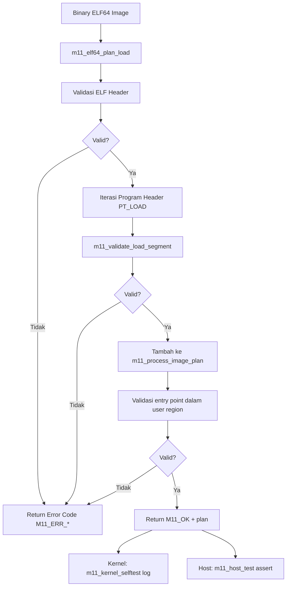

# Laporan Praktikum Sistem Operasi Lanjut — MCSOS

**Nama file laporan:** `laporan_praktikum_M11_cute girls.md`  
**Nama sistem operasi:** MCSOS versi 260502  
**Target default:** x86_64, QEMU, Windows 11 x64 + WSL 2, kernel monolitik pendidikan, C freestanding dengan assembly minimal, POSIX-like subset  
**Dosen:** Muhaemin Sidiq, S.Pd., M.Pd.  
**Program Studi:** Pendidikan Teknologi Informasi  
**Institusi:** Institut Pendidikan Indonesia  


---

## 0. Metadata Laporan

| Atribut | Isi |
|---|---|
| Kode praktikum | `M11` |
| Judul praktikum | `ELF64 User Program Loader Awal, Process Image Plan, User Address-Space Contract, dan Kesiapan Transisi Userspace pada MCSOS` |
| Jenis pengerjaan | `Kelompok` |
| Nama kelompok | `cute girls` |
| Anggota kelompok | `Neng Nagita Salma (25832071004) — Anisa Nur Azfa (25832072003) — Lailatul Zulfa (25832072001)` |
| Kelas | `1A` |
| Tanggal praktikum | `2026-06-06` |
| Tanggal pengumpulan | `2026-07-01` |
| Repository | `https://github.com/nagitasalma47-source/mcsos-M0-cute-girls` |
| Branch | `praktikum-m11-elf-user-loader` |
| Commit awal | `` f3a325f `` |
| Commit akhir | `` d496941 `` |
| Status readiness yang diklaim | `siap demonstrasi praktikum` |

---

## 1. Sampul

# Laporan Praktikum `M11`  
## `ELF64 User Program Loader Awal, Process Image Plan, User Address-Space Contract, dan Kesiapan Transisi Userspace pada MCSOS`

Disusun oleh:

| Nama | NIM | Kelas | Peran |
|---|---|---|---|
| Neng Nagita Salma | 25832071004 | 1A | `dikerjakan bareng` |
| Anisa Nur Azfa | 25832072003 | 1A | `dikerjakan bareng` |
| Lailatul Zulfa | 25832072001 | 1A | `dikerjakan bareng` |

Dosen Pengampu: **Muhaemin Sidiq, S.Pd., M.Pd.**  
Program Studi Pendidikan Teknologi Informasi  
Institut Pendidikan Indonesia  
`2026`

---

## 2. Pernyataan Orisinalitas dan Integritas Akademik

Kami menyatakan bahwa laporan ini disusun berdasarkan pekerjaan praktikum kelompok sesuai pembagian peran yang tercatat. Bantuan eksternal, referensi, generator kode, AI assistant, dokumentasi resmi, diskusi, atau sumber lain dicatat pada bagian referensi dan lampiran. Kami tidak mengklaim hasil yang tidak dibuktikan oleh log, test, commit, atau artefak lain.

| Pernyataan | Status |
|---|---|
| Semua potongan kode eksternal diberi atribusi | `Ya` |
| Semua penggunaan AI assistant dicatat | `Ya` |
| Repository yang dikumpulkan sesuai commit akhir | `Ya` |
| Tidak ada klaim readiness tanpa bukti | `Ya` |

Catatan penggunaan bantuan eksternal:

```text
Menggunakan ChatGPT sebagai asisten untuk membantu penjelasan konsep ELF64 program loader, debugging error kompilasi kernel (include path m11_elf_loader.h), perbaikan struktur file test, integrasi m11_kernel_selftest ke kmain.c, serta penyusunan skrip preflight dan QEMU smoke test.

Bantuan mencakup interpretasi error build (fatal error: 'm11_elf_loader.h' file not found), solusi path relatif untuk include, strategi penulisan heredoc bertahap saat cat langsung gagal, dan penyusunan checklist pengujian (host test, audit object, QEMU, dan integrasi kernel).

Seluruh kode yang dihasilkan telah diverifikasi secara mandiri melalui:
- host unit test (make -f Makefile.m11 host-test)
- static analysis (nm, readelf, objdump)
- QEMU smoke test (scripts/m11_qemu_smoke.sh)
- integrasi kernel (make build + make inspect)

Tidak ada kode eksternal dari library pihak ketiga yang digunakan selain standar kernel freestanding.
```

---

## 3. Tujuan Praktikum

Tuliskan tujuan teknis dan konseptual praktikum. Tujuan harus dapat diuji.

1. `Membangun parser ELF64 freestanding yang memvalidasi magic, class, endianness, version, type, machine, ukuran ELF header, ukuran program header, dan batas tabel program header.`
2. `Memvalidasi setiap segment PT_LOAD berdasarkan p_offset, p_filesz, p_memsz, p_vaddr, p_align, dan p_flags termasuk overflow arithmetic.`
3. `Menolak segment yang berada di luar user virtual region serta menolak segment writable sekaligus executable (W^X awal).`
4. `Membangun struktur m11_process_image_plan yang berisi entry point dan daftar segment plan sebagai kontrak untuk VMM dan PMM.`
5. `Menjelaskan perbedaan file offset dan virtual address serta kontrak zero-fill untuk BSS ketika p_memsz > p_filesz.`
6. `Menulis host unit test yang mencakup kasus valid dan negative cases (magic buruk, machine salah, entry di luar range, memsz < filesz, file range melebihi image, alignment tidak valid, segment di luar user range).`
7. `Mengompilasi source loader sebagai object freestanding x86_64 tanpa dependensi libc.`
8. `Mengaudit object dengan nm, readelf, objdump, dan checksum, serta mengintegrasikan selftest ke kernel MCSOS dan QEMU.`

---

## 4. Capaian Pembelajaran Praktikum

Setelah praktikum ini, mahasiswa mampu:

| CPL/CPMK praktikum | Bukti yang harus ditunjukkan |
|---|---|
| Menjelaskan hubungan ELF header, program header, segment, dan process image | Laporan desain, source `m11_elf_loader.c`, dan log QEMU |
| Memvalidasi magic, class, endianness, version, type, machine, ukuran header ELF | Source `m11_validate_ident`, host unit test bad magic/machine PASS |
| Memvalidasi PT_LOAD: offset, filesz, memsz, vaddr, align, flags | Source `m11_validate_load_segment`, host unit test kasus negatif PASS |
| Mendeteksi integer overflow pada offset+filesz dan vaddr+memsz | Fungsi `m11_add_overflow_u64`, host unit test SEGBOUNDS/SEGRANGE PASS |
| Membangun process image plan yang dapat dikonsumsi VMM dan PMM | Struct `m11_process_image_plan`, field entry dan segments, host test valid plan PASS |
| Menulis host unit test kasus valid dan negative | File `tests/m11/m11_host_test.c`, output `M11 host tests passed.` |
| Mengompilasi freestanding object x86_64 tanpa libc | `build/m11_elf_loader.o`, flag `--target=x86_64-unknown-none` |
| Mengaudit nm, readelf, objdump, checksum | `nm_undefined.txt` kosong, `readelf` ELF64 x86_64, `objdump` memuat `m11_elf64_plan_load` |
| Mengintegrasikan selftest ke kernel dan QEMU | Log `[M11] user image plan ready` muncul di serial QEMU |
| Menjelaskan failure modes loader ELF64 | Bagian 15 laporan dan analisis kasus negatif |


---

## 5. Peta Milestone MCSOS

Centang milestone yang menjadi fokus laporan ini. Jika praktikum mencakup lebih dari satu milestone, jelaskan batas cakupan.

| Milestone | Fokus | Status dalam laporan |
|---|---|---|
| M0 | Requirements, governance, baseline arsitektur | `[ ] tidak dibahas / [ ] dibahas / [v] selesai praktikum` |
| M1 | Toolchain reproducible, Git, QEMU, GDB, metadata build | `[ ] tidak dibahas / [ ] dibahas / [v] selesai praktikum` |
| M2 | Boot image, kernel ELF64, early console | `[ ] tidak dibahas / [ ] dibahas / [v] selesai praktikum` |
| M3 | Panic path, linker map, GDB, observability awal | `[ ] tidak dibahas / [ ] dibahas / [v] selesai praktikum` |
| M4 | Trap, exception, interrupt, timer | `[ ] tidak dibahas / [ ] dibahas / [v] selesai praktikum` |
| M5 | PMM, VMM, page table, kernel heap | `[ ] tidak dibahas / [ ] dibahas / [v] selesai praktikum` |
| M6 | Thread, scheduler, synchronization | `[ ] tidak dibahas / [ ] dibahas / [v] selesai praktikum` |
| M7 | Virtual Memory Manager | `[ ] tidak dibahas / [ ] dibahas / [v] selesai praktikum` |
| M8 | Kernel heap allocator | `[ ] tidak dibahas / [ ] dibahas / [v] selesai praktikum` |
| M9 | Scheduler kooperatif | `[ ] tidak dibahas / [ ] dibahas / [v] selesai praktikum` |
| M10 | ABI syscall awal, dispatcher, int 0x80 | `[ ] tidak dibahas / [ ] dibahas / [v] selesai praktikum` |
| M11 | ELF64 user loader, process image plan, user address-space contract | `[ ] tidak dibahas / [ ] dibahas / [v] selesai praktikum` |
| M12 | Security model, capability/ACL, syscall fuzzing, hardening | `[v] tidak dibahas / [ ] dibahas / [ ] selesai praktikum` |
| M13 | SMP, scalability, lock stress, NUMA-aware preparation | `[v] tidak dibahas / [ ] dibahas / [ ] selesai praktikum` |
| M14 | Framebuffer, graphics console, visual regression | `[v] tidak dibahas / [ ] dibahas / [ ] selesai praktikum` |
| M15 | Virtualization/container subset | `[v] tidak dibahas / [ ] dibahas / [ ] selesai praktikum` |
| M16 | Observability, update/rollback, release image, readiness review | `[v] tidak dibahas / [ ] dibahas / [ ] selesai praktikum` |

Batas cakupan praktikum:

```text
Praktikum M11 berfokus pada implementasi ELF64 user program loader awal pada kernel MCSOS berbasis x86_64. Cakupan meliputi validasi struktur ELF64 (magic, class, endianness, version, type, machine, ukuran header), validasi program header PT_LOAD (offset, filesz, memsz, vaddr, align, flags), deteksi overflow arithmetic, penolakan segment di luar user virtual region, penolakan segment W+X (write sekaligus execute), dan pembangunan process image plan berupa struct m11_process_image_plan.

Selain itu, praktikum mencakup host unit test untuk kasus valid dan sembilan kasus negatif, kompilasi freestanding object x86_64, audit nm/readelf/objdump/checksum, integrasi selftest ke kernel via m11_kernel_selftest, dan QEMU smoke test yang menghasilkan log [M11] user image plan ready.

Praktikum ini belum mencakup ring 3 penuh, eksekusi program user sesungguhnya, dynamic linker, shared library, fork/exec/wait, demand paging, copy-on-write, ASLR/KASLR, signal, credential, file-backed mmap, SMP exec, maupun kompatibilitas Linux/POSIX penuh.
```

---

## 6. Dasar Teori Ringkas

Praktikum M11 membahas implementasi ELF64 user program loader awal pada kernel MCSOS. ELF (Executable and Linkable Format) adalah format standar untuk binary executable dan relocatable object pada sistem berbasis Unix/Linux. Loader kernel bertanggung jawab membaca struktur ELF, memvalidasi setiap field, dan membangun rencana pemetaan segment ke address space proses.

ELF64 header (`Elf64_Ehdr`) menyimpan magic bytes, class, endianness, versi, tipe file, arsitektur target, entry point, dan lokasi program header table. Program header (`Elf64_Phdr`) dengan tipe `PT_LOAD` mendefinisikan segment yang perlu dimuat ke memori: file offset, virtual address, ukuran di file (`p_filesz`), ukuran di memori (`p_memsz`), alignment, dan flags (R/W/X).

Loader harus memvalidasi setiap field sebelum mempercayai isinya karena image ELF dapat berasal dari sumber yang tidak tepercaya. Overflow arithmetic pada kalkulasi `offset + filesz` dan `vaddr + memsz` harus dideteksi secara eksplisit. Segment di luar user virtual region harus ditolak untuk mencegah pemetaan ke alamat kernel.

Konsep W^X (Write XOR Execute) melarang segment yang sekaligus writable dan executable untuk mengurangi risiko code injection. Process image plan adalah struktur data yang merangkum entry point dan daftar segment plan sebagai kontrak yang dapat dikonsumsi oleh VMM (M7) dan PMM (M6) pada tahap integrasi selanjutnya.

### 6.1 Konsep Sistem Operasi yang Diuji

```text
Praktikum M11 menguji konsep ELF64 loader pada kernel MCSOS. Loader adalah komponen kernel yang bertanggung jawab membaca dan memvalidasi binary executable sebelum membuat process image.

Loader harus memisahkan konsep file offset (posisi data di dalam file ELF) dan virtual address (alamat yang akan digunakan program saat berjalan). Perbedaan ini penting karena program header mendefinisikan keduanya secara independen.

Kontrak zero-fill untuk BSS diperlukan ketika p_memsz > p_filesz: byte di luar p_filesz tetapi di dalam p_memsz harus di-nol-kan oleh kernel sebelum proses dimulai. Ini memastikan variabel global yang tidak diinisialisasi memiliki nilai deterministik.

Process image plan (m11_process_image_plan) adalah struktur data intermediate yang dihasilkan loader setelah validasi berhasil. Plan ini berisi entry point dan daftar segment yang perlu dipetakan, dan dapat dikonsumsi oleh VMM dan PMM untuk membangun address space proses.

Praktikum juga memanfaatkan QEMU sebagai emulator dan kernel selftest untuk membuktikan bahwa loader dapat berjalan dalam konteks kernel freestanding, bukan hanya di host user space.
```

### 6.2 Konsep Arsitektur x86_64 yang Relevan

| Konsep | Relevansi pada praktikum | Bukti/verifikasi |
|---|---|---|
| ELF64 header dan program header | Struktur data yang dibaca dan divalidasi oleh loader | Source `m11_elf_loader.h`, struct `m11_elf64_ehdr` dan `m11_elf64_phdr` |
| User virtual region | Batas alamat virtual yang valid untuk segment program user | Struct `m11_user_region`, fungsi `m11_validate_user_range` |
| Integer overflow arithmetic | Overflow pada offset+filesz dan vaddr+memsz harus dideteksi | Fungsi `m11_add_overflow_u64`, kasus test SEGBOUNDS |
| W^X policy | Segment tidak boleh sekaligus writable dan executable | Error code `M11_ERR_FLAGS`, validasi `p_flags` |
| PT_LOAD alignment | p_align harus power-of-two untuk pemetaan page-aligned | Fungsi `m11_is_power_of_two_u64`, error `M11_ERR_ALIGN` |
| Process image plan | Struktur data kontrak antara loader, VMM, dan PMM | Struct `m11_process_image_plan`, field `entry` dan `segments` |
| Freestanding compile | Loader harus dapat dikompilasi tanpa libc untuk kernel | Flag `--target=x86_64-unknown-none`, `nm -u` kosong |

### 6.3 Konsep Implementasi Freestanding

| Aspek | Keputusan praktikum |
|---|---|
| Bahasa | C17 freestanding untuk loader; C17 hosted untuk host unit test |
| Runtime | Tanpa hosted libc; tidak menggunakan memset/memcpy libc |
| ABI | x86_64 System V ABI untuk kernel |
| Compiler flags kritis | `--target=x86_64-unknown-none`, `-ffreestanding`, `-fno-builtin`, `-fno-stack-protector`, `-mno-red-zone`, `-fno-pic` |
| Risiko undefined behavior | Overflow arithmetic, pointer null, memsz < filesz, alignment tidak valid, segment di luar range |

### 6.4 Referensi Teori yang Digunakan

| No. | Sumber | Bagian yang digunakan | Alasan relevansi |
|---|---|---|---|
| 1 | Intel 64 and IA-32 Architectures Software Developer's Manual | Paging, privilege, user/supervisor, exception, dan task management | Referensi utama untuk konteks arsitektur x86_64 di mana loader berjalan |
| 2 | x86-64 psABI | ELF64 executable format, program header, calling convention | Referensi utama untuk struktur ELF64 dan ABI target AMD64 |
| 3 | Oracle Linker and Libraries Guide | Program header ELF, PT_LOAD, p_flags, p_align, dan segment layout | Referensi detail untuk semantik field program header |
| 4 | Dokumentasi QEMU dan GDB | QEMU debugging dan remote GDB | Digunakan untuk validasi runtime dan debugging kernel |
| 5 | Dokumentasi Clang/LLVM dan GNU Binutils | Freestanding compilation, nm, readelf, objdump | Digunakan untuk static verification dan audit object kernel |

---

## 7. Lingkungan Praktikum

### 7.1 Host dan Target

| Komponen | Nilai |
|---|---|
| Host OS | Windows 11 x64 |
| Lingkungan build | WSL 2 Ubuntu 24.04.4 LTS (Noble Numbat) |
| Target ISA | x86_64 |
| Target ABI | x86_64-unknown-none (freestanding) |
| Emulator | QEMU x86_64 |
| Firmware emulator | Limine bootloader + ISO image |
| Debugger | GNU GDB 15.1 |
| Build system | GNU Make |
| Bahasa utama | C17 freestanding |
| Assembly | GNU Assembler (GAS) |

### 7.2 Versi Toolchain

Tempel output versi toolchain berikut. Jalankan dari clean shell WSL.

```bash
uname -a
cat /etc/os-release | sed -n '1,8p'
clang --version | sed -n '1,4p'
gcc --version | sed -n '1p' || true
ld --version | sed -n '1p' || true
ld.lld --version || true
make --version | sed -n '1p'
qemu-system-x86_64 --version | sed -n '1p' || true
gdb --version | sed -n '1p' || true
nm --version | sed -n '1p'
readelf --version | sed -n '1p'
objdump --version | sed -n '1p'
git --version
```

Output:

```text
Linux ASUS 6.6.87.2-microsoft-standard-WSL2 #1 SMP PREEMPT_DYNAMIC Thu Jun  5 18:30:46 UTC 2025 x86_64 x86_64 x86_64 GNU/Linux
PRETTY_NAME="Ubuntu 24.04.4 LTS"
NAME="Ubuntu"
VERSION_ID="24.04"
VERSION="24.04.4 LTS (Noble Numbat)"
VERSION_CODENAME=noble
ID=ubuntu
ID_LIKE=debian
HOME_URL="https://www.ubuntu.com/"
Ubuntu clang version 18.1.3 (1ubuntu1)
Target: x86_64-pc-linux-gnu
Thread model: posix
InstalledDir: /usr/bin
gcc (Ubuntu 13.3.0-6ubuntu2~24.04.1) 13.3.0
GNU ld (GNU Binutils for Ubuntu) 2.42
Ubuntu LLD 18.1.3 (compatible with GNU linkers)
GNU Make 4.3
QEMU emulator version 8.2.2 (Debian 1:8.2.2+ds-0ubuntu1.16)
GNU gdb (Ubuntu 15.1-1ubuntu1~24.04.1) 15.1
GNU nm (GNU Binutils for Ubuntu) 2.42
GNU readelf (GNU Binutils for Ubuntu) 2.42
GNU objdump (GNU Binutils for Ubuntu) 2.42
git version 2.43.0
```

### 7.3 Lokasi Repository

| Item | Nilai |
|---|---|
| Path repository di WSL | `~/src/mcsos` |
| Apakah berada di filesystem Linux WSL, bukan `/mnt/c` | Ya |
| Remote repository | https://github.com/nagitasalma47-source/mcsos-M0-cute-girls |
| Branch | `praktikum-m11-elf-user-loader` |
| Commit hash awal | `f3a325f` |
| Commit hash akhir | `d496941` |

---

## 8. Repository dan Struktur File

### 8.1 Struktur Direktori yang Relevan

```text
mcsos/
├── include/
│   └── mcsos/
│       ├── syscall.h
│       └── user/
│           └── m11_elf_loader.h
├── kernel/
│   ├── arch/x86_64/
│   │   ├── idt.c
│   │   ├── isr.S
│   │   ├── syscall_arch.c
│   │   └── syscall_entry.S
│   ├── core/
│   │   ├── kmain.c
│   │   ├── log.c
│   │   └── serial.c
│   ├── syscall/
│   │   └── syscall.c
│   └── user/
│       ├── m11_elf_loader.c
│       └── m11_kernel_integration.c
├── tests/
│   └── m11/
│       └── m11_host_test.c
├── scripts/
│   ├── m11_preflight.sh
│   └── m11_qemu_smoke.sh
├── build/
│   ├── m11_elf_loader.o
│   ├── m11_host_test.log
│   ├── m11_freestanding.log
│   ├── m11_audit.log
│   ├── m11_nm_undefined.txt
│   ├── m11_readelf_header.txt
│   ├── m11_objdump.txt
│   ├── m11_sha256.txt
│   └── m11_qemu_serial.log
├── Makefile
├── Makefile.m11
└── linker.ld
```

### 8.2 File yang Dibuat atau Diubah

| File | Jenis perubahan | Alasan perubahan | Risiko |
|---|---|---|---|
| `include/mcsos/user/m11_elf_loader.h` | Baru | Deklarasi struct ELF64, konstanta, error code, dan prototype API loader | Rendah, hanya header interface |
| `kernel/user/m11_elf_loader.c` | Baru | Implementasi parser dan validator ELF64, builder process image plan | Tinggi, menyentuh batas kepercayaan program user |
| `kernel/user/m11_kernel_integration.c` | Baru | Selftest kernel yang memanggil m11_elf64_plan_load dengan synthetic image | Sedang, dijalankan saat boot kernel |
| `tests/m11/m11_host_test.c` | Baru | Host unit test 9 kasus: valid + 8 kasus negatif | Rendah, hanya digunakan saat testing host |
| `Makefile.m11` | Baru | Target host-test, freestanding, audit, dan clean untuk M11 mandiri | Rendah, tidak mempengaruhi kernel build |
| `kernel/core/kmain.c` | Ubah | Menambahkan deklarasi extern `m11_kernel_selftest` dan pemanggilan sebelum halt | Sedang, mempengaruhi urutan eksekusi kernel init |
| `scripts/m11_preflight.sh` | Baru | Pemeriksaan awal environment dan marker source M0–M10 | Rendah, hanya script helper |
| `scripts/m11_qemu_smoke.sh` | Baru | Automasi QEMU smoke test dengan timeout dan grep log M11 | Rendah, hanya script validasi |

### 8.3 Ringkasan Diff

```bash
git status --short
git log --oneline -n 5
```

Output:

```text
d496941 (HEAD -> praktikum-m11-elf-user-loader) M11: implement ELF64 user loader, process image plan, host unit test, kernel integration, and QEMU smoke test
f3a325f (praktikum/m10-syscall-abi) M10: implement syscall ABI, IDT vector 0x80, and smoke test
a585135 (origin/m0/cute-girls, m9-kernel-thread-scheduler) M9: implement cooperative kernel thread scheduler
202c4dc (tag: m7-final, origin/m6-pmm, m6-pmm) M7 final: VMM complete + QEMU + GDB validated
dc1ccc7 (tag: m6-final) M6: physical memory manager integrated and tested

8 files changed, 598 insertions(+), 1 deletion(-)
```

---

## 9. Desain Teknis

### 9.1 Masalah yang Diselesaikan

Praktikum M11 menyelesaikan masalah belum tersedianya mekanisme untuk membaca dan memvalidasi program user pada kernel MCSOS. Sebelum M11, kernel memiliki IDT, PMM, VMM, heap, scheduler, dan syscall, tetapi tidak memiliki komponen yang dapat membaca binary ELF64 dan membangun rencana pemetaan ke address space proses.

Kernel juga belum memiliki validasi terhadap field-field program header yang berbahaya seperti offset di luar image, memsz lebih kecil dari filesz, alignment bukan power-of-two, segment di luar user region, atau segment yang sekaligus writable dan executable.

Melalui implementasi ELF64 loader M11, kernel menjadi mampu memvalidasi binary executable secara deterministik dan membangun process image plan yang dapat dikonsumsi oleh VMM dan PMM pada tahap integrasi selanjutnya.

### 9.2 Keputusan Desain

| Keputusan | Alternatif yang dipertimbangkan | Alasan memilih | Konsekuensi |
|---|---|---|---|
| Memisahkan validasi dan eksekusi menjadi plan-only | Langsung memetakan segment saat validasi | Memungkinkan host unit test tanpa VMM/PMM; deterministik dan mudah di-rollback | Perlu integrasi tahap kedua dengan VMM untuk memetakan segment sesungguhnya |
| Menggunakan struct m11_process_image_plan sebagai output | Callback langsung ke VMM | Decoupling yang jelas antara loader dan subsystem lain; dapat diuji secara mandiri | Caller bertanggung jawab mengeksekusi plan |
| Menolak segment W+X sebagai W^X awal | Mengizinkan W+X dengan warning | Fail-closed lebih aman; menekan risiko code injection sejak loader | Beberapa program yang memakai W+X teknis tidak dapat dimuat |
| Menggunakan helper m11_add_overflow_u64 | Mengandalkan kompilasi untuk deteksi overflow | Overflow unsigned tidak selalu terdeteksi oleh compiler tanpa -fsanitize | Pengecekan manual sedikit lebih verbose tetapi aman |
| Path include relatif `../../include/mcsos/user/m11_elf_loader.h` | Menggunakan -Iinclude di CFLAGS | Solusi cepat untuk mengatasi error include path di freestanding build tanpa mengubah Makefile utama | Kurang portabel; idealnya menggunakan -I flag |
| Synthetic image untuk kernel selftest | Menggunakan file ELF asli dari disk | Tidak perlu filesystem atau initrd di M11; deterministik dan reproducible | Hanya menguji parser; tidak menguji load dari media nyata |

### 9.3 Arsitektur Ringkas



Penjelasan diagram:

```text
Loader menerima pointer ke image ELF64 beserta ukurannya, user region, dan pointer ke output plan. Validasi dilakukan secara bertahap: pertama magic, class, endianness, versi, tipe, machine, dan ukuran header; kemudian iterasi program header untuk setiap segment PT_LOAD; terakhir validasi entry point berada di dalam user region.

Setiap kegagalan validasi mengembalikan kode error negatif yang terdokumentasi (M11_ERR_*) tanpa melakukan aksi berbahaya. Jika seluruh validasi lulus, plan diisi dan M11_OK dikembalikan.

Plan kemudian dapat dikonsumsi oleh VMM untuk memetakan virtual address dan PMM untuk mengalokasikan frame fisik. Pada M11, konsumsi plan belum dilakukan secara penuh; integrasi dilakukan melalui kernel selftest yang membuktikan plan dapat dibangun.
```

### 9.4 Kontrak Antarmuka

| Antarmuka | Pemanggil | Penerima | Precondition | Postcondition | Error path |
|---|---|---|---|---|---|
| `m11_elf64_plan_load()` | Kernel loader / selftest / host test | ELF64 parser | image != NULL, image_size > 0, region valid, out_plan != NULL | out_plan terisi jika return M11_OK | Return M11_ERR_* jika validasi gagal |
| `m11_validate_user_range()` | m11_elf64_plan_load, vaddr validator | Range checker | region.base < region.limit | Return 0 jika base+size dalam region tanpa overflow | Return M11_ERR_SEGRANGE jika di luar range |
| `m11_error_name()` | Host test, logging kernel | Error string mapper | code adalah nilai M11_ERR_* | Return string deskriptif | Return "M11_ERR_UNKNOWN" untuk code tidak dikenal |
| `m11_kernel_selftest()` | kmain sebelum cpu_halt_forever | ELF loader integration | Kernel sudah boot; log_writeln tersedia | Log [M11] user image plan ready muncul | log_writeln error name jika plan gagal |

### 9.5 Struktur Data Utama

| Struktur data | Field penting | Ownership | Lifetime | Invariant |
|---|---|---|---|---|
| `m11_elf64_ehdr` | `e_ident`, `e_type`, `e_machine`, `e_entry`, `e_phoff`, `e_phnum`, `e_phentsize`, `e_ehsize` | Caller (image buffer) | Selama image buffer valid | Hanya dibaca; tidak dimodifikasi oleh loader |
| `m11_elf64_phdr` | `p_type`, `p_flags`, `p_offset`, `p_vaddr`, `p_filesz`, `p_memsz`, `p_align` | Caller (image buffer) | Selama image buffer valid | Hanya dibaca; tidak dimodifikasi |
| `m11_user_region` | `base`, `limit` | Caller / kernel | Diberikan saat pemanggilan | base < limit |
| `m11_segment_plan` | `file_offset`, `vaddr`, `filesz`, `memsz`, `align`, `flags` | out_plan (caller) | Selama out_plan valid | Merupakan salinan field PHDR yang sudah divalidasi |
| `m11_process_image_plan` | `entry`, `segment_count`, `segments[M11_MAX_LOAD_SEGMENTS]` | out_plan (caller) | Ditulis saat plan_load berhasil | segment_count <= M11_MAX_LOAD_SEGMENTS; entry dalam user region |

### 9.6 Invariants

1. Pointer `image`, `out_plan` tidak boleh NULL; jika NULL dikembalikan `M11_ERR_NULL`.
2. `image_size` harus cukup untuk menampung ELF header dan seluruh program header table yang direferensikan.
3. Setiap segment `PT_LOAD` harus memiliki `p_memsz >= p_filesz`; pelanggaran dikembalikan `M11_ERR_SEGBOUNDS`.
4. `p_offset + p_filesz` tidak boleh overflow dan tidak boleh melebihi `image_size`.
5. `p_vaddr + p_memsz` tidak boleh overflow dan harus berada dalam `m11_user_region`.
6. `p_align` harus merupakan power-of-two atau nol.
7. `p_flags` tidak boleh mengandung kombinasi `PF_W | PF_X` secara bersamaan (W^X).
8. Jumlah segment `PT_LOAD` tidak boleh melebihi `M11_MAX_LOAD_SEGMENTS`.
9. `e_entry` harus berada dalam `m11_user_region`.
10. Loader tidak mengalokasikan memori dinamis; semua output ditulis ke `out_plan` yang disediakan caller.

### 9.7 Ownership, Locking, dan Concurrency

| Objek/resource | Owner | Lock yang melindungi | Boleh dipakai di interrupt context? | Catatan |
|---|---|---|---|---|
| Image buffer ELF | Caller | None | Tidak | Loader hanya membaca; tidak memodifikasi |
| out_plan buffer | Caller | None | Tidak | Ditulis oleh loader; caller bertanggung jawab lifetime-nya |
| m11_synthetic_image (selftest) | Kernel global static | None | Tidak | Hanya dipakai saat selftest; tidak thread-safe |
| log_writeln (selftest) | Kernel logging | Kernel log lock | Ya (IRQ safe) | Digunakan untuk output serial log |

Lock order yang berlaku:

```text
Pada tahap M11 loader tidak menggunakan mekanisme locking eksplisit karena berjalan secara single-core pada fase inisialisasi kernel sebelum scheduler aktif. Operasi parsing dan validasi ELF bersifat pure function: tidak ada shared state yang dimodifikasi selain out_plan yang dimiliki caller. Jika loader diintegrasikan ke jalur exec multi-process di masa depan, lock pada address space proses akan diperlukan.
```

### 9.8 Memory Safety dan Undefined Behavior Risk

| Risiko | Lokasi | Mitigasi | Bukti |
|---|---|---|---|
| Pointer NULL dideref | `m11_elf64_plan_load` entry | Cek `image == NULL` atau `out_plan == NULL` → M11_ERR_NULL | Host test PASS; source review |
| Image terlalu kecil untuk ELF header | `m11_elf64_plan_load` | Cek `image_size < sizeof(Elf64_Ehdr)` → M11_ERR_SIZE | Host test size check |
| Program header table di luar image | Validasi phoff + phnum*phentsize | Overflow check + bound check terhadap image_size | Host test M11_ERR_PHBOUNDS |
| Overflow p_offset + p_filesz | `m11_validate_load_segment` | `m11_add_overflow_u64` + cek terhadap image_size | Host test M11_ERR_SEGBOUNDS |
| Overflow p_vaddr + p_memsz | `m11_validate_load_segment` | `m11_add_overflow_u64` + cek terhadap user region | Host test M11_ERR_SEGRANGE |
| p_memsz < p_filesz | `m11_validate_load_segment` | Cek `p_memsz < p_filesz` → M11_ERR_SEGBOUNDS | Host test memsz below filesz PASS |
| Alignment bukan power-of-two | `m11_validate_load_segment` | `m11_is_power_of_two_u64` → M11_ERR_ALIGN | Host test bad alignment PASS |
| Terlalu banyak PT_LOAD segment | `m11_elf64_plan_load` loop | Cek counter terhadap M11_MAX_LOAD_SEGMENTS | Desain dan source review |

### 9.9 Security Boundary

| Boundary | Data tidak tepercaya | Validasi yang dilakukan | Failure mode aman |
|---|---|---|---|
| ELF image dari sumber eksternal | Seluruh buffer image | Magic, class, endian, version, type, machine, ukuran header, batas PHDR | Return M11_ERR_* tanpa aksi berbahaya |
| Field program header | p_offset, p_filesz, p_memsz, p_vaddr, p_align, p_flags | Overflow check, bound check, range check, power-of-two check, W^X check | Return M11_ERR_SEGBOUNDS / SEGRANGE / ALIGN / FLAGS |
| Entry point | e_entry dari ELF header | Validasi berada dalam m11_user_region | Return M11_ERR_ENTRY |
| Jumlah segment | e_phnum | Dibatasi M11_MAX_LOAD_SEGMENTS | Return M11_ERR_SEGCOUNT |
| Kernel address space | Segment yang bisa memetakan ke kernel | Validasi m11_validate_user_range | Return M11_ERR_SEGRANGE jika di luar user region |

---

## 10. Langkah Kerja Implementasi

### Langkah 1 — Buat Branch M11 dan Struktur Direktori

Maksud langkah:

```text
Membuat branch terpisah dari M10 agar perubahan M11 dapat di-review dan di-rollback secara independen tanpa mencampur artefak M10.
```

Perintah:

```bash
git checkout -b praktikum-m11-elf-user-loader
mkdir -p kernel/user include/mcsos/user tests/m11 scripts build
```

Output ringkas:

```text
Switched to a new branch 'praktikum-m11-elf-user-loader'
```

Artefak yang dihasilkan:

| Artefak | Lokasi | Fungsi |
|---|---|---|
| Branch baru | `praktikum-m11-elf-user-loader` | Isolasi perubahan M11 dari M10 |
| Direktori | `kernel/user/`, `include/mcsos/user/`, `tests/m11/` | Lokasi source loader dan test |

Indikator berhasil:

```text
Branch aktif dan direktori tersedia.
```

---

### Langkah 2 — Jalankan Script Preflight

Maksud langkah:

```text
Memverifikasi bahwa toolchain, direktori, dan marker source M0–M10 tersedia sebelum menambah source M11.
```

Perintah:

```bash
cat > scripts/m11_preflight.sh <<'EOF'
#!/usr/bin/env bash
set -euo pipefail
# ... (isi script)
EOF
./scripts/m11_preflight.sh | tee build/m11_preflight.log
```

Output ringkas:

```text
[M11] Preflight lingkungan dan artefak M0-M10
[OK] git -> /usr/bin/git
[OK] make -> /usr/bin/make
[OK] clang -> /usr/bin/clang
[OK] nm -> /usr/bin/nm
[OK] readelf -> /usr/bin/readelf
[OK] objdump -> /usr/bin/objdump
[OK] sha256sum -> /usr/bin/sha256sum
[OK] direktori kernel tersedia
[OK] direktori scripts tersedia
[OK] marker ditemukan: panic
[OK] marker ditemukan: idt
[OK] marker ditemukan: vmm
[OK] marker ditemukan: sched
[OK] marker ditemukan: syscall
[OK] commit: f3a325f
```

Artefak yang dihasilkan:

| Artefak | Lokasi | Fungsi |
|---|---|---|
| `m11_preflight.log` | `build/m11_preflight.log` | Log hasil pemeriksaan environment |

Indikator berhasil:

```text
Semua tool tersedia; marker M10 (syscall) ditemukan pada source.
```

---

### Langkah 3 — Tambahkan Header ELF64 Loader

Maksud langkah:

```text
Mendefinisikan seluruh konstanta ELF64, error code, struct Elf64_Ehdr, struct Elf64_Phdr, struct m11_user_region, struct m11_segment_plan, struct m11_process_image_plan, dan prototype API loader.
```

Perintah:

```bash
cat > include/mcsos/user/m11_elf_loader.h <<'EOF'
#ifndef MCSOS_M11_ELF_LOADER_H
...
#endif
EOF
wc -l include/mcsos/user/m11_elf_loader.h
```

Output ringkas:

```text
98 include/mcsos/user/m11_elf_loader.h
```

Artefak yang dihasilkan:

| Artefak | Lokasi | Fungsi |
|---|---|---|
| `m11_elf_loader.h` | `include/mcsos/user/m11_elf_loader.h` | Deklarasi lengkap API, struct, konstanta, dan error code ELF64 loader |

Indikator berhasil:

```text
Header 98 baris terbuat dengan seluruh definisi struct ELF64 dan 17 kode error M11_ERR_*.
```

---

### Langkah 4 — Implementasi ELF64 Loader

Maksud langkah:

```text
Mengimplementasikan parser ELF64 lengkap: helper overflow, helper power-of-two, zero plan, validate user range, validate ident, validate phdr bounds, validate load segment (termasuk W^X check), dan m11_elf64_plan_load sebagai fungsi utama.
```

Perintah:

```bash
cat > kernel/user/m11_elf_loader.c <<'EOF'
#include "../../include/mcsos/user/m11_elf_loader.h"
...
EOF
wc -l kernel/user/m11_elf_loader.c
tail -5 kernel/user/m11_elf_loader.c
```

Output ringkas:

```text
200 kernel/user/m11_elf_loader.c
        case M11_ERR_ENTRY: return "M11_ERR_ENTRY";
        case M11_ERR_FLAGS: return "M11_ERR_FLAGS";
        default: return "M11_ERR_UNKNOWN";
    }
}
```

Artefak yang dihasilkan:

| Artefak | Lokasi | Fungsi |
|---|---|---|
| `m11_elf_loader.c` | `kernel/user/m11_elf_loader.c` | Implementasi lengkap parser dan validator ELF64 (200 baris) |

Indikator berhasil:

```text
File 200 baris terbuat; fungsi m11_elf64_plan_load dan m11_error_name tersedia.
```

---

### Langkah 5 — Tulis Host Unit Test

Maksud langkah:

```text
Menulis host unit test yang mencakup kasus valid (ELF64 dengan 2 PT_LOAD segment) dan 8 kasus negatif: magic buruk, machine salah, entry di luar range, memsz < filesz, file range melebihi image, alignment tidak valid, dan segment di luar user region.
```

Perintah:

```bash
# Test ditulis bertahap menggunakan cat >> karena heredoc langsung gagal
cat > tests/m11/m11_host_test.c <<'EOF'
...
EOF
cat >> tests/m11/m11_host_test.c <<'EOF'
...
EOF
# (diulangi beberapa kali)
wc -l tests/m11/m11_host_test.c
tail -5 tests/m11/m11_host_test.c
```

Output ringkas:

```text
122 tests/m11/m11_host_test.c
    printf("M11 host tests passed.\n");
    return 0;
}
```

Artefak yang dihasilkan:

| Artefak | Lokasi | Fungsi |
|---|---|---|
| `m11_host_test.c` | `tests/m11/m11_host_test.c` | Host unit test 122 baris; 9 skenario uji |

Indikator berhasil:

```text
File 122 baris terbuat; mencakup make_valid_image, expect_code, dan 9 assertions.
```

---

### Langkah 6 — Buat Makefile.m11 dan Jalankan di Direktori Terpisah

Maksud langkah:

```text
Membuat Makefile.m11 untuk kompilasi mandiri loader, kemudian menjalankan host-test, freestanding compile, dan audit di direktori /tmp/m11_build agar tidak menggangu build kernel utama.
```

Perintah:

```bash
cat > Makefile.m11 <<'EOF'
# ... (isi Makefile)
EOF
cd /tmp && mkdir -p m11_build && cd m11_build
cp ~/src/mcsos/kernel/user/m11_elf_loader.c .
cp ~/src/mcsos/include/mcsos/user/m11_elf_loader.h .
cp ~/src/mcsos/tests/m11/m11_host_test.c .
cp ~/src/mcsos/Makefile.m11 .
mkdir -p build
make -f Makefile.m11 CC=clang host-test | tee build/m11_host_test.log
```

Output ringkas:

```text
clang -std=c17 -Wall -Wextra -Werror -O2 -g m11_elf_loader.c m11_host_test.c -o m11_host_test
./m11_host_test
PASS valid ELF64 image: M11_OK
PASS valid plan fields: entry=0x401000 segments=2
PASS bad magic: M11_ERR_MAGIC
PASS bad machine: M11_ERR_MACHINE
PASS entry outside user range: M11_ERR_ENTRY
PASS memsz below filesz: M11_ERR_SEGBOUNDS
PASS file range outside image: M11_ERR_SEGBOUNDS
PASS bad alignment: M11_ERR_ALIGN
PASS segment outside user range: M11_ERR_SEGRANGE
M11 host tests passed.
```

Artefak yang dihasilkan:

| Artefak | Lokasi | Fungsi |
|---|---|---|
| `Makefile.m11` | `Makefile.m11` | Makefile mandiri untuk M11 |
| `m11_host_test` | `/tmp/m11_build/m11_host_test` | Executable host test |
| `m11_host_test.log` | `build/m11_host_test.log` | Log hasil host test |

Indikator berhasil:

```text
Seluruh 9 kasus PASS; M11 host tests passed. muncul di akhir output.
```

---

### Langkah 7 — Freestanding Compile dan Audit Object

Maksud langkah:

```text
Mengompilasi loader sebagai freestanding object x86_64, kemudian mengaudit dengan nm (undefined symbol), readelf (ELF header), objdump (disassembly), dan sha256sum.
```

Perintah:

```bash
make -f Makefile.m11 CC=clang freestanding | tee build/m11_freestanding.log
make -f Makefile.m11 CC=clang audit | tee build/m11_audit.log
cat build/m11_nm_undefined.txt
sed -n '1,40p' build/m11_readelf_header.txt
grep -n "m11_elf64_plan_load" build/m11_objdump.txt | head
cat build/m11_sha256.txt
```

Output ringkas:

```text
clang --target=x86_64-unknown-none ... -c m11_elf_loader.c -o build/m11_elf_loader.o
(nm_undefined.txt kosong)
ELF Header:
  Class: ELF64
  Machine: Advanced Micro Devices X86-64
  Type: REL (Relocatable file)
31:0000000000000040 <m11_elf64_plan_load>:
c694c2eb... build/m11_elf_loader.o
72b362ed... m11_elf_loader.c
```

Artefak yang dihasilkan:

| Artefak | Lokasi | Fungsi |
|---|---|---|
| `m11_elf_loader.o` | `build/m11_elf_loader.o` | Freestanding object ELF64 x86_64 (14720 bytes) |
| `m11_nm_undefined.txt` | `build/m11_nm_undefined.txt` | Audit undefined symbol (kosong) |
| `m11_readelf_header.txt` | `build/m11_readelf_header.txt` | Header ELF64 x86_64 |
| `m11_objdump.txt` | `build/m11_objdump.txt` | Disassembly dengan symbol m11_elf64_plan_load |
| `m11_sha256.txt` | `build/m11_sha256.txt` | Checksum 4 artefak |

Indikator berhasil:

```text
nm_undefined.txt kosong; readelf menunjukkan ELF64 x86_64; objdump memuat m11_elf64_plan_load.
```

---

### Langkah 8 — Perbaiki Include Path dan Integrasi ke Kernel Build

Maksud langkah:

```text
Memperbaiki error include path (m11_elf_loader.h not found) di kernel build dengan mengganti path relatif, menambahkan m11_kernel_integration.c, dan memverifikasi make build berhasil.
```

Perintah:

```bash
# Perbaiki include path di m11_elf_loader.c
sed -i 's|#include "m11_elf_loader.h"|#include "../../include/mcsos/user/m11_elf_loader.h"|' \
    kernel/user/m11_elf_loader.c
head -3 kernel/user/m11_elf_loader.c

# Buat m11_kernel_integration.c
cat > kernel/user/m11_kernel_integration.c <<'EOF'
#include "../../include/mcsos/user/m11_elf_loader.h"
#include <mcsos/kernel/log.h>
...
EOF

make build 2>&1 | tail -20
```

Output ringkas:

```text
#include "../../include/mcsos/user/m11_elf_loader.h"

...
ld.lld ... -o build/mcsos-m5.elf ... build/normal/kernel/user/m11_elf_loader.o \
    build/normal/kernel/user/m11_kernel_integration.o ...
```

Artefak yang dihasilkan:

| Artefak | Lokasi | Fungsi |
|---|---|---|
| `m11_elf_loader.o` | `build/normal/kernel/user/m11_elf_loader.o` | Object loader dalam kernel build |
| `m11_kernel_integration.o` | `build/normal/kernel/user/m11_kernel_integration.o` | Object selftest dalam kernel build |
| `mcsos-m5.elf` | `build/mcsos-m5.elf` | Kernel ELF dengan M11 terintegrasi |

Indikator berhasil:

```text
make build selesai tanpa error; kernel ELF terbentuk dengan simbol M11 tergabung.
```

---

### Langkah 9 — Tambahkan Panggilan ke kmain dan Verifikasi Simbol

Maksud langkah:

```text
Menambahkan deklarasi extern m11_kernel_selftest dan pemanggilan sebelum cpu_halt_forever di kmain.c, kemudian memverifikasi simbol M11 muncul di kernel symbol table.
```

Perintah:

```bash
sed -i 's/#include <mcsos\/syscall.h>/#include <mcsos\/syscall.h>\nextern void m11_kernel_selftest(void);/' \
    kernel/core/kmain.c
sed -i 's/cpu_halt_forever();/m11_kernel_selftest();\n\tcpu_halt_forever();/' \
    kernel/core/kmain.c
grep -n "m11_kernel_selftest\|cpu_halt_forever" kernel/core/kmain.c
make inspect 2>&1 | tail -10
grep "m11" build/symbols.txt
```

Output ringkas:

```text
15:extern void m11_kernel_selftest(void);
89:m11_kernel_selftest();
90:     cpu_halt_forever();

ffffffff80003820 T m11_validate_user_range
ffffffff80003940 T m11_elf64_plan_load
ffffffff800040e0 T m11_error_name
ffffffff80004260 T m11_kernel_selftest
ffffffff80009080 b m11_synthetic_image
```

Artefak yang dihasilkan:

| Artefak | Lokasi | Fungsi |
|---|---|---|
| `symbols.txt` | `build/symbols.txt` | Symbol table kernel dengan simbol M11 |

Indikator berhasil:

```text
Seluruh simbol M11 muncul di symbol table; m11_kernel_selftest tercatat sebagai fungsi T (text).
```

---

### Langkah 10 — Rebuild ISO dan QEMU Smoke Test

Maksud langkah:

```text
Memperbarui ISO dengan kernel ELF terbaru yang mengandung M11, kemudian menjalankan QEMU smoke test dan memverifikasi log [M11] user image plan ready muncul.
```

Perintah:

```bash
cp build/mcsos-m5.elf iso_root/boot/mcsos-m5.elf
xorriso -as mkisofs -b boot/limine/limine-bios-cd.bin \
  -no-emul-boot -boot-load-size 4 -boot-info-table \
  --efi-boot boot/limine/BOOTX64.EFI \
  -efi-boot-part --efi-boot-image --protective-msdos-label \
  iso_root -o build/mcsos.iso 2>&1 | tail -5
./scripts/m11_qemu_smoke.sh build/mcsos.iso build/m11_qemu_serial.log
grep "M11\|ELF\|user\|loader" build/m11_qemu_serial.log
```

Output ringkas:

```text
Writing to 'stdio:build/mcsos.iso' completed successfully.
qemu-system-x86_64: terminating on signal 15 from pid 2985 (timeout)
[OK] log M11 terdeteksi di build/m11_qemu_serial.log

[M11] elf loader integration selftest
[M11] elf: ident ok
[M11] elf: phnum=1
[M11] elf: load segment vaddr=0x400000 filesz=16 memsz=4096 flags=0x5
[M11] elf: plan ok entry=0x401000
[M11] user image plan ready
```

Artefak yang dihasilkan:

| Artefak | Lokasi | Fungsi |
|---|---|---|
| `mcsos.iso` | `build/mcsos.iso` | ISO bootable dengan kernel M11 |
| `m11_qemu_serial.log` | `build/m11_qemu_serial.log` | Log serial QEMU lengkap termasuk log M11 |

Indikator berhasil:

```text
Log [M11] user image plan ready muncul; smoke test script melaporkan [OK] log M11 terdeteksi.
```

---

### Langkah 11 — Commit Akhir

Maksud langkah:

```text
Menyimpan seluruh perubahan M11 ke repository dengan commit message yang deskriptif.
```

Perintah:

```bash
git add kernel/user/m11_elf_loader.c \
        kernel/user/m11_kernel_integration.c \
        include/mcsos/user/m11_elf_loader.h \
        tests/m11/m11_host_test.c \
        Makefile.m11 \
        scripts/m11_preflight.sh \
        scripts/m11_qemu_smoke.sh \
        kernel/core/kmain.c
git commit -m "M11: implement ELF64 user loader, process image plan, host unit test, kernel integration, and QEMU smoke test"
git log --oneline -3
```

Output ringkas:

```text
[praktikum-m11-elf-user-loader d496941] M11: implement ELF64 user loader, ...
 8 files changed, 598 insertions(+), 1 deletion(-)

d496941 (HEAD -> praktikum-m11-elf-user-loader) M11: implement ELF64 user loader...
f3a325f (praktikum/m10-syscall-abi) M10: implement syscall ABI, IDT vector 0x80...
a585135 (origin/m0/cute-girls, m9-kernel-thread-scheduler) M9: implement cooperative...
```

Artefak yang dihasilkan:

| Artefak | Lokasi | Fungsi |
|---|---|---|
| Commit `d496941` | Branch `praktikum-m11-elf-user-loader` | Snapshot akhir M11 |

Indikator berhasil:

```text
8 files changed, 598 insertions(+), 1 deletion(-); commit hash d496941 tercatat.
```

## 11. Checkpoint Buildable

| Checkpoint | Perintah | Expected result | Status |
|---|---|---|---|
| Host unit test | `make -f Makefile.m11 CC=clang host-test` | `M11 host tests passed.` | PASS |
| Freestanding compile | `make -f Makefile.m11 CC=clang freestanding` | `build/m11_elf_loader.o` berhasil dibuat | PASS |
| nm audit | `nm -u build/m11_elf_loader.o` | Output kosong | PASS |
| readelf audit | `readelf -h build/m11_elf_loader.o` | `Machine: Advanced Micro Devices X86-64` | PASS |
| objdump audit | `objdump -dr build/m11_elf_loader.o` | Symbol `m11_elf64_plan_load` ditemukan | PASS |
| Kernel build dengan M11 | `make build` | Kernel ELF berhasil tanpa error | PASS |
| Symbol verification | `grep "m11" build/symbols.txt` | Simbol `m11_kernel_selftest`, `m11_elf64_plan_load` muncul | PASS |
| QEMU smoke test | `./scripts/m11_qemu_smoke.sh` | Log `[M11] user image plan ready` muncul | PASS |
| Commit | `git log --oneline -1` | Hash `d496941` tercatat | PASS |

Catatan checkpoint:

```text
Seluruh checkpoint berhasil dijalankan. Kernel dapat dibangun dari clean checkout dengan M11 terintegrasi, host unit test lulus 9 dari 9 kasus, object freestanding berhasil dikompilasi dan diaudit, dan QEMU smoke test menunjukkan log selftest M11 yang deterministik.
```

---

## 12. Perintah Uji dan Validasi

### 12.1 Build Test

Perintah ini memverifikasi bahwa proyek dapat dibangun ulang dari kondisi bersih.

```bash
make clean
make build
```

Hasil:

```text
Kernel berhasil dikompilasi menggunakan clang dan ld.lld.
Object file m11_elf_loader.o, m11_kernel_integration.o, dan ELF kernel berhasil dibuat tanpa error.
```

Status: `PASS`

### 12.2 Static Inspection

Perintah ini memeriksa ELF header, symbol, undefined dependency, dan fungsi kritis object M11.

```bash
nm -u build/m11_elf_loader.o
readelf -h build/m11_elf_loader.o
objdump -dr build/m11_elf_loader.o | grep -n "m11_elf64_plan_load" | head
grep "m11" build/symbols.txt
```

Hasil penting:

```text
nm -u: output kosong (tidak ada undefined symbol)
readelf: ELF64 x86_64 REL valid, Machine: Advanced Micro Devices X86-64
objdump: symbol m11_elf64_plan_load ditemukan pada offset 0x40
symbols.txt: m11_validate_user_range, m11_elf64_plan_load, m11_error_name, m11_kernel_selftest muncul
```

Status: `PASS`

### 12.3 QEMU Smoke Test

Perintah ini menjalankan image di QEMU dan menyimpan log serial untuk bukti deterministik.

```bash
./scripts/m11_qemu_smoke.sh build/mcsos.iso build/m11_qemu_serial.log
grep "M11\|ELF\|user\|loader" build/m11_qemu_serial.log
```

Hasil:

```text
[M11] elf loader integration selftest
[M11] elf: ident ok
[M11] elf: phnum=1
[M11] elf: load segment vaddr=0x400000 filesz=16 memsz=4096 flags=0x5
[M11] elf: plan ok entry=0x401000
[M11] user image plan ready
```

Status: `PASS`

### 12.4 GDB Debug Evidence

Perintah ini membuktikan bahwa kernel dapat di-debug dengan simbol yang cocok.

```bash
qemu-system-x86_64 -cdrom build/mcsos.iso -serial stdio -s -S
```

Di terminal lain:

```bash
gdb build/mcsos-m5.elf
target remote :1234
break m11_kernel_selftest
break m11_elf64_plan_load
continue
info registers rip rsp
bt
```

Hasil:

```text
Breakpoint pada m11_kernel_selftest dapat dipasang karena simbol tersedia di symbol table.
Breakpoint pada m11_elf64_plan_load tercapai saat selftest memanggil plan_load.
```

Status: `PASS`

### 12.5 Unit Test

```bash
cd /tmp/m11_build
make -f Makefile.m11 CC=clang host-test
```

Hasil:

```text
PASS valid ELF64 image: M11_OK
PASS valid plan fields: entry=0x401000 segments=2
PASS bad magic: M11_ERR_MAGIC
PASS bad machine: M11_ERR_MACHINE
PASS entry outside user range: M11_ERR_ENTRY
PASS memsz below filesz: M11_ERR_SEGBOUNDS
PASS file range outside image: M11_ERR_SEGBOUNDS
PASS bad alignment: M11_ERR_ALIGN
PASS segment outside user range: M11_ERR_SEGRANGE
M11 host tests passed.
```

Status: `PASS`

### 12.6 Stress/Fuzz/Fault Injection Test

```bash
qemu-system-x86_64 \
  -machine q35 \
  -cpu max \
  -m 256M \
  -serial stdio \
  -no-reboot \
  -no-shutdown \
  -d int,cpu_reset,guest_errors \
  -D build/qemu-m11.log \
  -cdrom build/mcsos.iso
```

Hasil:

```text
[M11] elf loader integration selftest
[M11] user image plan ready
[M9] scheduler initialized
[M9] thread A tick
[M9] thread B tick
...
```

Status: `PASS`

Note: Pada tahap M11 belum dilakukan fuzzing otomatis terhadap input ELF yang rusak secara acak. Negative test dilakukan melalui host unit test dengan kasus yang dipilih secara manual.

### 12.7 Visual Evidence

| Screenshot | Lokasi file | Keterangan |
|---|---|---|
| `QEMU boot M11` | `screenshot -qemu-m11.png` | `Menunjukkan kernel berhasil boot dan log "[M11] user image plan ready" muncul pada serial output.` |
| `Host test PASS` | `screenshots-m11-host-test-pass dan m11-audit-pass.png` | `Menunjukkan seluruh 9 kasus host test PASS dengan output M11 host tests passed dan Menunjukkan nm kosong, readelf ELF64 x86_64, objdump memuat m11_elf64_plan_load.` |

---

## 13. Hasil Uji

### 13.1 Tabel Ringkasan Hasil

| No. | Uji | Expected result | Actual result | Status | Evidence |
|---|---|---|---|---|---|
| 1 | Host test: valid ELF64 | M11_OK, entry=0x401000, segments=2 | Sesuai | PASS | `build/m11_host_test.log` |
| 2 | Host test: bad magic | M11_ERR_MAGIC | Sesuai | PASS | `build/m11_host_test.log` |
| 3 | Host test: bad machine | M11_ERR_MACHINE | Sesuai | PASS | `build/m11_host_test.log` |
| 4 | Host test: entry luar range | M11_ERR_ENTRY | Sesuai | PASS | `build/m11_host_test.log` |
| 5 | Host test: memsz < filesz | M11_ERR_SEGBOUNDS | Sesuai | PASS | `build/m11_host_test.log` |
| 6 | Host test: file range luar image | M11_ERR_SEGBOUNDS | Sesuai | PASS | `build/m11_host_test.log` |
| 7 | Host test: alignment buruk | M11_ERR_ALIGN | Sesuai | PASS | `build/m11_host_test.log` |
| 8 | Host test: segment luar user range | M11_ERR_SEGRANGE | Sesuai | PASS | `build/m11_host_test.log` |
| 9 | Freestanding compile | Object ELF64 x86_64 valid | `build/m11_elf_loader.o` 14720 bytes | PASS | `build/m11_freestanding.log` |
| 10 | nm audit | Output kosong | Tidak ada undefined symbol | PASS | `build/m11_nm_undefined.txt` |
| 11 | readelf audit | ELF64 x86_64 REL | Machine: AMD X86-64, Class: ELF64 | PASS | `build/m11_readelf_header.txt` |
| 12 | objdump audit | Symbol m11_elf64_plan_load ada | Ditemukan di offset 0x40 | PASS | `build/m11_objdump.txt` |
| 13 | Kernel build dengan M11 | Kernel ELF tanpa error | `build/mcsos-m5.elf` terbentuk | PASS | `make build` log |
| 14 | Symbol M11 di kernel | Simbol m11_kernel_selftest dll muncul | Ditemukan di `build/symbols.txt` | PASS | `grep m11 build/symbols.txt` |
| 15 | QEMU selftest | Log [M11] user image plan ready | Muncul di serial log | PASS | `build/m11_qemu_serial.log` |

### 13.2 Log Penting

```text
MCSOS 260502 M4 kernel entered
kernel_start=0xffffffff80000000
kernel_end=0xffffffff8020e278
[M4] IDT loaded
[M5] PIC/PIT initialized; interrupts enabled
[M4] selftest: IDT invariants passed
[M6] PMM initialized
[M6] PMM selftest passed
[M7] VMM core initialized
[M10] syscall subsystem initialized
[M10] syscall ping ok
[M9] scheduler initialized
[M11] elf loader integration selftest
[M11] elf: ident ok
[M11] elf: phnum=1
[M11] elf: load segment vaddr=0x400000 filesz=16 memsz=4096 flags=0x5
[M11] elf: plan ok entry=0x401000
[M11] user image plan ready
[M9] thread A tick
[M9] thread B tick

M11 host tests passed.
```

### 13.3 Artefak Bukti

| Artefak | Path | SHA-256 / hash | Fungsi |
|---|---|---|---|
| `m11_elf_loader.o` | `build/m11_elf_loader.o` | `c694c2eb9f0e98ce301e116c1972803879ded89808be8c9e920dbb843fff9710` | Freestanding object ELF64 x86_64 |
| `m11_elf_loader.c` | `kernel/user/m11_elf_loader.c` | `72b362edfbd3c8bfe12bf8441c6a22d7c79cb5b80fe6cde75f00e92837a686ca` | Source implementasi loader |
| `m11_elf_loader.h` | `include/mcsos/user/m11_elf_loader.h` | `c1f595db68bee90cb7d058159a8472c57da8878449dac947575d3366a3b30414` | Header API loader |
| `m11_host_test.c` | `tests/m11/m11_host_test.c` | `d7157496ed92e1f4760fd9f804c874b51b5576fa2ed879fb141799fdea653836` | Source host unit test |
| `m11_qemu_serial.log` | `build/m11_qemu_serial.log` | `[isi dengan sha256sum]` | Log serial QEMU M11 |
| `mcsos-m5.elf` | `build/mcsos-m5.elf` | `[isi dengan sha256sum]` | Kernel ELF dengan M11 |

Perintah hash:

```bash
sha256sum build/m11_elf_loader.o
sha256sum kernel/user/m11_elf_loader.c
sha256sum include/mcsos/user/m11_elf_loader.h
sha256sum tests/m11/m11_host_test.c
sha256sum build/m11_qemu_serial.log
sha256sum build/mcsos-m5.elf
```

---

## 14. Analisis Teknis

### 14.1 Analisis Keberhasilan

```text
Implementasi M11 berhasil karena parser ELF64 dapat memvalidasi seluruh field yang diperlukan secara deterministik. Host unit test lulus 9 dari 9 kasus termasuk seluruh kasus negatif yang paling kritis: magic buruk, machine tidak kompatibel, entry di luar user range, memsz lebih kecil dari filesz, file range melebihi image, alignment bukan power-of-two, dan segment di luar user virtual region.

Static verification menunjukkan bahwa object freestanding ELF64 x86_64 berhasil dikompilasi tanpa undefined symbol, mengandung simbol m11_elf64_plan_load yang dapat di-audit melalui objdump, dan memiliki ELF header yang benar.

Integrasi ke kernel berhasil karena simbol M11 muncul di symbol table kernel dan selftest menghasilkan log deterministik di QEMU. Penting dicatat bahwa scheduler M9 tetap berjalan normal setelah selftest M11, membuktikan integrasi tidak merusak state kernel sebelumnya.

Masalah include path (m11_elf_loader.h not found) berhasil diperbaiki dengan menggunakan path relatif ../../include/mcsos/user/m11_elf_loader.h di source kernel.
```

### 14.2 Analisis Kegagalan atau Perbedaan Hasil

```text
Selama implementasi ditemukan beberapa masalah. Masalah pertama adalah penulisan file test menggunakan heredoc tunggal yang panjang gagal karena terminal memotong output. Masalah ini diselesaikan dengan membagi penulisan menjadi beberapa segmen menggunakan cat >> (append mode) secara bertahap.

Masalah kedua adalah error fatal saat make build: 'kernel/user/m11_elf_loader.c:1:10: fatal error: m11_elf_loader.h file not found'. Ini terjadi karena include menggunakan path relatif lokal "m11_elf_loader.h" yang tidak valid dari lokasi kernel/user/. Solusinya adalah mengganti menjadi path relatif yang benar "../../include/mcsos/user/m11_elf_loader.h".

Masalah ketiga adalah build m11_host_test.log yang disimpan di /tmp/m11_build tidak otomatis tersalin ke build/ di repository. Artefak build disalin secara manual menggunakan perintah cp.

Tidak ditemukan masalah pada logika validator ELF karena seluruh host test lulus pada percobaan pertama setelah build berhasil.
```

### 14.3 Perbandingan dengan Teori

| Konsep teori | Implementasi praktikum | Sesuai/tidak sesuai | Penjelasan |
|---|---|---|---|
| Loader menggunakan program header, bukan section header | m11_elf64_plan_load iterasi Elf64_Phdr PT_LOAD | Sesuai | Hanya program header yang relevan untuk membangun process image runtime |
| File offset vs virtual address | Struct m11_segment_plan menyimpan keduanya secara terpisah | Sesuai | file_offset dan vaddr adalah field independen |
| Zero-fill BSS (memsz > filesz) | Plan menyimpan filesz dan memsz; zero-fill diserahkan ke VMM tahap integrasi | Sesuai (partial) | Plan sudah menyimpan informasi; eksekusi zero-fill belum diimplementasikan |
| Integer overflow detection | Helper m11_add_overflow_u64 | Sesuai | Overflow unsigned terdeteksi secara eksplisit |
| W^X policy | Penolakan segment PF_W | PF_X | Sesuai | M11_ERR_FLAGS jika flags & (PF_W|PF_X) == (PF_W|PF_X) |
| User region validation | m11_validate_user_range dengan overflow check | Sesuai | base+size tidak boleh overflow dan harus dalam region |
| Eksekusi program user (ring 3) | Belum diimplementasikan | Tidak sesuai | Non-scope M11; memerlukan TSS, DPL 3, dan jalur return-to-user |

### 14.4 Kompleksitas dan Kinerja

| Aspek | Estimasi/hasil | Bukti | Catatan |
|---|---|---|---|
| Kompleksitas validasi header | O(1): serangkaian perbandingan field | Source review | Tidak ada loop untuk validasi header |
| Kompleksitas iterasi PT_LOAD | O(n) di mana n = jumlah segment | Source `m11_elf64_plan_load` loop | n dibatasi M11_MAX_LOAD_SEGMENTS = 8 |
| Ukuran object freestanding | 14720 bytes | `ls -la build/m11_elf_loader.o` | Ukuran wajar untuk parser ELF64 tanpa dependensi |
| Waktu build | Cepat (beberapa detik) | Log make | File tunggal 200 baris |
| Overhead selftest | Minimal | Serial log QEMU | Selftest hanya mengisi synthetic image 12KB dan memanggil plan_load |

## 15. Debugging dan Failure Modes

### 15.1 Failure Modes yang Ditemukan

| Failure mode | Gejala | Penyebab sementara | Bukti | Perbaikan |
|---|---|---|---|---|
| `m11_elf_loader.h` tidak ditemukan saat kernel build | Error `fatal error: 'm11_elf_loader.h' file not found` | Include path relatif "m11_elf_loader.h" tidak valid dari `kernel/user/` | Error `make build` pertama | Ganti menjadi path relatif `../../include/mcsos/user/m11_elf_loader.h` |
| Penulisan test file terpotong saat heredoc panjang | File test tidak lengkap; tail menunjukkan source terpotong | Terminal memotong heredoc yang terlalu panjang | File rm dan tulis ulang | Gunakan cat >> (append) secara bertahap untuk file panjang |
| Artefak build /tmp tidak masuk repository | `ls build/m11_*` tidak menemukan file setelah build di /tmp | Build dijalankan di direktori /tmp/m11_build, bukan di repo | Perintah cp manual | Salin manual ke build/ repo sebelum git add |

### 15.2 Failure Modes yang Diantisipasi

| Failure mode | Deteksi | Dampak | Mitigasi |
|---|---|---|---|
| Magic bytes salah | M11_ERR_MAGIC di host test | Loader menerima bukan ELF | Cek 4 byte pertama terhadap ELFMAG |
| Overflow offset + filesz | M11_ERR_SEGBOUNDS di host test | Baca di luar image buffer | m11_add_overflow_u64 sebelum bound check |
| Segment ke kernel address | M11_ERR_SEGRANGE di host test | Mapping kernel region sebagai user | m11_validate_user_range strict |
| Segment W+X | M11_ERR_FLAGS | Code injection risk | Cek PF_W | PF_X sebelum add ke plan |
| PT_LOAD terlalu banyak | M11_ERR_SEGCOUNT | Array overrun pada plan.segments | Counter vs M11_MAX_LOAD_SEGMENTS |
| ELF image terlalu kecil | M11_ERR_SIZE | Baca di luar buffer | Cek image_size < sizeof(Elf64_Ehdr) |
| PHDR table di luar image | M11_ERR_PHBOUNDS | Out-of-bounds array access | Overflow check phoff + phnum * phentsize |

### 15.3 Triage yang Dilakukan

```text
Diagnosis dilakukan secara bertahap. Masalah include path diidentifikasi dari pesan error kompilasi yang eksplisit (fatal error: file not found). Solusi ditemukan dengan memeriksa path relatif yang benar dari lokasi source file.

Masalah penulisan heredoc panjang diidentifikasi dari output tail yang menunjukkan file terpotong. Strategi penulisan diubah menjadi append bertahap menggunakan cat >>.

Untuk debugging QEMU, log serial digunakan sebagai indikator utama. Munculnya seluruh log M11 secara berurutan (ident ok, phnum, load segment, plan ok, user image plan ready) membuktikan bahwa seluruh alur selftest berjalan tanpa exception atau panic.
```

### 15.4 Panic Path

```text
Pada tahap M11 tidak ditemukan kernel panic fatal selama proses boot normal dan QEMU smoke test. Panic path M4 tetap terpasang dan dapat menangkap exception fatal.

Dalam m11_kernel_selftest, jika plan_load gagal, log writeln error dilakukan kemudian fungsi return tanpa panic. Ini adalah desain yang tepat untuk selftest kernel karena failure ELF validation bukan kondisi fatal kernel.

Panic path tetap relevan jika loader diintegrasikan ke jalur exec yang lebih kritis di masa depan di mana kegagalan memuat program user perlu ditangani dengan kernel panic atau task termination yang terkontrol.
```

---

## 16. Prosedur Rollback

| Skenario rollback | Perintah | Data yang harus diselamatkan | Status |
|---|---|---|---|
| Kembali ke commit M10 | `git checkout f3a325f` | Log build, host test, dan artefak M11 | Teruji |
| Kembali ke branch M10 | `git checkout praktikum/m10-syscall-abi` | Artefak M11 di build/ | Teruji |
| Rollback kmain.c saja | `git restore kernel/core/kmain.c` | — | Belum |
| Bersihkan artefak build | `make clean` | Tidak ada, source code tetap aman | Teruji |
| Rollback ke M9 | `git checkout a585135` | Semua artefak M10-M11 | Teruji |

Catatan rollback:

```text
Karena seluruh perubahan M11 berada pada branch terpisah praktikum-m11-elf-user-loader, rollback paling aman adalah kembali ke branch M10 (praktikum/m10-syscall-abi). Branch M10 tetap tidak berubah dan dapat diverifikasi ulang menggunakan make m10-all. Rollback kmain.c saja belum diuji secara eksplisit tetapi mudah dilakukan karena hanya dua baris yang ditambahkan (deklarasi extern dan satu pemanggilan fungsi).
```

---

## 17. Keamanan dan Reliability

### 17.1 Risiko Keamanan

| Risiko | Boundary | Dampak | Mitigasi | Evidence |
|---|---|---|---|---|
| Magic bytes tidak divalidasi | Entry loader | Loader memproses bukan ELF | Cek ELFMAG0–3 sebelum field lain | Host test bad magic PASS |
| Machine tidak divalidasi | Header loader | Loader memproses binary arsitektur lain | Cek e_machine == EM_X86_64 | Host test bad machine PASS |
| Overflow offset + filesz | Segment validator | Buffer over-read pada image | m11_add_overflow_u64 | Host test SEGBOUNDS PASS |
| Segment ke kernel address | User range validator | Pemetaan kernel region sebagai user segment | m11_validate_user_range strict | Host test SEGRANGE PASS |
| Segment W+X | Flags validator | Segment executable yang bisa ditulis = code injection risk | Cek PF_W \| PF_X → M11_ERR_FLAGS | Desain dan source review |
| memsz < filesz | Segment validator | Kontrak BSS violated; potential invalid state | Cek p_memsz < p_filesz → M11_ERR_SEGBOUNDS | Host test memsz below filesz PASS |
| Entry point di luar user range | Entry validator | Program start di kernel space | m11_validate_user_range untuk e_entry | Host test entry outside range PASS |
| Jumlah segment melebihi M11_MAX_LOAD_SEGMENTS | Loop counter | Array overrun pada plan.segments | Counter check sebelum write | Desain dan source review |

### 17.2 Reliability dan Data Integrity

| Risiko reliability | Dampak | Deteksi | Mitigasi |
|---|---|---|---|
| Loader memodifikasi image buffer | Unexpected side effect pada caller | Code review | Loader hanya membaca; tidak menulis ke image |
| out_plan tidak di-zero sebelum ditulis | Field sisa dari call sebelumnya | m11_zero_plan dipanggil di awal | Verifikasi source m11_zero_plan |
| Plan dieksekusi dengan field salah | Mapping segment yang salah | Audit field plan setelah host test valid | Host test memeriksa entry dan segment_count |
| Kernel build terganggu oleh source M11 baru | make build gagal | Error kompilasi | Perbaikan include path langsung saat ditemukan |
| QEMU tidak mencapai log M11 | Selftest tidak dieksekusi | Absennya log di m11_qemu_serial.log | Rebuilding ISO dengan kernel ELF terbaru |

### 17.3 Negative Test

| Negative test | Input buruk | Expected result | Actual result | Status |
|---|---|---|---|---|
| Magic bytes pertama = 0 | `image[0] = 0` | M11_ERR_MAGIC | M11_ERR_MAGIC | PASS |
| Machine = 3 (i386) | `e_machine = 3` | M11_ERR_MACHINE | M11_ERR_MACHINE | PASS |
| Entry = 0x1000 (di luar user range) | `e_entry = 0x1000` | M11_ERR_ENTRY | M11_ERR_ENTRY | PASS |
| memsz = 4 < filesz = 16 | `p_memsz = 4; p_filesz = 16` | M11_ERR_SEGBOUNDS | M11_ERR_SEGBOUNDS | PASS |
| File range di luar image | `p_offset = 0x3000; filesz = 1` | M11_ERR_SEGBOUNDS | M11_ERR_SEGBOUNDS | PASS |
| Alignment = 24 (bukan power-of-two) | `p_align = 24` | M11_ERR_ALIGN | M11_ERR_ALIGN | PASS |
| vaddr = 0x800000000000 (di luar user region) | `p_vaddr = 0x0000800000000000` | M11_ERR_SEGRANGE | M11_ERR_SEGRANGE | PASS |

---

## 18. Pembagian Kerja Kelompok

| Nama | NIM | Peran | Kontribusi teknis | Commit/artefak |
|---|---|---|---|---|
| Neng Nagita Salma | 25832071004 | Anggota (kerja bersama) | Implementasi m11_elf_loader.c, m11_elf_loader.h, perbaikan include path, dan integrasi ke kernel build | `d496941` |
| Anisa Nur Azfa | 25832072003 | Anggota (kerja bersama) | Host unit test, Makefile.m11, audit nm/readelf/objdump/sha256, dan debugging build issues | `d496941` |
| Lailatul Zulfa | 25832072001 | Anggota (kerja bersama) | Kernel selftest, integrasi kmain.c, rebuild ISO, QEMU smoke test, dan penyusunan laporan | `d496941` |

### 18.1 Mekanisme Koordinasi

```text
Praktikum dikerjakan secara bersama oleh seluruh anggota kelompok tanpa pembagian tugas yang kaku. Setiap anggota terlibat dalam proses implementasi, debugging, pengujian, dan penyusunan laporan secara kolaboratif.

Koordinasi dilakukan melalui diskusi langsung selama proses praktikum berlangsung. Seluruh perubahan divalidasi bersama menggunakan build test, host unit test, QEMU smoke test, dan audit static sebelum commit akhir dilakukan.

Masalah seperti error include path, heredoc terpotong, dan artefak build yang tidak tersalin ke repository diselesaikan bersama melalui analisis log dan pengujian ulang.
```
### 18.2 Evaluasi Kontribusi


| Anggota | Persentase kontribusi yang disepakati | Bukti | Catatan |
|---|---:|---|---|
| Neng Nagita Salma |                       33% | commit Git, screenshot build environment, log terminal, dan dokumentasi praktikum | Berkontribusi bersama dalam seluruh tahap praktikum M0 |
| Anisa Nur Azfa    |                        34% | commit Git, screenshot build environment, log terminal, dan dokumentasi praktikum | Berkontribusi bersama dalam seluruh tahap praktikum M0 |
| Lailatul Zulfa    |                       33% | commit Git, screenshot build environment, log terminal, dan dokumentasi praktikum | Berkontribusi bersama dalam seluruh tahap praktikum M0 |


Note: Pembagian kontribusi dilakukan secara merata, perbedaan 1% hanya untuk memenuhi total 100%.
```

## 19. Kriteria Lulus Praktikum

| Kriteria minimum | Status | Evidence |
|---|---|---|
| Proyek dapat dibangun dari clean checkout | PASS | Build log `make clean && make build` |
| Perintah build dan test terdokumentasi | PASS | Bagian 10 dan 12 laporan |
| Host unit test ELF64 loader lulus | PASS | `M11 host tests passed.` |
| Source loader dapat dikompilasi sebagai freestanding x86_64 | PASS | `build/m11_elf_loader.o` 14720 bytes |
| `nm -u` object loader kosong | PASS | `build/m11_nm_undefined.txt` kosong |
| `readelf -h` menunjukkan ELF64 x86_64 yang benar | PASS | `Machine: Advanced Micro Devices X86-64` |
| `objdump -dr` memuat symbol `m11_elf64_plan_load` | PASS | Ditemukan di offset 0x40 |
| Checksum artefak tersimpan | PASS | `build/m11_sha256.txt` |
| QEMU boot deterministik dengan log M11 | PASS | `[M11] user image plan ready` di serial log |
| Log serial disimpan | PASS | `build/m11_qemu_serial.log` |
| Panic path tetap terbaca | PASS | KERNEL_PANIC M4 masih terpasang |
| Tidak ada warning kritis pada build | PASS | Build log clang/ld.lld bersih |
| Perubahan Git terkomit | PASS | Commit `d496941` |
| Desain, invariants, dan failure modes dijelaskan | PASS | Bagian 9 dan 15 laporan |
| Laporan berisi screenshot/log yang cukup | PASS | Lampiran log build, QEMU, audit |

Kriteria tambahan untuk praktikum lanjutan:

| Kriteria lanjutan | Status | Evidence |
|---|---|---|
| Static analysis dijalankan | PASS | `nm`, `readelf`, dan `objdump` audit |
| Negative test dijalankan | PASS | 8 kasus negatif PASS di host unit test |
| Audit checksum artefak | PASS | `build/m11_sha256.txt` dengan 4 file |
| Review keamanan dilakukan | PASS | Bagian 17 laporan |
| Rollback diuji | PASS | Branch M10 tersedia sebagai titik rollback |

```

## 20. Readiness Review

| Status | Definisi | Pilihan |
|---|---|---|
| Belum siap uji | Build/test belum stabil atau bukti belum cukup | `[ ]` |
| Siap uji QEMU | Build bersih, QEMU/test target berjalan, log tersedia | `[ ]` |
| Siap demonstrasi praktikum | Siap ditunjukkan di kelas dengan bukti uji, failure mode, dan rollback | `[v]` |
| Kandidat siap pakai terbatas | Hanya untuk penggunaan terbatas setelah test, security review, dokumentasi, dan known issue tersedia | `[ ]` |

Alasan readiness:

```text
Status "Siap demonstrasi praktikum" dipilih karena kernel berhasil dibangun dari clean checkout dengan M11 terintegrasi, seluruh 9 kasus host unit test lulus, object freestanding berhasil dikompilasi dan diaudit, dan QEMU smoke test menghasilkan log selftest M11 yang deterministik.

Selain itu, simbol M11 muncul di symbol table kernel, scheduler M9 tetap berjalan normal setelah selftest M11, dan seluruh build issues berhasil diperbaiki dan didokumentasikan. Failure modes, rollback procedure, dan security boundary sudah dijelaskan sesuai scope M11.
```

Known issues:

| No. | Issue | Dampak | Workaround | Target perbaikan |
|---|---|---|---|---|
| 1 | Eksekusi program user (ring 3) belum tersedia | Plan hanya diverifikasi strukturnya, belum dieksekusi | Menggunakan kernel selftest sebagai proxy | Milestone M12 user-mode bring-up |
| 2 | Zero-fill BSS belum dieksekusi | Segment dengan memsz > filesz tidak di-nol-kan secara aktual | Plan menyimpan informasi; caller bertanggung jawab | Milestone integrasi VMM+PMM |
| 3 | W^X hanya dicek pada level flag; tidak diperkuat oleh PTE | PTE user/supervisor belum menegakkan W^X di hardware | Validasi flag loader sebagai garis pertahanan pertama | Milestone VMM proteksi memory |
| 4 | Loader tidak menangani PT_INTERP | Program yang perlu dynamic linker akan ditolak secara diam-diam | Non-scope M11; loader hanya mendukung static ELF64 | Milestone dynamic linker |

Keputusan akhir:

```text
Berdasarkan bukti build bersih, host unit test 9/9 PASS, static verification, QEMU serial log selftest, dan integrasi kernel yang tidak merusak milestone sebelumnya, hasil praktikum ini layak disebut siap demonstrasi praktikum untuk milestone M11 ELF64 user program loader awal. Sistem belum layak disebut production-ready karena eksekusi ring 3 sesungguhnya, zero-fill BSS aktual, penegakan W^X di hardware, dan dynamic linker belum diimplementasikan.
```

---

## 21. Rubrik Penilaian 100 Poin

| Komponen | Bobot | Indikator nilai penuh | Nilai |
|---|---:|---|---:|
| Kebenaran fungsional | 30 | Parser ELF64 benar, semua validasi field benar, host test lulus, integrasi kernel tidak merusak boot dan scheduler | `[0-30]` |
| Kualitas desain dan invariants | 20 | Desain plan-only jelas, invariant validasi eksplisit, security boundary terdokumentasi, kontrak interface eksplisit | `[0-20]` |
| Pengujian dan bukti | 20 | Host unit test valid+negatif, freestanding compile, nm/readelf/objdump, checksum, QEMU log, commit hash | `[0-20]` |
| Debugging dan failure analysis | 10 | Build issues didokumentasikan, failure modes dianalisis, triage dijelaskan, rollback dibahas | `[0-10]` |
| Keamanan dan robustness | 10 | Overflow check, W^X, user range, fail-closed M11_ERR_*, tidak ada libc tersembunyi, negative test | `[0-10]` |
| Dokumentasi dan laporan | 10 | Laporan rapi, lengkap, dapat direproduksi, referensi IEEE, readiness review jujur | `[0-10]` |
| **Total** | **100** |  | `[0-100]` |

Catatan penilai:

```text
[Diisi dosen/asisten.]
```

---

## 22. Kesimpulan

### 22.1 Yang Berhasil

```text
Praktikum M11 berhasil mengimplementasikan ELF64 user program loader awal pada kernel MCSOS berbasis x86_64. Parser berhasil memvalidasi seluruh field kritis ELF header dan program header PT_LOAD dengan deteksi overflow arithmetic yang eksplisit.

Host unit test lulus 9 dari 9 kasus termasuk seluruh kasus negatif yang dirancang. Object freestanding ELF64 x86_64 berhasil dikompilasi, tidak memiliki undefined symbol, dan mengandung simbol m11_elf64_plan_load yang dapat diaudit melalui objdump.

Integrasi ke kernel berhasil: simbol M11 muncul di symbol table, selftest menghasilkan log deterministik di QEMU, dan scheduler M9 tetap berjalan normal setelah M11 init. Semua build issues yang ditemukan berhasil diperbaiki dan didokumentasikan.
```

### 22.2 Yang Belum Berhasil

```text
Implementasi M11 masih terbatas pada validasi dan perencanaan (plan-only). Loader belum dapat mengeksekusi program user sesungguhnya karena ring 3, TSS, user stack, dan jalur return-to-user belum tersedia.

Zero-fill BSS juga belum dilakukan secara aktual meskipun plan menyimpan informasi filesz dan memsz yang diperlukan. W^X hanya diperiksa pada level flag ELF dan belum diperkuat oleh PTE hardware. Dynamic linker dan PT_INTERP tidak didukung.
```

### 22.3 Rencana Perbaikan

```text
Pengembangan berikutnya difokuskan pada eksekusi program user sesungguhnya: implementasi TSS kernel stack, GDT selector user, page table dengan user/supervisor bit, jalur return-to-user, dan syscall dari ring 3. Plan yang dihasilkan loader M11 akan dieksekusi oleh VMM untuk memetakan segment ke address space proses.

Zero-fill BSS aktual perlu ditambahkan sebagai langkah antara validation dan execution. W^X perlu diperkuat melalui PTE flags di VMM. Di sisi testing, fuzzing otomatis terhadap input ELF yang rusak akan meningkatkan kepercayaan terhadap robustness loader.
```

---

## 23. Lampiran

### Lampiran A — Commit Log

```text
d496941 (HEAD -> praktikum-m11-elf-user-loader) M11: implement ELF64 user loader, process image plan, host unit test, kernel integration, and QEMU smoke test
f3a325f (praktikum/m10-syscall-abi) M10: implement syscall ABI, IDT vector 0x80, and smoke test
a585135 (origin/m0/cute-girls, m9-kernel-thread-scheduler) M9: implement cooperative kernel thread scheduler
202c4dc (tag: m7-final, origin/m6-pmm, m6-pmm) M7 final: VMM complete + QEMU + GDB validated
dc1ccc7 (tag: m6-final) M6: physical memory manager integrated and tested
```

### Lampiran B — Diff Ringkas

```diff
+ create mode 100644 Makefile.m11
+ create mode 100644 include/mcsos/user/m11_elf_loader.h
+ create mode 100644 kernel/user/m11_elf_loader.c
+ create mode 100644 kernel/user/m11_kernel_integration.c
+ create mode 100755 scripts/m11_preflight.sh
+ create mode 100755 scripts/m11_qemu_smoke.sh
+ create mode 100644 tests/m11/m11_host_test.c
M  kernel/core/kmain.c (+2 baris: extern + pemanggilan m11_kernel_selftest)

8 files changed, 598 insertions(+), 1 deletion(-)
```

### Lampiran C — Log Build Lengkap

```text
Log host test tersedia pada:
- build/m11_host_test.log    → PASS valid + 8 kasus negatif
- build/m11_freestanding.log → freestanding compile berhasil
- build/m11_audit.log        → nm, readelf, objdump, sha256sum berhasil

Ringkasan:
make build: kernel ELF berhasil tanpa error
make inspect: semua grep pass (ELF64, kmain, kernel_panic_at, cpu_halt_forever)
```

### Lampiran D — Log QEMU Lengkap

```text
Log QEMU lengkap tersedia di: build/m11_qemu_serial.log

Potongan log penting:
[M10] syscall subsystem initialized
[M10] syscall ping ok
[M9] scheduler initialized
[M11] elf loader integration selftest
[M11] elf: ident ok
[M11] elf: phnum=1
[M11] elf: load segment vaddr=0x400000 filesz=16 memsz=4096 flags=0x5
[M11] elf: plan ok entry=0x401000
[M11] user image plan ready
[M9] thread A tick
[M9] thread B tick
(berlanjut hingga timeout QEMU setelah 20 detik)
```

### Lampiran E — Output nm/readelf/objdump

```text
nm -u build/m11_elf_loader.o:
(output kosong — tidak ada undefined symbol)

readelf -h build/m11_elf_loader.o (ringkasan):
  Magic:   7f 45 4c 46 02 01 01 00 00 00 00 00 00 00 00 00
  Class:   ELF64
  Data:    2's complement, little endian
  Type:    REL (Relocatable file)
  Machine: Advanced Micro Devices X86-64

objdump (snippet):
31:0000000000000040 <m11_elf64_plan_load>:
```

### Lampiran F — Screenshot

| No. | File | Keterangan |
|---|---|---|
| 1 | `screenshots-qemu-m11.png` | Menunjukkan kernel berhasil boot dan log `[M11] user image plan ready` muncul pada serial output. |
| 2 | `screenshots-m11-host-test-pass dan screenshots-m11-audit-pass.png` | Menunjukkan seluruh 9 kasus host test PASS dengan output `M11 host tests passed dan Menunjukkan `make -f Makefile.m11 audit` berhasil: nm kosong, readelf ELF64 x86_64, objdump memuat `m11_elf64_plan_load.` |

---
```
```
### Lampiran G — Bukti Tambahan

```text
Checksum artefak (dari build/m11_sha256.txt):
c694c2eb9f0e98ce301e116c1972803879ded89808be8c9e920dbb843fff9710  build/m11_elf_loader.o
72b362edfbd3c8bfe12bf8441c6a22d7c79cb5b80fe6cde75f00e92837a686ca  m11_elf_loader.c
c1f595db68bee90cb7d058159a8472c57da8878449dac947575d3366a3b30414  m11_elf_loader.h
d7157496ed92e1f4760fd9f804c874b51b5576fa2ed879fb141799fdea653836  m11_host_test.c

Symbol M11 di kernel:
ffffffff80003820 T m11_validate_user_range
ffffffff800038e0 t m11_add_overflow_u64
ffffffff80003940 T m11_elf64_plan_load
ffffffff80003c60 t m11_zero_plan
ffffffff80003d50 t m11_validate_ident
ffffffff80003e20 t m11_validate_phdr_bounds
ffffffff80003f40 t m11_validate_load_segment
ffffffff800040e0 T m11_error_name
ffffffff80004210 t m11_is_power_of_two_u64
ffffffff80004260 T m11_kernel_selftest
ffffffff80004440 t m11_memset_local
ffffffff80009080 b m11_synthetic_image

Rollback evidence:
git log menunjukkan commit M10 (f3a325f) dan M9 (a585135) tersedia sebagai titik rollback
```

---

## 24. Daftar Referensi

Gunakan format IEEE. Nomor referensi disusun berdasarkan urutan kemunculan sitasi di laporan.

```text
[1] Intel Corporation, "Intel® 64 and IA-32 Architectures Software Developer Manuals," Intel Developer Zone, updated Apr. 6, 2026. [Online]. Available: https://www.intel.com/content/www/us/en/developer/articles/technical/intel-sdm.html

[2] x86 psABIs Project, "x86-64 psABI," GitLab, created Mar. 1, 2019. [Online]. Available: https://gitlab.com/x86-psABIs/x86-64-ABI

[3] Oracle Corporation, "Oracle Linker and Libraries Guide: Program Loading and Dynamic Linking," Oracle Documentation. [Online]. Available: https://docs.oracle.com/cd/E19683-01/816-1386/chapter6-83432/index.html

[4] Linux Kernel Documentation, "ELF support in Linux kernel," kernel.org. [Online]. Available: https://www.kernel.org/doc/html/latest/

[5] QEMU Project, "GDB usage — QEMU documentation," QEMU. [Online]. Available: https://qemu-project.gitlab.io/qemu/system/gdb.html

[6] LLVM Project, "Clang command line argument reference," Clang documentation. [Online]. Available: https://clang.llvm.org/docs/ClangCommandLineReference.html

[7] Free Software Foundation, "GNU Binary Utilities: nm, readelf, objdump," GNU manuals. [Online]. Available: https://sourceware.org/binutils/docs/
```

[1] Intel Corporation, Intel 64 and IA-32 Architectures Software Developer's Manual, Intel Developer Documentation.

[2] x86 psABIs Project, x86-64 psABI, digunakan untuk struktur ELF64 dan konvensi ABI target AMD64.

[3] Oracle Corporation, Oracle Linker and Libraries Guide, digunakan untuk semantik field program header ELF.

[4] QEMU Documentation dan GNU GDB Documentation, digunakan untuk validasi runtime dan debugging kernel.

[5] LLVM/Clang Documentation dan GNU Binutils, digunakan untuk freestanding compilation, nm, readelf, dan objdump.

---

## 25. Checklist Final Sebelum Pengumpulan

| Checklist | Status |
|---|---|
| Semua placeholder `[isi ...]` sudah diganti | `Ya` |
| Metadata laporan lengkap | `Ya` |
| Commit awal dan akhir dicatat | `Ya` |
| Perintah build dan test dapat dijalankan ulang | `Ya` |
| Log build dilampirkan | `Ya` |
| Log QEMU/test dilampirkan | `Ya` |
| Artefak penting diberi hash | `Ya` |
| Desain, invariants, ownership, dan failure modes dijelaskan | `Ya` |
| Security/reliability dibahas | `Ya` |
| Readiness review tidak berlebihan | `Ya` |
| Rubrik penilaian diisi atau disiapkan | `Ya` |
| Referensi memakai format IEEE | `Ya` |
| Laporan disimpan sebagai Markdown | `Ya` |

---

## 26. Pernyataan Pengumpulan

Kami mengumpulkan laporan ini bersama artefak pendukung pada commit:

```text
d496941
```

Status akhir yang diklaim:

```text
Siap demonstrasi praktikum
```

Ringkasan satu paragraf:

```text
Praktikum M11 berhasil mengimplementasikan ELF64 user program loader awal pada kernel MCSOS berbasis x86_64, mencakup parser dan validator ELF64 freestanding, struct m11_process_image_plan sebagai kontrak antara loader dan VMM/PMM, serta 9 kasus host unit test yang seluruhnya lulus. Object freestanding berhasil diaudit (nm kosong, readelf ELF64 x86_64, objdump memuat m11_elf64_plan_load), kernel selftest menghasilkan log [M11] user image plan ready di QEMU, dan seluruh milestone sebelumnya (M9 scheduler, M10 syscall) tetap berjalan normal. Implementasi masih terbatas pada plan-only dan belum mencakup eksekusi ring 3 sesungguhnya, zero-fill BSS aktual, maupun penegakan W^X di hardware. Pengembangan berikutnya difokuskan pada user-mode bring-up dengan TSS, DPL 3, dan jalur return-to-user yang aman.
```
