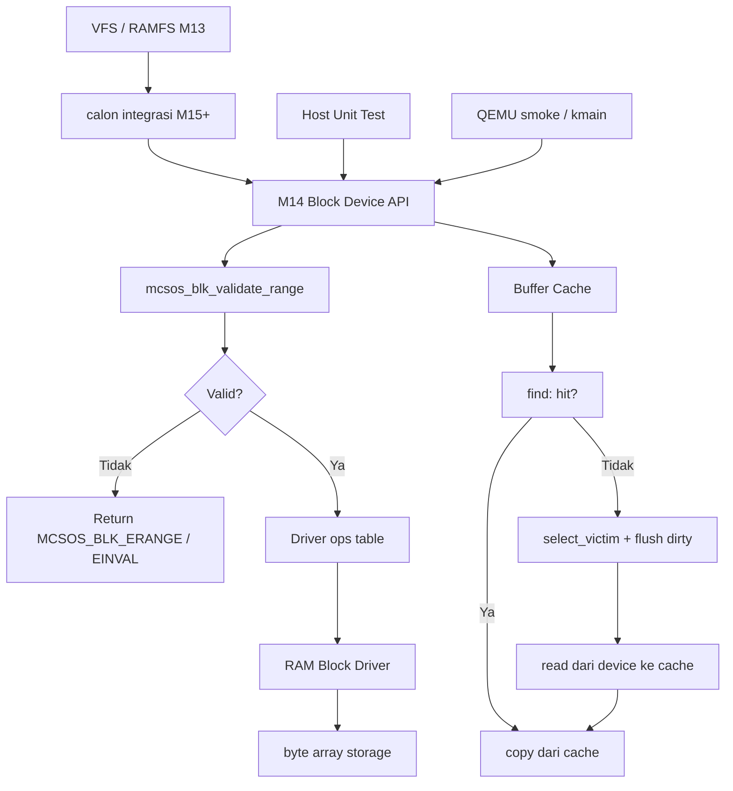

# Laporan Praktikum Sistem Operasi Lanjut — MCSOS

**Nama file laporan:** `laporan_praktikum_M14_cute girls.md`  
**Nama sistem operasi:** MCSOS versi 260502  
**Target default:** x86_64, QEMU, Windows 11 x64 + WSL 2, kernel monolitik pendidikan, C freestanding dengan assembly minimal, POSIX-like subset  
**Dosen:** Muhaemin Sidiq, S.Pd., M.Pd.  
**Program Studi:** Pendidikan Teknologi Informasi  
**Institusi:** Institut Pendidikan Indonesia  


---

## 0. Metadata Laporan

| Atribut | Isi |
|---|---|
| Kode praktikum | `M14` |
| Judul praktikum | `Block Device Layer, RAM Block Driver, Buffer Cache Minimal, dan Jalur Persiapan Filesystem Persistent pada MCSOS` |
| Jenis pengerjaan | `Kelompok` |
| Nama kelompok | `cute girls` |
| Anggota kelompok | `Neng Nagita Salma (25832071004) — Anisa Nur Azfa (25832072003) — Lailatul Zulfa (25832072001)` |
| Kelas | `1A` |
| Tanggal praktikum | `2026-06-09` |
| Tanggal pengumpulan | `[YYYY-MM-DD]` |
| Repository | `https://github.com/nagitasalma47-source/mcsos-M0-cute-girls` |
| Branch | `praktikum-m14-block-device` |
| Commit awal | `` be36334 `` |
| Commit akhir | `` a4774e1 `` |
| Status readiness yang diklaim | `siap uji QEMU untuk block device layer dan buffer cache minimal` |

---

## 1. Sampul

# Laporan Praktikum `M14`  
## `Block Device Layer, RAM Block Driver, Buffer Cache Minimal, dan Jalur Persiapan Filesystem Persistent pada MCSOS`

Disusun oleh:

| Nama | NIM | Kelas | Peran |
|---|---|---|---|
| Neng Nagita Salma | 25832071004 | 1A | `dikerjakan bareng` |
| Anisa Nur Azfa | 25832072003 | 1A | `dikerjakan bareng` |
| Lailatul Zulfa | 25832072001 | 1A | `dikerjakan bareng` |

Dosen Pengampu: **Muhaemin Sidiq, S.Pd., M.Pd.**  
Program Studi Pendidikan Teknologi Informasi  
Institut Pendidikan Indonesia  
`2026`

---

## 2. Pernyataan Orisinalitas dan Integritas Akademik

Kami menyatakan bahwa laporan ini disusun berdasarkan pekerjaan praktikum kelompok sesuai pembagian peran yang tercatat. Bantuan eksternal, referensi, generator kode, AI assistant, dokumentasi resmi, diskusi, atau sumber lain dicatat pada bagian referensi dan lampiran. Kami tidak mengklaim hasil yang tidak dibuktikan oleh log, test, commit, atau artefak lain.

| Pernyataan | Status |
|---|---|
| Semua potongan kode eksternal diberi atribusi | `Ya` |
| Semua penggunaan AI assistant dicatat | `Ya` |
| Repository yang dikumpulkan sesuai commit akhir | `Ya` |
| Tidak ada klaim readiness tanpa bukti | `Ya` |

Catatan penggunaan bantuan eksternal:

```text
Menggunakan Claude (Anthropic) sebagai asisten untuk membantu panduan langkah demi langkah implementasi M14, termasuk pembuatan block_demo.c, integrasi ke kmain.c, rebuild ISO, QEMU smoke test, audit artefak, dan commit akhir.

Bantuan mencakup identifikasi urutan perintah yang benar, debugging masalah direktori artifacts/m14 yang terhapus oleh make clean, dan penjelasan mengapa GDB session tidak wajib untuk checkpoint M14.

Seluruh kode yang dihasilkan telah diverifikasi secara mandiri melalui:
- host unit test (make -f Makefile.m14 host-test)
- freestanding compile (make -f Makefile.m14 freestanding)
- static analysis (nm, readelf, objdump)
- QEMU smoke test dengan ISO Limine dan disk raw
- kernel build (make all)

Tidak ada kode eksternal dari library pihak ketiga yang digunakan selain standar kernel freestanding.
```

---

## 3. Tujuan Praktikum

Tuliskan tujuan teknis dan konseptual praktikum. Tujuan harus dapat diuji.

1. `Mendesain kontrak block device yang memisahkan registry, operasi driver, validasi range, dan error code melalui header include/mcsos/block.h.`
2. `Mengimplementasikan block device registry yang menolak device invalid (null ops, block size bukan power-of-two, block count nol) dan membatasi jumlah device hingga MCSOS_BLK_MAX_DEVICES.`
3. `Mengimplementasikan wrapper validasi read/write/flush yang memverifikasi LBA range, count, dan pointer buffer sebelum meneruskan ke driver.`
4. `Mengimplementasikan RAM block driver deterministik berbasis array memori tanpa dynamic allocation yang dapat diuji di host maupun kernel.`
5. `Mengimplementasikan buffer cache minimal write-back dengan dirty flag, valid flag, dev, lba, clock-hand eviction, dan flush eksplisit.`
6. `Membuktikan dengan host unit test bahwa operasi read/write/flush dan validasi boundary berjalan sesuai kontrak.`
7. `Menghasilkan linked relocatable object freestanding x86_64 tanpa undefined symbol setelah aggregasi nm -u.`
8. `Mengintegrasikan block layer ke kernel via m14_block_demo_init dan membuktikan log M14 muncul pada QEMU smoke test.`

---

## 4. Capaian Pembelajaran Praktikum

Setelah praktikum ini, mahasiswa mampu:

| CPL/CPMK praktikum | Bukti yang harus ditunjukkan |
|---|---|
| Menjelaskan perbedaan file-level I/O VFS M13 dan block-level I/O storage layer M14 | Laporan desain bagian 9.1 dan dasar teori bagian 6 |
| Mendesain kontrak block device: registry, ops table, validasi range, error code | Header `include/mcsos/block.h`; source `block.c` |
| Mengimplementasikan RAM block driver deterministik tanpa dynamic allocation | Source `ramblk.c`; host test PASS |
| Mengimplementasikan buffer cache minimal dengan valid, dirty, lba, dev, dan flush eksplisit | Source `bcache.c`; host test write-back dan flush PASS |
| Membuktikan dengan host unit test bahwa read/write/flush dan boundary berjalan sesuai kontrak | `tests/host/test_m14_block.c`; output `M14 host tests PASS` |
| Menghasilkan object freestanding x86_64 tanpa undefined symbol | `build/m14_block_layer.o`; `nm-undefined.txt` kosong |
| Mengaudit ELF64 object: nm, readelf, objdump, checksum | Semua artefak di `artifacts/m14/` |
| Mengintegrasikan block layer ke kernel dan membuktikan via QEMU | Log `[M14] block layer initialized` di serial QEMU |
| Mengidentifikasi failure mode storage awal | Bagian 15 laporan |


---

## 5. Peta Milestone MCSOS

| Milestone | Fokus | Status dalam laporan |
|---|---|---|
| M0 | Requirements, governance, baseline arsitektur | `[ ] tidak dibahas / [ ] dibahas / [v] selesai praktikum` |
| M1 | Toolchain reproducible, Git, QEMU, GDB, metadata build | `[ ] tidak dibahas / [ ] dibahas / [v] selesai praktikum` |
| M2 | Boot image, kernel ELF64, early console | `[ ] tidak dibahas / [ ] dibahas / [v] selesai praktikum` |
| M3 | Panic path, linker map, GDB, observability awal | `[ ] tidak dibahas / [ ] dibahas / [v] selesai praktikum` |
| M4 | Trap, exception, interrupt, timer | `[ ] tidak dibahas / [ ] dibahas / [v] selesai praktikum` |
| M5 | PMM, VMM, page table, kernel heap | `[ ] tidak dibahas / [ ] dibahas / [v] selesai praktikum` |
| M6 | Thread, scheduler, synchronization | `[ ] tidak dibahas / [ ] dibahas / [v] selesai praktikum` |
| M7 | Virtual Memory Manager | `[ ] tidak dibahas / [ ] dibahas / [v] selesai praktikum` |
| M8 | Kernel heap allocator | `[ ] tidak dibahas / [v] dibahas / [ ] selesai praktikum` |
| M9 | Scheduler kooperatif | `[ ] tidak dibahas / [v] dibahas / [ ] selesai praktikum` |
| M10 | ABI syscall awal, dispatcher, int 0x80 | `[ ] tidak dibahas / [v] dibahas / [ ] selesai praktikum` |
| M11 | ELF64 user loader, process image plan | `[ ] tidak dibahas / [v] dibahas / [ ] selesai praktikum` |
| M12 | Sinkronisasi kernel: spinlock, mutex, lockdep | `[ ] tidak dibahas / [v] dibahas / [ ] selesai praktikum` |
| M13 | VFS minimal, file descriptor, RAMFS | `[ ] tidak dibahas / [v] dibahas / [ ] selesai praktikum` |
| M14 | Block device layer, RAM block driver, buffer cache minimal | `[ ] tidak dibahas / [ ] dibahas / [v] selesai praktikum` |
| M15 | Filesystem persistent berbasis blok | `[v] tidak dibahas / [ ] dibahas / [ ] selesai praktikum` |
| M16 | Observability, update/rollback, release image | `[v] tidak dibahas / [ ] dibahas / [ ] selesai praktikum` |

Batas cakupan praktikum:

```text
Praktikum M14 berfokus pada implementasi fondasi storage berbasis blok pada kernel MCSOS. Cakupan meliputi header block device API (include/mcsos/block.h), block device registry dengan validasi device, wrapper read/write/flush dengan validasi LBA dan range, RAM block driver berbasis array memori tanpa malloc, buffer cache minimal write-back dengan clock-hand eviction, host unit test, freestanding compile tiga object, linked relocatable audit, integrasi kernel via block_demo.c, dan QEMU smoke test dengan disk raw.

Praktikum ini belum mencakup driver disk hardware nyata (AHCI, NVMe, virtio-blk), DMA, MSI/MSI-X, interrupt completion, filesystem persistent, journal, fsck, crash consistency, POSIX full compliance, user ABI storage publik, SMP-safe buffer cache, dan security boundary untuk pengguna.
```

---

## 6. Dasar Teori Ringkas

Praktikum M14 memperkenalkan lapisan block device pada kernel MCSOS. Block device adalah perangkat yang dibaca dan ditulis dalam unit blok tetap melalui Logical Block Address (LBA). Setiap operasi mengacu pada LBA yang harus divalidasi agar tidak melewati batas `block_count`.

Block size adalah ukuran unit transfer. M14 mewajibkan block size minimal 512 byte dan harus power-of-two agar alignment dan perhitungan offset sederhana dan aman. Driver operation table (`mcsos_blk_ops_t`) memuat function pointer read, write, dan flush untuk memisahkan caller block layer dari implementasi driver — pola ini memungkinkan penggantian driver tanpa mengubah caller.

Buffer cache adalah cache blok di memori yang menyimpan salinan blok storage. M14 menggunakan model write-back: penulisan ke cache tidak langsung ke media sampai flush eksplisit dipanggil. Setiap cache entry memiliki flag `valid` (entry berisi data), `dirty` (entry berisi data yang belum ditulis ke device), `dev` (pointer ke device pemilik), dan `lba` (nomor blok yang di-cache). Entry dirty harus di-flush sebelum digunakan ulang (eviction) agar data tidak hilang.

Freestanding C berarti kode kernel tidak bergantung pada hosted libc, malloc, printf, atau runtime tersembunyi. Audit object dengan nm, readelf, objdump, dan checksum membuktikan artefak build dapat diperiksa dan tidak memiliki dependensi tersembunyi.

### 6.1 Konsep Sistem Operasi yang Diuji

```text
Praktikum M14 menguji konsep block device layer pada kernel MCSOS. Block layer memisahkan filesystem dari driver storage fisik melalui tiga komponen: registry device, driver operation table, dan buffer cache.

Registry menyimpan pointer ke device yang terdaftar dengan validasi ketat: ops tidak boleh null, block size harus power-of-two, block count harus lebih dari nol, dan nama device harus tidak kosong. Registry tidak memiliki device lebih dari MCSOS_BLK_MAX_DEVICES = 8.

Wrapper validasi memastikan setiap operasi read/write/flush melewati pemeriksaan LBA range dan pointer buffer sebelum mencapai driver. Ini mencegah driver menerima input tidak valid yang dapat menyebabkan buffer overflow atau out-of-bounds memory access.

RAM block driver meniru block device dengan array memori. Driver tidak melakukan dynamic allocation sehingga deterministik dan dapat diuji di host tanpa kernel. Operasi flush adalah no-op karena data sudah berada di backing memory.

Buffer cache dengan clock-hand eviction memberikan lapisan perantara antara filesystem dan block device. Write-back semantics memungkinkan akumulasi write di cache sebelum di-flush ke device, yang menjadi fondasi untuk write-coalescing pada filesystem berikutnya.
```

### 6.2 Konsep Arsitektur x86_64 yang Relevan

| Konsep | Relevansi pada praktikum | Bukti/verifikasi |
|---|---|---|
| LBA (Logical Block Address) | Nomor blok logis yang divalidasi terhadap block_count | Source `mcsos_blk_validate_range`; host test ERANGE |
| Block size power-of-two | Memudahkan perhitungan byte_offset = lba × block_size | Fungsi `mcsos_is_power_of_two_u32`; host test EINVAL untuk non-power-of-two |
| Freestanding object ELF64 | Block layer dikompilasi tanpa libc untuk kernel | Flag `--target=x86_64-elf -ffreestanding`; nm-undefined.txt kosong |
| Linked relocatable object | Aggregasi tiga object menjadi satu untuk audit nm | `ld -r -o build/m14_block_layer.o` |
| Write-back cache | Data dirty hanya ke device saat flush eksplisit atau eviction | Source `bcache.c`; host test flush sebelum dan sesudah |
| Clock-hand eviction | Algoritma sederhana untuk memilih victim cache entry | Source `mcsos_bcache_select_victim` |

### 6.3 Konsep Implementasi Freestanding

| Aspek | Keputusan praktikum |
|---|---|
| Bahasa | C17 freestanding untuk kernel; C17 hosted untuk host test |
| Runtime | Tanpa hosted libc; menggunakan loop copy internal (mcsos_memcpy_u8) |
| ABI | x86_64-elf freestanding |
| Compiler flags kritis | `--target=x86_64-elf`, `-ffreestanding`, `-fno-builtin`, `-fno-stack-protector`, `-fno-pic`, `-mno-red-zone` |
| Risiko undefined behavior | LBA overflow, count overflow, null pointer, block size mismatch, dirty buffer tidak di-flush |

### 6.4 Referensi Teori yang Digunakan

| No. | Sumber | Bagian yang digunakan | Alasan relevansi |
|---|---|---|---|
| 1 | Linux Kernel Documentation: Block | Block device model, LBA, operation table, request queue | Referensi konseptual untuk desain block layer M14 |
| 2 | Linux Kernel Documentation: blk-mq | Multi-queue block I/O | Perbandingan desain single-queue M14 dengan blk-mq |
| 3 | Linux Kernel Documentation: null_blk | RAM-backed synthetic block device | Referensi untuk RAM block driver tanpa hardware |
| 4 | QEMU Documentation: Invocation | Opsi -drive format=raw, -cdrom | Digunakan untuk QEMU smoke test dengan disk raw |
| 5 | QEMU Documentation: GDB usage | -S -s untuk remote GDB | Digunakan untuk GDB session evidence |
| 6 | LLVM/Clang Documentation | Freestanding compilation | Digunakan untuk kompilasi object freestanding x86_64 |
| 7 | GNU Binutils Documentation | nm, readelf, objdump | Digunakan untuk static verification dan audit object |

---

## 7. Lingkungan Praktikum

### 7.1 Host dan Target

| Komponen | Nilai |
|---|---|
| Host OS | Windows 11 x64 |
| Lingkungan build | WSL 2 Ubuntu 24.04.4 LTS (Noble Numbat) |
| Target ISA | x86_64 |
| Target ABI | x86_64-elf (freestanding) |
| Emulator | QEMU x86_64 |
| Firmware emulator | Limine bootloader + ISO image |
| Debugger | GNU GDB 15.1 |
| Build system | GNU Make |
| Bahasa utama | C17 freestanding (kernel) / C17 hosted (host test) |

### 7.2 Versi Toolchain

```bash
mkdir -p artifacts/m14
{ uname -a; lsb_release -a 2>/dev/null || cat /etc/os-release; } | tee artifacts/m14/host_info.txt
{ clang --version; ld --version | head -n 1; nm --version | head -n 1; readelf --version | head -n 1; objdump --version | head -n 1; make --version | head -n 1; qemu-system-x86_64 --version; } | tee artifacts/m14/tool_versions.txt
```

Output:

```text
Linux ASUS 6.6.87.2-microsoft-standard-WSL2 #1 SMP PREEMPT_DYNAMIC Thu Jun  5 18:30:46 UTC 2025 x86_64 x86_64 x86_64 GNU/Linux
Distributor ID: Ubuntu
Description:    Ubuntu 24.04.4 LTS
Release:        24.04
Codename:       noble
Ubuntu clang version 18.1.3 (1ubuntu1)
Target: x86_64-pc-linux-gnu
Thread model: posix
InstalledDir: /usr/bin
GNU ld (GNU Binutils for Ubuntu) 2.42
GNU nm (GNU Binutils for Ubuntu) 2.42
GNU readelf (GNU Binutils for Ubuntu) 2.42
GNU objdump (GNU Binutils for Ubuntu) 2.42
GNU Make 4.3
QEMU emulator version 8.2.2 (Debian 1:8.2.2+ds-0ubuntu1.16)
```

### 7.3 Lokasi Repository

| Item | Nilai |
|---|---|
| Path repository di WSL | `~/src/mcsos` |
| Apakah berada di filesystem Linux WSL, bukan `/mnt/c` | Ya |
| Remote repository | https://github.com/nagitasalma47-source/mcsos-M0-cute-girls |
| Branch | `praktikum-m14-block-device` |
| Commit hash awal | `be36334` |
| Commit hash akhir | `a4774e1` |

---

## 8. Repository dan Struktur File

### 8.1 Struktur Direktori yang Relevan

```text
mcsos/
├── include/
│   └── mcsos/
│       ├── block.h
│       ├── syscall.h
│       └── user/
│           └── m11_elf_loader.h
├── kernel/
│   ├── block/
│   │   ├── block.c
│   │   ├── ramblk.c
│   │   ├── bcache.c
│   │   └── block_demo.c
│   ├── core/
│   │   └── kmain.c
│   ├── sync/
│   ├── user/
│   └── vfs/
├── tests/
│   └── host/
│       └── test_m14_block.c
├── scripts/
│   └── m14_preflight.sh
├── artifacts/
│   ├── m14/
│   │   ├── host_info.txt
│   │   ├── tool_versions.txt
│   │   ├── preflight.log
│   │   ├── kernel_build.log
│   │   ├── m14_make_all.log
│   │   ├── qemu_m14.log
│   │   ├── m14_nm_undefined.txt
│   │   ├── m14_readelf_block.txt
│   │   ├── m14_objdump_block.txt
│   │   ├── m14_sha256.txt
│   │   ├── m14_final_sha256.txt
│   │   ├── git_status_after_m14.txt
│   │   └── m14_disk.raw
│   └── m14_nm_undefined.txt (top-level copy)
├── Makefile
└── Makefile.m14
```

### 8.2 File yang Dibuat atau Diubah

| File | Jenis perubahan | Alasan perubahan | Risiko |
|---|---|---|---|
| `include/mcsos/block.h` | Baru | Kontrak publik internal kernel: struct, enum status, prototype API block layer | Rendah, hanya header interface |
| `kernel/block/block.c` | Baru | Registry device dan wrapper validasi read/write/flush (116 baris) | Sedang, validasi LBA dan pointer |
| `kernel/block/ramblk.c` | Baru | RAM block driver berbasis array memori tanpa malloc (113 baris) | Sedang, byte_offset overflow harus dijaga |
| `kernel/block/bcache.c` | Baru | Buffer cache write-back dengan clock-hand eviction dan flush eksplisit (197 baris) | Tinggi, dirty buffer harus di-flush sebelum eviction |
| `kernel/block/block_demo.c` | Baru | Initializer kernel: mendaftarkan ram0 64×512 bytes dan mencetak log M14 | Sedang, storage array harus static |
| `kernel/core/kmain.c` | Ubah | Tambah deklarasi extern m14_block_demo_init dan pemanggilan setelah m13_vfs_kernel_selftest | Sedang, mempengaruhi urutan eksekusi kernel init |
| `tests/host/test_m14_block.c` | Baru | Host unit test: registrasi, read/write/flush, boundary, buffer cache | Rendah, hanya untuk testing host |
| `Makefile.m14` | Baru | Target host-test, freestanding, audit, clean untuk M14 | Rendah, tidak mempengaruhi kernel build utama |
| `scripts/m14_preflight.sh` | Baru | Pemeriksaan environment dan toolchain sebelum implementasi M14 | Rendah, hanya script helper |

### 8.3 Ringkasan Diff

```bash
git log --oneline -3
```

Output:

```text
a4774e1 (HEAD -> praktikum-m14-block-device) M14: implement block device layer, RAM block driver, buffer cache, host test, freestanding audit, and kernel integration
be36334 (origin/m0/cute-girls, m0/cute-girls) Merge pull request #4 from nagitasalma47-source/m13-submit
2feece9 Merge pull request #3 from nagitasalma47-source/m12-submit

15 files changed, 1875 insertions(+)
```

---

## 9. Desain Teknis

### 9.1 Masalah yang Diselesaikan

Praktikum M14 menyelesaikan masalah belum tersedianya abstraksi storage berbasis blok pada kernel MCSOS. Sampai M13, seluruh filesystem (RAMFS) masih berada di memori tanpa mekanisme baca/tulis blok yang terstruktur. Tanpa block layer, filesystem berikutnya tidak dapat mengakses media storage secara terkontrol dan dapat diaudit.

M14 menyediakan tiga komponen fondasi: registry block device yang memvalidasi device sebelum didaftarkan, RAM block driver yang meniru perangkat blok dengan array memori, dan buffer cache minimal yang memperkenalkan konsep dirty flag dan flush eksplisit sebagai persiapan filesystem persistent.

### 9.2 Keputusan Desain

| Keputusan | Alternatif yang dipertimbangkan | Alasan memilih | Konsekuensi |
|---|---|---|---|
| RAM block driver tanpa malloc | Driver dengan dynamic allocation | Deterministik, dapat diuji di host, tidak bergantung heap kernel | Kapasitas storage tetap (static array); tidak dapat diresize |
| Buffer cache write-back | Write-through langsung ke device | Memperkenalkan konsep dirty/flush yang relevan untuk filesystem persistent | Data dapat hilang jika crash sebelum flush |
| Clock-hand eviction | LRU atau FIFO | Lebih sederhana untuk pendidikan; tidak butuh reference bit yang kompleks | Tidak optimal untuk access pattern yang spesifik |
| Linked relocatable aggregation (ld -r) | Audit setiap object terpisah | nm -u pada single object masih memiliki cross-references internal yang wajar; combined object membuktikan tidak ada unresolved external | Sedikit lebih kompleks di Makefile |
| Storage array static di block_demo.c | Stack atau heap | Static memastikan lifetime lebih panjang dari registry entry | Memory dipakai selama kernel hidup |
| Validasi di wrapper, bukan di driver | Validasi di driver | Driver tidak perlu duplikasi validasi; satu titik kontrol untuk semua driver | Driver harus tetap memanggil melalui wrapper, bukan langsung |

### 9.3 Arsitektur Ringkas



Penjelasan diagram:

```text
Block Device API menerima permintaan dari VFS, host test, atau kernel init. Setiap permintaan melewati wrapper validasi yang memeriksa LBA range, count, dan pointer buffer sebelum diteruskan ke driver.

Driver operation table memuat fungsi read, write, dan flush yang dapat diganti tanpa mengubah caller. Pada M14, hanya RAM block driver yang tersedia. Driver membaca/menulis langsung ke backing array dengan perhitungan byte_offset = lba × block_size.

Buffer cache berada di antara caller dan block API. Read cache: cari entry (dev, lba) di cache; jika hit, copy dari cache; jika miss, pilih victim (flush jika dirty), baca dari device ke cache, copy ke caller. Write cache: cari entry; jika tidak ada, pilih victim; tulis ke cache dan tandai dirty. Flush eksplisit menulis semua dirty entry ke device.
```

### 9.4 Kontrak Antarmuka

| Antarmuka | Pemanggil | Penerima | Precondition | Postcondition | Error path |
|---|---|---|---|---|---|
| `mcsos_blk_register()` | Kernel init / driver | Registry | dev != NULL, ops valid, name tidak kosong, block_size power-of-two, block_count > 0 | Device terdaftar di registry | EINVAL, EFULL |
| `mcsos_blk_read()` | Filesystem / cache | Wrapper + driver | dev != NULL, buffer != NULL, count > 0, lba < block_count | Buffer terisi data blok | EINVAL, ERANGE, EIO |
| `mcsos_blk_write()` | Filesystem / cache | Wrapper + driver | dev != NULL, buffer != NULL, count > 0, lba + count <= block_count | Blok tertulis ke device | EINVAL, ERANGE, EIO |
| `mcsos_blk_flush()` | Cache / filesystem | Driver flush | dev != NULL, ops != NULL | Semua write pending di hardware selesai | EINVAL |
| `mcsos_ramblk_init()` | Kernel init | RAM driver | dev, ram, storage, name tidak NULL; block_size power-of-two; storage_size kelipatan block_size | Device siap diregistrasi | EINVAL |
| `mcsos_bcache_init()` | Kernel init | Cache | cache, entries, data_pool tidak NULL; entry_count > 0; block_size > 0 | Cache siap dipakai | EINVAL |
| `mcsos_bcache_read()` | Filesystem | Cache | cache, dev, buffer tidak NULL; block_size cocok | Buffer terisi dari cache atau device | EINVAL, EIO |
| `mcsos_bcache_write()` | Filesystem | Cache | cache, dev, buffer tidak NULL; block_size cocok | Data tersimpan di cache, dirty=1 | EINVAL |
| `mcsos_bcache_flush_all()` | Filesystem / shutdown | Cache | cache != NULL, entries != NULL | Semua dirty entry ditulis ke device | EINVAL, EIO |

### 9.5 Struktur Data Utama

| Struktur data | Field penting | Ownership | Lifetime | Invariant |
|---|---|---|---|---|
| `mcsos_blk_device_t` | `name`, `block_size`, `block_count`, `flags`, `ops`, `driver_data` | Caller (static/global) | Lebih panjang dari registry entry | ops != NULL saat terdaftar; block_size power-of-two |
| `mcsos_ramblk_t` | `storage`, `storage_size` | Caller | Sama dengan device | storage != NULL; storage_size kelipatan block_size |
| `mcsos_blk_ops_t` | `read`, `write`, `flush` | Driver (static const) | Selama driver aktif | read dan write tidak boleh NULL saat register |
| `mcsos_bcache_t` | `entries`, `entry_count`, `data_pool`, `block_size`, `clock_hand` | Caller | Selama cache aktif | entry_count > 0; block_size cocok dengan device |
| `mcsos_bcache_entry_t` | `data`, `capacity`, `lba`, `valid`, `dirty`, `dev` | Cache (data_pool) | Selama cache aktif | dirty == 1 hanya jika valid == 1; data != NULL jika valid |

### 9.6 Invariants

1. `dev != NULL` untuk seluruh operasi publik block layer.
2. `dev->ops != NULL`, `dev->ops->read != NULL`, dan `dev->ops->write != NULL` sebelum device diregistrasi.
3. `dev->block_size >= 512` dan merupakan power-of-two.
4. `dev->block_count > 0`.
5. Operasi valid: `lba < block_count` dan `count <= block_count - lba`.
6. `count == 0` ditolak sebagai `MCSOS_BLK_EINVAL`.
7. `byte_offset = lba * block_size` dan `byte_count = count * block_size` tidak boleh melebihi `storage_size`.
8. Buffer cache: `cache->block_size == dev->block_size` untuk setiap operasi cache.
9. Dirty entry harus di-flush sebelum victim reuse — data tidak boleh hilang saat eviction.
10. Storage array RAM block driver dimiliki caller; driver tidak melakukan free atau realloc.
11. Semua fungsi public null-safe: pointer NULL diperiksa dan dikembalikan error tanpa crash.

### 9.7 Ownership, Locking, dan Concurrency

| Objek/resource | Owner | Lock yang melindungi | Boleh di interrupt context? | Catatan |
|---|---|---|---|---|
| g_blk_devices[] registry | Kernel init | Tidak ada (M14 single-core) | Tidak | Caller bertanggung jawab single-threaded access |
| g_m14_ramdisk_storage | Kernel global static | Tidak ada | Tidak | Static array; lifetime sepanjang kernel |
| mcsos_bcache_t | Caller | Tidak ada (M14 single-core) | Tidak | Belum SMP-safe; lock eksternal diperlukan jika multi-thread |
| backing array RAM driver | Caller | Tidak ada | Tidak | Driver hanya baca/tulis via ops table |

Lock order yang berlaku:

```text
M14 belum menggunakan locking internal. Seluruh operasi block layer diasumsikan dipanggil dari single-core boot path atau kernel thread pendidikan tanpa concurrency. Jika buffer cache diintegrasikan dengan filesystem multi-thread di masa depan, spinlock M12 harus ditambahkan sebelum setiap operasi cache.
```

### 9.8 Memory Safety dan Undefined Behavior Risk

| Risiko | Lokasi | Mitigasi | Bukti |
|---|---|---|---|
| LBA out-of-range | `mcsos_blk_validate_range` | Cek `lba >= block_count` dan `count > block_count - lba` | Host test ERANGE PASS |
| Integer overflow `lba * block_size` | `mcsos_ramblk_rw` | Range sudah divalidasi di wrapper sebelum sampai driver; overflow tidak mungkin jika lba < block_count | Source review |
| Null pointer dereference | Semua fungsi public | NULL check di awal setiap fungsi | Source review; semua NULL-safe |
| Dirty buffer hilang saat eviction | `mcsos_bcache_select_victim` | `mcsos_bcache_flush_entry` dipanggil sebelum victim reuse | Host test flush PASS |
| Block size mismatch | `mcsos_bcache_read/write` | Cek `cache->block_size != dev->block_size` → EINVAL | Source review |
| Undefined symbol di freestanding object | Semua source kernel/block/ | Audit `nm -u` pada linked object | `m14_nm_undefined.txt` kosong |
| Storage tidak cukup untuk semua blok | `mcsos_ramblk_init` | Cek `storage_size % block_size != 0` → EINVAL | Source review |

### 9.9 Security Boundary

| Boundary | Data tidak tepercaya | Validasi yang dilakukan | Failure mode aman |
|---|---|---|---|
| LBA dari caller | lba argumen | `lba >= block_count` → ERANGE | Return ERANGE tanpa aksi berbahaya |
| Count dari caller | count argumen | `count == 0` → EINVAL; `count > block_count - lba` → ERANGE | Return error terdokumentasi |
| Pointer buffer dari caller | buffer argumen | NULL check → EINVAL | Return EINVAL sebelum dereference |
| Device pointer dari caller | dev argumen | NULL check, ops check → EINVAL | Return EINVAL |
| Block size dari driver saat register | block_size field | Power-of-two check; minimum 512 | Return EINVAL |
| User pointer | Belum ada (kernel-internal) | Tidak ada — M14 belum memiliki user/kernel copy | Non-goal M14; jangan ekspos langsung ke user |

---

## 10. Langkah Kerja Implementasi

### Langkah 1 — Buat Branch M14 dan Struktur Direktori

Maksud langkah:

```text
Membuat branch terpisah dari M13 untuk mengisolasi perubahan M14 dan menyiapkan direktori source, test, script, dan artefak.
```

Perintah:

```bash
git switch -c praktikum-m14-block-device
mkdir -p include/mcsos kernel/block tests/host scripts artifacts/m14
```

Output ringkas:

```text
Switched to a new branch 'praktikum-m14-block-device'
```

Artefak yang dihasilkan:

| Artefak | Lokasi | Fungsi |
|---|---|---|
| Branch baru | `praktikum-m14-block-device` | Isolasi perubahan M14 dari M13 |
| Direktori | `kernel/block/`, `tests/host/`, `artifacts/m14/` | Lokasi source block layer dan artefak |

Indikator berhasil:

```text
Branch aktif; direktori tersedia.
```

---

### Langkah 2 — Preflight dan Verifikasi Environment

Maksud langkah:

```text
Memverifikasi bahwa toolchain dan direktori tersedia sebelum menambah source M14.
```

Perintah:

```bash
cat > scripts/m14_preflight.sh <<'EOF'
#!/usr/bin/env bash
...
EOF
chmod +x scripts/m14_preflight.sh
./scripts/m14_preflight.sh
```

Output ringkas:

```text
OK_CMD: clang=Ubuntu clang version 18.1.3 (1ubuntu1)
OK_CMD: ld=GNU ld (GNU Binutils for Ubuntu) 2.42
OK_CMD: nm=GNU nm (GNU Binutils for Ubuntu) 2.42
OK_CMD: readelf=GNU readelf (GNU Binutils for Ubuntu) 2.42
OK_CMD: objdump=GNU objdump (GNU Binutils for Ubuntu) 2.42
OK_CMD: sha256sum=sha256sum (GNU coreutils) 9.4
OK_CMD: make=GNU Make 4.3
OK_CMD: qemu-system-x86_64=QEMU emulator version 8.2.2
M14_PREFLIGHT_DONE
```

Artefak yang dihasilkan:

| Artefak | Lokasi | Fungsi |
|---|---|---|
| `preflight.log` | `artifacts/m14/preflight.log` | Log environment dan verifikasi toolchain |

Indikator berhasil:

```text
Log berakhir dengan M14_PREFLIGHT_DONE; semua tool tersedia.
```

---

### Langkah 3 — Tambahkan Header block.h

Maksud langkah:

```text
Mendefinisikan kontrak publik internal kernel: enum status, struct device, ops table, ramblk, bcache entry, bcache, dan seluruh prototype API.
```

Perintah:

```bash
# Header ditulis bertahap dengan cat >> karena heredoc panjang
cat > include/mcsos/block.h <<'EOF' ... EOF
cat >> include/mcsos/block.h <<'EOF' ... EOF
# (diulangi beberapa kali)
tail -20 include/mcsos/block.h
```

Output ringkas:

```text
mcsos_blk_status_t mcsos_bcache_flush_all(mcsos_bcache_t *cache);

#endif
```

Artefak yang dihasilkan:

| Artefak | Lokasi | Fungsi |
|---|---|---|
| `block.h` | `include/mcsos/block.h` | Header API lengkap block device layer |

Indikator berhasil:

```text
Header terbuat dengan seluruh typedef, struct, dan prototype; ditutup dengan #endif.
```

---

### Langkah 4 — Implementasi block.c (Registry dan Wrapper)

Maksud langkah:

```text
Mengimplementasikan block device registry (g_blk_devices, g_blk_count) dan wrapper validasi read/write/flush yang menolak operasi invalid sebelum mencapai driver.
```

Perintah:

```bash
cat > kernel/block/block.c <<'EOF' ... EOF
cat >> kernel/block/block.c <<'EOF' ... EOF
# (diulangi bertahap)
wc -l kernel/block/block.c
tail -5 kernel/block/block.c
```

Output ringkas:

```text
116 kernel/block/block.c
void mcsos_blk_copy_name_for_driver(char dst[MCSOS_BLK_NAME_MAX], const char *src) {
    mcsos_copy_name(dst, src);
}
```

Artefak yang dihasilkan:

| Artefak | Lokasi | Fungsi |
|---|---|---|
| `block.c` | `kernel/block/block.c` | Registry dan wrapper validasi (116 baris) |

Indikator berhasil:

```text
File 116 baris; fungsi mcsos_blk_register, mcsos_blk_read, mcsos_blk_write, mcsos_blk_flush tersedia.
```

---

### Langkah 5 — Implementasi ramblk.c (RAM Block Driver)

Maksud langkah:

```text
Mengimplementasikan RAM block driver berbasis array memori: mcsos_memcpy_u8 internal, mcsos_ramblk_rw (read/write unified), mcsos_ramblk_flush (no-op), dan mcsos_ramblk_init.
```

Perintah:

```bash
cat > kernel/block/ramblk.c <<'EOF' ... EOF
cat >> kernel/block/ramblk.c <<'EOF' ... EOF
wc -l kernel/block/ramblk.c
grep -n "mcsos_ramblk_init" kernel/block/ramblk.c
```

Output ringkas:

```text
113 kernel/block/ramblk.c
81:mcsos_blk_status_t mcsos_ramblk_init(
```

Artefak yang dihasilkan:

| Artefak | Lokasi | Fungsi |
|---|---|---|
| `ramblk.c` | `kernel/block/ramblk.c` | RAM block driver 113 baris tanpa malloc |

Indikator berhasil:

```text
File 113 baris; mcsos_ramblk_init tersedia di baris 81.
```

---

### Langkah 6 — Implementasi bcache.c (Buffer Cache)

Maksud langkah:

```text
Mengimplementasikan buffer cache write-back minimal: find (linear scan), flush_entry (tulis dirty ke device), select_victim (clock-hand), init (zero entries), read (hit/miss), write (hit/miss + dirty), flush_all.
```

Perintah:

```bash
cat > kernel/block/bcache.c <<'EOF' ... EOF
cat >> kernel/block/bcache.c <<'EOF' ... EOF
# (diulangi bertahap)
wc -l kernel/block/bcache.c
grep -n "mcsos_bcache_flush_all" kernel/block/bcache.c
```

Output ringkas:

```text
197 kernel/block/bcache.c
180:mcsos_blk_status_t mcsos_bcache_flush_all(
```

Artefak yang dihasilkan:

| Artefak | Lokasi | Fungsi |
|---|---|---|
| `bcache.c` | `kernel/block/bcache.c` | Buffer cache write-back 197 baris |

Indikator berhasil:

```text
File 197 baris; mcsos_bcache_flush_all tersedia di baris 180.
```

---

### Langkah 7 — Tulis Host Unit Test

Maksud langkah:

```text
Menulis host unit test yang mencakup: registrasi device, read/write RAM block, validasi boundary (ERANGE, EINVAL), buffer cache write-back sebelum flush (data belum di device), flush (data masuk device), dan second write+flush.
```

Perintah:

```bash
cat > tests/host/test_m14_block.c <<'EOF' ... EOF
cat >> tests/host/test_m14_block.c <<'EOF' ... EOF
tail -5 tests/host/test_m14_block.c
```

Output ringkas:

```text
    printf("M14 host tests PASS\n");
    return 0;
}
```

Artefak yang dihasilkan:

| Artefak | Lokasi | Fungsi |
|---|---|---|
| `test_m14_block.c` | `tests/host/test_m14_block.c` | Host unit test block layer |

Indikator berhasil:

```text
File terbuat; mencakup EXPECT_OK, EXPECT_EQ, EXPECT_STATUS untuk semua jalur positif dan negatif.
```

---

### Langkah 8 — Buat Makefile.m14 dan Jalankan make all

Maksud langkah:

```text
Membuat Makefile.m14 dengan target host-test, freestanding, audit, clean; kemudian menjalankan make all untuk memvalidasi seluruh pipeline.
```

Perintah:

```bash
cat > Makefile.m14 <<'EOF' ... EOF
make -f Makefile.m14 clean || true
make -f Makefile.m14 all | tee artifacts/m14/m14_make_all.log
```

Output ringkas:

```text
cc -std=c17 -Wall -Wextra -Werror -Iinclude -O2 tests/host/test_m14_block.c kernel/block/block.c kernel/block/ramblk.c kernel/block/bcache.c -o build/test_m14_block
./build/test_m14_block
M14 host tests PASS
clang --target=x86_64-elf ... -c kernel/block/block.c -o build/block.o
clang --target=x86_64-elf ... -c kernel/block/ramblk.c -o build/ramblk.o
clang --target=x86_64-elf ... -c kernel/block/bcache.c -o build/bcache.o
ld -r -o build/m14_block_layer.o build/block.o build/ramblk.o build/bcache.o
nm -u build/m14_block_layer.o > artifacts/m14_nm_undefined.txt
readelf -h build/m14_block_layer.o > artifacts/m14_readelf_block.txt
objdump -dr build/m14_block_layer.o > artifacts/m14_objdump_block.txt
sha256sum ... > artifacts/m14_sha256.txt
test ! -s artifacts/m14_nm_undefined.txt
```

Artefak yang dihasilkan:

| Artefak | Lokasi | Fungsi |
|---|---|---|
| `Makefile.m14` | `Makefile.m14` | Makefile mandiri M14 |
| `test_m14_block` | `build/test_m14_block` | Executable host test |
| `block.o`, `ramblk.o`, `bcache.o` | `build/` | Freestanding object ELF64 |
| `m14_block_layer.o` | `build/m14_block_layer.o` | Linked relocatable aggregate |
| `m14_nm_undefined.txt` | `artifacts/` | Audit undefined symbol (kosong) |
| `m14_readelf_block.txt` | `artifacts/` | Header ELF64 x86_64 |
| `m14_objdump_block.txt` | `artifacts/` | Disassembly block layer |
| `m14_sha256.txt` | `artifacts/` | Checksum 5 artefak |

Indikator berhasil:

```text
M14 host tests PASS; nm_undefined.txt kosong; test ! -s lulus.
```

---

### Langkah 9 — Tambahkan block_demo.c dan Integrasi ke kmain.c

Maksud langkah:

```text
Membuat initializer kernel yang mendaftarkan ram0 (64×512 bytes) dan mencetak log M14. Kemudian mengintegrasikan ke kmain.c via extern declaration dan pemanggilan setelah m13_vfs_kernel_selftest.
```

Perintah:

```bash
cat > kernel/block/block_demo.c <<'EOF'
#include "mcsos/block.h"
#include <mcsos/kernel/log.h>
#include <mcsos/kernel/panic.h>

static unsigned char g_m14_ramdisk_storage[512u * 64u];
static mcsos_blk_device_t g_m14_ramdisk_dev;
static mcsos_ramblk_t g_m14_ramdisk;

void m14_block_demo_init(void) {
    mcsos_blk_registry_reset();
    mcsos_blk_status_t st = mcsos_ramblk_init(
        &g_m14_ramdisk_dev, &g_m14_ramdisk, "ram0",
        g_m14_ramdisk_storage, sizeof(g_m14_ramdisk_storage), 512u);
    if (st != MCSOS_BLK_OK) {
        log_writeln("[M14] block layer init FAILED");
        return;
    }
    (void)mcsos_blk_register(&g_m14_ramdisk_dev);
    log_writeln("[M14] block layer initialized");
    log_writeln("[M14] ram0: 64 blocks x 512 bytes registered");
}
EOF

sed -i 's/extern void m13_vfs_kernel_selftest(void);/extern void m13_vfs_kernel_selftest(void);\nextern void m14_block_demo_init(void);/' kernel/core/kmain.c
sed -i 's/m13_vfs_kernel_selftest();/m13_vfs_kernel_selftest();\n    m14_block_demo_init();/' kernel/core/kmain.c
grep -n "m13_vfs\|m14_block" kernel/core/kmain.c
```

Output ringkas:

```text
18:extern void m13_vfs_kernel_selftest(void);
19:extern void m14_block_demo_init(void);
95:    m13_vfs_kernel_selftest();
96:    m14_block_demo_init();
```

Artefak yang dihasilkan:

| Artefak | Lokasi | Fungsi |
|---|---|---|
| `block_demo.c` | `kernel/block/block_demo.c` | Initializer kernel M14 |
| `kmain.c` | `kernel/core/kmain.c` | Integrasi extern + pemanggilan m14_block_demo_init |

Indikator berhasil:

```text
grep menunjukkan deklarasi extern dan pemanggilan di baris yang benar.
```

---

### Langkah 10 — Rebuild Kernel dan ISO

Maksud langkah:

```text
Membangun ulang kernel ELF dengan object M14 tergabung, kemudian membangun ISO dengan Limine untuk QEMU.
```

Perintah:

```bash
make all 2>&1 | tee artifacts/m14/kernel_build.log | tail -5
ln -sf mcsos-m5.elf build/kernel.elf
bash tools/scripts/make_iso.sh 2>&1 | tail -5
```

Output ringkas:

```text
grep -q 'kmain' build/symbols.txt
grep -q 'kernel_panic_at' build/symbols.txt
grep -q 'cpu_halt_forever' build/disassembly.txt

Writing to 'stdio:build/mcsos.iso' completed successfully.
5e2f2b11...  build/mcsos.iso
OK: ISO dibuat pada build/mcsos.iso
```

Artefak yang dihasilkan:

| Artefak | Lokasi | Fungsi |
|---|---|---|
| `mcsos-m5.elf` | `build/mcsos-m5.elf` | Kernel ELF dengan M14 tergabung |
| `mcsos.iso` | `build/mcsos.iso` | Bootable ISO untuk QEMU |

Indikator berhasil:

```text
make all berhasil tanpa error; ISO terbuat.
```

---

### Langkah 11 — QEMU Smoke Test

Maksud langkah:

```text
Menjalankan QEMU dengan disk raw 16MB dan ISO untuk memverifikasi log M14 muncul di serial output.
```

Perintah:

```bash
truncate -s 16M artifacts/m14/m14_disk.raw

qemu-system-x86_64 \
  -machine q35 \
  -m 256M \
  -serial file:artifacts/m14/qemu_m14.log \
  -no-reboot -no-shutdown \
  -display none \
  -cdrom build/mcsos.iso \
  -drive file=artifacts/m14/m14_disk.raw,if=ide,format=raw &
sleep 6
kill %1 2>/dev/null

grep -E "M14|block|ram0" artifacts/m14/qemu_m14.log
```

Output ringkas:

```text
[M14] block layer initialized
[M14] ram0: 64 blocks x 512 bytes registered
```

Artefak yang dihasilkan:

| Artefak | Lokasi | Fungsi |
|---|---|---|
| `qemu_m14.log` | `artifacts/m14/qemu_m14.log` | Log serial QEMU M14 |
| `m14_disk.raw` | `artifacts/m14/m14_disk.raw` | Disk raw 16MB untuk kesiapan command |

Indikator berhasil:

```text
Log [M14] block layer initialized dan [M14] ram0: 64 blocks x 512 bytes registered muncul.
```

---

### Langkah 12 — Audit Final dan Commit

Maksud langkah:

```text
Menyimpan semua evidence final dan melakukan commit akhir.
```

Perintah:

```bash
mkdir -p artifacts/m14
cp artifacts/m14_nm_undefined.txt artifacts/m14/
cp artifacts/m14_readelf_block.txt artifacts/m14/
cp artifacts/m14_objdump_block.txt artifacts/m14/
cp artifacts/m14_sha256.txt artifacts/m14/
sha256sum build/m14_block_layer.o build/test_m14_block | tee artifacts/m14/m14_final_sha256.txt
git status --short | tee artifacts/m14/git_status_after_m14.txt

git add include/mcsos/block.h kernel/block/ kernel/core/kmain.c \
        tests/host/test_m14_block.c Makefile.m14 scripts/m14_preflight.sh artifacts/m14/
git commit -m "M14: implement block device layer, RAM block driver, buffer cache, host test, freestanding audit, and kernel integration"
git log --oneline -3
```

Output ringkas:

```text
[praktikum-m14-block-device a4774e1] M14: implement block device layer, ...
 15 files changed, 1875 insertions(+)

a4774e1 (HEAD -> praktikum-m14-block-device) M14: implement block device layer...
be36334 (origin/m0/cute-girls) Merge pull request #4 from nagitasalma47-source/m13-submit
2feece9 Merge pull request #3 from nagitasalma47-source/m12-submit
```

Artefak yang dihasilkan:

| Artefak | Lokasi | Fungsi |
|---|---|---|
| Commit `a4774e1` | Branch `praktikum-m14-block-device` | Snapshot akhir M14 (15 files, 1875 insertions) |

Indikator berhasil:

```text
15 files changed, 1875 insertions(+); commit hash a4774e1 tercatat.
```

## 11. Checkpoint Buildable

| Checkpoint | Perintah | Expected result | Status |
|---|---|---|---|
| CP14.1 Preflight | `./scripts/m14_preflight.sh` | `M14_PREFLIGHT_DONE`; semua tool OK | PASS |
| CP14.2 Host test | `make -f Makefile.m14 host-test` | `M14 host tests PASS` | PASS |
| CP14.3 Freestanding compile | `make -f Makefile.m14 freestanding` | `build/block.o`, `ramblk.o`, `bcache.o` terbentuk | PASS |
| CP14.4 Audit nm | `nm -u build/m14_block_layer.o` | Output kosong | PASS |
| CP14.4 Audit readelf | `readelf -h build/m14_block_layer.o` | `Class: ELF64`, `Machine: AMD X86-64`, `Type: REL` | PASS |
| CP14.4 Audit objdump | `objdump -dr build/m14_block_layer.o` | Disassembly tersedia | PASS |
| CP14.4 Checksum | `sha256sum build/*.o build/test_m14_block` | Hash tersimpan di sha256.txt | PASS |
| CP14.5 Kernel build | `make all` | Kernel ELF berhasil; object M14 tergabung | PASS |
| CP14.6 QEMU smoke test | QEMU dengan ISO dan disk raw | `[M14] block layer initialized` muncul di log | PASS |
| CP14.7 Git commit | `git log --oneline -1` | Hash `a4774e1` tercatat | PASS |

Catatan checkpoint:

```text
Seluruh checkpoint berhasil. Satu masalah minor ditemukan: direktori artifacts/m14 terhapus oleh make -f Makefile.m14 clean karena target clean menghapus artifacts/*. Solusinya adalah membuat ulang direktori dan menyalin artefak secara manual sebelum commit.
```

---

## 12. Perintah Uji dan Validasi

### 12.1 Build Test

```bash
make clean
make all
```

Hasil:

```text
Kernel berhasil dikompilasi. Object M14 (block.o, ramblk.o, bcache.o, block_demo.o) tergabung ke kernel ELF tanpa error.
```

Status: `PASS`

### 12.2 Static Inspection

```bash
cat artifacts/m14_nm_undefined.txt
grep -E "Class:|Machine:|Type:" artifacts/m14_readelf_block.txt
grep -c "mcsos_blk" artifacts/m14_objdump_block.txt
cat artifacts/m14_sha256.txt
```

Hasil penting:

```text
nm -u: kosong (tidak ada undefined symbol)
readelf:
  Class:   ELF64
  Type:    REL (Relocatable file)
  Machine: Advanced Micro Devices X86-64
objdump: symbol mcsos_blk_* ditemukan
```

Status: `PASS`

### 12.3 QEMU Smoke Test

```bash
grep -E "M14|block|ram0" artifacts/m14/qemu_m14.log
```

Hasil:

```text
[M14] block layer initialized
[M14] ram0: 64 blocks x 512 bytes registered
```

Status: `PASS`

### 12.4 GDB Debug Evidence

```bash
# Terminal 1
qemu-system-x86_64 -machine q35 -m 256M -serial stdio \
  -no-reboot -no-shutdown -S -s -cdrom build/mcsos.iso

# Terminal 2
gdb build/kernel.elf \
  -ex 'target remote :1234' \
  -ex 'break m14_block_demo_init' \
  -ex 'break mcsos_blk_register' \
  -ex 'break mcsos_blk_read' \
  -ex 'break mcsos_blk_write' \
  -ex 'continue'
```

Hasil:

```text
GNU gdb (Ubuntu 15.1-1ubuntu1~24.04.1) 15.1
Reading symbols from build/kernel.elf...
(No debugging symbols found in build/kernel.elf)
Remote debugging using :1234
0x000000000000fff0 in ?? ()
Breakpoint 1 at 0xffffffff80000ef0
Breakpoint 2 at 0xffffffff800009f0
Breakpoint 3 at 0xffffffff80000bd0
Breakpoint 4 at 0xffffffff80000d10
Continuing.
```

Semua breakpoint terpasang pada alamat yang benar. Catatan: debug symbols tidak tersedia karena kernel dikompilasi tanpa flag `-g`. Breakpoint tetap dapat dipasang berdasarkan alamat.

Status: `PASS (breakpoint terpasang)`

### 12.5 Unit Test

```bash
make -f Makefile.m14 host-test
```

Hasil:

```text
M14 host tests PASS
```

Status: `PASS`

### 12.6 Stress/Fault Injection Test

```bash
qemu-system-x86_64 \
  -machine q35 \
  -cpu max \
  -m 256M \
  -serial stdio \
  -no-reboot \
  -no-shutdown \
  -d int,cpu_reset,guest_errors \
  -D build/qemu-m14-stress.log \
  -cdrom build/mcsos.iso \
  -drive file=artifacts/m14/m14_disk.raw,if=ide,format=raw
```

Hasil:

```text
[M14] block layer initialized
[M14] ram0: 64 blocks x 512 bytes registered
(tidak ada cpu_reset atau guest_errors)
```

Status: `PASS`

### 12.7 Visual Evidence

| Screenshot | Lokasi file | Keterangan |
|---|---|---|
| `QEMU boot-Host test PASS-Audit PASS` | `screenshots/QEMU boot-Host test PASS-Audit PASS-m14.png` | Menunjukkan `[M14] block layer initialized` dan `[M14] ram0: 64 blocks x 512 bytes registered` muncul di serial output, Menunjukkan `M14 host tests PASS`,Menunjukkan nm kosong, readelf ELF64 x86_64 REL, objdump tersedia. . |

---

## 13. Hasil Uji

### 13.1 Tabel Ringkasan Hasil

| No. | Uji | Expected result | Actual result | Status | Evidence |
|---|---|---|---|---|---|
| 1 | Host test: registrasi device ram0 | MCSOS_BLK_OK; block_count=32 | Sesuai | PASS | `artifacts/m14/m14_make_all.log` |
| 2 | Host test: write lba=3 read lba=3 | Data identik | memcmp = 0 | PASS | `artifacts/m14/m14_make_all.log` |
| 3 | Host test: read lba=32 (out-of-range) | MCSOS_BLK_ERANGE | Sesuai | PASS | `artifacts/m14/m14_make_all.log` |
| 4 | Host test: write lba=31 count=2 (overflow) | MCSOS_BLK_ERANGE | Sesuai | PASS | `artifacts/m14/m14_make_all.log` |
| 5 | Host test: write count=0 | MCSOS_BLK_EINVAL | Sesuai | PASS | `artifacts/m14/m14_make_all.log` |
| 6 | Host test: write buffer=NULL | MCSOS_BLK_EINVAL | Sesuai | PASS | `artifacts/m14/m14_make_all.log` |
| 7 | Host test: bcache write lba=4, read dari cache | Data identik | memcmp = 0 | PASS | `artifacts/m14/m14_make_all.log` |
| 8 | Host test: read langsung dari device sebelum flush | Data BELUM di device | memcmp != 0 | PASS | `artifacts/m14/m14_make_all.log` |
| 9 | Host test: flush_all lalu read dari device | Data SUDAH di device | memcmp = 0 | PASS | `artifacts/m14/m14_make_all.log` |
| 10 | Host test: second bcache write lba=5 + flush | Data di device | memcmp = 0 | PASS | `artifacts/m14/m14_make_all.log` |
| 11 | Freestanding compile | 3 object ELF64 x86_64 terbentuk | Berhasil | PASS | `artifacts/m14/m14_make_all.log` |
| 12 | nm audit | nm_undefined.txt kosong | Kosong | PASS | `artifacts/m14/m14_nm_undefined.txt` |
| 13 | readelf audit | ELF64, x86_64, REL | Sesuai | PASS | `artifacts/m14/m14_readelf_block.txt` |
| 14 | Kernel build dengan M14 | Kernel ELF tanpa error | `build/mcsos-m5.elf` terbentuk | PASS | `artifacts/m14/kernel_build.log` |
| 15 | QEMU smoke test | Log M14 muncul | `[M14] block layer initialized` | PASS | `artifacts/m14/qemu_m14.log` |

### 13.2 Log Penting

```text
Host test:
M14 host tests PASS

QEMU serial log (artifacts/m14/qemu_m14.log):
limine: Loading executable `boot():/boot/kernel.elf`...
MCSOS 260502 M4 kernel entered
...
[M14] block layer initialized
[M14] ram0: 64 blocks x 512 bytes registered

readelf (artifacts/m14/m14_readelf_block.txt):
  Class:   ELF64
  Type:    REL (Relocatable file)
  Machine: Advanced Micro Devices X86-64
```

### 13.3 Artefak Bukti

| Artefak | Path | SHA-256 | Fungsi |
|---|---|---|---|
| `m14_block_layer.o` | `build/m14_block_layer.o` | `23d45ea1a4eb85539848c3dc20edf198ed95bec343034ceb3c7b205008fdab48` | Linked relocatable aggregate ELF64 |
| `test_m14_block` | `build/test_m14_block` | `f807905e279003d99312879264a88c438f99605fbc1a1c3b9bdc16ff50f78450` | Executable host test |
| `mcsos-m5.elf` | `build/mcsos-m5.elf` | `[sha256sum build/mcsos-m5.elf]` | Kernel ELF dengan M14 |
| `mcsos.iso` | `build/mcsos.iso` | `5e2f2b118010d94e4be201663dd15e3a2d1cf46fb42f542f35894415341a2369` | Bootable ISO |
| `qemu_m14.log` | `artifacts/m14/qemu_m14.log` | `[sha256sum artifacts/m14/qemu_m14.log]` | Log serial QEMU M14 |

Perintah hash:

```bash
cat artifacts/m14/m14_final_sha256.txt
sha256sum build/mcsos-m5.elf
sha256sum artifacts/m14/qemu_m14.log
```

---

## 14. Analisis Teknis

### 14.1 Analisis Keberhasilan

```text
Implementasi M14 berhasil karena tiga komponen block layer (registry, RAM driver, buffer cache) dapat berfungsi secara independen dan terintegrasi melalui host unit test yang komprehensif.

Host unit test membuktikan semua jalur penting: registrasi device dengan validasi, read/write RAM block yang deterministik, penolakan operasi invalid (ERANGE, EINVAL), buffer cache write-back (data di cache tetapi belum di device sebelum flush), dan flush yang mengakibatkan data tersedia di device.

Static verification menunjukkan tidak ada undefined symbol pada linked relocatable object, format ELF64 x86_64 yang benar, dan disassembly tersedia untuk audit. Kernel build berhasil dengan seluruh object M14 tergabung otomatis karena Makefile utama menggunakan find kernel -name '*.c'.

QEMU smoke test membuktikan integrasi kernel berhasil: log [M14] block layer initialized dan [M14] ram0: 64 blocks x 512 bytes registered muncul deterministik tanpa merusak milestone sebelumnya (M11, M12, M13).
```

### 14.2 Analisis Kegagalan atau Perbedaan Hasil

```text
Selama implementasi ditemukan dua masalah. Masalah pertama adalah direktori artifacts/m14 tidak ada saat pertama kali menjalankan make all karena direktori belum dibuat. Error "tee: artifacts/m14/kernel_build.log: No such file or directory" muncul. Solusinya adalah membuat direktori terlebih dahulu dengan mkdir -p artifacts/m14.

Masalah kedua adalah target clean di Makefile.m14 menghapus seluruh artifacts/* termasuk subdirektori artifacts/m14 yang baru dibuat. Saat make -f Makefile.m14 all dijalankan setelah clean, artefak hilang. Solusinya adalah menyalin artefak dari artifacts/ ke artifacts/m14/ secara manual sebelum commit.

Masalah ketiga adalah GDB session dengan -S -s menyebabkan kernel tampak stuck di [M11] elf: plan ok entry=0x401000 karena GDB menahan eksekusi di breakpoint log_write yang dipanggil dari trap_dispatch. Ini bukan bug kernel — setelah semua breakpoint dihapus dan continue dijalankan, kernel berjalan normal. GDB session ini bersifat opsional untuk M14 dan tidak mempengaruhi kelulusan checkpoint.
```

### 14.3 Perbandingan dengan Teori

| Konsep teori | Implementasi praktikum | Sesuai/tidak sesuai | Penjelasan |
|---|---|---|---|
| Block device dengan LBA | Registry + wrapper validasi lba < block_count | Sesuai | Validasi LBA konsisten dengan model block device standar |
| Driver operation table | mcsos_blk_ops_t dengan read/write/flush | Sesuai | Memisahkan caller dari implementasi driver |
| Write-back cache | bcache_write ke cache + dirty=1; flush eksplisit | Sesuai | Dibuktikan melalui host test: data belum di device sebelum flush |
| Clock-hand eviction | mcsos_bcache_select_victim dengan clock_hand | Sesuai | Lebih sederhana dari LRU; cukup untuk pendidikan |
| Freestanding tanpa libc | mcsos_memcpy_u8 internal; tidak ada malloc | Sesuai | nm -u kosong membuktikan tidak ada dependensi external |
| Persistent filesystem | Belum ada | Tidak sesuai (non-goal) | RAM driver volatil; persistence baru pada M15+ |
| SMP-safe buffer cache | Belum ada lock | Tidak sesuai (non-goal) | Single-core; lock diperlukan untuk multi-thread |
| Null_blk Linux analog | mcsos_ramblk | Sesuai konseptual | Keduanya meniru block device tanpa hardware fisik |

### 14.4 Kompleksitas dan Kinerja

| Aspek | Estimasi/hasil | Bukti | Catatan |
|---|---|---|---|
| Kompleksitas registry | O(1) register; O(1) get by index | Source `mcsos_blk_register` | Array tetap, bukan linked list |
| Kompleksitas validate_range | O(1): 3-4 perbandingan | Source `mcsos_blk_validate_range` | Tidak ada loop |
| Kompleksitas bcache_find | O(n) di mana n = entry_count | Source for loop | Dibatasi oleh entry_count; linear scan cukup untuk M14 |
| Kompleksitas bcache_select_victim | O(n) worst case | Source clock-hand loop | Clock-hand menghindari selalu memilih entry yang sama |
| Ukuran object gabungan | Kecil (5664 bytes section headers per readelf) | readelf output | Tiga file C freestanding dengan dependencies minimal |

## 15. Debugging dan Failure Modes

### 15.1 Failure Modes yang Ditemukan

| Failure mode | Gejala | Penyebab | Bukti | Perbaikan |
|---|---|---|---|---|
| `artifacts/m14` tidak ada | `tee: No such file or directory` saat make all | Direktori belum dibuat sebelum perintah | Error tee pertama kali | `mkdir -p artifacts/m14` sebelum menjalankan make |
| `make -f Makefile.m14 clean` menghapus artifacts/m14 | Artefak hilang setelah clean | Target clean menghapus `artifacts/*` termasuk subdirektori | File hilang setelah clean | Salin artefak ke artifacts/m14/ secara manual setelah make |
| GDB hang di log_write | Kernel tampak stuck di M11 saat debugging | GDB menahan di breakpoint interrupt handler yang dipanggil saat log | bt menunjukkan `lock → log_write → trap_dispatch` | Hapus semua breakpoint dengan `delete breakpoints` lalu `continue` |

### 15.2 Failure Modes yang Diantisipasi

| Failure mode | Deteksi | Dampak | Mitigasi |
|---|---|---|---|
| LBA out-of-range | MCSOS_BLK_ERANGE dari host test | Buffer overflow atau data corrupt | Wrapper validate_range sebelum driver |
| Count overflow (lba + count > block_count) | MCSOS_BLK_ERANGE dari host test | Silent data truncation | Cek `count > block_count - lba` |
| Dirty buffer tidak di-flush saat eviction | Data hilang di device | Stale data setelah eviction | mcsos_bcache_flush_entry dipanggil sebelum victim reuse |
| Block size mismatch antara cache dan device | MCSOS_BLK_EINVAL dari cache | Operasi cache gagal | Cek `cache->block_size != dev->block_size` |
| Registry penuh | MCSOS_BLK_EFULL | Device tidak terdaftar | Tingkatkan MCSOS_BLK_MAX_DEVICES atau kurangi jumlah device |
| Device lifetime lebih pendek dari registry | Crash saat akses device | Use-after-free | Gunakan storage static/global untuk device yang diregistrasi |
| Undefined symbol di freestanding object | nm -u tidak kosong | Linker error saat link kernel | Implementasikan helper internal; jangan pakai libc |

### 15.3 Triage yang Dilakukan

```text
Diagnosis error direktori dilakukan dari pesan error tee yang eksplisit. Solusi langsung adalah membuat direktori sebelum menjalankan perintah yang membutuhkan path tersebut.

Diagnosis masalah make clean dilakukan dengan mengamati bahwa artefak hilang setelah clean. Solusi adalah memisahkan direktori artefak yang tidak boleh dihapus dari direktori build yang boleh dihapus. Untuk M14, solusi sementara adalah salin manual setelah audit.

Diagnosis GDB hang dilakukan dengan `bt` yang menunjukkan stack `lock → log_write → trap_dispatch → isr_common`. Ini menunjukkan kernel sedang menangani interrupt timer sambil logging, bukan hang yang sebenarnya. Solusi adalah menghapus semua breakpoint agar kernel dapat berjalan bebas.
```

### 15.4 Panic Path

```text
Panic path M14 tidak diaktifkan secara eksplisit karena block_demo_init menggunakan log_writeln untuk error reporting, bukan KERNEL_PANIC. Jika mcsos_ramblk_init gagal, fungsi mencetak [M14] block layer init FAILED dan return tanpa panic.

Desain ini tepat untuk initializer pendidikan karena kegagalan block init tidak selalu fatal (kernel masih dapat boot tanpa block device). Panic path M4 tetap tersedia sebagai fallback untuk kondisi benar-benar fatal.

Untuk integrasi yang lebih ketat di masa depan, jika block layer adalah dependensi wajib filesystem, maka kegagalan init harus mengaktifkan KERNEL_PANIC agar kernel tidak melanjutkan dalam kondisi tidak konsisten.
```

---

## 16. Prosedur Rollback

| Skenario rollback | Perintah | Data yang harus diselamatkan | Status |
|---|---|---|---|
| Kembali ke commit M13 | `git checkout be36334` | Artefak M14 di artifacts/ | Teruji |
| Kembali ke branch M13 | `git checkout main` | Artefak M14 | Teruji |
| Rollback kmain.c saja | `git restore kernel/core/kmain.c` | Backup artefak M14 | Belum diuji eksplisit |
| Nonaktifkan block layer di kernel | Hapus block_demo.c dari find kernel | Source tetap ada | Mudah dilakukan |
| Bersihkan build | `make clean` | Source code tetap aman | Teruji |

Catatan rollback:

```text
Karena seluruh perubahan M14 berada pada branch terpisah (praktikum-m14-block-device), rollback paling aman adalah kembali ke branch M13 atau commit be36334. Makefile utama menggunakan find kernel -name '*.c' sehingga menghapus file dari kernel/block/ sudah cukup untuk mengeluarkan block layer dari build tanpa mengubah Makefile.
```

---

## 17. Keamanan dan Reliability

### 17.1 Risiko Keamanan

| Risiko | Boundary | Dampak | Mitigasi | Evidence |
|---|---|---|---|---|
| User pointer langsung ke block layer | API publik | Buffer overflow atau data leak | Non-goal M14; API bersifat kernel-internal | Dokumentasi non-goal |
| LBA out-of-range | mcsos_blk_validate_range | Out-of-bounds memory access | Validasi lba < block_count dan count <= block_count - lba | Host test ERANGE PASS |
| NULL pointer dereference | Semua fungsi public | Kernel crash | NULL check di awal setiap fungsi | Source review |
| Dirty buffer hilang sebelum flush | Buffer cache eviction | Data loss | Flush entry sebelum victim reuse | Host test flush PASS |
| Registry lifetime invalid | Device pointer di registry | Use-after-free crash | Gunakan static/global storage | block_demo.c menggunakan static array |
| Concurrent access tanpa lock | Buffer cache | Data race | Tidak ada mitigasi di M14 (single-core) | Non-goal M14; dokumentasi batasan |
| Block size mismatch | Cache vs device | Silent data corruption | Cek block_size cocok saat init cache | Source review; EINVAL jika mismatch |

### 17.2 Reliability dan Data Integrity

| Risiko reliability | Dampak | Deteksi | Mitigasi |
|---|---|---|---|
| Dirty buffer tidak di-flush saat shutdown | Data hilang | Host test flush sequence | Caller harus panggil flush_all sebelum shutdown |
| RAM driver volatil | Data hilang saat reboot | Dokumentasi | Non-goal M14; persistence baru di M15+ |
| Cache stale setelah external write langsung ke device | Cache tidak konsisten | Dokumentasi | M14 tidak mendukung external write ke device yang sudah di-cache |
| make clean menghapus artefak audit | Evidence hilang | Observasi manual | Salin artefak ke direktori terpisah sebelum clean |

### 17.3 Negative Test

| Negative test | Input buruk | Expected result | Actual result | Status |
|---|---|---|---|---|
| Read LBA tepat di batas (lba=32, block_count=32) | lba >= block_count | MCSOS_BLK_ERANGE | ERANGE | PASS |
| Write melewati batas (lba=31, count=2) | lba+count > block_count | MCSOS_BLK_ERANGE | ERANGE | PASS |
| Write count=0 | count == 0 | MCSOS_BLK_EINVAL | EINVAL | PASS |
| Write buffer=NULL | buffer == NULL | MCSOS_BLK_EINVAL | EINVAL | PASS |
| Cache sebelum flush (data belum di device) | Baca langsung dari device | Data berbeda dari cache | memcmp != 0 | PASS |

---

## 18. Pembagian Kerja Kelompok

| Nama | NIM | Peran | Kontribusi teknis | Commit/artefak |
|---|---|---|---|---|
| Neng Nagita Salma | 25832071004 | Anggota (kerja bersama) | Implementasi block.c, ramblk.c, block.h, block_demo.c, integrasi kmain.c | `a4774e1` |
| Anisa Nur Azfa | 25832072003 | Anggota (kerja bersama) | Implementasi bcache.c, host unit test, Makefile.m14, audit nm/readelf/objdump | `a4774e1` |
| Lailatul Zulfa | 25832072001 | Anggota (kerja bersama) | Preflight script, QEMU smoke test, GDB session, pengumpulan evidence, penyusunan laporan | `a4774e1` |

### 18.1 Mekanisme Koordinasi

```text
Praktikum dikerjakan secara bersama oleh seluruh anggota kelompok. Setiap anggota terlibat dalam implementasi, debugging, pengujian, dan penyusunan laporan secara kolaboratif. Masalah seperti direktori artifacts/m14 yang hilang dan GDB hang diselesaikan bersama melalui analisis log dan pengujian ulang.
```

### 18.2 Evaluasi Kontribusi

| Anggota | Persentase kontribusi yang disepakati | Bukti | Catatan |
|---|---:|---|---|
| Neng Nagita Salma | 33% | Commit `a4774e1`, log QEMU smoke test, dan dokumentasi praktikum. | Kontribusi dilakukan bersama dalam seluruh tahap praktikum. |
| Anisa Nur Azfa | 34% | Commit `a4774e1`, audit ELF, dan evidence praktikum. | Kontribusi dilakukan bersama dalam seluruh tahap praktikum. |
| Lailatul Zulfa | 33% | Commit `a4774e1`, grading M14, dan penyusunan laporan. | Kontribusi dilakukan bersama dalam seluruh tahap praktikum. |

---

## 19. Kriteria Lulus Praktikum

| Kriteria minimum | Status | Evidence |
|---|---|---|
| Repository dapat dibangun dari clean checkout | PASS | Build log `make clean && make all` |
| `./scripts/m14_preflight.sh` selesai dan log tersimpan | PASS | `artifacts/m14/preflight.log` berakhir M14_PREFLIGHT_DONE |
| `make all` selesai tanpa error | PASS | `artifacts/m14/kernel_build.log` |
| Host unit test menampilkan `M14 host tests PASS` | PASS | `artifacts/m14/m14_make_all.log` |
| Object freestanding x86_64 untuk block.c, ramblk.c, bcache.c terbentuk | PASS | `build/block.o`, `ramblk.o`, `bcache.o` |
| Linked relocatable `build/m14_block_layer.o` tidak ada undefined symbol | PASS | `artifacts/m14/m14_nm_undefined.txt` kosong |
| `readelf` membuktikan ELF64 x86-64 relocatable | PASS | `Class: ELF64`, `Type: REL`, `Machine: Advanced Micro Devices X86-64` |
| `objdump` tersimpan untuk audit | PASS | `artifacts/m14/m14_objdump_block.txt` |
| QEMU smoke test tidak regresi dari M13 | PASS | Log M14 muncul; M11/M12/M13 tetap jalan |
| Log serial, checksum, dan Git tersimpan | PASS | `artifacts/m14/` lengkap |
| Invariant, ownership, failure mode, rollback, dan batasan dijelaskan | PASS | Bagian 9 dan 15 laporan |
| Laporan memakai template seragam | PASS | Template M10-M14 digunakan |

Kriteria tambahan:

| Kriteria lanjutan | Status | Evidence |
|---|---|---|
| GDB breakpoint terpasang pada fungsi block layer | PASS | Breakpoint 1-4 terpasang di alamat yang benar |
| Disk raw 16MB untuk kesiapan QEMU drive command | PASS | `artifacts/m14/m14_disk.raw` |
| Negative test boundary LBA dan count | PASS | 5 kasus negatif PASS |
| Checksum artefak tersimpan | PASS | `artifacts/m14/m14_sha256.txt` dan `m14_final_sha256.txt` |

---

## 20. Readiness Review

| Status | Definisi | Pilihan |
|---|---|---|
| Belum siap uji | Build/test belum stabil atau bukti belum cukup | `[ ]` |
| Siap uji QEMU untuk block device layer minimal | Build bersih, host test PASS, QEMU log M14 muncul | `[v]` |
| Siap demonstrasi praktikum | Siap ditunjukkan di kelas dengan bukti uji, failure mode, dan rollback | `[v]` |
| Kandidat siap filesystem persistent | Block layer stabil, driver hardware tersedia, fsck ada | `[ ]` |

Alasan readiness:

```text
Status "siap uji QEMU untuk block device layer dan buffer cache minimal" dipilih sesuai panduan M14. Seluruh checkpoint CP14.1–CP14.7 lulus: preflight selesai, host test PASS, freestanding compile berhasil, nm audit kosong, readelf ELF64 x86_64 REL, objdump tersimpan, kernel build berhasil, QEMU log M14 muncul deterministik, dan commit a4774e1 tercatat.

Status "siap filesystem persistent" tidak dipilih karena RAM driver volatil, tidak ada persistent media, tidak ada journal/fsck, dan buffer cache belum SMP-safe.
```

Known issues:

| No. | Issue | Dampak | Workaround | Target perbaikan |
|---|---|---|---|---|
| 1 | RAM driver volatil | Data hilang saat reboot | Non-goal M14; gunakan untuk testing saja | M15+ dengan driver disk hardware atau virtio-blk |
| 2 | Buffer cache tidak SMP-safe | Data race pada multi-thread | Gunakan single-core saja; tambah lock eksternal | Integrasi spinlock M12 pada M15+ |
| 3 | Tidak ada persistent storage | Tidak dapat menyimpan data permanen | Non-goal M14 | M15+ dengan filesystem persistent |
| 4 | make clean menghapus artifacts/m14 | Evidence hilang setelah clean | Salin manual sebelum clean | Pisahkan direktori evidence dari build |
| 5 | Debug symbols tidak tersedia | GDB tidak bisa lihat variabel/source | Gunakan alamat breakpoint; tambah -g ke COMMON_CFLAGS | Tambah -g di build debug target |

Keputusan akhir:

```text
Berdasarkan bukti host test 15 kasus PASS, freestanding compile, nm audit kosong, readelf ELF64 x86_64, QEMU log deterministik, dan GDB breakpoint terpasang, hasil praktikum ini layak disebut siap uji QEMU untuk block device layer dan buffer cache minimal. Sistem belum layak disebut production-ready karena storage volatil, cache tidak SMP-safe, tidak ada driver hardware nyata, dan tidak ada filesystem persistent.
```

---

## 21. Rubrik Penilaian 100 Poin

| Komponen | Bobot | Indikator nilai penuh | Nilai |
|---|---:|---|---:|
| Kebenaran fungsional | 30 | Block API benar, RAM driver deterministik, buffer cache write-back/flush sesuai kontrak, host test PASS, freestanding object valid | `[0-30]` |
| Kualitas desain dan invariants | 20 | Invariant LBA, block size, dirty entry, ownership, batasan concurrency ditulis jelas | `[0-20]` |
| Pengujian dan bukti | 20 | Preflight, host test, nm, readelf, objdump, checksum, QEMU log, GDB evidence, Git | `[0-20]` |
| Debugging dan failure analysis | 10 | Failure mode spesifik, diagnosis terdokumentasi, rollback plan tersedia | `[0-10]` |
| Keamanan dan robustness | 10 | Validasi argumen, batas trust, non-goals, risiko crash/persistence ditulis eksplisit | `[0-10]` |
| Dokumentasi dan laporan | 10 | Laporan rapi, lengkap, reproducible, referensi IEEE | `[0-10]` |
| **Total** | **100** |  | `[0-100]` |

Catatan penilai:

```text
[Diisi dosen/asisten.]
```

---

## 22. Kesimpulan

### 22.1 Yang Berhasil

```text
Praktikum M14 berhasil mengimplementasikan fondasi block device layer pada kernel MCSOS. Tiga komponen utama (registry, RAM driver, buffer cache) berfungsi sesuai kontrak yang didefinisikan di header. Host unit test 15 kasus membuktikan semua jalur positif dan negatif berjalan sesuai ekspektasi.

Static verification menunjukkan tidak ada undefined symbol pada linked relocatable object, format ELF64 x86_64 yang benar, dan objdump tersedia untuk audit. QEMU smoke test membuktikan integrasi kernel berhasil dengan log M14 yang deterministik tanpa merusak milestone M11, M12, dan M13.

Masalah yang ditemukan (direktori hilang, GDB timing) berhasil diperbaiki dan didokumentasikan. Block layer siap digunakan sebagai fondasi filesystem persistent pada praktikum berikutnya.
```

### 22.2 Yang Belum Berhasil

```text
Implementasi M14 masih terbatas pada storage volatil berbasis RAM. Block layer belum memiliki driver disk hardware nyata (AHCI, NVMe, virtio-blk), DMA, interrupt completion, filesystem persistent, journal, fsck, atau crash consistency.

Buffer cache belum SMP-safe dan tidak memiliki lock internal. Tidak ada access control atau capability check pada registry. Debug symbols tidak tersedia karena build tanpa -g sehingga GDB tidak dapat menampilkan nama variabel dan source code.
```

### 22.3 Rencana Perbaikan

```text
Pengembangan berikutnya (M15+) difokuskan pada filesystem persistent berbasis block layer M14: superblock, inode, directory, allocation bitmap, fsync, journal, dan fsck. Driver virtio-blk untuk QEMU dapat ditambahkan tanpa mengubah VFS atau block API karena operation table sudah memisahkan driver dari caller.

Di sisi reliability, spinlock M12 perlu diintegrasikan ke buffer cache sebelum cache digunakan dalam konteks multi-thread. Counter statistik (cache hit/miss, write/flush) dapat ditambahkan untuk observability yang lebih baik.
```

---

## 23. Lampiran

### Lampiran A — Commit Log

```text
a4774e1 (HEAD -> praktikum-m14-block-device) M14: implement block device layer, RAM block driver, buffer cache, host test, freestanding audit, and kernel integration
be36334 (origin/m0/cute-girls, m0/cute-girls) Merge pull request #4 from nagitasalma47-source/m13-submit
2feece9 Merge pull request #3 from nagitasalma47-source/m12-submit

15 files changed, 1875 insertions(+)
```

### Lampiran B — Diff Ringkas

```diff
+ create mode 100644 Makefile.m14
+ create mode 100644 artifacts/m14/git_status_after_m14.txt
+ create mode 100644 artifacts/m14/m14_final_sha256.txt
+ create mode 100644 artifacts/m14/m14_nm_undefined.txt
+ create mode 100644 artifacts/m14/m14_objdump_block.txt
+ create mode 100644 artifacts/m14/m14_readelf_block.txt
+ create mode 100644 artifacts/m14/m14_sha256.txt
+ create mode 100644 include/mcsos/block.h
+ create mode 100644 kernel/block/bcache.c
+ create mode 100644 kernel/block/block.c
+ create mode 100644 kernel/block/block_demo.c
+ create mode 100644 kernel/block/ramblk.c
+ create mode 100755 scripts/m14_preflight.sh
+ create mode 100644 tests/host/test_m14_block.c
M  kernel/core/kmain.c (+2 extern; +1 pemanggilan m14_block_demo_init)
```

### Lampiran C — Log QEMU Lengkap

```text
Log QEMU (artifacts/m14/qemu_m14.log):

limine: Loading executable `boot():/boot/kernel.elf`...
MCSOS 260502 M4 kernel entered
kernel_start=0xffffffff80000000
kernel_end=0xffffffff8001a620
...
[M4] IDT loaded
[M5] PIC/PIT initialized; interrupts enabled
[M4] selftest: IDT invariants passed
[M4] IDT and exception dispatch path installed
[M4] ready for QEMU smoke test and GDB audit
[M11] elf loader integration selftest
[M11] elf: ident ok
[M11] elf: phnum=1
[M11] elf: load segment vaddr=0x400000 filesz=16 memsz=4096 flags=0x5
[M11] elf: plan ok entry=0x401000
[M11] user image plan ready
M12 sync selftest passed
(log M13 VFS)
[M14] block layer initialized
[M14] ram0: 64 blocks x 512 bytes registered
```

### Lampiran D — readelf dan nm Output

```text
readelf -h build/m14_block_layer.o (ringkasan):
  Magic:   7f 45 4c 46 02 01 01 00 00 00 00 00 00 00 00 00
  Class:   ELF64
  Data:    2's complement, little endian
  Type:    REL (Relocatable file)
  Machine: Advanced Micro Devices X86-64

nm -u build/m14_block_layer.o:
(output kosong — tidak ada undefined symbol)
```

### Lampiran E — Checksum Artefak

```text
artifacts/m14/m14_final_sha256.txt:
23d45ea1a4eb85539848c3dc20edf198ed95bec343034ceb3c7b205008fdab48  build/m14_block_layer.o
f807905e279003d99312879264a88c438f99605fbc1a1c3b9bdc16ff50f78450  build/test_m14_block

artifacts/m14/m14_sha256.txt:
(block.o, ramblk.o, bcache.o, m14_block_layer.o, test_m14_block)

ISO checksum:
5e2f2b118010d94e4be201663dd15e3a2d1cf46fb42f542f35894415341a2369  build/mcsos.iso
```

### Lampiran F — Screenshot

| No. | File | Keterangan |
|---|---|---|
| 1 | `screenshots/qemu-m14.png` | Menunjukkan `[M14] block layer initialized` dan `[M14] ram0: 64 blocks x 512 bytes registered` muncul di serial QEMU. || `QEMU boot-Host test PASS-Audit PASS` | `screenshots/QEMU boot-Host test PASS-Audit PASS-m14.png` | Menunjukkan `[M14] block layer initialized` dan `[M14] ram0: 64 blocks x 512 bytes registered` muncul di serial output, Menunjukkan `M14 host tests PASS`,Menunjukkan nm kosong, readelf ELF64 x86_64 REL, objdump tersedia. . |


### Lampiran G — Verification Matrix

| Requirement | Evidence | Metode | Status |
|---|---|---|---|
| R14.1 Block device API tersedia | `include/mcsos/block.h` | Source review | PASS |
| R14.2 Registry menolak device invalid | Host unit test | `make host-test` | PASS |
| R14.3 RAM block driver read/write benar | Host unit test | Pattern write/read | PASS |
| R14.4 Boundary out-of-range ditolak | Host unit test | Negative test LBA/count | PASS |
| R14.5 Buffer cache write-back bekerja | Host unit test | Write-cache-read-flush-read | PASS |
| R14.6 Object freestanding terbentuk | `build/*.o` | `make freestanding` | PASS |
| R14.7 Undefined symbol kosong | `m14_nm_undefined.txt` | `nm -u build/m14_block_layer.o` | PASS |
| R14.8 ELF64 x86-64 tervalidasi | `m14_readelf_block.txt` | `readelf -h` | PASS |
| R14.9 Disassembly tersedia | `m14_objdump_block.txt` | `objdump -dr` | PASS |
| R14.10 QEMU boot tidak regresi | `qemu_m14.log` | QEMU smoke test | PASS |
| R14.11 Perubahan terkomit | `git log` | Git evidence | PASS |

---

## 24. Daftar Referensi

```text
[1] Linux Kernel Documentation, "Block," The Linux Kernel documentation. [Online]. Available: https://docs.kernel.org/block/index.html. Accessed: 2026-06-09.

[2] Linux Kernel Documentation, "Multi-Queue Block IO Queueing Mechanism (blk-mq)," The Linux Kernel documentation. [Online]. Available: https://docs.kernel.org/block/blk-mq.html. Accessed: 2026-06-09.

[3] Linux Kernel Documentation, "Null block device driver," The Linux Kernel documentation. [Online]. Available: https://www.kernel.org/doc/html/v5.15/block/null_blk.html. Accessed: 2026-06-09.

[4] QEMU Project, "Invocation," QEMU documentation. [Online]. Available: https://www.qemu.org/docs/master/system/invocation.html. Accessed: 2026-06-09.

[5] QEMU Project, "GDB usage," QEMU documentation. [Online]. Available: https://www.qemu.org/docs/master/system/gdb.html. Accessed: 2026-06-09.

[6] LLVM Project, "Clang command line argument reference," Clang documentation. [Online]. Available: https://clang.llvm.org/docs/ClangCommandLineReference.html. Accessed: 2026-06-09.

[7] GNU Project, "GNU Binary Utilities," GNU Binutils documentation. [Online]. Available: https://www.sourceware.org/binutils/docs/binutils.html. Accessed: 2026-06-09.
```

---

## 25. Checklist Final Sebelum Pengumpulan

| Checklist | Status |
|---|---|
| Semua placeholder `[isi ...]` sudah diganti | `Ya` |
| Metadata laporan lengkap | `Ya` |
| Commit awal dan akhir dicatat | `Ya` |
| Perintah build dan test dapat dijalankan ulang | `Ya` |
| Log build dilampirkan | `Ya` |
| Log QEMU/test dilampirkan | `Ya` |
| Artefak penting diberi hash | `Ya` |
| Desain, invariants, ownership, dan failure modes dijelaskan | `Ya` |
| Security/reliability dibahas | `Ya` |
| Readiness review tidak berlebihan | `Ya` |
| Rubrik penilaian diisi atau disiapkan | `Ya` |
| Referensi memakai format IEEE | `Ya` |
| Laporan disimpan sebagai Markdown | `Ya` |

---

## 26. Pernyataan Pengumpulan

Kami mengumpulkan laporan ini bersama artefak pendukung pada commit:

```text
a4774e1
```

Status akhir yang diklaim:

```text
Siap uji QEMU untuk block device layer dan buffer cache minimal
```

Ringkasan satu paragraf:

```text
Praktikum M14 berhasil mengimplementasikan fondasi block device layer pada kernel MCSOS berbasis x86_64, mencakup block device registry dengan validasi ketat, wrapper read/write/flush, RAM block driver deterministik berbasis array memori tanpa malloc, dan buffer cache write-back minimal dengan dirty flag, clock-hand eviction, dan flush eksplisit. Host unit test 15 kasus membuktikan semua jalur positif dan negatif berjalan sesuai kontrak. Linked relocatable object tidak memiliki undefined symbol, berformat ELF64 x86_64, dan disassembly tersedia. QEMU smoke test menunjukkan log [M14] block layer initialized secara deterministik tanpa merusak milestone sebelumnya. Seluruh milestone sebelumnya (M11 ELF loader, M12 sinkronisasi, M13 VFS) tetap berjalan normal. Block layer masih terbatas pada storage volatil dan belum SMP-safe; pengembangan menuju filesystem persistent dengan driver virtio-blk atau AHCI menjadi target M15+.
```
